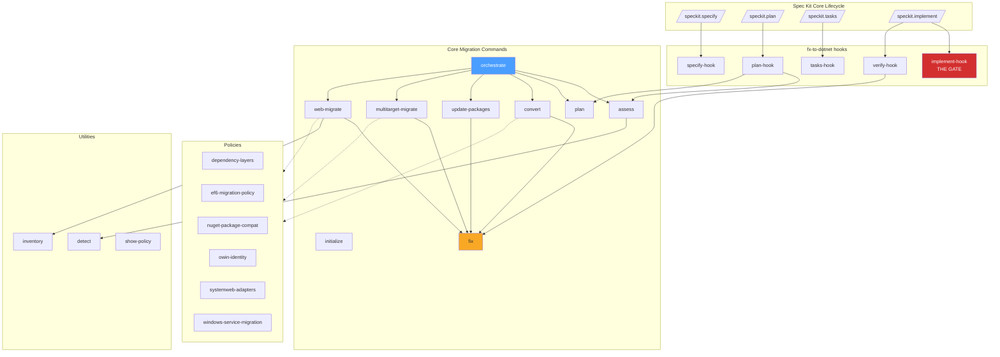
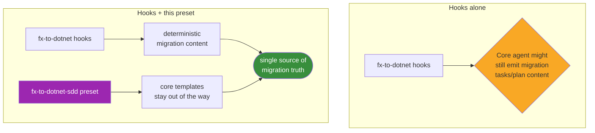
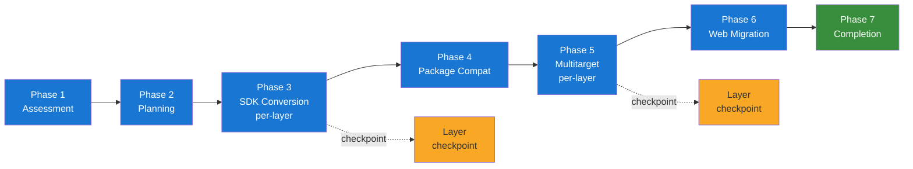
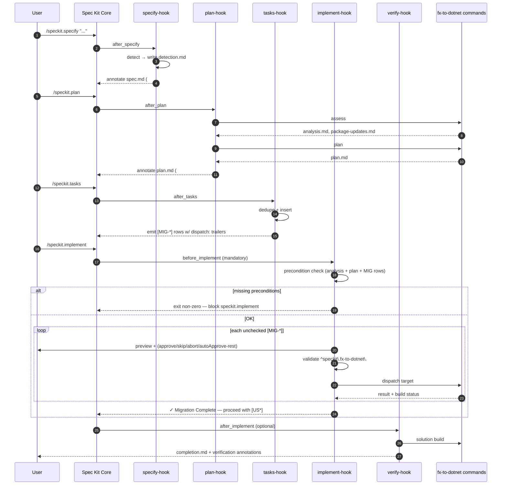
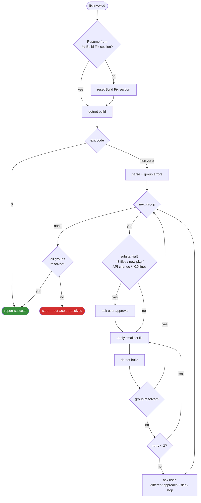

# fx-to-dotnet — .NET Framework to Modern .NET Migration

A single Spec Kit extension that orchestrates migrating .NET Framework applications to modern .NET (e.g. .NET 10) through a 7-phase workflow, optionally driven end-to-end by Spec Kit lifecycle hooks.

- **Version**: `0.8.0`
- **License**: MIT
- **Repository**: https://github.com/AzureAD/fx-to-dotnet-extensions
- **Default target framework**: `net10.0`

## Architecture at a Glance



## Commands

| Command | Description |
|---------|-------------|
| `speckit.fx-to-dotnet.initialize` | Initialize per-feature migration state (`{featureDir}/migration/orchestration.md`) |
| `speckit.fx-to-dotnet.orchestrate` | Orchestrator — drives the 7-phase migration flow |
| `speckit.fx-to-dotnet.assess` | Phase 1: Gather solution info, classify projects, audit package compatibility |
| `speckit.fx-to-dotnet.plan` | Phase 2: Synthesize assessment into an actionable migration plan |
| `speckit.fx-to-dotnet.convert` | Phase 3: Convert legacy project files to SDK-style format |
| `speckit.fx-to-dotnet.fix` | Cross-cutting: Iterative build → diagnose → fix loop |
| `speckit.fx-to-dotnet.update-packages` | Phase 4: Execute chunked package compatibility updates |
| `speckit.fx-to-dotnet.multitarget-migrate` | Phase 5: Add modern .NET target framework, fix API issues |
| `speckit.fx-to-dotnet.web-migrate` | Phase 6: ASP.NET Framework to ASP.NET Core web migration |
| `speckit.fx-to-dotnet.detect` | Utility: Determine project type, SDK-style status, classification |
| `speckit.fx-to-dotnet.inventory` | Utility: Extract route/endpoint inventory from legacy ASP.NET |
| `speckit.fx-to-dotnet.show-policy` | Display a named migration policy document |

## Lifecycle Integration (v0.5.0+)

From v0.4.0 the extension integrates tightly with the standard Spec Kit lifecycle (`specify → plan → tasks → implement`) via five lifecycle hooks. Migration content is owned end-to-end by the extension; user-story implementation is gated behind completion of all migration tasks.

**Path convention (v0.7.0+).** All migration artifacts live under the active Spec Kit feature folder at `{featureDir}/migration/` (i.e. `specs/<branch>/migration/`), colocated with `spec.md`, `plan.md`, and `tasks.md`. This makes migration state per-feature (each branch gets isolated state) and lets core Spec Kit (`/speckit.analyze`, `/speckit.verify`) discover them by convention since it already operates on the active feature dir. Hooks resolve `{featureDir}` from the `SPECIFY_FEATURE` env var or the current git branch and silent-exit if no active feature folder is detectable. (History: v0.5.0 introduced `.specify/migration/analysis.md` as a shared artifact; v0.6.0 added `plan.md` and `orchestration.md` alongside it; v0.7.0 relocated all migration files to the active feature folder.)

| Event | Hook command | Optional? | Role |
|---|---|---|---|
| `after_specify` | `speckit.fx-to-dotnet.specify-hook` | **no** | Detect Framework projects; annotate `spec.md` with `## Migration Context Detected`. Silent-exit on non-Framework workspaces. |
| `after_plan` | `speckit.fx-to-dotnet.plan-hook` | **no** | Run `assess` + `plan`; produce `{featureDir}/migration/analysis.md` and `{featureDir}/migration/plan.md` (both shared); annotate `plan.md` with `## .NET Migration Plan`. |
| `after_tasks` | `speckit.fx-to-dotnet.tasks-hook` | **no** | Dedupe migration tasks the core agent emitted; insert `## Phase N: .NET Framework Migration` ahead of user stories; emit granular `[MIG-*]` rows with `dispatch:` trailers. |
| `before_implement` | `speckit.fx-to-dotnet.implement-hook` | **no** | **The gate.** Verify preconditions; per-task review of every `[MIG-*]`; validate dispatch namespace; only then allow `speckit.implement` to run user-story tasks. |
| `after_implement` | `speckit.fx-to-dotnet.verify-hook` | yes | Solution build verification; write `{featureDir}/migration/completion.md`; annotate plan + tasks with verification status. |

All mandatory hooks **silent-exit success** on non-Framework workspaces, so they never block ordinary (non-migration) Spec Kit usage.

### `[MIG-*]` Task Format

The `after_tasks` hook emits one row per granular dispatch unit. Each row carries a machine-readable trailer:

```
- [ ] [MIG-001] [P0] Convert ProjectA.csproj to SDK-style — dispatch: speckit.fx-to-dotnet.convert(ProjectA.csproj)
- [ ] [MIG-002] [P0] Apply package chunk 1 to LibraryA (3 minor updates) — dispatch: speckit.fx-to-dotnet.update-packages(project=src/LibraryA/LibraryA.csproj, chunk=1)
- [ ] [MIG-003] [P0] Multitarget LibraryA to net10.0 — dispatch: speckit.fx-to-dotnet.multitarget-migrate(LibraryA.csproj)
- [ ] [MIG-004] [P0] Web migrate WebApp slice=bootstrap — dispatch: speckit.fx-to-dotnet.web-migrate(WebApp.csproj, slice=bootstrap)
```

The `dispatch:` trailer is parsed and validated by the `before_implement` hook against the regex `^speckit\.fx-to-dotnet\.[a-z0-9-]+\(.*\)$`. Targets that do not match the `speckit.fx-to-dotnet.` prefix are rejected and the task is marked `[~]` with a `dispatch-rejected` audit-log entry — this is the technical enforcement that **migrations only run extension-owned commands**.

### Precondition Gate

`speckit.implement` is blocked until ALL of the following exist:

1. `{featureDir}/migration/analysis.md` (from `assess` — shared artifact)
2. `{featureDir}/migration/plan.md` with phase sections (from `plan` — shared artifact)
3. `tasks.md` containing at least one `[MIG-*]` task

If any precondition is missing, the `before_implement` hook exits non-zero with a remediation message that points the user back to `/speckit.plan` → `/speckit.tasks` → `/speckit.implement`.

### Per-Task Review

The `before_implement` hook walks each unchecked `[MIG-*]` row in document order. For every row the user is shown a preview and one of four choices:

- `approve` — invoke the dispatch target now
- `skip` — mark `[~]` and continue
- `abort` — stop the run; leave remaining rows unchecked
- `autoApprove-rest` — invoke this and all subsequent rows without further outer prompts

**Build failures inside an invoked dispatch target always pause for review**, even when `autoApprove-rest` is active. State is persisted to `{featureDir}/migration/implement-state.md` and the run is resumable.

After all `[MIG-*]` rows are resolved the hook appends `## Migration Execution Summary` to `plan.md` and inserts a `> ✓ Migration Complete` checkpoint above the first `[US*]` task in `tasks.md`.

### Companion Preset (optional)

This package also ships a companion **`fx-to-dotnet-sdd`** preset (manifest at [preset.yml](preset.yml), templates under [templates/](templates/)) that overrides core `speckit.tasks`, `speckit.implement`, and the `plan-template` so the core agent never emits competing migration content (Layer 4 of the integration plan). Hooks alone work without the preset; the preset is the deterministic backstop.

- **Preset id**: `fx-to-dotnet-sdd`
- **Requires**: `speckit_version >= 0.7.2`, extension `fx-to-dotnet >= 0.8.0`

#### What the preset overrides

| Override | Path | Effect |
|----------|------|--------|
| `commands/tasks.md` | [templates/commands/tasks.md](templates/commands/tasks.md) | Core `speckit.tasks` no longer emits migration tasks; the `tasks-hook` owns `[MIG-*]` rows |
| `commands/implement.md` | [templates/commands/implement.md](templates/commands/implement.md) | Core `speckit.implement` defers all `[MIG-*]` rows to the `before_implement` hook |
| `templates/plan-template.md` | [templates/plan-template.md](templates/plan-template.md) | Plan template reserves the `## .NET Migration Plan` section for the `plan-hook` |

#### How it fits



Install the preset when you want a deterministic guarantee that core never emits competing migration content (recommended for shared / production use):

```bash
specify preset add fx-to-dotnet-sdd
```

Or, from a local checkout:

```bash
specify preset add --dev /path/to/fx-to-dotnet
```

## Quick Start

Specify a `.sln`/`.slnx` path and optional target framework (default: `net10.0`):

```
speckit.fx-to-dotnet.orchestrate <solutionPath> [targetFramework]
```

## Phases

1. **Assessment** → `speckit.fx-to-dotnet.assess`
2. **Planning** → `speckit.fx-to-dotnet.plan`
3. **SDK Conversion** → `speckit.fx-to-dotnet.convert` (layer-by-layer)
4. **Package Compatibility** → `speckit.fx-to-dotnet.update-packages`
5. **Multitarget Migration** → `speckit.fx-to-dotnet.multitarget-migrate` (layer-by-layer)
6. **Web Migration** → `speckit.fx-to-dotnet.web-migrate`
7. Completion / Deferred Work

### Phase Flow



Phases 3 and 5 process projects layer-by-layer using the dependency layers computed by `assess`. After each layer the orchestrator presents a **layer checkpoint** prompt (continue / skip remaining checkpoints / stop) unless `alwaysContinue: true` is recorded in `preferences.md`. Phase transitions also pause via a **phase checkpoint** prompt.

### Hook Lifecycle Sequence



## Prerequisites

- **Spec Kit** >= 0.1.0
- **.NET SDK** (for `dotnet build` via the fix command)
- **MCP Server**: `Microsoft.GitHubCopilot.Modernization.Mcp` (required by assess and convert commands)

## State Files

All migration files live under the active Spec Kit feature folder at `{featureDir}/migration/` (i.e. `specs/<branch>/migration/`).

Shared (discoverable by Spec Kit core and other extensions):
- `analysis.md` — assessment report (assess output)
- `plan.md` — migration plan (plan output)
- `orchestration.md` — orchestrator phase-completion state

Private (extension state):
- `package-updates.md` — package compatibility analysis + execution state
- `preferences.md` — continuation preferences
- `detection.md` — framework-detection cache
- `implement-state.md` — per-task state for the `before_implement` gate
- `{ProjectName}.md` — per-project migration state

### State File Producers and Consumers

```mermaid
graph TD
    subgraph SK[Spec Kit Core]
        SP[spec.md]
        PL[plan.md]
        TK[tasks.md]
    end

    subgraph Mig[specs/&lt;branch&gt;/migration/]
        AN[analysis.md]
        MP[plan.md]
        ORC[orchestration.md]
        PKG[package-updates.md]
        PRF[preferences.md]
        DET[detection.md]
        IST[implement-state.md]
        COMP[completion.md]
        PROJ[&#123;ProjectName&#125;.md]
    end

    SH[specify-hook] --> DET
    SH --> SP
    PH[plan-hook] --> AN
    PH --> MP
    PH --> PL
    TH[tasks-hook] --> TK
    IH[implement-hook] --> IST
    VH[verify-hook] --> COMP

    Assess[assess] --> AN
    Assess --> PKG
    Plan[plan] --> MP
    Orch[orchestrate] --> ORC
    Conv[convert] --> PROJ
    UPP[update-packages] --> PKG
    Multi[multitarget-migrate] --> PROJ
    Web[web-migrate] --> PROJ
    AnyPause[any phase pause] --> PRF

    AN -. read by .-> Plan
    AN -. read by .-> IH
    MP -. read by .-> Orch
    MP -. read by .-> IH
    ORC -. resume .-> Orch
    PKG -. read by .-> UPP
    DET -. read by .-> IH

    style AN fill:#6cc644,color:#fff
    style MP fill:#6cc644,color:#fff
    style ORC fill:#6cc644,color:#fff
    style IH fill:#d32f2f,color:#fff
```



Per-project `{ProjectName}.md` contains four sections written by different commands:

| Section | Producer |
|---------|----------|
| `## SDK Conversion` | `convert` |
| `## Build Fix` | `fix` (transient — reset each invocation) |
| `## Multitarget` | `multitarget-migrate` |
| `## Web Migration` | `web-migrate` |

## Policies

Domain policies under `policies/<name>/POLICY.md` encode migration rules that commands consult via `get_instructions(kind='policy', query='<name>')`:

| Policy | Rule (summary) |
|--------|----------------|
| `dependency-layers` | Algorithm for computing project dependency layers (used by `assess`) |
| `ef6-migration-policy` | Keep EF6 during framework migration; defer EF Core upgrade as a post-migration effort |
| `nuget-package-compat` | NuGet package compatibility analysis (find minimum supported version, flag legacy package shapes) |
| `owin-identity` | Migration guidance for OWIN/Identity stacks |
| `systemweb-adapters` | Use `Microsoft.AspNetCore.SystemWebAdapters` to minimize code change during web migration |
| `windows-service-migration` | Replace `System.ServiceProcess.ServiceBase` with `BackgroundService` + Generic Host |

The `mcp-setup.md` document at `policies/mcp-setup.md` describes how to configure the required MCP servers.

## Scripts

PowerShell and Bash variants are provided for every helper. Scripts live under `scripts/`.

| Script | Used by |
|--------|---------|
| `dotnet-build.{ps1,sh}` | `fix` |
| `find-recommended-package-upgrades.{ps1,sh}` | `assess`, `convert` |
| `get-minimal-package-set.{ps1,sh}` | `assess`, `convert` |

## Build Fix Loop

`fix` is the cross-cutting build-and-fix loop invoked by `convert`, `update-packages`, `multitarget-migrate`, and `web-migrate`.



## Standalone Usage

Some commands can be used independently outside the full migration suite:

- **`speckit.fx-to-dotnet.fix`** — Useful for any .NET project; iteratively builds and fixes compilation errors
- **`speckit.fx-to-dotnet.detect`** — Classifies any .NET project (SDK-style, web host, service, library, etc.)
- **`speckit.fx-to-dotnet.inventory`** — Extracts endpoint inventory from any legacy ASP.NET web project

## Known Limitations

- **Single web-app-host per run** — Phase 6 (ASP.NET Core migration) handles one web host project at a time; solutions with multiple web applications require sequential runs or user selection
- **No project filtering** — All projects in the solution are included in assessment and planning; there is no mechanism to exclude deprecated or out-of-scope projects
- **No cross-project failure recovery** — If a project fails during conversion, there is no defined strategy for whether to block the solution, skip the failed project, or continue with dependent layers
- **No multi-solution / monorepo support** — The extension expects a single `.sln` file; repositories with multiple solutions require separate invocations
- **Package updates are solution-global** — Package compatibility updates are applied across the entire solution with no per-project override for conflicting requirements
- **No per-layer build validation** — Layer completion is treated as a checkpoint but does not mandate a verification build before advancing to the next layer
