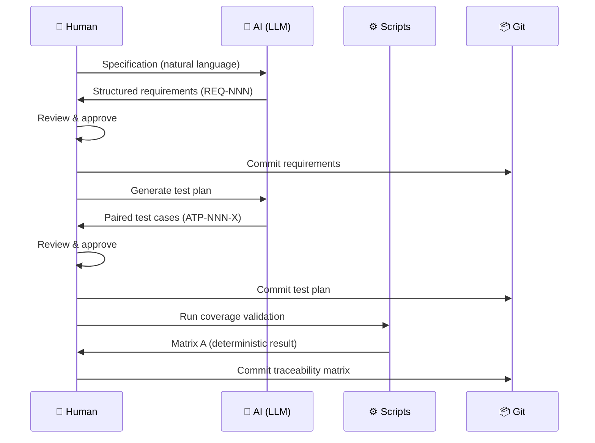

# About the V-Model Extension Pack

## Vision

The V-Model Extension Pack for Spec Kit exists to prove that **rigor and velocity are no longer mutually exclusive**.

The V-Model's core discipline — every development artifact has a simultaneously generated, paired testing artifact — can be enforced at AI speed without sacrificing the traceability that regulators demand. The extension treats the specification as the ultimate source of truth, and from it generates every downstream artifact: requirements, test plans, hazard analysis, traceability matrices, and audit reports.

What previously took a compliance team weeks to assemble is generated in minutes and validated in seconds. When a requirement changes, downstream artifacts are regenerated — not manually patched.

---

## Scripts Verify, AI Generates

A compliance tool that uses AI for everything cannot be trusted for compliance. If an AI generates the traceability matrix and also evaluates whether it's correct, you have a system grading its own homework.

The V-Model Extension Pack enforces a **strict separation of concerns** between what AI does well (understanding context and generating structured content) and what deterministic scripts do well (producing the same correct answer every time).

!!! warning "Why This Matters"

    When you present a traceability matrix to an auditor, the coverage numbers must be computed by a script that can be inspected, tested, and verified — not by an AI that might produce a different answer on the next run.

### Separation of Concerns

| Responsibility | Handled By | Why |
|---|---|---|
| **Creative translation** — turning specifications into structured requirements and test scenarios | AI (LLM) + **Human review** | Requires domain context and natural language interpretation. The human expert verifies fidelity of derived `REQ-NNN` items against the original intent — the tool ensures structural completeness; the human ensures semantic correctness. |
| **Coverage calculation** — determining whether every requirement has a test case | Deterministic scripts (regex + Bash/PowerShell) | Must be mathematically correct; AI hallucinations are unacceptable for compliance metrics. |
| **Matrix generation** — building the traceability table with forward/backward links | Deterministic scripts | Structural correctness is verifiable by inspection; no probabilistic reasoning needed. |
| **Gap detection** — identifying orphaned tests, uncovered requirements, missing scenarios | Deterministic scripts | Binary yes/no decisions that must be reproducible across runs. |
| **Quality evaluation** — assessing whether requirements are well-written and scenarios are comprehensive | LLM-as-judge (DeepEval + Gemini) | Qualitative assessment where human-like judgment adds value; clearly labeled as advisory, not deterministic. |
| **Audit trail** — proving who changed what and when | Git (cryptographic commit hashes) | Immutable, mathematically verifiable history; no separate ALM database required. |

!!! tip "The Design Rule"

    AI does what AI is good at: understanding context and generating structured content. Scripts do what scripts are good at: producing the same correct answer every time. Humans do what humans do best: deciding whether the generated content is correct. Git does what Git does best: remembering everything.

---

## The Human Review Gate

This is not about replacing human judgment. The AI acts as an **exoskeleton for the systems engineer** — it drafts exhaustive requirements and test cases at machine speed, but the human expert reviews, refines, and commits them.

No safety parameter is set by AI autonomously. Every artifact is reviewed before it becomes part of the verified baseline. The creative translation step — where the AI derives `REQ-NNN` items from a specification — is the most critical review gate. A hallucinated threshold (e.g., 250ms instead of 150ms) would propagate structurally perfect but functionally dangerous artifacts downstream. The human catches what the AI cannot guarantee.

---

## Technical Debt of Intent

Not every project faces regulatory audits, but every project faces the same fundamental question: **is what we built what we intended to build?**

The gap between intent and implementation — what we call the **"technical debt of intent"** — grows silently. Requirements live in issue trackers, test cases live in test files, and no one can prove they align. Six months later, a test fails and no one knows which requirement it validates, or a feature is cut and orphaned tests remain in the suite forever.

!!! info "Intent Debt Accumulates Silently"

    Unlike code-level technical debt, which manifests as friction (slow builds, fragile tests), intent debt is invisible until it causes a failure — a missed requirement in production, an audit finding, or a test suite that tests nothing meaningful.

The V-Model Extension Pack brings the same structured traceability to any project that values knowing, with certainty, that every requirement has a test and every test has a purpose. The overhead is minutes, not months — and the payoff is a `specs/` directory that serves as living proof of what was specified, what was tested, and what was verified.

---

## By the Numbers

The V-Model Extension Pack is backed by comprehensive testing and a substantial scripting infrastructure:

| Metric | Count |
|---|---|
| Commands | 14 |
| Templates | 12 |
| Bash scripts | 13 |
| PowerShell scripts | 13 |
| BATS tests (Bash) | 364 |
| Pester tests (PowerShell) | 347 |
| Structural evals | 89 |
| LLM evals | 42 |

Every deterministic script is tested on both platforms. Every template is structurally evaluated. The coverage and matrix calculations that auditors rely on are verified by **711 combined tests** — not by AI self-assessment.

---

## Git as the Quality Management System

Because every artifact is plaintext Markdown stored in Git, the entire specification history is backed by **cryptographic commit hashes** — an immutable, mathematically verifiable audit trail of who changed what and when.

Git becomes the QMS: every requirement change, every test case update, every traceability matrix regeneration is versioned, diffable, and attributable. No ALM database required for the audit trail — `git log` provides it.

For teams already invested in ALM platforms like Jama Connect, IBM DOORS, or Siemens Polarion, the generated Markdown artifacts serve as an accelerator — draft-quality requirements and test plans produced in minutes, ready for expert review and import into the team's existing system of record.

---

## What This Tool Is Not

The V-Model Extension Pack is not a documentation generator. It is a **discipline enforcer** — one that proves rigor and velocity can coexist, that AI-native speed and safety-critical compliance are not opposing forces, and that the gap between what is specified and what is tested can be closed permanently.

> **The AI drafts. The human decides. The scripts verify. Git remembers.**

---

## Roadmap

The extension currently covers the full V-Model from requirements through unit testing, plus hazard analysis, impact analysis, peer review, test results ingestion, and audit reports. The roadmap includes:

- **Implementation Gating** — Enforce that all upstream artifacts exist and pass coverage checks before implementation begins
- **Pre-built Regulatory Template Packs** — Domain-specific templates for IEC 62304, ISO 26262, and DO-178C
- **Bidirectional ALM Synchronization** — Two-way sync with enterprise ALM platforms (Jama Connect, IBM DOORS, Siemens Polarion)
- **Trend Tracking** — Monitor requirement quality scores, coverage percentages, and traceability completeness over time

[:octicons-arrow-right-24: Full roadmap](community/roadmap.md)
