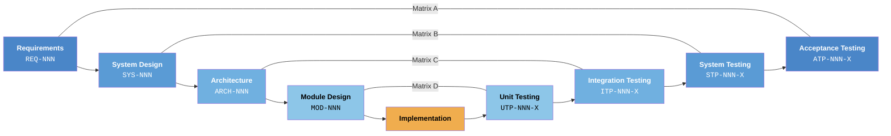

# V-Model Concepts

## What Is the V-Model?

The **V-Model** (Verification and Validation model) is a software development lifecycle that pairs every development phase with a corresponding testing phase. Instead of a linear waterfall, the process forms a **"V" shape** — development descends on the left, implementation sits at the bottom, and testing ascends on the right.

The defining characteristic: **test plans are designed simultaneously with their corresponding development phase**, not after coding is complete.

---

## Core Principle: Verification vs. Validation

!!! info "The Two Questions"

    - **Verification (Left Side):** "Are we building the product *right*?" — Reviews of documents, design, and code.
    - **Validation (Right Side):** "Are we building the *right* product?" — Dynamic testing and execution.

Every artifact on the left side has a **paired artifact** on the right side. A requirement always has an acceptance test. A system design always has a system test. No orphans, no gaps.

---

## The V-Model Phases

---

### Left Side — Development / Verification

The left side descends from high-level business needs to low-level implementation details.

| Phase | Output | Paired Test Phase |
|---|---|---|
| **Requirements Analysis** | Requirement Specification (`REQ-NNN`) | Acceptance Testing |
| **System Design** | System Design Document (`SYS-NNN`) | System Testing |
| **Architectural Design** | High-Level Design (`ARCH-NNN`) | Integration Testing |
| **Module Design** | Low-Level Design (`MOD-NNN`) | Unit Testing |

### Right Side — Testing / Validation

The right side ascends from low-level unit tests to high-level acceptance tests.

| Phase | Validates | What It Tests |
|---|---|---|
| **Unit Testing** | Module Design | Individual functions, classes, methods |
| **Integration Testing** | Architecture | Module interfaces, API contracts |
| **System Testing** | System Design | Complete system: performance, security, load |
| **Acceptance Testing** | Requirements | End-to-end user scenarios |

---

## Why the V-Model Matters for AI-Assisted Development

Modern AI coding tools ("vibe coding") often generate code without structured test plans, making it difficult to:

- **Prove** that every requirement was tested
- **Trace** a test failure back to a specific requirement
- **Demonstrate** compliance with safety standards (ISO 26262, DO-178C, IEC 62304)

The V-Model Extension Pack enforces discipline by **requiring paired generation**: every development artifact (specification) automatically generates its testing counterpart (test plan), with traceable IDs linking them.

!!! tip "The Core Principle"

    **The AI drafts. The human decides. The scripts verify. Git remembers.**

---

## The Four-Tier ID Schema

This extension uses a hierarchical ID scheme that encodes traceability directly into every identifier. Reading any ID tells you exactly where it sits in the verification chain — no lookup table needed.

### Overview

| Level | Design ID | Test Case ID | Scenario ID | Prefix |
|---|---|---|---|---|
| Requirements ↔ Acceptance | `REQ-NNN` | `ATP-NNN-X` | `SCN-NNN-X#` | NF, IF, CN |
| System ↔ System Test | `SYS-NNN` | `STP-NNN-X` | `STS-NNN-X#` | — |
| Architecture ↔ Integration | `ARCH-NNN` | `ITP-NNN-X` | `ITS-NNN-X#` | — |
| Module ↔ Unit Test | `MOD-NNN` | `UTP-NNN-X` | `UTS-NNN-X#` | — |
| Hazard Analysis (cross-cutting) | `HAZ-NNN` | — | — | — |

### How to Read an ID

Reading `SCN-001-A1` tells you:

1. **`SCN`** — This is a BDD scenario (acceptance level)
2. **`001`** — It traces to requirement `REQ-001`
3. **`A`** — It belongs to test case `ATP-001-A`
4. **`1`** — It is the first scenario under that test case

The same self-documenting pattern repeats at every level: `STS-002-B3` → test step for `STP-002-B` → validates `SYS-002`.

---

## Key Terms Glossary

| Term | Definition |
|---|---|
| **Requirement** | A discrete, testable statement of what the system must do (`REQ-NNN`) |
| **Test Case** | A logical validation condition that exercises one or more aspects of a requirement (`ATP-NNN-X`, `STP-NNN-X`, etc.) |
| **Scenario** | An executable test path — BDD Given/When/Then at acceptance level, step-by-step procedures at lower levels (`SCN-NNN-X#`, `STS-NNN-X#`, etc.) |
| **Traceability** | The ability to follow an artifact's lineage forward (requirement → test) and backward (test → requirement) through the V-Model |
| **Coverage** | The percentage of artifacts at one tier that are linked to artifacts at the paired tier — the V-Model Extension Pack enforces 100% |
| **Deterministic Validation** | Verification performed by scripts (not AI) — the same inputs always produce the same pass/fail result |
| **Intra-level Link** | A link within the same V-Model tier (e.g., `REQ-001` → `ATP-001-A` → `SCN-001-A1`) |
| **Inter-level Link** | A link between V-Model tiers (e.g., `REQ-001` → `SYS-003` via Parent Requirements metadata) |

---

## What's Next?

-   :material-clipboard-check:{ .lg .middle } **Level 1: Requirements ↔ Acceptance**

    ---

    Start with the outermost V-Model level — defining what the system must do and proving it works.

    [:octicons-arrow-right-24: Requirements & Acceptance](requirements-acceptance.md)

-   :material-cog:{ .lg .middle } **Level 2: System Design ↔ System Testing**

    ---

    Decompose requirements into system components and validate the architecture.

    [:octicons-arrow-right-24: System Design & Testing](system-design-testing.md)

-   :material-sitemap:{ .lg .middle } **Level 3: Architecture ↔ Integration**

    ---

    Define module boundaries and test the seams between them.

    [:octicons-arrow-right-24: Architecture & Integration](architecture-integration.md)

-   :material-code-braces:{ .lg .middle } **Level 4: Module Design ↔ Unit Testing**

    ---

    Specify internal module logic and verify it with white-box tests.

    [:octicons-arrow-right-24: Module Design & Unit Testing](module-unit.md)

