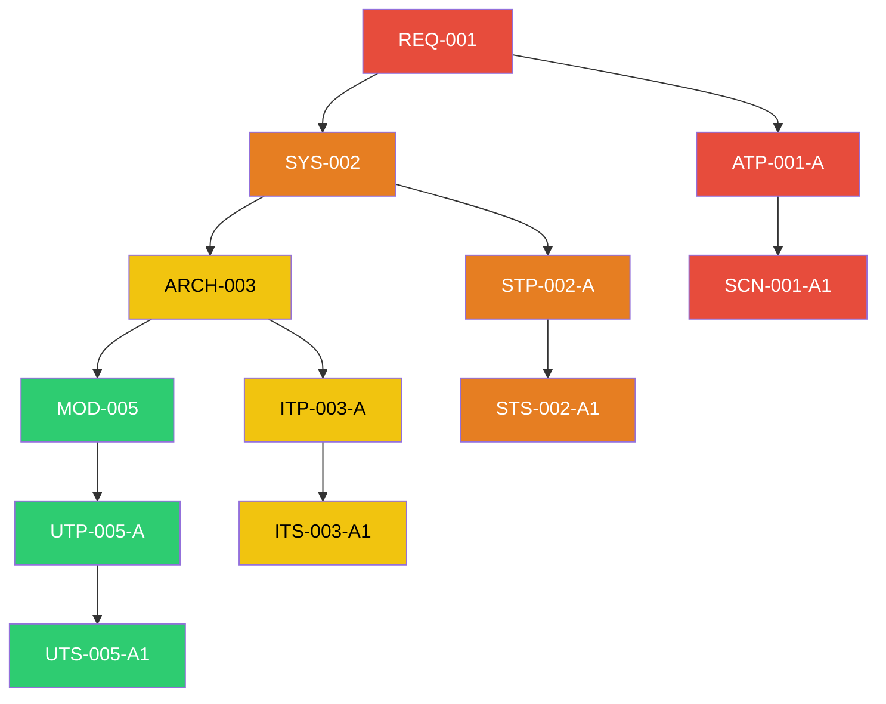

# Change Impact Analysis

When a requirement changes, what else is affected? Impact analysis answers this question **deterministically** — no AI involved. The script scans all V-Model artifacts, builds an ID dependency graph, and traverses it to produce a complete blast radius report.

---

## Purpose

In a fully traceable V-Model, changing one artifact can cascade across multiple levels. Impact analysis:

- Identifies **all suspect artifacts** affected by a change
- Computes the **blast radius** (count of affected artifacts per level)
- Produces a **re-validation order** so you know what to update first
- Supports **CI integration** with `--json` output for automated threshold checks

---

## Command

### `/speckit.v-model.impact-analysis`

This is a **script-only command** — the script handles everything deterministically.

=== "Bash"

    ```bash
    # Downward: what depends on REQ-001?
    scripts/bash/impact-analysis.sh --downward REQ-001 specs/<feature>/v-model

    # Upward: what does MOD-003 depend on?
    scripts/bash/impact-analysis.sh --upward MOD-003 specs/<feature>/v-model

    # Full: complete blast radius of SYS-002
    scripts/bash/impact-analysis.sh --full SYS-002 specs/<feature>/v-model

    # JSON output for CI pipelines
    scripts/bash/impact-analysis.sh --json --downward REQ-001 REQ-002 specs/<feature>/v-model

    # Multiple changed IDs at once
    scripts/bash/impact-analysis.sh --full REQ-001 REQ-003 SYS-005 specs/<feature>/v-model
    ```

=== "PowerShell"

    ```powershell
    # Downward traversal
    scripts/powershell/impact-analysis.ps1 -Downward -Ids REQ-001 -VModelDir specs/<feature>/v-model

    # Upward traversal
    scripts/powershell/impact-analysis.ps1 -Upward -Ids MOD-003 -VModelDir specs/<feature>/v-model

    # Full traversal with JSON output
    scripts/powershell/impact-analysis.ps1 -Full -Json -Ids SYS-002 -VModelDir specs/<feature>/v-model
    ```

---

## Traversal Modes

| Mode | Flag | Description |
|---|---|---|
| **Downward** | `--downward` (default) | Traces from changed IDs to all downstream dependents |
| **Upward** | `--upward` | Traces from changed IDs to all upstream parents |
| **Full** | `--full` | Both directions — complete upstream/downstream impact |

### Graph Traversal

The script builds a bi-directional dependency graph from all V-Model markdown files:



A `--downward` traversal from `REQ-001` visits every node reachable by following edges forward. An `--upward` traversal from `MOD-005` walks backward to find all ancestors.

---

## Output

The script produces an **Impact Analysis Report** containing:

1. **Changed IDs** — The IDs specified by the user with their V-Model level
2. **Suspect Artifacts** — All affected IDs organized by V-Model level
3. **Blast Radius** — Statistics showing the count of affected artifacts per level
4. **Re-validation Order** — Ordered list of artifacts that should be re-validated

### Example: Changing REQ-003

Running `--full REQ-003` might produce:

```
Blast Radius:
  REQ: 1 (REQ-003)
  ATP: 2 (ATP-003-A, ATP-003-B)
  SCN: 4 (SCN-003-A1, SCN-003-A2, SCN-003-B1, SCN-003-B2)
  SYS: 1 (SYS-002)
  STP: 1 (STP-002-B)
  STS: 2 (STS-002-B1, STS-002-B2)
  ARCH: 1 (ARCH-004)
  ITP: 1 (ITP-004-A)
  MOD: 2 (MOD-007, MOD-008)
  UTP: 3 (UTP-007-A, UTP-008-A, UTP-008-B)

Re-validation Order:
  1. MOD-007, MOD-008 (update module designs)
  2. UTP-007-A, UTP-008-A, UTP-008-B (regenerate unit tests)
  3. ARCH-004 (review architecture)
  4. ITP-004-A (regenerate integration tests)
  5. SYS-002 (review system design)
  6. STP-002-B (regenerate system test)
  7. ATP-003-A, ATP-003-B (regenerate acceptance tests)
```

---

## CI Integration

Use `--json` output for automated threshold checking in CI pipelines:

```bash
# Fail CI if blast radius exceeds 20 artifacts
RESULT=$(scripts/bash/impact-analysis.sh --json --downward REQ-001 specs/<feature>/v-model)
TOTAL=$(echo "$RESULT" | jq '.blast_radius.total')
if [ "$TOTAL" -gt 20 ]; then
  echo "⚠️ Blast radius ($TOTAL) exceeds threshold (20)"
  exit 1
fi
```

### Exit Codes

| Code | Meaning |
|---|---|
| `0` | Analysis completed successfully |
| `1` | Error — invalid arguments, no artifacts found, etc. |

---

## Related Pages

- [V-Model Concepts](concepts.md) — Understanding the traceability chain
- [Level 1: Requirements ↔ Acceptance](requirements-acceptance.md) — Where most changes originate
- [Peer Review](peer-review.md) — Review affected artifacts after impact analysis
- [CI Integration](ci-integration.md) — Automated impact checking in pipelines
