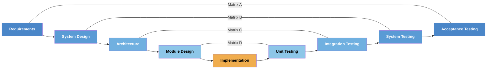

# V-Model Extension Pack for Spec Kit

## The Compliance Chasm

Software engineering is split in two. **AI-native teams** ship features in hours — but produce no traceability, no test plans, and no proof of correctness. **Regulated teams** in medical devices, automotive, and aerospace have full traceability — maintained manually across spreadsheets and ALM platforms at the cost of weeks per feature.

Neither side wins.

| | AI-Native Teams | Regulated Teams |
|---|---|---|
| **Speed** | Hours per feature | Weeks per feature |
| **Traceability** | None | Manual, error-prone |
| **Audit readiness** | Not applicable | Months of prep |
| **Requirement coverage** | Unknown | Manually verified |
| **Cost of change** | Low (code only) | Extreme (documentation) |

Fast teams ship without proof of correctness. Compliant teams move too slowly to compete. **What if rigor and velocity could coexist?**

---

## The Solution

The V-Model Extension Pack for [Spec Kit](https://github.com/github/spec-kit) closes this chasm. From a single specification, it generates traceable requirements, paired test plans, hazard analysis, and a deterministic traceability matrix — in minutes, not months.

!!! tip "The Core Principle"

    **The AI drafts. The human decides. The scripts verify. Git remembers.**

    Scripts handle all deterministic logic — coverage calculations, matrix generation, gap detection. AI handles creative translation — turning specifications into structured requirements and test scenarios. Humans review every artifact before it enters the verified baseline.



---

## :material-feature-search: Key Features

### :octicons-id-badge-16: 14 Commands Across the Full V-Model

From requirements to audit reports — every V-Model level is covered with dedicated commands for specification, design, testing, and verification.

### :octicons-package-16: Domain Overlay Architecture

Base commands contain only universal best-practice standards. Domain-specific safety content (ISO 26262 ASIL tables, DO-178C DAL classifications, IEC 62304 software classes) is loaded at runtime from `commands/overlays/` based on the `domain:` field in `v-model-config.yml`. Non-safety projects get no regulatory noise; safety-critical projects get precisely the right domain content — no cross-contamination.

### :octicons-git-branch-16: ID Lifecycle Model

Every V-Model ID supports a formal lifecycle: **ACTIVE → DEPRECATED / MODIFIED → SUSPECT**. When a requirement is deprecated, the entire downstream chain (acceptance tests, system design, architecture, module design, unit tests) is automatically marked `[SUSPECT]` pending review. Evolution is traceable — no silent overwrites, no orphaned test cases.

### :octicons-law-16: Standards Enrichment

All 11 base commands now include explicit `## Governing Standards` sections mapping each output to its governing IEEE/ISO/IEC standard. Quality characteristics (ISO/IEC 25010:2023), V&V coverage gates (IEEE 1012:2016), and architecture evaluation (ISO/IEC 42030:2019) are enforced as mandatory output sections — not optional guidance.

### :octicons-stack-16: 4 V-Model Levels

Progressive traceability from the top of the V to the bottom:

- **Requirements ↔ Acceptance Testing** — `REQ-NNN` → `ATP-NNN-X` → `SCN-NNN-X#`
- **System Design ↔ System Testing** — `SYS-NNN` → `STP-NNN-X` → `STS-NNN-X#`
- **Architecture ↔ Integration Testing** — `ARCH-NNN` → `ITP-NNN-X` → `ITS-NNN-X#`
- **Module Design ↔ Unit Testing** — `MOD-NNN` → `UTP-NNN-X` → `UTS-NNN-X#`

### :octicons-table-16: 5 Traceability Matrices

- **Matrix A** — Requirements ↔ Acceptance
- **Matrix B** — System Design ↔ System Testing
- **Matrix C** — Architecture ↔ Integration Testing
- **Matrix D** — Module Design ↔ Unit Testing
- **Matrix H** — Hazard ↔ Mitigation Traceability

### :octicons-shield-check-16: Hazard Analysis

ISO 14971 / ISO 26262 FMEA registers with operational state awareness, mitigation traceability, and automatic Matrix H generation.

### :octicons-git-compare-16: Impact Analysis

Deterministic change impact tracing — identify every suspect artifact affected by a change, downward, upward, or both across the entire V-Model.

### :octicons-code-review-16: Peer Review

AI-powered stateless linter for any V-Model artifact. Evaluates against INCOSE, IEEE 1016/42010, ISO 29119, and ISO 14971 criteria. Produces `PRF-{ARTIFACT}-NNN` findings with CI-compatible exit codes.

### :octicons-check-circle-16: Test Results Ingestion

100% deterministic JUnit XML and Cobertura XML ingestion. Updates the traceability matrix in-place — flipping `⬜ Untested` to `✅ Passed` / `❌ Failed` / `⏭️ Skipped` with Date, Commit SHA, and Coverage columns.

### :octicons-report-16: Audit Reports

Point-in-time release audit report: artifact inventory pinned to Git SHAs, traceability matrices, coverage analysis, hazard management summary, anomaly/waiver cross-referencing, and compliance gating.

---

## :material-domain: Built for Regulated Industries

### :material-hospital-box: Medical Devices — IEC 62304 & FDA 21 CFR Part 820

Medical device software requires complete traceability between requirements, architecture, and verification evidence. A single requirement change can cascade into days of rework across multiple documents.

**With V-Model Extension Pack:** Generate traceable `REQ-NNN` items, paired `ATP-NNN-X` test cases, and `SCN-NNN-X#` BDD scenarios. The traceability matrix updates in seconds, not days. Coverage is verified by deterministic scripts — mathematically correct, not AI-assessed.

### :material-car: Automotive — ISO 26262

ISO 26262 demands traceability proportional to ASIL level. ASIL-D systems require the most rigorous evidence — orphaned tests or untested requirements are audit findings.

**With V-Model Extension Pack:** The three-tier ID schema creates self-documenting lineage. The matrix explicitly flags orphaned test cases and uncovered requirements. Deterministic validation scripts provide the mathematical proof that assessors require.

### :material-airplane: Aerospace — DO-178C

DO-178C requires bidirectional traceability: forward (requirement → test) and backward (test → requirement). Certification authorities expect this traceability to be demonstrably complete.

**With V-Model Extension Pack:** The `/speckit.v-model.trace` command produces both forward and backward traceability views in a single matrix. Gaps are surfaced immediately — before a DER review, not during one.

---

## :octicons-workflow-16: How It Works

The V-Model Extension Pack follows a progressive workflow. Each command produces artifacts in `specs/{feature}/v-model/`, and the traceability matrix is rebuilt after each design↔test pair to catch gaps early.

```
Step 1:  /speckit.specify                        →  Define your feature
Step 2:  /speckit.v-model.requirements           →  REQ-NNN from spec.md
Step 3:  /speckit.v-model.acceptance             →  ATP + SCN (100% coverage validated)
Step 4:  /speckit.v-model.trace                  →  Matrix A
Step 5:  /speckit.v-model.system-design          →  SYS-NNN (IEEE 1016 views)
Step 6:  /speckit.v-model.system-test            →  STP/STS (ISO 29119-4)
Step 7:  /speckit.v-model.hazard-analysis        →  HAZ-NNN (ISO 14971/26262 FMEA)
Step 8:  /speckit.v-model.trace                  →  Matrix A + B + H
Step 9:  /speckit.v-model.architecture-design    →  ARCH-NNN (IEEE 42010/4+1)
Step 10: /speckit.v-model.integration-test       →  ITP/ITS (ISO 29119-4)
Step 11: /speckit.v-model.trace                  →  Matrix A + B + C + H
Step 12: /speckit.v-model.module-design          →  MOD-NNN (pseudocode + state machines)
Step 13: /speckit.v-model.unit-test              →  UTP/UTS (white-box techniques)
Step 14: /speckit.v-model.trace                  →  Matrix A + B + C + D + H
```

After CI, ingest test results and generate the release audit report:

```
/speckit.v-model.test-results --input results.xml    →  ⬜ → ✅/❌/⏭️
/speckit.v-model.audit-report                        →  release-audit-report.md
```

At any time, run impact analysis or peer review:

```
/speckit.v-model.impact-analysis --downward REQ-001  →  Suspect artifacts + blast radius
/speckit.v-model.peer-review requirements.md         →  PRF-REQ-NNN findings
```

!!! info "Progressive Traceability"

    The `/speckit.v-model.trace` command is run after each design↔test pair. Coverage gaps are caught at each V-level — not discovered at the end.

### Output Structure

Every artifact lives in plaintext Markdown, versioned in Git:

```
specs/{feature}/v-model/
├── requirements.md              →  REQ-NNN requirements
├── acceptance-plan.md           →  ATP + SCN test cases
├── system-design.md             →  SYS-NNN components
├── system-test.md               →  STP/STS procedures
├── hazard-analysis.md           →  HAZ-NNN hazards (FMEA register)
├── architecture-design.md       →  ARCH-NNN modules
├── integration-test.md          →  ITP/ITS procedures
├── module-design.md             →  MOD-NNN detailed modules
├── unit-test.md                 →  UTP/UTS unit test procedures
├── peer-review-{artifact}.md    →  PRF-NNN findings (advisory)
├── traceability-matrix.md       →  Matrix A + B + C + D + H
└── release-audit-report.md      →  Point-in-time audit package
```

---

## :octicons-rocket-16: Get Started

<div class="grid cards" markdown>

-   :octicons-download-16:{ .lg .middle } **Get Started**

    ---

    Install the extension and generate your first traceable specification in minutes.

    [:octicons-arrow-right-24: Getting started](getting-started/index.md)

-   :octicons-book-16:{ .lg .middle } **Read the Docs**

    ---

    Learn the concepts, commands, and architecture behind the V-Model Extension Pack.

    [:octicons-arrow-right-24: Concepts guide](guide/concepts.md)

-   :octicons-people-16:{ .lg .middle } **About & Philosophy**

    ---

    Understand the architectural decisions and separation of concerns that make this tool trustworthy.

    [:octicons-arrow-right-24: About](about.md)

</div>
