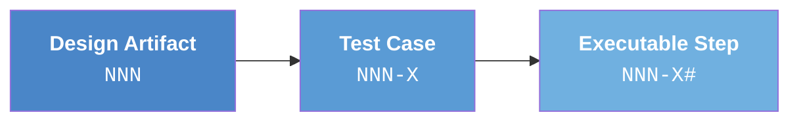

# ID Schema Reference

The V-Model Extension Pack uses a **self-documenting ID schema** where traceability is encoded directly in the identifier. Reading `SCN-003-A1` immediately tells you: Scenario 1 → of Test Case A → validating Requirement 003. No database query or lookup table needed.

## Summary of All 15 ID Types

| ID | Full Name | Format | Example | Level |
|----|-----------|--------|---------|-------|
| `REQ` | Requirement | `REQ[-CAT]-NNN` | `REQ-003`, `REQ-NF-001` | 1 |
| `ATP` | Acceptance Test Procedure | `ATP[-CAT]-NNN-X` | `ATP-003-A` | 1 |
| `SCN` | Scenario (BDD) | `SCN[-CAT]-NNN-X#` | `SCN-003-A1` | 1 |
| `SYS` | System Design Element | `SYS-NNN` | `SYS-002` | 2 |
| `STP` | System Test Procedure | `STP-NNN-X` | `STP-002-A` | 2 |
| `STS` | System Test Step | `STS-NNN-X#` | `STS-002-A2` | 2 |
| `ARCH` | Architecture Element | `ARCH-NNN` | `ARCH-005` | 3 |
| `ITP` | Integration Test Procedure | `ITP-NNN-X` | `ITP-005-A` | 3 |
| `ITS` | Integration Test Step | `ITS-NNN-X#` | `ITS-005-A1` | 3 |
| `MOD` | Module Design | `MOD-NNN` | `MOD-003` | 4 |
| `UTP` | Unit Test Procedure | `UTP-NNN-X` | `UTP-003-A` | 4 |
| `UTS` | Unit Test Scenario | `UTS-NNN-X#` | `UTS-003-A1` | 4 |
| `HAZ` | Hazard (FMEA) | `HAZ-NNN` | `HAZ-005` | H |
| `PRF` | Peer Review Finding | `PRF-{ARTIFACT}-NNN` | `PRF-REQ-001` | Advisory |
| `WAV` | Waiver | `WAV-NNN` | `WAV-001` | Advisory |

## Design Principles

### Deterministic

Every ID is assigned sequentially when an artifact is first generated. The numbering is per-level — `REQ-001`, `SYS-001`, `ARCH-001`, and `MOD-001` are four independent identifiers referring to four different things.

### Position-Based

Within each level, the test case ID appends a letter to the parent's number, and the executable step appends a digit to the test case. This pattern is uniform across all four levels.

### Reproducible

All coverage calculations are performed by deterministic regex-based scripts — not by the AI that generated the artifacts. Running a validation script twice produces identical results.

---

## Format Conventions

These conventions are consistent across all levels:

| Component | Format | Meaning | Example |
|-----------|--------|---------|---------|
| `NNN` | Zero-padded 3-digit | Design artifact number | `001`, `042`, `999` |
| `X` | Single uppercase letter | Test case identifier | `A`, `B`, `C` |
| `#` | One or more digits | Step/scenario number | `1`, `2`, `12` |
| `CAT` | 2-letter category code | Requirement category | `NF`, `IF`, `CN` |

---

## The Four-Tier Hierarchy

Each V-Model level follows the same three-tier structure:



| Level | Design Artifact | Test Case | Executable Step | Matrix |
|-------|----------------|-----------|-----------------|--------|
| 1 — Requirements ↔ Acceptance | `REQ-NNN` | `ATP-NNN-X` | `SCN-NNN-X#` | A |
| 2 — System Design ↔ System Test | `SYS-NNN` | `STP-NNN-X` | `STS-NNN-X#` | B |
| 3 — Architecture ↔ Integration | `ARCH-NNN` | `ITP-NNN-X` | `ITS-NNN-X#` | C |
| 4 — Module ↔ Unit Test | `MOD-NNN` | `UTP-NNN-X` | `UTS-NNN-X#` | D |

---

## Two Types of Traceability Links

### Intra-Level Links — Encoded in the ID

**Within** each V-Model level, the relationship between a design artifact and its tests is encoded directly in the ID:

```
REQ-003  →  ATP-003-A  →  SCN-003-A1
             ^^^                ^^^
             "003" IS the link — no lookup needed
```

This applies at every level: `STP-002-A` links to `SYS-002`, `ITP-005-A` links to `ARCH-005`, `UTP-001-A` links to `MOD-001`.

### Inter-Level Links — Recorded in Artifact Content

**Between** V-Model levels, the relationship is an explicit field in the artifact content. IDs of different levels are independent — `SYS-001` does not inherently relate to `REQ-001`.

| Cross-Level Link | Document | Section | Field Name |
|-----------------|----------|---------|------------|
| REQ → SYS | `system-design.md` | Decomposition View table | `Parent Requirements` |
| SYS → ARCH | `architecture-design.md` | Logical View table | `Parent System Components` |
| ARCH → MOD | `module-design.md` | Module heading metadata | `Parent Architecture Modules` |

These explicit fields are what the deterministic scripts parse to build traceability matrices.

!!! note "Why Two Mechanisms?"
    **Intra-level** links are structural (one test case → exactly one parent), so encoding in the ID is sufficient. **Inter-level** links are many-to-many (one component may satisfy multiple requirements), so they require a list of parent IDs in the artifact content.

---

## Level 1: Requirements ↔ Acceptance Testing

### REQ-NNN — Requirement

The atomic unit of specification. Top of the traceability chain.

```
REQ-001    — First functional requirement
REQ-NF-001 — First non-functional requirement
REQ-IF-001 — First interface requirement
REQ-CN-001 — First constraint requirement
```

**Category prefixes** (unique to the requirements level):

| Prefix | Category | Example |
|--------|----------|---------|
| *(none)* | Functional | `REQ-001` |
| `NF` | Non-Functional | `REQ-NF-001` |
| `IF` | Interface | `REQ-IF-001` |
| `CN` | Constraint | `REQ-CN-001` |

Category prefixes propagate to test cases and scenarios: `REQ-NF-001` → `ATP-NF-001-A` → `SCN-NF-001-A1`.

### ATP-NNN-X — Acceptance Test Procedure

Each ATP validates a specific aspect of one requirement:

```
ATP-003-A  — First test case for REQ-003
ATP-003-B  — Second test case for REQ-003
```

The `003` in `ATP-003-A` **is** the intra-level link to `REQ-003`.

### SCN-NNN-X# — Scenario

Executable BDD (Given/When/Then) test steps:

```
SCN-003-A1 — First scenario of ATP-003-A
SCN-003-A2 — Second scenario of ATP-003-A
SCN-003-B1 — First scenario of ATP-003-B
```

### Traceability Chain

```
REQ-003 (Heart rate alarm within 2.0 seconds)
  ├── ATP-003-A (Alarm triggers at exact threshold crossing)
  │     ├── SCN-003-A1 (Given HR=80, When sensor reports 121, Then alarm within 2.0s)
  │     └── SCN-003-A2 (Given HR=80, When sensor reports 200, Then alarm within 2.0s)
  ├── ATP-003-B (Alarm does NOT trigger at boundary)
  │     └── SCN-003-B1 (Given threshold=120, When HR=120, Then no alarm)
  └── ATP-003-C (Alarm timing under full sensor load)
        └── SCN-003-C1 (Given 3 sensors active, When HR=150, Then alarm ≤2.0s)
```

### Validator — Matrix A

`validate-requirement-coverage.sh` / `.ps1` checks:

- **Forward**: Every `REQ` → at least one `ATP` → at least one `SCN`
- **Backward**: Every `ATP` → existing `REQ`; every `SCN` → existing `ATP`

---

## Level 2: System Design ↔ System Testing

### SYS-NNN — System Design Element

Major components aligned with IEEE 1016:2009 design views:

```
SYS-001 — SensorAcquisitionService
SYS-002 — AlarmEngine
SYS-003 — ClinicalDashboard
```

**Inter-level link to requirements** via the `Parent Requirements` column in the Decomposition View:

```markdown
| SYS ID  | Component               | Parent Requirements    |
|---------|-------------------------|------------------------|
| SYS-001 | SensorAcquisitionService | REQ-001, REQ-NF-002   |
| SYS-002 | AlarmEngine             | REQ-003, REQ-004       |
```

!!! important
    `SYS` numbering is independent of `REQ` numbering. The relationship is recorded in `Parent Requirements`, not in the number.

The `system-design.md` may also contain **Derived Requirements** with `SYS-DR-NNN` identifiers — requirements arising from design decisions rather than original user requirements.

### STP-NNN-X — System Test Procedure

ISO 29119-4 test procedures:

```
STP-002-A — Boundary Value Analysis for AlarmEngine thresholds
STP-002-B — Fault Injection for sensor communication failure
```

### STS-NNN-X# — System Test Step

Executable test steps with concrete preconditions and assertions:

```
STS-002-A1 — Given threshold=120, When HR=119, Then no alarm
STS-002-A2 — Given threshold=120, When HR=121, Then alarm within 2.0s
```

### Validator — Matrix B

`validate-system-coverage.sh` / `.ps1` checks:

- **Forward**: Every `SYS` → at least one `STP` → at least one `STS`
- **Backward**: Every `STP` → existing `SYS`; every `STS` → existing `STP`
- **Inter-level**: Every `REQ` appears in at least one `SYS`'s `Parent Requirements`

---

## Level 3: Architecture Design ↔ Integration Testing

### ARCH-NNN — Architecture Element

Modules aligned with IEEE 42010 / Kruchten 4+1 views:

```
ARCH-001 — SensorProtocolAdapter
ARCH-002 — ThresholdEvaluator
ARCH-003 — AlarmDispatcher
ARCH-007 — AuditLogger [CROSS-CUTTING]
```

**Inter-level link to system design** via the `Parent System Components` column in the Logical View:

```markdown
| ARCH ID  | Module              | Parent System Components |
|----------|---------------------|--------------------------|
| ARCH-001 | SensorProtocolAdapter | SYS-001                 |
| ARCH-003 | AlarmDispatcher     | SYS-002, SYS-003         |
| ARCH-007 | AuditLogger         | [CROSS-CUTTING]           |
```

**Cross-cutting modules** use `[CROSS-CUTTING]` instead of parent IDs. These are infrastructure modules spanning all system components.

### ITP-NNN-X — Integration Test Procedure

ISO 29119-4 integration techniques:

```
ITP-004-A — Interface Contract Testing
ITP-004-B — Data Flow Testing
ITP-004-C — Interface Fault Injection
ITP-004-D — Concurrency & Race Condition Testing
```

### ITS-NNN-X# — Integration Test Step

```
ITS-004-A1 — Given mock HR sensor, When reading=80, Then VitalSignReading event published
ITS-004-B1 — Given ThresholdEvaluator subscribed, When HR=121 published, Then value received
```

### Validator — Matrix C

`validate-architecture-coverage.sh` / `.ps1` checks:

- **Forward**: Every `ARCH` → at least one `ITP` → at least one `ITS`
- **Backward**: Every `ITP` → existing `ARCH`; every `ITS` → existing `ITP`
- **Cross-cutting**: `[CROSS-CUTTING]` modules must have integration tests spanning dependents
- **Inter-level**: Every `SYS` appears in at least one `ARCH`'s `Parent System Components`

---

## Level 4: Module Design ↔ Unit Testing

### MOD-NNN — Module Design

Individual implementation units with four mandatory views:

```
MOD-001 — SensorProtocolParser
MOD-003 — ThresholdComparator
MOD-005 — ExternalSDK [EXTERNAL]
MOD-007 — AuditLogger [CROSS-CUTTING]
```

**Inter-level link to architecture** via metadata below each module heading:

```markdown
### Module: MOD-003 (ThresholdComparator)

**Parent Architecture Modules:** ARCH-002
**Target Source File(s):** `src/threshold_comparator.py`
```

**Special tags:**

| Tag | Meaning | Validation Impact |
|-----|---------|-------------------|
| `[EXTERNAL]` | Third-party library/SDK | Excluded from pseudocode requirements; tested at boundaries only |
| `[CROSS-CUTTING]` | Infrastructure module | Inherited from parent ARCH; validated across dependents |
| `[DERIVED MODULE]` | Not directly from an ARCH element | Must still have full unit test coverage |

### UTP-NNN-X — Unit Test Procedure

White-box techniques with strict isolation:

```
UTP-001-A — Statement & Branch Coverage
UTP-001-B — Boundary Value Analysis
UTP-002-A — State Transition Testing
```

Each UTP includes a **Dependency & Mock Registry** listing all mocked dependencies:

```markdown
**Dependency & Mock Registry:**
| Real Dependency       | Mock / Stub       | Behavior                  |
|-----------------------|-------------------|---------------------------|
| ThresholdConfigStore  | MockConfigStore   | Returns fixed thresholds  |
| EventBus              | StubEventBus      | Records emitted events    |
```

### UTS-NNN-X# — Unit Test Scenario

**Arrange / Act / Assert** format (not Given/When/Then — unit tests are white-box):

```
UTS-001-A1 — Arrange: valid 14-byte HR packet, Act: parse(), Assert: VitalSignReading returned
UTS-001-A2 — Arrange: 4-byte packet (too short), Act: parse(), Assert: Error("Insufficient data")
UTS-001-B1 — Arrange: HR value=0 (minimum), Act: parse(), Assert: accepted
```

### Validator — Matrix D

`validate-module-coverage.sh` / `.ps1` checks:

- **Forward**: Every `MOD` → at least one `UTP` → at least one `UTS`
- **Backward**: Every `UTP` → existing `MOD`; every `UTS` → existing `UTP`
- **External handling**: `[EXTERNAL]` modules validated for boundary tests only
- **Orphan detection**: UTPs referencing non-existent MODs are flagged
- **Inter-level**: Every `ARCH` appears in at least one `MOD`'s `Parent Architecture Modules`

---

## Hazard Analysis: HAZ-NNN

Cross-cutting hazard identifiers from the FMEA (Failure Mode and Effects Analysis):

```
HAZ-001 — First identified hazard
HAZ-005 — Fifth identified hazard
```

HAZ entries link to system design elements via the FMEA Component column and to mitigations via `REQ-NNN` / `SYS-NNN` references.

**Validator — Matrix H** (`validate-hazard-coverage.sh` / `.ps1`):

1. **Forward**: Every `SYS-NNN` → at least one `HAZ-NNN`
2. **Backward**: Every `HAZ` mitigation → valid `REQ`/`SYS`
3. **State consistency**: Every operational state in HAZ → exists in system-design

---

## Peer Review Finding: PRF-{ARTIFACT}-NNN

Generated by `/speckit.v-model.peer-review`. Each finding identifies a quality issue:

```
PRF-REQ-001 — First finding in a requirements review
PRF-SYS-003 — Third finding in a system design review
PRF-HAZ-012 — Twelfth finding in a hazard analysis review
```

**Format:**

- `PRF` — Fixed prefix
- `{ARTIFACT}` — Matches the artifact's own ID prefix (`REQ`, `ATP`, `SYS`, `STP`, `ARCH`, `ITP`, `MOD`, `UTP`, `HAZ`)
- `NNN` — Zero-padded 3-digit sequential number

**Severity classifications:**

| Severity | Meaning | CI Exit Code |
|----------|---------|-------------|
| Critical | Correctness or safety issue | Exit 1 (blocks PR) |
| Major | Significant quality issue | Exit 1 (blocks PR) |
| Minor | Style or completeness issue | Exit 2 (warning) |
| Observation | Informational suggestion | Exit 0 (clean) |

!!! warning "Key Properties"
    - **Transient** — regenerated from scratch on each run (like ESLint)
    - **NOT** part of the traceability chain — excluded from matrices and coverage metrics
    - Parsed by `peer-review-check.sh` / `Peer-Review-Check.ps1` for CI gating

---

## Waiver: WAV-NNN

Persistent records of accepted deviations used in the audit report workflow:

```
WAV-001 — Sensor calibration test deferred to hardware validation
WAV-002 — Known boundary condition in legacy protocol
```

**Format:**

- `WAV` — Fixed prefix
- `NNN` — Zero-padded 3-digit sequential number

**Waiver structure** (in `waivers.md`):

```markdown
### WAV-001

**Title:** Sensor Calibration Test Deferred to Hardware Validation
**Artifact:** STS-003-A1
**Justification:** Test requires physical sensor hardware; validated during
system integration testing per test protocol TP-2026-04.
**Approved By:** @jane-doe
**Expiry:** v1.1.0
```

**Cross-referencing by audit-report:**

- Anomalies **with** matching waivers → classified as "waived" (non-blocking)
- Anomalies **without** matching waivers → block the release (exit 1)
- **Orphaned waivers** (referencing non-existent anomalies) → flagged, non-blocking

!!! warning "Key Properties"
    - **Persistent** — maintained across runs (unlike PRF IDs)
    - **NOT** part of the traceability chain — excluded from matrices and coverage metrics
    - Cross-referenced by `build-audit-report.sh` / `Build-Audit-Report.ps1`

---

## Category Prefixes

Category prefixes are unique to the **requirements level** (Level 1). They allow filtering by requirement type:

| Prefix | Category | Propagation |
|--------|----------|-------------|
| *(none)* | Functional | `REQ-001` → `ATP-001-A` → `SCN-001-A1` |
| `NF` | Non-Functional | `REQ-NF-001` → `ATP-NF-001-A` → `SCN-NF-001-A1` |
| `IF` | Interface | `REQ-IF-001` → `ATP-IF-001-A` → `SCN-IF-001-A1` |
| `CN` | Constraint | `REQ-CN-001` → `ATP-CN-001-A` → `SCN-CN-001-A1` |

Category prefixes propagate from requirements through all test cases and scenarios at Level 1. They do **not** apply to Levels 2–4.

---

## Cross-Level Traceability: The Four Matrices

### Matrix A — Requirements → Acceptance Testing

```
REQ-NNN  →  ATP-NNN-X  →  SCN-NNN-X#
```

- **Link type**: Intra-level (ID-encoded)
- **Proves**: Every business requirement has testable acceptance criteria
- **Auditor question**: *"Was this requirement tested?"*

### Matrix B — System Design → System Testing

```
REQ-NNN  →(Parent Requirements)→  SYS-NNN  →  STP-NNN-X  →  STS-NNN-X#
```

- **Link types**: REQ → SYS (inter-level), SYS → STP → STS (intra-level)
- **Proves**: Every design element is verified and traces to source requirements
- **Auditor question**: *"Was this design element verified?"*

### Matrix C — Architecture → Integration Testing

```
SYS-NNN  →(Parent System Components)→  ARCH-NNN  →  ITP-NNN-X  →  ITS-NNN-X#
```

- **Link types**: SYS → ARCH (inter-level), ARCH → ITP → ITS (intra-level)
- **Proves**: Module interactions are correct; interface contracts are honored
- **Auditor question**: *"Do the modules work together correctly?"*

### Matrix D — Module Design → Unit Testing

```
ARCH-NNN  →(Parent Architecture Modules)→  MOD-NNN  →  UTP-NNN-X  →  UTS-NNN-X#
```

- **Link types**: ARCH → MOD (inter-level), MOD → UTP → UTS (intra-level)
- **Proves**: Every module's internal logic is correct in isolation
- **Auditor question**: *"Does each module work correctly in isolation?"*

### The Complete Chain

When all four matrices are compliant, you have an unbroken chain from business intent to implementation proof:

```
REQ-003 (business requirement)
  │  ← Intra-level: "003" encoded in ATP-003-A
  ├── ATP-003-A → SCN-003-A1
  ┄┄┄┄┄┄┄┄┄┄┄┄┄┄┄┄┄┄┄┄┄┄┄┄┄┄
  │  ← Inter-level: REQ-003 in SYS-002's "Parent Requirements"
SYS-002 (system component)
  │  ← Intra-level: "002" encoded in STP-002-A
  ├── STP-002-A → STS-002-A2
  ┄┄┄┄┄┄┄┄┄┄┄┄┄┄┄┄┄┄┄┄┄┄┄┄┄┄
  │  ← Inter-level: SYS-002 in ARCH-002's "Parent System Components"
ARCH-002 (architecture module)
  │  ← Intra-level: "002" encoded in ITP-002-A
  ├── ITP-002-A → ITS-002-A1
  ┄┄┄┄┄┄┄┄┄┄┄┄┄┄┄┄┄┄┄┄┄┄┄┄┄┄
  │  ← Inter-level: ARCH-002 in MOD-003's "Parent Architecture Modules"
MOD-003 (module design)
  │  ← Intra-level: "003" encoded in UTP-003-A
  └── UTP-003-A → UTS-003-A1
```

The dotted lines (┄) mark boundaries between V-Model levels. Each crossing is an inter-level link stored as an explicit field. Within each level, links are encoded in the IDs.

---

## ID Lifecycle

### Creation

IDs are assigned sequentially when an artifact is first generated. Each command reads IDs from the previous level and derives the next level's IDs.

### Immutability

Once assigned, an ID is **permanent**:

- **IDs are never renumbered.** Gaps from removed artifacts remain.
- **Gaps are acceptable.** Renumbering would break every audit trail.
- **IDs survive modification.** Content changes are tracked by Git, not by new IDs.

### Deprecation

Removed artifacts are marked with `[DEPRECATED]` rather than deleted:

```markdown
### ~~REQ-003~~ [DEPRECATED]
**Reason:** Replaced by REQ-012 after clinical risk reassessment.
```

### Incremental Updates

| Change Type | Behavior |
|-------------|----------|
| **Added** | New test artifacts generated and appended; matrix rebuilt |
| **Modified** | Corresponding tests regenerated in place; ID unchanged |
| **Removed** | ID and tests marked `[DEPRECATED]`; matrix flags as inactive |
| **Unchanged** | Preserved exactly as-is — character for character |

The `diff-requirements.sh` script detects which requirements changed between baselines, enabling surgical regeneration of affected artifacts.

---

## Why Deterministic Validation — Not AI

All traceability validation is performed by **deterministic scripts**, not by the AI that generated the artifacts:

1. **An AI cannot grade its own homework.** Independent verification requires a separate mechanism.
2. **Coverage is binary.** Either `REQ-003` has a matching `ATP-003-*` or it doesn't — a pattern-matching problem.
3. **Auditors demand reproducibility.** Scripts produce identical results every time; LLMs are stochastic.
4. **Scripts are inspectable.** An auditor can read and trust `validate-requirement-coverage.sh`.

The validation scripts are tested by **364 BATS tests** and **347 Pester tests**.
