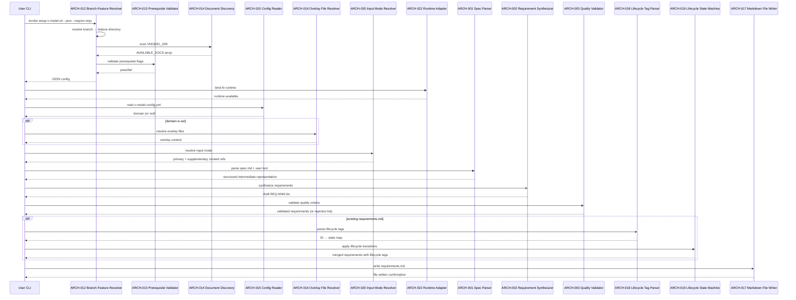
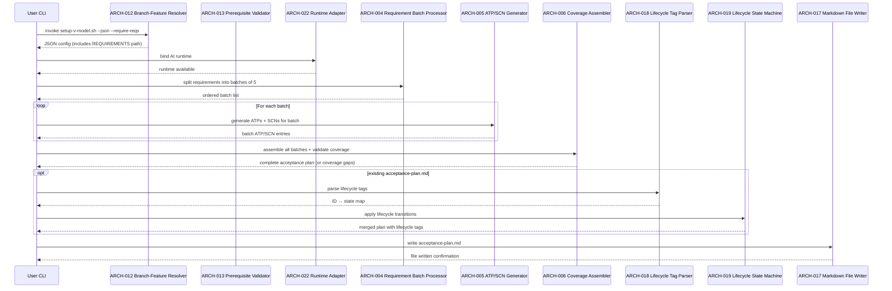
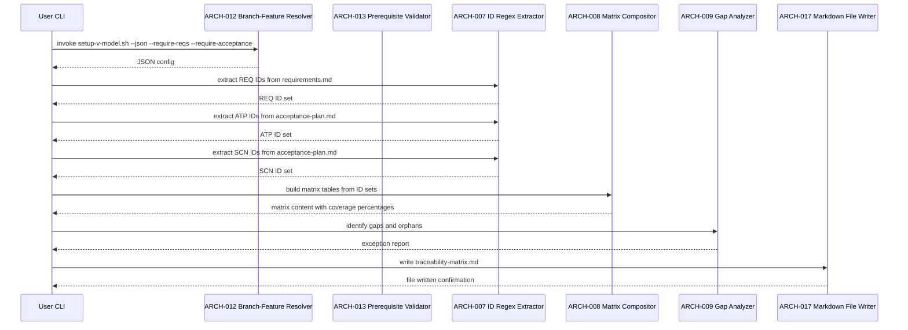
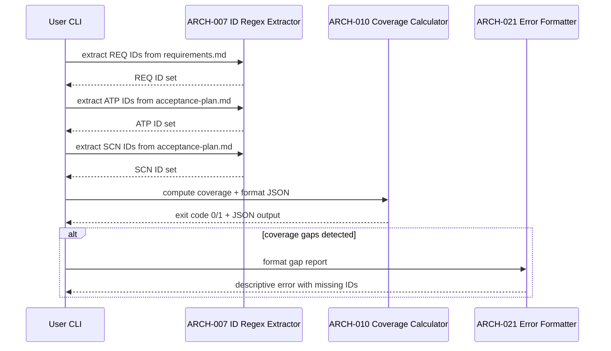

# Architecture Design: V-Model Extension Pack MVP

**Feature Branch**: `001-v-model-mvp`
**Created**: 2026-04-18
**Status**: Draft
**Source**: `specs/001-v-model-mvp/v-model/system-design.md`

## Overview

This document decomposes the twelve system components from `system-design.md` into twenty-two architecture modules organised into four IEEE 42010/Kruchten 4+1 views. The decomposition preserves the system design's generative-vs-deterministic separation: generative subsystems (SYS-001, SYS-002) decompose into parse → synthesise → validate pipelines, deterministic subsystems (SYS-003, SYS-004, SYS-005) decompose into extract → compute → report pipelines, and shared pattern-recognition logic (ID regex extraction, lifecycle tag parsing) is factored into reusable library modules to avoid duplication. Cross-cutting system components (SYS-009, SYS-011) trace to dedicated architecture modules that serve multiple consumers. No cross-cutting ARCH-level modules or derived modules were needed — all twenty-two modules trace to existing SYS components.

## ID Schema

- **Architecture Module**: `ARCH-NNN` — sequential identifier for each module
- **Parent System Components**: Comma-separated `SYS-NNN` list per module (many-to-many)
- **Cross-Cutting Tag**: `[CROSS-CUTTING]` for infrastructure/utility modules not traceable to a specific SYS
- Example: `ARCH-007` with Parent System Components `SYS-003, SYS-004` — shared library serves both components
- Example: `ARCH-017` with Parent System Components `SYS-008` — single-parent module

## Logical View — Component Breakdown (IEEE 42010 / Kruchten 4+1)

| ARCH ID | Name | Description | Parent System Components | Type |
|---------|------|-------------|--------------------------|------|
| ARCH-001 | Spec Parser | Reads `spec.md` and inline text arguments, extracts user stories, functional requirements, quality attributes, and constraints into a structured intermediate representation for downstream synthesis. | SYS-001 | Component |
| ARCH-002 | Requirement Synthesizer | AI-driven transformer that converts the parsed intermediate representation into sequentially numbered `REQ-NNN` entries with four-category classification (Functional, Non-Functional, Interface, Constraint), measurable language, and template-compliant structure. | SYS-001 | Component |
| ARCH-003 | Quality Validator | Validates each generated requirement against eight quality criteria (atomic, testable, unambiguous, complete, consistent, traceable, feasible, necessary) and checks for fifteen banned vague terms. Rejects non-conformant requirements with specific failure reasons. | SYS-001 | Component |
| ARCH-004 | Requirement Batch Processor | Splits the incoming requirements list into ordered batches of five for sequential processing by the ATP/SCN Generator. Maintains batch boundary metadata to ensure no requirement is skipped or duplicated across batches. | SYS-002 | Component |
| ARCH-005 | ATP/SCN Generator | AI-driven transformer that produces `ATP-NNN-X` test cases and `SCN-NNN-X#` BDD scenarios for each requirement batch. Generates happy-path (A-suffix) and edge-case (B/C-suffix) test cases with lineage-encoding IDs preserving the `SCN → ATP → REQ` traceability chain. | SYS-002 | Component |
| ARCH-006 | Coverage Assembler | Merges batched ATP/SCN outputs into a single acceptance plan, validates 100% REQ→ATP→SCN bidirectional coverage, resolves cross-batch ID conflicts, and assembles the coverage summary section with final counts. | SYS-002 | Component |
| ARCH-007 | ID Regex Extractor | Shared library that parses V-Model Markdown files using regular expressions to extract typed identifier sets: `REQ-(NF-\|IF-\|CN-)?[0-9]{3}`, `ATP-([A-Z]+-)?[0-9]{3}-[A-Z]`, `SCN-([A-Z]+-)?[0-9]{3}-[A-Z][0-9]+`. Returns deduplicated, sorted identifier arrays for downstream matrix and coverage computations. | SYS-003, SYS-004 | Library |
| ARCH-008 | Matrix Compositor | Constructs bidirectional traceability matrix tables (REQ↔ATP↔SCN) from extracted ID sets. Computes forward and backward coverage percentages, populates the five-matrix structure (A through H), and records baseline metadata (timestamps, source file references). | SYS-003 | Component |
| ARCH-009 | Gap Analyzer | Identifies coverage exceptions: requirements without ATPs, ATPs without SCNs, orphan ATPs/SCNs not traced to a parent, and SUSPECT-tagged items. Produces the Exception Report section with categorised findings. | SYS-003 | Component |
| ARCH-010 | Coverage Calculator | Computes bidirectional coverage percentages from extracted ID sets, determines pass/fail exit code (0 = full coverage, 1 = gaps), and formats the JSON output object with `has_gaps`, `reqs_without_atp`, `atps_without_scn`, and percentage fields. | SYS-004 | Component |
| ARCH-011 | Git Diff Analyzer | Executes `git diff` between the working copy and last committed version of `requirements.md`, parses the unified diff output, and classifies each requirement ID change into `added`, `modified`, or `removed` arrays for the JSON change report. | SYS-005 | Component |
| ARCH-012 | Branch-Feature Resolver | Maps the current Git branch name to a feature directory using the `^([0-9]{3}[a-z]?)-` regex pattern, with `SPECIFY_FEATURE` environment variable override. Returns the resolved `FEATURE_DIR` and `VMODEL_DIR` paths. | SYS-006 | Component |
| ARCH-013 | Prerequisite Validator | Evaluates prerequisite flags (`--require-reqs`, `--require-acceptance`, `--require-system-design`) against the resolved `VMODEL_DIR`, checking for the existence of each required document. Returns pass/fail with descriptive error messages identifying missing prerequisites. | SYS-006 | Component |
| ARCH-014 | Document Discovery | Scans the resolved `VMODEL_DIR` for all recognised V-Model document types (`spec.md`, `requirements.md`, `acceptance-plan.md`, `traceability-matrix.md`, `system-design.md`, `system-test.md`, `architecture-design.md`, `integration-test.md`, `module-design.md`, `unit-test.md`). Returns the `AVAILABLE_DOCS` array. | SYS-006 | Component |
| ARCH-015 | Config Reader | Reads `v-model-config.yml` from the repository root, extracts the `domain` field, and validates it against allowed values (`iso_26262`, `do_178c`, `iec_62304`). Returns the domain string or null if the file is absent or the field is empty. | SYS-007 | Component |
| ARCH-016 | Overlay File Resolver | Given a domain and command name, constructs the overlay file paths (`commands/overlays/{domain}/{command}.md`, `templates/overlays/{domain}/{template}.md`), checks existence, and returns the overlay content or empty string for absent files. | SYS-007 | Component |
| ARCH-017 | Markdown File Writer | Writes generated Markdown content to the Git-tracked `specs/{feature}/v-model/` directory using the expected file naming conventions. Enforces UTF-8 encoding, English language constraint, and directory creation if the `v-model/` subdirectory does not yet exist. | SYS-008 | Adapter |
| ARCH-018 | Lifecycle Tag Parser | Shared library that scans Markdown content for inline lifecycle markers: `[DEPRECATED — Superseded by ...]`, `[DEPRECATED — Withdrawn: ...]`, `[MODIFIED]`, `[SUSPECT — Parent ... modified/deprecated]`. Returns a structured map of ID → lifecycle state for each recognised tag. | SYS-009 | Library |
| ARCH-019 | Lifecycle State Machine | Applies lifecycle transition rules: deprecation cascading (parent deprecated → children become SUSPECT), suspect resolution (re-parent, deprecate, or confirm active), and incremental ID assignment (next sequential, never reuse gaps). Enforces the "never delete an ID" invariant. | SYS-009 | Component |
| ARCH-020 | Input Mode Resolver | Determines the input mode for the requirements command: `spec.md`-only (when AVAILABLE_DOCS contains `spec.md` and no inline text), text-only (inline text with no `spec.md`), or combined (both present). Returns the resolved primary and supplementary content references. | SYS-010 | Component |
| ARCH-021 | Error Formatter | Formats descriptive error messages with structured context: component name, operation attempted, failure cause, and recovery guidance. Writes to stderr. Prevents downstream execution when called (fail-fast pattern). | SYS-011 | Utility |
| ARCH-022 | Runtime Adapter | Binds to the AI assistant environment (GitHub Copilot or equivalent), providing tool access (file read, file write, script execution) for generative commands. Returns a capability check confirming AI runtime availability. Non-generative scripts bypass this adapter entirely. | SYS-012 | Adapter |

## Process View — Dynamic Behavior (Kruchten 4+1)

### Interaction: Requirements Generation Pipeline

The primary generative flow — transforms a feature specification into a validated requirements document.

**Concurrency Model**: Sequential pipeline — each stage completes before the next begins. No concurrent execution within the requirements generation flow because each stage depends on the previous stage's output.

**Synchronization Points**: Setup JSON must be fully parsed before any downstream component executes. Quality validation must complete before write.

### Interaction: Acceptance Plan Generation Pipeline

Transforms validated requirements into a three-tier acceptance test plan.

**Concurrency Model**: Sequential with internal iteration — batches are processed in order to maintain ID continuity. Each batch's ATP/SCN IDs must be assigned before the next batch starts.

**Synchronization Points**: Batch boundary metadata must transfer between iterations. Coverage assembly waits for all batches.

### Interaction: Traceability Matrix Build Pipeline

Deterministic script pipeline — no AI runtime required.

**Concurrency Model**: Sequential — extraction must complete before matrix composition. Parallelizable in theory (REQ/ATP/SCN extraction are independent), but sequential execution is simpler and deterministic output is the priority.

**Synchronization Points**: All three ID sets must be available before ARCH-008 begins composition.

### Interaction: Coverage Validation Pipeline

Deterministic validation — shares the ID Regex Extractor with the matrix builder.

**Concurrency Model**: Sequential — identical to matrix build pipeline structure.

## Interface View — API Contracts (Kruchten 4+1)

### ARCH-001: Spec Parser

| Direction | Name | Type | Format | Constraints |
|-----------|------|------|--------|-------------|
| Input | spec_content | string | Markdown text | Required when input mode is `spec.md` or `combined`; may be empty in `text-only` mode |
| Input | user_text | string | Plain text | Optional supplementary argument; may be empty |
| Output | parsed_repr | object | `{user_stories: [...], functional_reqs: [...], quality_attrs: [...], constraints: [...]}` | Arrays may be empty but structure must be present |
| Exception | EMPTY_INPUT | error | string | Raised when both `spec_content` and `user_text` are empty; delegates to ARCH-021 |

### ARCH-002: Requirement Synthesizer

| Direction | Name | Type | Format | Constraints |
|-----------|------|------|--------|-------------|
| Input | parsed_repr | object | Output of ARCH-001 | Required; must have at least one non-empty array |
| Input | overlay_content | string | Markdown (domain overlay) | Optional; empty when no domain configured |
| Input | template_structure | string | Markdown (template) | Required; defines output section layout |
| Output | draft_requirements | array | `[{id: "REQ-NNN", category, description, priority, verification_method, trace_source}]` | Sequential IDs; four categories; no banned terms |
| Exception | SYNTHESIS_FAILURE | error | string | Raised when AI runtime cannot produce conformant output after retry |

### ARCH-003: Quality Validator

| Direction | Name | Type | Format | Constraints |
|-----------|------|------|--------|-------------|
| Input | draft_requirements | array | Output of ARCH-002 | Required; non-empty array |
| Output | validated_requirements | array | Same format as input, filtered | Only requirements passing all 8 criteria |
| Output | rejection_list | array | `[{id, failed_criteria: [...], reason}]` | Requirements that failed validation; may be empty |
| Exception | VALIDATION_THRESHOLD | error | string | Raised when > 50% of requirements fail validation (structural spec issue) |

### ARCH-004: Requirement Batch Processor

| Direction | Name | Type | Format | Constraints |
|-----------|------|------|--------|-------------|
| Input | requirements_list | array | `[{id, category, description, ...}]` | Required; parsed from requirements.md |
| Input | batch_size | integer | Positive integer | Default: 5; minimum: 1; maximum: requirements count |
| Output | batches | array | `[[REQ-001..REQ-005], [REQ-006..REQ-010], ...]` | Ordered; no requirement omitted or duplicated |
| Exception | EMPTY_REQUIREMENTS | error | string | Raised when input list is empty |

### ARCH-005: ATP/SCN Generator

| Direction | Name | Type | Format | Constraints |
|-----------|------|------|--------|-------------|
| Input | requirement_batch | array | Single batch from ARCH-004 | Required; 1–5 requirements per batch |
| Input | start_atp_number | integer | Next available ATP sequence number | Required; ensures cross-batch ID continuity |
| Input | overlay_content | string | Markdown (domain overlay) | Optional |
| Output | atp_entries | array | `[{id: "ATP-NNN-X", parent_req, technique, description, scenarios: [{id: "SCN-NNN-X#", given, when, then}]}]` | At least one ATP per REQ; at least one SCN per ATP |
| Exception | GENERATION_FAILURE | error | string | Raised when AI runtime fails to produce valid BDD format |

### ARCH-006: Coverage Assembler

| Direction | Name | Type | Format | Constraints |
|-----------|------|------|--------|-------------|
| Input | all_batch_outputs | array | Array of ARCH-005 outputs | Required; one entry per batch |
| Input | requirements_list | array | Full requirements list | Required; for coverage verification |
| Output | acceptance_plan | string | Markdown document | Complete acceptance-plan.md content |
| Output | coverage_summary | object | `{total_reqs, total_atps, total_scns, coverage_pct}` | 100% or gap list |
| Exception | COVERAGE_GAP | error | string | Raised when any REQ has zero ATPs after assembly |
| Exception | ID_CONFLICT | error | string | Raised when duplicate ATP/SCN IDs found across batches |

### ARCH-007: ID Regex Extractor

| Direction | Name | Type | Format | Constraints |
|-----------|------|------|--------|-------------|
| Input | markdown_content | string | Markdown file content | Required; non-empty |
| Input | id_type | enum | `"REQ"` \| `"ATP"` \| `"SCN"` | Required; determines regex pattern |
| Output | id_set | array | Sorted, deduplicated string array | e.g., `["REQ-001", "REQ-002", "REQ-NF-001"]` |
| Exception | MALFORMED_INPUT | error | string | Raised when file has no recognisable Markdown table structure |

### ARCH-008: Matrix Compositor

| Direction | Name | Type | Format | Constraints |
|-----------|------|------|--------|-------------|
| Input | req_ids | array | Output of ARCH-007 (type=REQ) | Required |
| Input | atp_ids | array | Output of ARCH-007 (type=ATP) | Required for Matrix A |
| Input | scn_ids | array | Output of ARCH-007 (type=SCN) | Required for Matrix A |
| Input | sys_ids | array | Output of ARCH-007 (type=SYS) | Optional; enables Matrix B |
| Output | matrix_content | string | Markdown tables (Matrix A–H) | Coverage percentages computed; baseline metadata included |
| Exception | EMPTY_ID_SET | error | string | Raised when any required ID set is empty |

### ARCH-009: Gap Analyzer

| Direction | Name | Type | Format | Constraints |
|-----------|------|------|--------|-------------|
| Input | matrix_content | object | Parsed matrix from ARCH-008 | Required |
| Input | lifecycle_map | object | Output of ARCH-018 (optional) | Used to flag SUSPECT items |
| Output | exception_report | string | Markdown section | Categories: uncovered REQs, orphan ATPs, orphan SCNs, SUSPECT items |
| Output | has_gaps | boolean | `true` \| `false` | `true` if any non-deprecated item is uncovered |

### ARCH-010: Coverage Calculator

| Direction | Name | Type | Format | Constraints |
|-----------|------|------|--------|-------------|
| Input | req_ids | array | Output of ARCH-007 (type=REQ) | Required |
| Input | atp_ids | array | Output of ARCH-007 (type=ATP) | Required |
| Input | scn_ids | array | Output of ARCH-007 (type=SCN) | Required |
| Output | exit_code | integer | `0` (full coverage) or `1` (gaps) | Deterministic |
| Output | json_report | object | `{has_gaps, reqs_without_atp, atps_without_scn, req_coverage_pct, atp_coverage_pct}` | Only when `--json` flag is present |

### ARCH-011: Git Diff Analyzer

| Direction | Name | Type | Format | Constraints |
|-----------|------|------|--------|-------------|
| Input | vmodel_dir | string | Directory path | Required; must contain requirements.md |
| Output | change_report | object | `{added: [...], modified: [...], removed: [...]}` | Arrays of REQ-NNN IDs |
| Exception | NO_GIT_HISTORY | error | string | Raised when requirements.md has no committed version |
| Exception | NOT_GIT_REPO | error | string | Raised when directory is not within a Git repository |

### ARCH-012: Branch-Feature Resolver

| Direction | Name | Type | Format | Constraints |
|-----------|------|------|--------|-------------|
| Input | branch_name | string | Git branch name (from `git rev-parse`) | Required |
| Input | specify_feature | string | `SPECIFY_FEATURE` env var | Optional; overrides branch-based resolution |
| Output | feature_dir | string | Path `specs/{feature}/` | Must exist on filesystem |
| Output | vmodel_dir | string | Path `specs/{feature}/v-model/` | Created if absent |
| Exception | RESOLUTION_FAILURE | error | string | Raised when branch name doesn't match `^([0-9]{3}[a-z]?)-` and no override set |

### ARCH-013: Prerequisite Validator

| Direction | Name | Type | Format | Constraints |
|-----------|------|------|--------|-------------|
| Input | vmodel_dir | string | Output of ARCH-012 | Required |
| Input | required_flags | array | `["--require-reqs", "--require-acceptance", "--require-system-design"]` | Zero or more |
| Output | validation_result | boolean | `true` (all present) | All required documents exist |
| Exception | MISSING_PREREQUISITE | error | string | Exit code 1; identifies the specific missing document |

### ARCH-014: Document Discovery

| Direction | Name | Type | Format | Constraints |
|-----------|------|------|--------|-------------|
| Input | vmodel_dir | string | Output of ARCH-012 | Required |
| Output | available_docs | array | String array of filenames | e.g., `["spec.md", "requirements.md"]` |

### ARCH-015: Config Reader

| Direction | Name | Type | Format | Constraints |
|-----------|------|------|--------|-------------|
| Input | repo_root | string | Repository root path | Required |
| Output | domain | string \| null | `"iso_26262"` \| `"do_178c"` \| `"iec_62304"` \| `null` | `null` when file absent or field empty |
| Exception | INVALID_DOMAIN | error | string | Raised when domain value is not in the allowed set |

### ARCH-016: Overlay File Resolver

| Direction | Name | Type | Format | Constraints |
|-----------|------|------|--------|-------------|
| Input | domain | string | Output of ARCH-015 | Required; non-null |
| Input | command_name | string | e.g., `"requirements"`, `"acceptance"`, `"trace"` | Required |
| Output | command_overlay | string | Markdown content | Empty string if file absent |
| Output | template_overlay | string | Markdown content | Empty string if file absent |

### ARCH-017: Markdown File Writer

| Direction | Name | Type | Format | Constraints |
|-----------|------|------|--------|-------------|
| Input | content | string | Markdown text | Required; non-empty |
| Input | target_path | string | Full file path | Must be within `specs/{feature}/v-model/` |
| Output | write_confirmation | boolean | `true` on success | File exists at target_path after call |
| Exception | WRITE_FAILURE | error | string | Raised on filesystem error (permissions, disk full) |

### ARCH-018: Lifecycle Tag Parser

| Direction | Name | Type | Format | Constraints |
|-----------|------|------|--------|-------------|
| Input | markdown_content | string | Any V-Model Markdown file | Required |
| Output | lifecycle_map | object | `{id: {state, detail}}` | State: `ACTIVE` \| `DEPRECATED_SUPERSEDED` \| `DEPRECATED_WITHDRAWN` \| `MODIFIED` \| `SUSPECT` |

### ARCH-019: Lifecycle State Machine

| Direction | Name | Type | Format | Constraints |
|-----------|------|------|--------|-------------|
| Input | lifecycle_map | object | Output of ARCH-018 | Required |
| Input | parent_changes | object | Map of parent ID → change type | Required; from upstream artifact comparison |
| Output | transitions | array | `[{id, from_state, to_state, action, reason}]` | Ordered list of applied transitions |
| Output | next_id | string | Next available sequential ID | e.g., `REQ-036` if highest is REQ-035 |
| Exception | INVALID_TRANSITION | error | string | Raised on illegal state transition (e.g., DEPRECATED → ACTIVE) |

### ARCH-020: Input Mode Resolver

| Direction | Name | Type | Format | Constraints |
|-----------|------|------|--------|-------------|
| Input | available_docs | array | Output of ARCH-014 | Required |
| Input | user_arguments | string | Inline text from CLI | May be empty |
| Output | input_mode | enum | `"spec_only"` \| `"text_only"` \| `"combined"` | Determined by presence of spec.md and user text |
| Output | primary_content | string | spec.md content or user text | Non-empty for the resolved mode |
| Output | supplementary_content | string \| null | User text when mode is `combined` | null otherwise |
| Exception | NO_INPUT | error | string | Raised when both sources are empty; delegates to ARCH-021 |

### ARCH-021: Error Formatter

| Direction | Name | Type | Format | Constraints |
|-----------|------|------|--------|-------------|
| Input | error_category | enum | `"EMPTY_INPUT"` \| `"MISSING_PREREQUISITE"` \| `"MALFORMED_MARKDOWN"` \| `"COVERAGE_GAP"` \| `"VALIDATION_FAILURE"` \| `"WRITE_FAILURE"` \| `"RUNTIME_UNAVAILABLE"` | Required |
| Input | context | object | `{component, operation, cause, guidance}` | Required; all fields populated |
| Output | formatted_message | string | Human-readable error message | Written to stderr |
| Output | exit_code | integer | Non-zero | Halts downstream execution |

### ARCH-022: Runtime Adapter

| Direction | Name | Type | Format | Constraints |
|-----------|------|------|--------|-------------|
| Input | capability_check | enum | `"generative"` \| `"deterministic"` | Required |
| Output | runtime_available | boolean | `true` \| `false` | `true` for generative only when AI assistant bound |
| Output | tool_access | object | `{file_read, file_write, script_exec}` | Available tool capabilities |
| Exception | RUNTIME_UNAVAILABLE | error | string | Raised when generative command invoked without AI runtime |

## Data Flow View — Data Transformation Chains (Kruchten 4+1)

### Data Flow: Feature Specification → Requirements Document

| Stage | Module | Input Format | Transformation | Output Format |
|-------|--------|-------------|----------------|---------------|
| 1 | ARCH-012 | Git branch name | Resolve branch → feature path | JSON config (VMODEL_DIR, FEATURE_DIR, AVAILABLE_DOCS) |
| 2 | ARCH-020 | JSON config + user CLI args | Determine input mode; load spec.md or text | Primary content string + supplementary content string |
| 3 | ARCH-015 | YAML file (v-model-config.yml) | Extract domain field | Domain string or null |
| 4 | ARCH-016 | Domain string + command name | Load overlay files from filesystem | Command overlay string + template overlay string |
| 5 | ARCH-001 | Markdown (spec.md) + plain text | Parse into structured sections | Intermediate representation (user stories, FRs, QAs, constraints) |
| 6 | ARCH-002 | Intermediate repr + overlays + template | AI synthesis → REQ-NNN entries | Draft requirements array (35 entries) |
| 7 | ARCH-003 | Draft requirements array | Validate 8 criteria + 15 banned terms | Validated requirements array (non-conformant rejected) |
| 8 | ARCH-017 | Validated requirements array | Format to template structure | Markdown file (requirements.md) |

### Data Flow: Requirements Document → Acceptance Test Plan

| Stage | Module | Input Format | Transformation | Output Format |
|-------|--------|-------------|----------------|---------------|
| 1 | ARCH-012 | Git branch name | Resolve paths + validate --require-reqs | JSON config with REQUIREMENTS path |
| 2 | ARCH-004 | Markdown (requirements.md) → REQ array | Split into ordered batches of 5 | Array of 7 batches (for 35 REQs) |
| 3 | ARCH-005 | Requirement batch (5 REQs) | AI generation → ATP-NNN-X + SCN-NNN-X# | Batch ATP/SCN entries with BDD scenarios |
| 4 | ARCH-006 | All batch outputs + full REQ list | Merge, deduplicate, validate 100% coverage | Complete acceptance plan Markdown |
| 5 | ARCH-017 | Acceptance plan Markdown | Write to filesystem | Markdown file (acceptance-plan.md) |

### Data Flow: Requirements + Acceptance → Traceability Matrix

| Stage | Module | Input Format | Transformation | Output Format |
|-------|--------|-------------|----------------|---------------|
| 1 | ARCH-007 | Markdown (requirements.md) | Regex extraction of REQ IDs | Sorted REQ ID array (35 items) |
| 2 | ARCH-007 | Markdown (acceptance-plan.md) | Regex extraction of ATP IDs | Sorted ATP ID array (59 items) |
| 3 | ARCH-007 | Markdown (acceptance-plan.md) | Regex extraction of SCN IDs | Sorted SCN ID array (63 items) |
| 4 | ARCH-008 | Three ID arrays | Build forward/backward matrix tables | Matrix content with coverage percentages |
| 5 | ARCH-009 | Matrix content + lifecycle map | Identify gaps, orphans, SUSPECT items | Exception report section |
| 6 | ARCH-017 | Matrix + exception report | Format to template structure | Markdown file (traceability-matrix.md) |

### Data Flow: Coverage Validation

| Stage | Module | Input Format | Transformation | Output Format |
|-------|--------|-------------|----------------|---------------|
| 1 | ARCH-007 | Markdown (requirements.md + acceptance-plan.md) | Regex extraction of REQ, ATP, SCN IDs | Three sorted ID arrays |
| 2 | ARCH-010 | Three ID arrays | Compute bidirectional coverage, determine gaps | Exit code (0/1) + JSON report object |

---

## Coverage Summary

| Metric | Count |
|--------|-------|
| Total Architecture Modules (ARCH) | 22 (22 active, 0 deprecated, 0 suspect) |
| Cross-Cutting Modules | 0 |
| Total Parent System Components Covered | 12 / 12 (100%) (active items only) |
| Modules per Type | Component: 16 \| Service: 0 \| Library: 2 \| Utility: 1 \| Adapter: 3 |
| **Forward Coverage (SYS→ARCH)** | **100%** |

## Derived Modules

None — all modules trace to existing system components.
