```mermaid
stateDiagram-v2
    [*] --> Active
    Active --> Suspect : Parent modified/deprecated
    Active --> Deprecated_Superseded : Superseded by new ID
    Active --> Deprecated_Withdrawn : Withdrawn with justification
    Active --> Modified : Content updated in-place
    Suspect --> Active : Confirmed active after review
    Suspect --> Deprecated_Superseded : Re-parent failed; superseded
    Suspect --> Deprecated_Withdrawn : Parent withdrawn; cascade
    Modified --> Active : Modification accepted
    Deprecated_Superseded --> [*]
    Deprecated_Withdrawn --> [*]
    note right of Deprecated_Superseded : Terminal state — cannot reactivate
    note right of Deprecated_Withdrawn : Terminal state — cannot reactivate
```

# Module Design: V-Model Extension Pack MVP

**Feature Branch**: `001-v-model-mvp`
**Created**: 2026-04-19
**Status**: Draft
**Source**: `specs/001-v-model-mvp/v-model/architecture-design.md`

## Overview

This document decomposes the twenty-two architecture modules from `architecture-design.md` into twenty-eight low-level module specifications. The implementation spans two code paradigms: AI prompt definitions (commands/*.md for generative modules) and shell scripts (scripts/bash/*.sh for deterministic modules). Each MOD is detailed with pseudocode precise enough that coding is a translation exercise. Generative modules (MOD-001 through MOD-007) define prompt-orchestration logic; deterministic modules (MOD-008 through MOD-028) define regex, file I/O, and control-flow logic executable in Bash.

## ID Schema

- **Module Design**: `MOD-NNN` — sequential identifier for each module (3-digit zero-padded)
- **Parent Architecture Modules**: Comma-separated `ARCH-NNN` list per module (many-to-many, authoritative for traceability)
- **Target Source File(s)**: Comma-separated file paths mapping to the repository codebase
- Example: `MOD-008` with Parent Architecture Modules `ARCH-007` — regex extractor library function

## Summary Table

| MOD | Name | Parent ARCH | Target Source File(s) | Type |
|-----|------|------------|----------------------|------|
| MOD-001 | parse_spec_content | ARCH-001 | `commands/requirements.md` | Generative |
| MOD-002 | synthesize_requirements | ARCH-002 | `commands/requirements.md` | Generative |
| MOD-003 | validate_requirement_quality | ARCH-003 | `commands/requirements.md` | Generative |
| MOD-004 | check_banned_terms | ARCH-003 | `commands/requirements.md` | Deterministic |
| MOD-005 | create_requirement_batches | ARCH-004 | `commands/acceptance.md` | Generative |
| MOD-006 | generate_atp_scn | ARCH-005 | `commands/acceptance.md` | Generative |
| MOD-007 | assemble_acceptance_plan | ARCH-006 | `commands/acceptance.md` | Generative |
| MOD-008 | extract_ids | ARCH-007 | `scripts/bash/build-matrix.sh`, `scripts/bash/validate-requirement-coverage.sh` | Deterministic |
| MOD-009 | build_matrix_tables | ARCH-008 | `scripts/bash/build-matrix.sh` | Deterministic |
| MOD-010 | compute_coverage_stats | ARCH-008 | `scripts/bash/build-matrix.sh` | Deterministic |
| MOD-011 | find_gaps | ARCH-009 | `scripts/bash/build-matrix.sh` | Deterministic |
| MOD-012 | format_exception_report | ARCH-009 | `scripts/bash/build-matrix.sh` | Deterministic |
| MOD-013 | compute_bidirectional_coverage | ARCH-010 | `scripts/bash/validate-requirement-coverage.sh` | Deterministic |
| MOD-014 | format_json_report | ARCH-010 | `scripts/bash/validate-requirement-coverage.sh` | Deterministic |
| MOD-015 | parse_unified_diff | ARCH-011 | `scripts/bash/diff-requirements.sh` | Deterministic |
| MOD-016 | classify_changes | ARCH-011 | `scripts/bash/diff-requirements.sh` | Deterministic |
| MOD-017 | resolve_feature_from_branch | ARCH-012 | `scripts/bash/setup-v-model.sh` | Deterministic |
| MOD-018 | validate_prerequisites | ARCH-013 | `scripts/bash/setup-v-model.sh` | Deterministic |
| MOD-019 | scan_vmodel_directory | ARCH-014 | `scripts/bash/setup-v-model.sh` | Deterministic |
| MOD-020 | read_vmodel_config | ARCH-015 | `commands/requirements.md`, `commands/acceptance.md` | Deterministic |
| MOD-021 | resolve_overlay_paths | ARCH-016 | `commands/requirements.md`, `commands/acceptance.md` | Deterministic |
| MOD-022 | write_markdown_file | ARCH-017 | `commands/requirements.md`, `commands/acceptance.md`, `scripts/bash/build-matrix.sh` | Deterministic |
| MOD-023 | parse_lifecycle_tags | ARCH-018 | `commands/requirements.md`, `commands/acceptance.md` | Deterministic |
| MOD-024 | apply_lifecycle_transitions | ARCH-019 | `commands/requirements.md`, `commands/acceptance.md` | Deterministic |
| MOD-025 | assign_next_id | ARCH-019 | `commands/requirements.md`, `commands/acceptance.md` | Deterministic |
| MOD-026 | resolve_input_mode | ARCH-020 | `commands/requirements.md` | Deterministic |
| MOD-027 | format_error_message | ARCH-021 | `scripts/bash/setup-v-model.sh` | Deterministic |
| MOD-028 | check_runtime_capability | ARCH-022 | `extension.yml` | Deterministic |

## Module Designs

### Module: MOD-001 (parse_spec_content)

**Parent Architecture Modules**: ARCH-001
**Target Source File(s)**: `commands/requirements.md`

#### Algorithmic / Logic View

```pseudocode
FUNCTION parse_spec_content(spec_content: String, user_text: String) -> ParsedRepr:
    // Step 1: Validate inputs
    IF spec_content IS EMPTY AND user_text IS EMPTY:
        RAISE EMPTY_INPUT("Both spec_content and user_text are empty")

    // Step 2: Initialize intermediate representation
    result = ParsedRepr {
        user_stories: [],
        functional_reqs: [],
        quality_attrs: [],
        constraints: []
    }

    // Step 3: Parse spec.md sections (primary source)
    IF spec_content IS NOT EMPTY:
        sections = split_by_h2_headers(spec_content)
        FOR EACH section IN sections:
            IF section.header MATCHES "User Stor":
                items = extract_numbered_items(section.body)
                result.user_stories.extend(items)
            ELSE IF section.header MATCHES "Functional Requirement":
                items = extract_table_rows(section.body, columns=["ID", "Description", "Priority"])
                result.functional_reqs.extend(items)
            ELSE IF section.header MATCHES "Quality Attribute":
                items = extract_table_rows(section.body, columns=["ID", "Description"])
                result.quality_attrs.extend(items)
            ELSE IF section.header MATCHES "Constraint":
                items = extract_table_rows(section.body, columns=["ID", "Description"])
                result.constraints.extend(items)

    // Step 4: Append supplementary text (if present)
    IF user_text IS NOT EMPTY:
        supplementary = extract_requirements_from_prose(user_text)
        result.functional_reqs.extend(supplementary)

    // Step 5: Return structured representation
    RETURN result
```

#### State Machine View

N/A — Stateless pure function

#### Internal Data Structures

| Name | Type | Size/Constraints | Initialization | Description |
|------|------|-----------------|----------------|-------------|
| result | ParsedRepr | 4 arrays, each unbounded | Empty arrays | Intermediate representation accumulator |
| sections | Array\<Section\> | 1 per h2 header in spec.md | From split | Markdown sections split by `## ` headers |
| items | Array\<String\> | 1 per table row or numbered item | From extraction | Individual requirement/story entries |

#### Error Handling & Return Codes

| Error Condition | Error Code / Exception | Architecture Contract | Recovery |
|----------------|----------------------|----------------------|----------|
| Both inputs empty | EMPTY_INPUT | ARCH-001 Exception contract | Delegate to ARCH-021 (Error Formatter); halt pipeline |
| Malformed Markdown (no h2 headers) | Graceful degradation | N/A | Return ParsedRepr with empty arrays; ARCH-002 handles empty input |

---

### Module: MOD-002 (synthesize_requirements)

**Parent Architecture Modules**: ARCH-002
**Target Source File(s)**: `commands/requirements.md`

#### Algorithmic / Logic View

```pseudocode
FUNCTION synthesize_requirements(parsed_repr: ParsedRepr, overlay_content: String,
                                  template_structure: String) -> Array<Requirement>:
    // Step 1: Initialize output
    requirements = []
    next_functional_id = 1
    next_nf_id = 1
    next_if_id = 1
    next_cn_id = 1

    // Step 2: Process each source category
    FOR EACH story IN parsed_repr.user_stories:
        reqs = decompose_story_to_requirements(story)
        FOR EACH req IN reqs:
            req.id = format("REQ-%03d", next_functional_id)
            next_functional_id += 1
            req.category = "Functional"
            req.trace_source = story.source_section
            requirements.append(req)

    FOR EACH fr IN parsed_repr.functional_reqs:
        req = translate_to_requirement(fr)
        req.id = format("REQ-%03d", next_functional_id)
        next_functional_id += 1
        req.category = "Functional"
        requirements.append(req)

    FOR EACH qa IN parsed_repr.quality_attrs:
        req = translate_to_requirement(qa)
        req.id = format("REQ-NF-%03d", next_nf_id)
        next_nf_id += 1
        req.category = "Non-Functional"
        requirements.append(req)

    FOR EACH cn IN parsed_repr.constraints:
        IF cn.type == "interface":
            req.id = format("REQ-IF-%03d", next_if_id)
            next_if_id += 1
            req.category = "Interface"
        ELSE:
            req.id = format("REQ-CN-%03d", next_cn_id)
            next_cn_id += 1
            req.category = "Constraint"
        requirements.append(req)

    // Step 3: Apply overlay enrichment (if present)
    IF overlay_content IS NOT EMPTY:
        domain_guidance = parse_overlay_sections(overlay_content)
        FOR EACH req IN requirements:
            enrich_with_domain_guidance(req, domain_guidance)

    // Step 4: Assign verification methods and priorities
    FOR EACH req IN requirements:
        req.verification_method = determine_verification(req.category, req.description)
        req.priority = determine_priority(req.category, req.description)

    RETURN requirements
```

#### State Machine View

N/A — Stateless pure function

#### Internal Data Structures

| Name | Type | Size/Constraints | Initialization | Description |
|------|------|-----------------|----------------|-------------|
| requirements | Array\<Requirement\> | Unbounded; typically 20–50 | Empty array | Accumulator for synthesized requirements |
| next_functional_id | Integer | ≥ 1 | 1 | Counter for REQ-NNN sequential numbering |
| next_nf_id | Integer | ≥ 1 | 1 | Counter for REQ-NF-NNN numbering |
| next_if_id | Integer | ≥ 1 | 1 | Counter for REQ-IF-NNN numbering |
| next_cn_id | Integer | ≥ 1 | 1 | Counter for REQ-CN-NNN numbering |
| domain_guidance | Object | Depends on overlay | From parse | Extracted domain-specific enrichment rules |

#### Error Handling & Return Codes

| Error Condition | Error Code / Exception | Architecture Contract | Recovery |
|----------------|----------------------|----------------------|----------|
| Empty parsed_repr (all arrays empty) | SYNTHESIS_FAILURE | ARCH-002 Exception contract | Delegate to ARCH-021; halt pipeline |
| AI runtime unable to produce conformant output | SYNTHESIS_FAILURE | ARCH-002 Exception contract | Retry once; if still fails, delegate to ARCH-021 |

---

### Module: MOD-003 (validate_requirement_quality)

**Parent Architecture Modules**: ARCH-003
**Target Source File(s)**: `commands/requirements.md`

#### Algorithmic / Logic View

```pseudocode
FUNCTION validate_requirement_quality(draft_requirements: Array<Requirement>) -> ValidationResult:
    CONST QUALITY_CRITERIA = ["atomic", "testable", "unambiguous", "complete",
                              "consistent", "traceable", "feasible", "necessary"]
    validated = []
    rejected = []

    FOR EACH req IN draft_requirements:
        failures = []

        // Check each criterion
        IF NOT is_atomic(req.description):
            failures.append("atomic: contains multiple independent conditions")
        IF NOT is_testable(req.description):
            failures.append("testable: no measurable acceptance condition")
        IF NOT is_unambiguous(req.description):
            failures.append("unambiguous: uses subjective terms")
        IF NOT is_complete(req.description, req.trace_source):
            failures.append("complete: missing context or preconditions")
        IF NOT is_consistent(req, draft_requirements):
            failures.append("consistent: conflicts with another requirement")
        IF NOT has_trace(req.trace_source):
            failures.append("traceable: no trace to spec.md section")
        IF NOT is_feasible(req.description):
            failures.append("feasible: requires capabilities beyond system scope")
        IF NOT is_necessary(req.description, req.trace_source):
            failures.append("necessary: not traceable to a user need")

        // Check banned terms (delegates to MOD-004)
        banned_hits = check_banned_terms(req.description)
        IF banned_hits IS NOT EMPTY:
            failures.append(format("banned terms: %s", join(banned_hits, ", ")))

        IF failures IS EMPTY:
            validated.append(req)
        ELSE:
            rejected.append({id: req.id, failed_criteria: failures, reason: join(failures, "; ")})

    // Threshold check
    IF length(rejected) > length(draft_requirements) * 0.5:
        RAISE VALIDATION_THRESHOLD(format("%d of %d requirements failed", length(rejected), length(draft_requirements)))

    RETURN ValidationResult { validated: validated, rejection_list: rejected }
```

#### State Machine View

N/A — Stateless pure function

#### Internal Data Structures

| Name | Type | Size/Constraints | Initialization | Description |
|------|------|-----------------|----------------|-------------|
| QUALITY_CRITERIA | Array\<String\> | Exactly 8 | Constant | The eight quality criteria names |
| validated | Array\<Requirement\> | ≤ input length | Empty | Requirements passing all criteria |
| rejected | Array\<RejectionEntry\> | ≤ input length | Empty | Requirements with failure reasons |
| failures | Array\<String\> | 0–9 per requirement | Empty per iteration | Criterion failures for current requirement |

#### Error Handling & Return Codes

| Error Condition | Error Code / Exception | Architecture Contract | Recovery |
|----------------|----------------------|----------------------|----------|
| > 50% requirements fail | VALIDATION_THRESHOLD | ARCH-003 Exception contract | Delegate to ARCH-021; suggest spec.md review |
| Individual requirement fails criteria | Rejection entry (not exception) | N/A | Included in rejection_list; pipeline continues |

---

### Module: MOD-004 (check_banned_terms)

**Parent Architecture Modules**: ARCH-003
**Target Source File(s)**: `commands/requirements.md`

#### Algorithmic / Logic View

```pseudocode
FUNCTION check_banned_terms(description: String) -> Array<String>:
    CONST BANNED_TERMS = [
        "fast", "slow", "quick", "efficient", "user-friendly",
        "intuitive", "robust", "flexible", "scalable", "powerful",
        "simple", "easy", "lightweight", "seamless", "state-of-the-art"
    ]
    hits = []

    description_lower = lowercase(description)
    FOR EACH term IN BANNED_TERMS:
        IF description_lower CONTAINS term:
            // Verify word boundary (not substring of another word)
            IF regex_match(description_lower, format("\\b%s\\b", term)):
                hits.append(term)

    RETURN hits
```

#### State Machine View

N/A — Stateless pure function

#### Internal Data Structures

| Name | Type | Size/Constraints | Initialization | Description |
|------|------|-----------------|----------------|-------------|
| BANNED_TERMS | Array\<String\> | Exactly 15 | Constant | List of vague terms prohibited in requirements |
| hits | Array\<String\> | 0–15 | Empty | Matched banned terms found in description |
| description_lower | String | Same length as input | From lowercase() | Case-normalized input for matching |

#### Error Handling & Return Codes

| Error Condition | Error Code / Exception | Architecture Contract | Recovery |
|----------------|----------------------|----------------------|----------|
| Empty description | Returns empty array | N/A | No banned terms in empty string |

---

### Module: MOD-005 (create_requirement_batches)

**Parent Architecture Modules**: ARCH-004
**Target Source File(s)**: `commands/acceptance.md`

#### Algorithmic / Logic View

```pseudocode
FUNCTION create_requirement_batches(requirements: Array<Requirement>,
                                     batch_size: Integer = 5) -> Array<Array<Requirement>>:
    IF length(requirements) == 0:
        RAISE EMPTY_REQUIREMENTS("No requirements to batch")
    IF batch_size < 1:
        batch_size = 5  // Fallback to default

    batches = []
    current_batch = []

    FOR i = 0 TO length(requirements) - 1:
        current_batch.append(requirements[i])
        IF length(current_batch) == batch_size OR i == length(requirements) - 1:
            batches.append(copy(current_batch))
            current_batch = []

    RETURN batches
```

#### State Machine View

N/A — Stateless pure function

#### Internal Data Structures

| Name | Type | Size/Constraints | Initialization | Description |
|------|------|-----------------|----------------|-------------|
| batches | Array\<Array\<Requirement\>\> | ceil(N / batch_size) | Empty | Collected batches |
| current_batch | Array\<Requirement\> | 0 to batch_size | Empty | Accumulator for current batch |
| batch_size | Integer | ≥ 1, default 5 | 5 | Maximum items per batch |

#### Error Handling & Return Codes

| Error Condition | Error Code / Exception | Architecture Contract | Recovery |
|----------------|----------------------|----------------------|----------|
| Empty requirements list | EMPTY_REQUIREMENTS | ARCH-004 Exception contract | Delegate to ARCH-021 |

---

### Module: MOD-006 (generate_atp_scn)

**Parent Architecture Modules**: ARCH-005
**Target Source File(s)**: `commands/acceptance.md`

#### Algorithmic / Logic View

```pseudocode
FUNCTION generate_atp_scn(batch: Array<Requirement>, start_atp_number: Integer,
                           overlay_content: String) -> BatchOutput:
    entries = []
    current_atp_num = start_atp_number

    FOR EACH req IN batch:
        // Generate happy-path test case (A suffix)
        atp_a = {
            id: format("ATP-%03d-A", current_atp_num),
            parent_req: req.id,
            technique: "Validation",
            description: generate_happy_path_description(req)
        }
        atp_a.scenarios = [generate_bdd_scenario(atp_a.id, 1, req, "happy_path")]

        // Generate edge-case test cases (B, C suffixes)
        edge_cases = identify_edge_cases(req.description)
        suffix = ord('B')
        FOR EACH edge IN edge_cases:
            atp_edge = {
                id: format("ATP-%03d-%c", current_atp_num, suffix),
                parent_req: req.id,
                technique: "Edge-case Validation",
                description: generate_edge_description(req, edge)
            }
            atp_edge.scenarios = [generate_bdd_scenario(atp_edge.id, 1, req, edge)]
            entries.append(atp_edge)
            suffix += 1

        entries.insert_before_edges(atp_a)  // A always first
        current_atp_num += 1

    RETURN BatchOutput { entries: entries, next_atp_number: current_atp_num }
```

#### State Machine View

N/A — Stateless pure function

#### Internal Data Structures

| Name | Type | Size/Constraints | Initialization | Description |
|------|------|-----------------|----------------|-------------|
| entries | Array\<ATPEntry\> | ≥ batch size (at least 1 per REQ) | Empty | Generated ATP entries with nested SCN scenarios |
| current_atp_num | Integer | ≥ start_atp_number | start_atp_number | Rolling ATP sequence counter |
| edge_cases | Array\<String\> | 0–3 per requirement | From identification | Identified edge-case conditions |

#### Error Handling & Return Codes

| Error Condition | Error Code / Exception | Architecture Contract | Recovery |
|----------------|----------------------|----------------------|----------|
| AI runtime fails to produce valid BDD | GENERATION_FAILURE | ARCH-005 Exception contract | Retry once; if still fails, delegate to ARCH-021 |
| Empty batch | Returns empty entries | N/A | Upstream MOD-005 prevents this |

---

### Module: MOD-007 (assemble_acceptance_plan)

**Parent Architecture Modules**: ARCH-006
**Target Source File(s)**: `commands/acceptance.md`

#### Algorithmic / Logic View

```pseudocode
FUNCTION assemble_acceptance_plan(batch_outputs: Array<BatchOutput>,
                                   requirements: Array<Requirement>) -> AcceptancePlan:
    // Step 1: Merge all entries
    all_entries = []
    seen_ids = Set()
    FOR EACH batch IN batch_outputs:
        FOR EACH entry IN batch.entries:
            IF entry.id IN seen_ids:
                RAISE ID_CONFLICT(format("Duplicate ATP ID: %s", entry.id))
            seen_ids.add(entry.id)
            all_entries.append(entry)

    // Step 2: Validate bidirectional coverage
    covered_reqs = Set()
    FOR EACH entry IN all_entries:
        covered_reqs.add(entry.parent_req)

    all_req_ids = Set(req.id FOR req IN requirements)
    uncovered = all_req_ids - covered_reqs
    IF length(uncovered) > 0:
        RAISE COVERAGE_GAP(format("Requirements without ATP: %s", join(uncovered, ", ")))

    // Step 3: Compute summary
    total_atps = length(all_entries)
    total_scns = sum(length(e.scenarios) FOR e IN all_entries)
    coverage_pct = (length(covered_reqs) / length(all_req_ids)) * 100

    // Step 4: Format Markdown output using template
    plan_content = format_to_template(all_entries, requirements,
                                       {total_atps, total_scns, coverage_pct})

    RETURN AcceptancePlan { content: plan_content, summary: {total_atps, total_scns, coverage_pct} }
```

#### State Machine View

N/A — Stateless pure function

#### Internal Data Structures

| Name | Type | Size/Constraints | Initialization | Description |
|------|------|-----------------|----------------|-------------|
| all_entries | Array\<ATPEntry\> | Sum of batch entries | Empty | Merged entries from all batches |
| seen_ids | Set\<String\> | ≤ all_entries count | Empty | Duplicate detection set |
| covered_reqs | Set\<String\> | ≤ requirements count | Empty | REQ IDs that have at least one ATP |
| uncovered | Set\<String\> | 0 (target) | Computed | REQ IDs missing ATP coverage |

#### Error Handling & Return Codes

| Error Condition | Error Code / Exception | Architecture Contract | Recovery |
|----------------|----------------------|----------------------|----------|
| Duplicate ATP ID across batches | ID_CONFLICT | ARCH-006 Exception contract | Delegate to ARCH-021; requires batch regeneration |
| Requirements without ATP coverage | COVERAGE_GAP | ARCH-006 Exception contract | Delegate to ARCH-021; lists uncovered REQs |

---

### Module: MOD-008 (extract_ids)

**Parent Architecture Modules**: ARCH-007
**Target Source File(s)**: `scripts/bash/build-matrix.sh`, `scripts/bash/validate-requirement-coverage.sh`

#### Algorithmic / Logic View

```pseudocode
FUNCTION extract_ids(markdown_content: String, id_type: Enum["REQ","ATP","SCN"]) -> Array<String>:
    // Step 1: Select regex pattern based on id_type
    SWITCH id_type:
        CASE "REQ":
            pattern = "REQ-(NF-|IF-|CN-)?[0-9]{3}"
        CASE "ATP":
            pattern = "ATP-([A-Z]+-)?[0-9]{3}-[A-Z]"
        CASE "SCN":
            pattern = "SCN-([A-Z]+-)?[0-9]{3}-[A-Z][0-9]+"

    // Step 2: Extract all matches
    matches = grep_oE(pattern, markdown_content)

    // Step 3: Deduplicate and sort
    unique_ids = sort(unique(matches))

    RETURN unique_ids
```

#### State Machine View

N/A — Stateless pure function

#### Internal Data Structures

| Name | Type | Size/Constraints | Initialization | Description |
|------|------|-----------------|----------------|-------------|
| pattern | String | Fixed regex per type | From switch | Regex pattern for ID extraction |
| matches | Array\<String\> | Unbounded; includes duplicates | From grep | Raw regex matches |
| unique_ids | Array\<String\> | ≤ matches count | From dedup+sort | Final deduplicated sorted array |

#### Error Handling & Return Codes

| Error Condition | Error Code / Exception | Architecture Contract | Recovery |
|----------------|----------------------|----------------------|----------|
| No matches found | Returns empty array | N/A | Caller (MOD-009/MOD-013) handles empty |
| Malformed Markdown (no table structure) | MALFORMED_INPUT (exit 1) | ARCH-007 Exception contract | Print error to stderr; exit |

---

### Module: MOD-009 (build_matrix_tables)

**Parent Architecture Modules**: ARCH-008
**Target Source File(s)**: `scripts/bash/build-matrix.sh`

#### Algorithmic / Logic View

```pseudocode
FUNCTION build_matrix_tables(req_ids: Array<String>, atp_ids: Array<String>,
                              scn_ids: Array<String>, acceptance_content: String) -> MatrixContent:
    IF length(req_ids) == 0:
        RAISE EMPTY_ID_SET("No REQ IDs extracted")

    // Step 1: Build REQ→ATP mapping by scanning acceptance plan
    req_to_atps = Dict<String, Array<String>>()
    FOR EACH req_id IN req_ids:
        req_to_atps[req_id] = []
    FOR EACH atp_id IN atp_ids:
        parent_req = extract_parent_req_from_atp_context(acceptance_content, atp_id)
        IF parent_req IN req_to_atps:
            req_to_atps[parent_req].append(atp_id)

    // Step 2: Build ATP→SCN mapping
    atp_to_scns = Dict<String, Array<String>>()
    FOR EACH atp_id IN atp_ids:
        atp_to_scns[atp_id] = []
    FOR EACH scn_id IN scn_ids:
        parent_atp = derive_parent_atp_from_scn_id(scn_id)
        IF parent_atp IN atp_to_scns:
            atp_to_scns[parent_atp].append(scn_id)

    // Step 3: Format Matrix A table
    matrix_rows = []
    FOR EACH req_id IN req_ids:
        atps = req_to_atps[req_id]
        scns = flatten(atp_to_scns[atp] FOR atp IN atps)
        matrix_rows.append({req: req_id, atps: join(atps, ", "), scns: join(scns, ", ")})

    // Step 4: Compute coverage stats (delegates to MOD-010)
    stats = compute_coverage_stats(req_ids, atp_ids, scn_ids, req_to_atps, atp_to_scns)

    RETURN MatrixContent { rows: matrix_rows, stats: stats, timestamp: now() }
```

#### State Machine View

N/A — Stateless pure function

#### Internal Data Structures

| Name | Type | Size/Constraints | Initialization | Description |
|------|------|-----------------|----------------|-------------|
| req_to_atps | Dict\<String, Array\<String\>\> | 1 entry per REQ | Empty arrays per REQ | Forward mapping REQ→ATP |
| atp_to_scns | Dict\<String, Array\<String\>\> | 1 entry per ATP | Empty arrays per ATP | Forward mapping ATP→SCN |
| matrix_rows | Array\<MatrixRow\> | 1 per REQ | Empty | Formatted matrix rows |

#### Error Handling & Return Codes

| Error Condition | Error Code / Exception | Architecture Contract | Recovery |
|----------------|----------------------|----------------------|----------|
| Empty REQ ID set | EMPTY_ID_SET (exit 1) | ARCH-008 Exception contract | Print error; exit |
| ATP not mappable to REQ | Logged as orphan | N/A | Passed to MOD-011 gap analysis |

---

### Module: MOD-010 (compute_coverage_stats)

**Parent Architecture Modules**: ARCH-008
**Target Source File(s)**: `scripts/bash/build-matrix.sh`

#### Algorithmic / Logic View

```pseudocode
FUNCTION compute_coverage_stats(req_ids: Array, atp_ids: Array, scn_ids: Array,
                                 req_to_atps: Dict, atp_to_scns: Dict) -> CoverageStats:
    reqs_with_atp = count(req FOR req IN req_ids IF length(req_to_atps[req]) > 0)
    atps_with_scn = count(atp FOR atp IN atp_ids IF length(atp_to_scns[atp]) > 0)

    RETURN CoverageStats {
        total_reqs: length(req_ids),
        total_atps: length(atp_ids),
        total_scns: length(scn_ids),
        req_coverage_pct: (reqs_with_atp / length(req_ids)) * 100,
        atp_coverage_pct: (atps_with_scn / length(atp_ids)) * 100,
        reqs_covered: reqs_with_atp,
        atps_covered: atps_with_scn
    }
```

#### State Machine View

N/A — Stateless pure function

#### Internal Data Structures

| Name | Type | Size/Constraints | Initialization | Description |
|------|------|-----------------|----------------|-------------|
| reqs_with_atp | Integer | 0 to total_reqs | Computed | Count of REQs having ≥1 ATP |
| atps_with_scn | Integer | 0 to total_atps | Computed | Count of ATPs having ≥1 SCN |

#### Error Handling & Return Codes

| Error Condition | Error Code / Exception | Architecture Contract | Recovery |
|----------------|----------------------|----------------------|----------|
| Division by zero (0 REQs) | Returns 0% | N/A | Upstream MOD-009 prevents this via EMPTY_ID_SET check |

---

### Module: MOD-011 (find_gaps)

**Parent Architecture Modules**: ARCH-009
**Target Source File(s)**: `scripts/bash/build-matrix.sh`

#### Algorithmic / Logic View

```pseudocode
FUNCTION find_gaps(req_to_atps: Dict, atp_to_scns: Dict,
                    all_atp_ids: Array, all_req_ids: Array) -> GapReport:
    uncovered_reqs = []
    FOR EACH req IN all_req_ids:
        IF length(req_to_atps[req]) == 0:
            uncovered_reqs.append(req)

    uncovered_atps = []
    FOR EACH atp IN all_atp_ids:
        IF length(atp_to_scns[atp]) == 0:
            uncovered_atps.append(atp)

    orphan_atps = []
    mapped_atps = flatten(req_to_atps.values())
    FOR EACH atp IN all_atp_ids:
        IF atp NOT IN mapped_atps:
            orphan_atps.append(atp)

    has_gaps = length(uncovered_reqs) > 0 OR length(uncovered_atps) > 0 OR length(orphan_atps) > 0

    RETURN GapReport {
        uncovered_reqs: uncovered_reqs,
        uncovered_atps: uncovered_atps,
        orphan_atps: orphan_atps,
        has_gaps: has_gaps
    }
```

#### State Machine View

N/A — Stateless pure function

#### Internal Data Structures

| Name | Type | Size/Constraints | Initialization | Description |
|------|------|-----------------|----------------|-------------|
| uncovered_reqs | Array\<String\> | 0 to total REQs | Empty | REQs with no ATP |
| uncovered_atps | Array\<String\> | 0 to total ATPs | Empty | ATPs with no SCN |
| orphan_atps | Array\<String\> | 0 to total ATPs | Empty | ATPs not traced to any REQ |

#### Error Handling & Return Codes

| Error Condition | Error Code / Exception | Architecture Contract | Recovery |
|----------------|----------------------|----------------------|----------|
| Gaps found | has_gaps = true | ARCH-009 output contract | Report included in matrix output |

---

### Module: MOD-012 (format_exception_report)

**Parent Architecture Modules**: ARCH-009
**Target Source File(s)**: `scripts/bash/build-matrix.sh`

#### Algorithmic / Logic View

```pseudocode
FUNCTION format_exception_report(gap_report: GapReport) -> String:
    lines = ["## Exception Report", ""]

    IF NOT gap_report.has_gaps:
        lines.append("No exceptions — full coverage achieved.")
        RETURN join(lines, "\n")

    IF length(gap_report.uncovered_reqs) > 0:
        lines.append("### Uncovered Requirements")
        FOR EACH req IN gap_report.uncovered_reqs:
            lines.append(format("- %s — No ATP mapped", req))
        lines.append("")

    IF length(gap_report.uncovered_atps) > 0:
        lines.append("### ATPs Without Scenarios")
        FOR EACH atp IN gap_report.uncovered_atps:
            lines.append(format("- %s — No SCN mapped", atp))
        lines.append("")

    IF length(gap_report.orphan_atps) > 0:
        lines.append("### Orphan ATPs")
        FOR EACH atp IN gap_report.orphan_atps:
            lines.append(format("- %s — Not traced to any REQ", atp))

    RETURN join(lines, "\n")
```

#### State Machine View

N/A — Stateless pure function

#### Internal Data Structures

| Name | Type | Size/Constraints | Initialization | Description |
|------|------|-----------------|----------------|-------------|
| lines | Array\<String\> | Unbounded | Header lines | Markdown output accumulator |

#### Error Handling & Return Codes

| Error Condition | Error Code / Exception | Architecture Contract | Recovery |
|----------------|----------------------|----------------------|----------|
| None | N/A | N/A | Pure formatting function; no failure modes |

---

### Module: MOD-013 (compute_bidirectional_coverage)

**Parent Architecture Modules**: ARCH-010
**Target Source File(s)**: `scripts/bash/validate-requirement-coverage.sh`

#### Algorithmic / Logic View

```pseudocode
FUNCTION compute_bidirectional_coverage(vmodel_dir: String, json_flag: Boolean) -> ExitCode:
    // Step 1: Read input files
    reqs_content = read_file(vmodel_dir + "/requirements.md")
    acceptance_content = read_file(vmodel_dir + "/acceptance-plan.md")

    // Step 2: Extract IDs (delegates to MOD-008)
    req_ids = extract_ids(reqs_content, "REQ")
    atp_ids = extract_ids(acceptance_content, "ATP")
    scn_ids = extract_ids(acceptance_content, "SCN")

    // Step 3: Build mappings
    reqs_without_atp = []
    FOR EACH req IN req_ids:
        atp_pattern = format("ATP-%s", extract_number(req))
        IF NOT any(atp MATCHES atp_pattern FOR atp IN atp_ids):
            reqs_without_atp.append(req)

    atps_without_scn = []
    FOR EACH atp IN atp_ids:
        scn_pattern = format("SCN-%s", extract_atp_suffix(atp))
        IF NOT any(scn MATCHES scn_pattern FOR scn IN scn_ids):
            atps_without_scn.append(atp)

    // Step 4: Determine result
    has_gaps = length(reqs_without_atp) > 0 OR length(atps_without_scn) > 0

    // Step 5: Output (delegates to MOD-014 if json_flag)
    IF json_flag:
        report = format_json_report(req_ids, atp_ids, scn_ids,
                                     reqs_without_atp, atps_without_scn, has_gaps)
        print(report)
    ELSE:
        print_text_summary(req_ids, atp_ids, scn_ids, has_gaps)

    IF has_gaps:
        RETURN 1
    ELSE:
        RETURN 0
```

#### State Machine View

N/A — Stateless pure function

#### Internal Data Structures

| Name | Type | Size/Constraints | Initialization | Description |
|------|------|-----------------|----------------|-------------|
| req_ids | Array\<String\> | From file | From MOD-008 | Extracted REQ identifiers |
| atp_ids | Array\<String\> | From file | From MOD-008 | Extracted ATP identifiers |
| scn_ids | Array\<String\> | From file | From MOD-008 | Extracted SCN identifiers |
| reqs_without_atp | Array\<String\> | 0 to req count | Empty | Gap list |
| atps_without_scn | Array\<String\> | 0 to atp count | Empty | Gap list |

#### Error Handling & Return Codes

| Error Condition | Error Code / Exception | Architecture Contract | Recovery |
|----------------|----------------------|----------------------|----------|
| Coverage gaps | Exit code 1 | ARCH-010 output contract | Caller interprets exit code |
| Full coverage | Exit code 0 | ARCH-010 output contract | Success |
| Missing input file | Exit code 1 + stderr message | ARCH-010 implied | Upstream setup script prevents this |

---

### Module: MOD-014 (format_json_report)

**Parent Architecture Modules**: ARCH-010
**Target Source File(s)**: `scripts/bash/validate-requirement-coverage.sh`

#### Algorithmic / Logic View

```pseudocode
FUNCTION format_json_report(req_ids: Array, atp_ids: Array, scn_ids: Array,
                             reqs_without_atp: Array, atps_without_scn: Array,
                             has_gaps: Boolean) -> String:
    req_pct = IF length(req_ids) > 0 THEN
                  ((length(req_ids) - length(reqs_without_atp)) / length(req_ids)) * 100
              ELSE 0
    atp_pct = IF length(atp_ids) > 0 THEN
                  ((length(atp_ids) - length(atps_without_scn)) / length(atp_ids)) * 100
              ELSE 0

    json = {
        "has_gaps": has_gaps,
        "total_reqs": length(req_ids),
        "total_atps": length(atp_ids),
        "total_scns": length(scn_ids),
        "reqs_without_atp": reqs_without_atp,
        "atps_without_scn": atps_without_scn,
        "req_coverage_pct": req_pct,
        "atp_coverage_pct": atp_pct
    }

    RETURN json_serialize(json)
```

#### State Machine View

N/A — Stateless pure function

#### Internal Data Structures

| Name | Type | Size/Constraints | Initialization | Description |
|------|------|-----------------|----------------|-------------|
| req_pct | Float | 0.0–100.0 | Computed | REQ→ATP coverage percentage |
| atp_pct | Float | 0.0–100.0 | Computed | ATP→SCN coverage percentage |

#### Error Handling & Return Codes

| Error Condition | Error Code / Exception | Architecture Contract | Recovery |
|----------------|----------------------|----------------------|----------|
| None | N/A | N/A | Pure formatting; zero division guarded |

---

### Module: MOD-015 (parse_unified_diff)

**Parent Architecture Modules**: ARCH-011
**Target Source File(s)**: `scripts/bash/diff-requirements.sh`

#### Algorithmic / Logic View

```pseudocode
FUNCTION parse_unified_diff(vmodel_dir: String) -> DiffResult:
    req_file = vmodel_dir + "/requirements.md"

    // Step 1: Check Git history
    git_status = run("git log --oneline -1 -- " + req_file)
    IF git_status IS EMPTY:
        RAISE NO_GIT_HISTORY(format("No committed version of %s", req_file))

    // Step 2: Get unified diff
    diff_output = run("git diff HEAD -- " + req_file)

    // Step 3: Parse diff hunks
    added_lines = []
    removed_lines = []
    FOR EACH line IN split(diff_output, "\n"):
        IF line STARTS WITH "+":
            IF NOT line STARTS WITH "+++":
                added_lines.append(line[1:])  // Strip leading +
        ELSE IF line STARTS WITH "-":
            IF NOT line STARTS WITH "---":
                removed_lines.append(line[1:])  // Strip leading -

    RETURN DiffResult { added_lines: added_lines, removed_lines: removed_lines }
```

#### State Machine View

N/A — Stateless pure function

#### Internal Data Structures

| Name | Type | Size/Constraints | Initialization | Description |
|------|------|-----------------|----------------|-------------|
| diff_output | String | Unbounded | From git diff | Raw unified diff output |
| added_lines | Array\<String\> | 0 to diff size | Empty | Lines added in working copy |
| removed_lines | Array\<String\> | 0 to diff size | Empty | Lines removed from committed version |

#### Error Handling & Return Codes

| Error Condition | Error Code / Exception | Architecture Contract | Recovery |
|----------------|----------------------|----------------------|----------|
| No Git history | NO_GIT_HISTORY (exit 1) | ARCH-011 Exception contract | Print error; exit |
| Not a Git repo | NOT_GIT_REPO (exit 1) | ARCH-011 Exception contract | Print error; exit |

---

### Module: MOD-016 (classify_changes)

**Parent Architecture Modules**: ARCH-011
**Target Source File(s)**: `scripts/bash/diff-requirements.sh`

#### Algorithmic / Logic View

```pseudocode
FUNCTION classify_changes(diff_result: DiffResult) -> ChangeReport:
    added_ids = extract_ids(join(diff_result.added_lines, "\n"), "REQ")
    removed_ids = extract_ids(join(diff_result.removed_lines, "\n"), "REQ")

    // IDs in both added and removed = modified (content changed)
    modified = intersection(added_ids, removed_ids)

    // IDs only in added = newly added
    added = difference(added_ids, removed_ids)

    // IDs only in removed = deleted
    removed = difference(removed_ids, added_ids)

    RETURN ChangeReport { added: added, modified: modified, removed: removed }
```

#### State Machine View

N/A — Stateless pure function

#### Internal Data Structures

| Name | Type | Size/Constraints | Initialization | Description |
|------|------|-----------------|----------------|-------------|
| added_ids | Array\<String\> | From diff added lines | From MOD-008 | REQ IDs in added lines |
| removed_ids | Array\<String\> | From diff removed lines | From MOD-008 | REQ IDs in removed lines |

#### Error Handling & Return Codes

| Error Condition | Error Code / Exception | Architecture Contract | Recovery |
|----------------|----------------------|----------------------|----------|
| No changes detected | Returns empty arrays | N/A | Valid result — no changes |

---

### Module: MOD-017 (resolve_feature_from_branch)

**Parent Architecture Modules**: ARCH-012
**Target Source File(s)**: `scripts/bash/setup-v-model.sh`

#### Algorithmic / Logic View

```pseudocode
FUNCTION resolve_feature_from_branch(branch_name: String,
                                      specify_feature: String = "") -> FeaturePaths:
    // Step 1: Check environment override
    IF specify_feature IS NOT EMPTY:
        feature_name = specify_feature
    ELSE:
        // Step 2: Apply regex pattern to branch name
        cleaned = regex_replace(branch_name, "^(feature|bugfix|hotfix)/", "")
        match = regex_match(cleaned, "^([0-9]{3}[a-z]?)-")
        IF match IS NULL:
            RAISE RESOLUTION_FAILURE(format("Branch '%s' doesn't match pattern ^([0-9]{3}[a-z]?)-", branch_name))
        feature_prefix = match.group(1)
        feature_name = cleaned  // Full cleaned name (e.g., "001-v-model-mvp")

    // Step 3: Resolve paths
    feature_dir = "specs/" + feature_name + "/"
    vmodel_dir = feature_dir + "v-model/"

    RETURN FeaturePaths { feature_dir: feature_dir, vmodel_dir: vmodel_dir, feature_name: feature_name }
```

#### State Machine View

N/A — Stateless pure function

#### Internal Data Structures

| Name | Type | Size/Constraints | Initialization | Description |
|------|------|-----------------|----------------|-------------|
| feature_name | String | Non-empty | From override or regex | Resolved feature directory name |
| cleaned | String | Branch name without prefix | From regex_replace | Cleaned branch name |

#### Error Handling & Return Codes

| Error Condition | Error Code / Exception | Architecture Contract | Recovery |
|----------------|----------------------|----------------------|----------|
| Branch doesn't match pattern and no override | RESOLUTION_FAILURE (exit 1) | ARCH-012 Exception contract | Print error with expected pattern; exit |

---

### Module: MOD-018 (validate_prerequisites)

**Parent Architecture Modules**: ARCH-013
**Target Source File(s)**: `scripts/bash/setup-v-model.sh`

#### Algorithmic / Logic View

```pseudocode
FUNCTION validate_prerequisites(vmodel_dir: String,
                                  required_flags: Array<String>) -> Boolean:
    flag_to_file = {
        "--require-reqs": "requirements.md",
        "--require-acceptance": "acceptance-plan.md",
        "--require-system-design": "system-design.md",
        "--require-architecture-design": "architecture-design.md"
    }

    FOR EACH flag IN required_flags:
        expected_file = flag_to_file[flag]
        full_path = vmodel_dir + "/" + expected_file
        IF NOT file_exists(full_path):
            RAISE MISSING_PREREQUISITE(format("%s not found at %s", expected_file, full_path))

    RETURN true
```

#### State Machine View

N/A — Stateless pure function

#### Internal Data Structures

| Name | Type | Size/Constraints | Initialization | Description |
|------|------|-----------------|----------------|-------------|
| flag_to_file | Dict\<String, String\> | 4 entries | Constant | Maps CLI flags to expected file names |

#### Error Handling & Return Codes

| Error Condition | Error Code / Exception | Architecture Contract | Recovery |
|----------------|----------------------|----------------------|----------|
| File not found for required flag | MISSING_PREREQUISITE (exit 1) | ARCH-013 Exception contract | Print error identifying missing file; exit |

---

### Module: MOD-019 (scan_vmodel_directory)

**Parent Architecture Modules**: ARCH-014
**Target Source File(s)**: `scripts/bash/setup-v-model.sh`

#### Algorithmic / Logic View

```pseudocode
FUNCTION scan_vmodel_directory(vmodel_dir: String) -> Array<String>:
    CONST KNOWN_DOCS = [
        "spec.md", "requirements.md", "acceptance-plan.md",
        "traceability-matrix.md", "system-design.md", "system-test.md",
        "architecture-design.md", "integration-test.md",
        "module-design.md", "unit-test.md"
    ]

    available = []
    FOR EACH doc IN KNOWN_DOCS:
        IF file_exists(vmodel_dir + "/" + doc):
            available.append(doc)

    RETURN available
```

#### State Machine View

N/A — Stateless pure function

#### Internal Data Structures

| Name | Type | Size/Constraints | Initialization | Description |
|------|------|-----------------|----------------|-------------|
| KNOWN_DOCS | Array\<String\> | Exactly 10 | Constant | Recognised V-Model document file names |
| available | Array\<String\> | 0–10 | Empty | Documents found in directory |

#### Error Handling & Return Codes

| Error Condition | Error Code / Exception | Architecture Contract | Recovery |
|----------------|----------------------|----------------------|----------|
| Directory doesn't exist | Returns empty array | N/A | Upstream MOD-017 ensures directory exists |

---

### Module: MOD-020 (read_vmodel_config)

**Parent Architecture Modules**: ARCH-015
**Target Source File(s)**: `commands/requirements.md`, `commands/acceptance.md`

#### Algorithmic / Logic View

```pseudocode
FUNCTION read_vmodel_config(repo_root: String) -> String | NULL:
    CONST ALLOWED_DOMAINS = ["iso_26262", "do_178c", "iec_62304"]
    config_path = repo_root + "/v-model-config.yml"

    IF NOT file_exists(config_path):
        RETURN NULL

    config = parse_yaml(read_file(config_path))

    IF "domain" NOT IN config OR config["domain"] IS EMPTY:
        RETURN NULL

    domain = config["domain"]
    IF domain NOT IN ALLOWED_DOMAINS:
        RAISE INVALID_DOMAIN(format("Domain '%s' not in allowed set: %s", domain, join(ALLOWED_DOMAINS, ", ")))

    RETURN domain
```

#### State Machine View

N/A — Stateless pure function

#### Internal Data Structures

| Name | Type | Size/Constraints | Initialization | Description |
|------|------|-----------------|----------------|-------------|
| ALLOWED_DOMAINS | Array\<String\> | Exactly 3 | Constant | Valid domain values |
| config | Dict | From YAML parse | From file | Parsed YAML config object |

#### Error Handling & Return Codes

| Error Condition | Error Code / Exception | Architecture Contract | Recovery |
|----------------|----------------------|----------------------|----------|
| File absent | Returns NULL | N/A | Base-only generation |
| Domain empty | Returns NULL | N/A | Base-only generation |
| Invalid domain value | INVALID_DOMAIN | ARCH-015 Exception contract | Delegate to ARCH-021 |

---

### Module: MOD-021 (resolve_overlay_paths)

**Parent Architecture Modules**: ARCH-016
**Target Source File(s)**: `commands/requirements.md`, `commands/acceptance.md`

#### Algorithmic / Logic View

```pseudocode
FUNCTION resolve_overlay_paths(domain: String, command_name: String) -> OverlayContent:
    cmd_overlay_path = format("commands/overlays/%s/%s.md", domain, command_name)
    tmpl_overlay_path = format("templates/overlays/%s/%s-template.md", domain, command_name)

    command_overlay = ""
    IF file_exists(cmd_overlay_path):
        command_overlay = read_file(cmd_overlay_path)

    template_overlay = ""
    IF file_exists(tmpl_overlay_path):
        template_overlay = read_file(tmpl_overlay_path)

    RETURN OverlayContent { command_overlay: command_overlay, template_overlay: template_overlay }
```

#### State Machine View

N/A — Stateless pure function

#### Internal Data Structures

| Name | Type | Size/Constraints | Initialization | Description |
|------|------|-----------------|----------------|-------------|
| cmd_overlay_path | String | Repository-relative | Formatted | Expected command overlay file path |
| tmpl_overlay_path | String | Repository-relative | Formatted | Expected template overlay file path |

#### Error Handling & Return Codes

| Error Condition | Error Code / Exception | Architecture Contract | Recovery |
|----------------|----------------------|----------------------|----------|
| Overlay file absent | Returns empty string | N/A | Graceful degradation to base-only |

---

### Module: MOD-022 (write_markdown_file)

**Parent Architecture Modules**: ARCH-017
**Target Source File(s)**: `commands/requirements.md`, `commands/acceptance.md`, `scripts/bash/build-matrix.sh`

#### Algorithmic / Logic View

```pseudocode
FUNCTION write_markdown_file(content: String, target_path: String) -> Boolean:
    // Step 1: Validate inputs
    IF content IS EMPTY:
        RAISE WRITE_FAILURE("Cannot write empty content")

    // Step 2: Ensure directory exists
    target_dir = dirname(target_path)
    IF NOT directory_exists(target_dir):
        mkdir_p(target_dir)

    // Step 3: Write file
    TRY:
        write_file(target_path, content, encoding="UTF-8")
    CATCH IOError AS e:
        RAISE WRITE_FAILURE(format("Failed to write %s: %s", target_path, e.message))

    // Step 4: Verify
    IF NOT file_exists(target_path):
        RAISE WRITE_FAILURE(format("File not found after write: %s", target_path))

    RETURN true
```

#### State Machine View

N/A — Stateless pure function

#### Internal Data Structures

| Name | Type | Size/Constraints | Initialization | Description |
|------|------|-----------------|----------------|-------------|
| target_dir | String | Parent directory of target | From dirname() | Directory to ensure exists |

#### Error Handling & Return Codes

| Error Condition | Error Code / Exception | Architecture Contract | Recovery |
|----------------|----------------------|----------------------|----------|
| Empty content | WRITE_FAILURE | ARCH-017 Exception contract | Delegate to ARCH-021 |
| Filesystem error | WRITE_FAILURE | ARCH-017 Exception contract | Delegate to ARCH-021; no partial file |
| Post-write verification fails | WRITE_FAILURE | ARCH-017 Exception contract | Delegate to ARCH-021 |

---

### Module: MOD-023 (parse_lifecycle_tags)

**Parent Architecture Modules**: ARCH-018
**Target Source File(s)**: `commands/requirements.md`, `commands/acceptance.md`

#### Algorithmic / Logic View

```pseudocode
FUNCTION parse_lifecycle_tags(markdown_content: String) -> Dict<String, LifecycleState>:
    CONST TAG_PATTERNS = {
        "DEPRECATED_SUPERSEDED": regex("\\[DEPRECATED — Superseded by (\\S+)\\]"),
        "DEPRECATED_WITHDRAWN":  regex("\\[DEPRECATED — Withdrawn: (.+?)\\]"),
        "MODIFIED":              regex("\\[MODIFIED\\]"),
        "SUSPECT":               regex("\\[SUSPECT — Parent (\\S+) (deprecated|modified)\\]")
    }

    lifecycle_map = Dict()

    // Extract all IDs from document
    all_ids = extract_ids(markdown_content, "REQ")  // Or ATP, SCN depending on context

    FOR EACH id IN all_ids:
        // Find the line containing this ID
        id_line = find_line_containing(markdown_content, id)

        state = "ACTIVE"
        detail = ""

        FOR EACH tag_type, pattern IN TAG_PATTERNS:
            match = pattern.search(id_line)
            IF match IS NOT NULL:
                state = tag_type
                detail = match.group(1) IF match.groups() ELSE ""
                BREAK

        lifecycle_map[id] = LifecycleState { state: state, detail: detail }

    RETURN lifecycle_map
```

#### State Machine View

N/A — Stateless pure function

#### Internal Data Structures

| Name | Type | Size/Constraints | Initialization | Description |
|------|------|-----------------|----------------|-------------|
| TAG_PATTERNS | Dict\<String, Regex\> | 4 patterns | Constant | Lifecycle tag detection regexes |
| lifecycle_map | Dict\<String, LifecycleState\> | 1 per ID | Empty | Mapping of ID to lifecycle state |

#### Error Handling & Return Codes

| Error Condition | Error Code / Exception | Architecture Contract | Recovery |
|----------------|----------------------|----------------------|----------|
| No lifecycle tags found | All IDs mapped as ACTIVE | N/A | Normal case for fresh artifacts |
| Malformed tag syntax | ID mapped as ACTIVE (tag ignored) | N/A | Graceful; malformed tags treated as untagged |

---

### Module: MOD-024 (apply_lifecycle_transitions)

**Parent Architecture Modules**: ARCH-019
**Target Source File(s)**: `commands/requirements.md`, `commands/acceptance.md`

#### Algorithmic / Logic View

```pseudocode
FUNCTION apply_lifecycle_transitions(lifecycle_map: Dict<String, LifecycleState>,
                                      parent_changes: Dict<String, ChangeType>) -> TransitionResult:
    CONST VALID_TRANSITIONS = {
        ("ACTIVE", "SUSPECT"): true,
        ("ACTIVE", "DEPRECATED_SUPERSEDED"): true,
        ("ACTIVE", "DEPRECATED_WITHDRAWN"): true,
        ("ACTIVE", "MODIFIED"): true,
        ("SUSPECT", "ACTIVE"): true,          // Confirmed active after review
        ("SUSPECT", "DEPRECATED_SUPERSEDED"): true,
        ("SUSPECT", "DEPRECATED_WITHDRAWN"): true,
        ("MODIFIED", "ACTIVE"): true,         // Modification accepted
    }

    transitions = []

    FOR EACH id, change_type IN parent_changes:
        IF id NOT IN lifecycle_map:
            CONTINUE

        current_state = lifecycle_map[id].state
        target_state = determine_target_state(current_state, change_type)

        transition_key = (current_state, target_state)
        IF transition_key NOT IN VALID_TRANSITIONS:
            RAISE INVALID_TRANSITION(format("Cannot transition %s from %s to %s",
                                             id, current_state, target_state))

        transitions.append({
            id: id,
            from_state: current_state,
            to_state: target_state,
            action: change_type,
            reason: format("Parent %s %s", parent_changes[id].parent_id, change_type)
        })

        // Update map for cascading
        lifecycle_map[id].state = target_state

    RETURN TransitionResult { transitions: transitions, updated_map: lifecycle_map }
```

#### State Machine View



#### Internal Data Structures

| Name | Type | Size/Constraints | Initialization | Description |
|------|------|-----------------|----------------|-------------|
| VALID_TRANSITIONS | Dict\<Tuple, Boolean\> | 8 valid transitions | Constant | Allowed state transition pairs |
| transitions | Array\<TransitionEntry\> | 0 to parent_changes size | Empty | Applied transitions log |

#### Error Handling & Return Codes

| Error Condition | Error Code / Exception | Architecture Contract | Recovery |
|----------------|----------------------|----------------------|----------|
| Invalid state transition | INVALID_TRANSITION | ARCH-019 Exception contract | Delegate to ARCH-021; halt |
| ID not in lifecycle map | Skipped silently | N/A | Parent change references unknown ID |

---

### Module: MOD-025 (assign_next_id)

**Parent Architecture Modules**: ARCH-019
**Target Source File(s)**: `commands/requirements.md`, `commands/acceptance.md`

#### Algorithmic / Logic View

```pseudocode
FUNCTION assign_next_id(existing_ids: Array<String>, prefix: String) -> String:
    // Step 1: Extract numeric portions
    max_num = 0
    pattern = format("%s-([0-9]{3})", prefix)  // e.g., "REQ-([0-9]{3})"

    FOR EACH id IN existing_ids:
        match = regex_match(id, pattern)
        IF match IS NOT NULL:
            num = parse_int(match.group(1))
            IF num > max_num:
                max_num = num

    // Step 2: Assign next sequential (never reuse gaps)
    next_num = max_num + 1
    next_id = format("%s-%03d", prefix, next_num)

    RETURN next_id
```

#### State Machine View

N/A — Stateless pure function

#### Internal Data Structures

| Name | Type | Size/Constraints | Initialization | Description |
|------|------|-----------------|----------------|-------------|
| max_num | Integer | ≥ 0 | 0 | Highest existing numeric suffix |
| next_num | Integer | max_num + 1 | Computed | Next sequential number |

#### Error Handling & Return Codes

| Error Condition | Error Code / Exception | Architecture Contract | Recovery |
|----------------|----------------------|----------------------|----------|
| Empty existing_ids | Returns prefix-001 | N/A | First ID in sequence |

---

### Module: MOD-026 (resolve_input_mode)

**Parent Architecture Modules**: ARCH-020
**Target Source File(s)**: `commands/requirements.md`

#### Algorithmic / Logic View

```pseudocode
FUNCTION resolve_input_mode(available_docs: Array<String>,
                              user_arguments: String) -> InputResolution:
    has_spec = "spec.md" IN available_docs
    has_text = user_arguments IS NOT EMPTY

    IF has_spec AND has_text:
        RETURN InputResolution {
            mode: "combined",
            primary_content: read_file(feature_dir + "/spec.md"),
            supplementary_content: user_arguments
        }
    ELSE IF has_spec AND NOT has_text:
        RETURN InputResolution {
            mode: "spec_only",
            primary_content: read_file(feature_dir + "/spec.md"),
            supplementary_content: NULL
        }
    ELSE IF NOT has_spec AND has_text:
        RETURN InputResolution {
            mode: "text_only",
            primary_content: user_arguments,
            supplementary_content: NULL
        }
    ELSE:
        RAISE NO_INPUT("No spec.md found and no text arguments provided")
```

#### State Machine View

N/A — Stateless pure function

#### Internal Data Structures

| Name | Type | Size/Constraints | Initialization | Description |
|------|------|-----------------|----------------|-------------|
| has_spec | Boolean | true/false | Computed | Whether spec.md is in available_docs |
| has_text | Boolean | true/false | Computed | Whether user_arguments is non-empty |

#### Error Handling & Return Codes

| Error Condition | Error Code / Exception | Architecture Contract | Recovery |
|----------------|----------------------|----------------------|----------|
| Both sources empty | NO_INPUT | ARCH-020 Exception contract | Delegate to ARCH-021 |

---

### Module: MOD-027 (format_error_message)

**Parent Architecture Modules**: ARCH-021
**Target Source File(s)**: `scripts/bash/setup-v-model.sh`

#### Algorithmic / Logic View

```pseudocode
FUNCTION format_error_message(error_category: String,
                               context: ErrorContext) -> FormattedError:
    // Step 1: Build structured message
    message = format("ERROR [%s]: %s\n  Component: %s\n  Operation: %s\n  Cause: %s",
                     error_category,
                     context.cause,
                     context.component,
                     context.operation,
                     context.cause)

    // Step 2: Append guidance if available
    IF context.guidance IS NOT EMPTY:
        message += format("\n  Guidance: %s", context.guidance)

    // Step 3: Write to stderr
    write_stderr(message)

    RETURN FormattedError { message: message, exit_code: 1 }
```

#### State Machine View

N/A — Stateless pure function

#### Internal Data Structures

| Name | Type | Size/Constraints | Initialization | Description |
|------|------|-----------------|----------------|-------------|
| message | String | Unbounded | From format | Formatted error message |

#### Error Handling & Return Codes

| Error Condition | Error Code / Exception | Architecture Contract | Recovery |
|----------------|----------------------|----------------------|----------|
| None | Always returns exit_code 1 | ARCH-021 output contract | Halts downstream pipeline |

---

### Module: MOD-028 (check_runtime_capability)

**Parent Architecture Modules**: ARCH-022
**Target Source File(s)**: `extension.yml`

#### Algorithmic / Logic View

```pseudocode
FUNCTION check_runtime_capability(capability_check: String) -> RuntimeStatus:
    IF capability_check == "deterministic":
        // Deterministic scripts always available — no AI runtime needed
        RETURN RuntimeStatus {
            runtime_available: true,
            tool_access: { file_read: true, file_write: true, script_exec: true }
        }

    IF capability_check == "generative":
        // Check if AI assistant is bound in current environment
        ai_bound = environment_has_ai_assistant()

        IF ai_bound:
            RETURN RuntimeStatus {
                runtime_available: true,
                tool_access: { file_read: true, file_write: true, script_exec: true }
            }
        ELSE:
            RAISE RUNTIME_UNAVAILABLE("Generative command requires AI assistant (GitHub Copilot or equivalent)")

    RAISE INVALID_CAPABILITY(format("Unknown capability: %s", capability_check))
```

#### State Machine View

N/A — Stateless pure function

#### Internal Data Structures

| Name | Type | Size/Constraints | Initialization | Description |
|------|------|-----------------|----------------|-------------|
| ai_bound | Boolean | true/false | From environment check | Whether AI assistant is available |

#### Error Handling & Return Codes

| Error Condition | Error Code / Exception | Architecture Contract | Recovery |
|----------------|----------------------|----------------------|----------|
| Generative command without AI | RUNTIME_UNAVAILABLE | ARCH-022 Exception contract | Delegate to ARCH-021 |
| Unknown capability type | INVALID_CAPABILITY | N/A | Programming error — should not occur |

---

## Coverage Summary

| Metric | Count |
|--------|-------|
| Total Module Designs (MOD) | 28 (28 active, 0 deprecated, 0 suspect) |
| External Modules (`[EXTERNAL]`) | 0 |
| Cross-Cutting Modules (`[CROSS-CUTTING]`) | 0 |
| Stateful Modules | 1 (MOD-024) |
| Stateless Modules | 27 |
| Total Parent Architecture Modules Covered | 22 / 22 (100%) (active items only) |
| Modules with Pseudocode | 28 / 28 (100%) |
| **Forward Coverage (ARCH→MOD)** | **100%** |

## Derived Modules

None — all modules trace to existing architecture modules.
