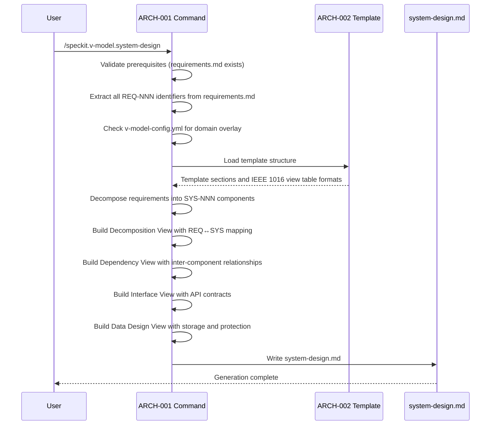
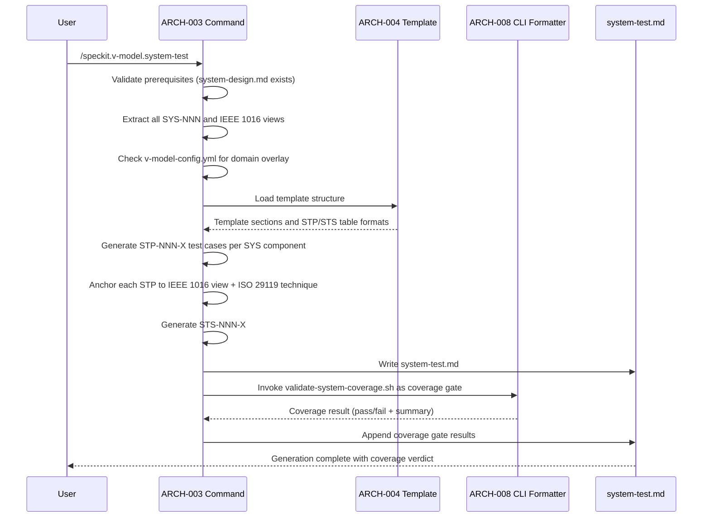
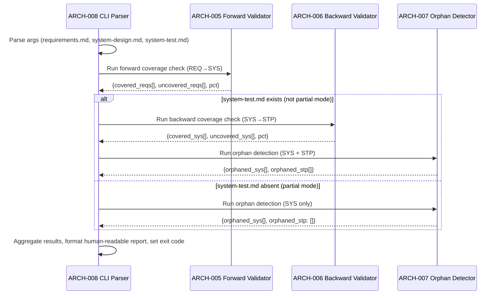
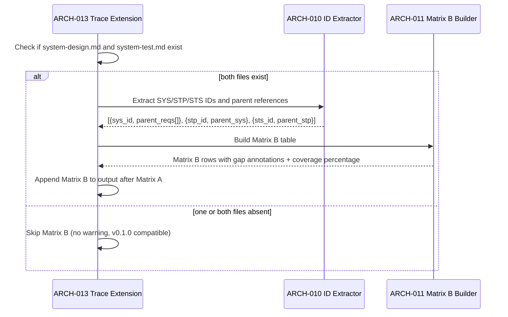

# Architecture Design: System Design ↔ System Testing

**Feature Branch**: `002-system-design-testing`
**Created**: 2026-02-20
**Status**: Draft
**Source**: `specs/002-system-design-testing/v-model/system-design.md`

## Overview

This architecture decomposes the 13 system components into 17 architecture modules organized by implementation boundary. The System Design Command (SYS-001) maps to a single prompt file (ARCH-001). The System Design Template (SYS-002) maps to a single template file (ARCH-002). The System Test Command (SYS-003) maps to a single prompt file (ARCH-003). The System Test Template (SYS-004) maps to a single template file (ARCH-004). The Bash validation script (SYS-005) is decomposed into four functional modules — a forward coverage validator (REQ→SYS), a backward coverage validator (SYS→STP), an orphan detector, and a CLI/output formatter — reflecting the script's internal function structure and independent testability. The PowerShell validation script (SYS-006) maps to a single module mirroring the Bash validators. The Bash matrix builder extension (SYS-007) decomposes into a SYS/STP/STS ID extractor and a Matrix B table builder. The PowerShell matrix builder extension (SYS-008) maps to a single module mirroring the Bash matrix builder. The trace command extension (SYS-009), ID validator extension (SYS-010), extension manifest (SYS-011), CI evaluation extension (SYS-012), and backward compatibility guard (SYS-013) each map to a single module. All modules have explicit interface contracts. No cross-cutting or derived modules are required.

## ID Schema

- **Architecture Module**: `ARCH-NNN` — sequential identifier for each module
- **Parent System Components**: Comma-separated `SYS-NNN` list per module (many-to-many)
- Example: `ARCH-005` with Parent System Components `SYS-005` — module implements the forward coverage validation function within the Bash validation script

## Logical View — Component Breakdown (IEEE 42010 / Kruchten 4+1)

| ARCH ID | Name | Description | Parent System Components | Type |
|---------|------|-------------|--------------------------|------|
| ARCH-001 | System Design Command Definition | Markdown agent prompt file (`commands/system-design.md`) executed by GitHub Copilot. Orchestrates system design generation: validates prerequisite inputs (`requirements.md`), extracts all `REQ-NNN` identifiers, generates `SYS-NNN` components with four IEEE 1016 mandatory views (Decomposition, Dependency, Interface, Data Design), supports many-to-many REQ↔SYS relationships, handles derived requirement flagging, loads domain overlay from `commands/overlays/{domain}/system-design.md` when `v-model-config.yml` specifies a `domain` value, enforces the strict translator constraint, and writes output using the template structure. Uses generic IEEE 1016 framing without referencing specific safety standards; domain-specific framing provided only by loaded overlays. Produces `system-design.md` with sequential `SYS-NNN` identifiers matching `SYS-[0-9]{3}`. | SYS-001 | Component |
| ARCH-002 | System Design Template | Markdown template file (`templates/system-design-template.md`) defining the output structure for IEEE 1016-compliant system design descriptions. Includes section structure for: Overview, ID Schema, Decomposition View (table with SYS ID, Name, Description, Parent Requirements, Type columns), Dependency View (table with Source, Target, Relationship, Failure Impact columns plus Mermaid dependency diagram), Interface View (split into External Interfaces and Internal Interfaces with protocol-level detail), Data Design View (table with Entity, Component, Storage, Protection, Retention columns), Coverage Summary, Derived Requirements, and Glossary. Uses generic IEEE 1016 framing; domain-specific structural extensions are provided by template overlay files when a domain is configured. | SYS-002 | Component |
| ARCH-003 | System Test Command Definition | Markdown agent prompt file (`commands/system-test.md`) executed by GitHub Copilot. Orchestrates system test generation: validates prerequisite inputs (`system-design.md`), extracts all `SYS-NNN` identifiers and their IEEE 1016 views, generates `STP-NNN-X` test cases anchored to specific design views with named ISO 29119 test techniques (Interface Contract Testing, Boundary Value Analysis, Equivalence Partitioning, Fault Injection), generates `STS-NNN-X#` test scenarios in Given/When/Then BDD format with technical component-oriented language, invokes `validate-system-coverage.sh` as a post-generation coverage gate, loads domain overlay from `commands/overlays/{domain}/system-test.md` when `v-model-config.yml` specifies a `domain` value, enforces the strict translator constraint, and writes output using the template structure. | SYS-003 | Component |
| ARCH-004 | System Test Template | Markdown template file (`templates/system-test-template.md`) defining the output structure for ISO 29119-compliant system test plans with the three-tier STP/STS hierarchy. Includes section structure for: Overview, ID Schema, Test Cases (table with STP ID, Name, Parent SYS, IEEE 1016 View, ISO 29119 Technique, Interface Type columns), Test Scenarios (table with STS ID, Parent STP, Given/When/Then BDD steps), Coverage Gate Results (validation script output), and Glossary. Uses generic ISO 29119 framing; domain-specific structural extensions are provided by template overlay files when a domain is configured. | SYS-004 | Component |
| ARCH-005 | Forward Coverage Validator | Bash function within `validate-system-coverage.sh` that validates every `REQ-NNN` in `requirements.md` has at least one corresponding `SYS-NNN` in `system-design.md` via the Parent Requirements field. Uses regex `REQ-[0-9]{3}` and `REQ-(NF\|CN\|IF)-[0-9]{3}` to extract requirement IDs and `SYS-[0-9]{3}` to extract system component IDs, then cross-references the Parent Requirements column of the Decomposition View. Returns a list of uncovered `REQ-NNN` IDs and a forward coverage percentage. | SYS-005 | Utility |
| ARCH-006 | Backward Coverage Validator | Bash function within `validate-system-coverage.sh` that validates every `SYS-NNN` in `system-design.md` has at least one corresponding `STP-NNN-X` in `system-test.md`. Extracts system component IDs from the Decomposition View using regex `SYS-[0-9]{3}` and test case IDs from the test plan using regex `STP-[0-9]{3}-[A-Z]`, then computes the set difference to identify uncovered components. Returns a list of uncovered `SYS-NNN` IDs and a backward coverage percentage. Skipped when `system-test.md` is absent (partial validation mode). | SYS-005 | Utility |
| ARCH-007 | Orphan Detector | Bash function within `validate-system-coverage.sh` that identifies orphaned identifiers across the traceability chain. Detects any `SYS-NNN` not referenced as a parent in any `REQ-NNN` trace (system components with no requirement parent), and any `STP-NNN-X` whose parent `SYS-NNN` does not exist in `system-design.md` (test cases targeting non-existent components). Reports each orphan by ID with a human-readable explanation. Orphan detection for `STP-NNN-X` is skipped when `system-test.md` is absent. | SYS-005 | Utility |
| ARCH-008 | Validation CLI and Output Formatter | Bash function within `validate-system-coverage.sh` that handles argument parsing (three positional file paths: `requirements.md`, `system-design.md`, `system-test.md`), orchestrates the three validators (ARCH-005, ARCH-006, ARCH-007), formats output as human-readable gap reports with section headers and per-ID gap messages, computes the composite pass/fail verdict, and sets the exit code (0 = all checks pass, 1 = any gap or orphan detected). In partial mode (third argument absent), gracefully bypasses backward coverage and STP orphan detection, reporting only forward coverage results. | SYS-005 | Utility |
| ARCH-009 | PowerShell Coverage Validation | PowerShell script (`Validate-SystemCoverage.ps1`) mirroring the combined behavior of ARCH-005 through ARCH-008. Implements identical forward coverage (REQ→SYS), backward coverage (SYS→STP), and orphan detection using PowerShell regex patterns. Produces identical output format, field values, and exit codes. Accepts three positional parameters corresponding to the same file paths. Supports partial validation mode when the third parameter is absent. Ensures cross-platform parity for enterprise Windows teams. | SYS-006 | Utility |
| ARCH-010 | SYS/STP/STS ID Extractor | Bash function within `build-matrix.sh` that parses `system-design.md` using regex `SYS-[0-9]{3}` to extract all system component IDs and their parent `REQ-NNN` references from the Decomposition View, and parses `system-test.md` using regex `STP-[0-9]{3}-[A-Z]` and `STS-[0-9]{3}-[A-Z][0-9]+` to extract all test case and scenario IDs. Returns structured data: arrays of `{sys_id, parent_reqs[]}` and `{stp_id, parent_sys}` and `{sts_id, parent_stp}` tuples. | SYS-007 | Utility |
| ARCH-011 | Matrix B Table Builder | Bash function within `build-matrix.sh` that constructs Matrix B (Verification Traceability) from the ID extractor output. For each `REQ-NNN`, resolves the full chain: REQ → SYS → STP → STS. Calculates an independent coverage percentage matching the output of the validation script (SYS-005). Highlights gaps where a component has no associated test coverage. Maintains backward compatibility: produces no Matrix B output when `system-design.md` and `system-test.md` are absent. Matrix B is a separate matrix from Matrix A (Validation: REQ→ATP→SCN), using the letter "B". | SYS-007 | Utility |
| ARCH-012 | PowerShell Matrix B Builder | PowerShell function within `build-matrix.ps1` mirroring the combined behavior of ARCH-010 and ARCH-011. Implements identical SYS/STP/STS ID extraction and Matrix B table construction using PowerShell regex patterns. Produces identical Matrix B output including gap highlighting and coverage percentages. Ensures cross-platform parity for enterprise Windows teams. | SYS-008 | Utility |
| ARCH-013 | Trace Command Matrix B Integration | Extension to the existing `commands/trace.md` prompt to include Matrix B (Verification: REQ → SYS → STP → STS) in the traceability matrix output when `system-design.md` and `system-test.md` exist in the feature directory. Follows the progressive matrix pattern: Matrix A alone after acceptance, A+B after system-test. Matrix B is presented as a separate table from Matrix A to prevent visual bloat. No warning when `system-design.md` and `system-test.md` are missing — consistent with v0.1.0 backward compatibility. | SYS-009 | Component |
| ARCH-014 | SYS/STP/STS ID Pattern Registration | Extension to `evals/validators/id_validator.py` adding `SYS`, `STP`, and `STS` to the recognized prefix list and registering the validation regex patterns: `SYS-[0-9]{3}` for system component IDs, `STP-[0-9]{3}-[A-Z]` for test case IDs, and `STS-[0-9]{3}-[A-Z][0-9]+` for test scenario IDs. Supports machine-parseable lineage extraction: given any `STS-NNN-X#` identifier, the validator can extract the parent `STP-NNN-X`, grandparent `SYS-NNN`, and great-grandparent `REQ-NNN` using regex alone. | SYS-010 | Utility |
| ARCH-015 | Extension Manifest Entries | Updates to `extension.yml`: (1) register `speckit.v-model.system-design` command with file path `commands/system-design.md` and description, (2) register `speckit.v-model.system-test` command with file path `commands/system-test.md` and description, (3) bump extension version from `0.1.0` to `0.2.0`, (4) update the `trace` command description to mention Matrix B alongside Matrix A. The manifest SHALL register exactly 5 commands (3 existing from v0.1.0 + 2 new) and 1 hook after update. | SYS-011 | Component |
| ARCH-016 | CI Evaluation Suite Extension | Extension to the CI evaluation suite (`evals.yml` workflow) to add quality evaluation cases for `/speckit.v-model.system-design` and `/speckit.v-model.system-test` command outputs. Validates that generated artifacts meet or exceed the quality thresholds established for v0.1.0 artifacts. This is an internal QA gate — not user-facing. Ensures prompt quality through automated regression testing in the development pipeline. | SYS-012 | Utility |
| ARCH-017 | Backward Compatibility Enforcement | Cross-cutting design constraint enforced across all v0.2.0 modules ensuring that existing v0.1.0 artifacts (`requirements.md`, `acceptance-plan.md`, `traceability-matrix.md`) are never modified by any v0.2.0 operation. Verified by regression tests confirming v0.1.0 output identity before and after v0.2.0 installation. Commands are domain-agnostic in their base form: adding a new regulated domain requires only adding overlay files with no modification to base commands or templates. | SYS-013 | Component |

## Process View — Dynamic Behavior (Kruchten 4+1)

### Interaction: System Design Generation

**Concurrency Model**: Sequential — single-threaded execution within the Copilot agent context
**Synchronization Points**: None — file I/O is sequential

### Interaction: System Test Generation

**Concurrency Model**: Sequential — single-threaded execution within the Copilot agent context
**Synchronization Points**: Coverage gate must complete before final output is written

### Interaction: Coverage Validation Pipeline

**Concurrency Model**: Sequential — validators execute in order within a single Bash process
**Synchronization Points**: Each validator completes before the next starts

### Interaction: Matrix B Generation in Trace

**Concurrency Model**: Sequential — script execution within the Copilot agent context
**Synchronization Points**: None — file reads are sequential

## Interface View — API Contracts (Kruchten 4+1)

### ARCH-001: System Design Command Definition

| Direction | Name | Type | Format | Constraints |
|-----------|------|------|--------|-------------|
| Input | requirements.md | File | Markdown with `REQ-NNN` table rows in Requirements section | Must exist; validated by setup script; command fails with error if absent |
| Input | v-model-config.yml | File | YAML with `domain` key | Optional; triggers domain overlay loading when present |
| Input | domain overlay | File | Markdown from `commands/overlays/{domain}/system-design.md` | Optional; loaded only when domain is configured |
| Input | existing system-design.md | File | Markdown with existing `SYS-NNN` entries | Optional; triggers append-only mode preserving existing IDs |
| Output | system-design.md | File | Markdown conforming to template structure with four IEEE 1016 views | Written to `{VMODEL_DIR}/system-design.md` |
| Exception | Missing prerequisite | Error message | Plain text | "requirements.md not found. Run `/speckit.v-model.requirements` first." |

### ARCH-002: System Design Template

| Direction | Name | Type | Format | Constraints |
|-----------|------|------|--------|-------------|
| Input | Template load request | File read | Markdown | Template must exist in `templates/` directory |
| Output | Template structure | Markdown sections | HTML comment markers + table headers for Decomposition, Dependency, Interface, Data Design views | Defines Overview, ID Schema, four IEEE 1016 views, Coverage Summary, Derived Requirements, Glossary sections |

### ARCH-003: System Test Command Definition

| Direction | Name | Type | Format | Constraints |
|-----------|------|------|--------|-------------|
| Input | system-design.md | File | Markdown with `SYS-NNN` Decomposition View + Dependency/Interface/Data Design views | Must exist; command fails with error if absent |
| Input | v-model-config.yml | File | YAML with `domain` key | Optional; triggers domain overlay loading when present |
| Input | domain overlay | File | Markdown from `commands/overlays/{domain}/system-test.md` | Optional; loaded only when domain is configured |
| Input | existing system-test.md | File | Markdown with existing `STP-NNN-X` and `STS-NNN-X#` entries | Optional; triggers append-only mode preserving existing IDs |
| Output | system-test.md | File | Markdown conforming to template structure with STP/STS hierarchy | Written to `{VMODEL_DIR}/system-test.md` |
| Output | Coverage gate result | Embedded section | Pass/fail verdict with coverage summary from validate-system-coverage.sh | Included in system-test.md output |
| Exception | Missing prerequisite | Error message | Plain text | "system-design.md not found. Run `/speckit.v-model.system-design` first." |

### ARCH-004: System Test Template

| Direction | Name | Type | Format | Constraints |
|-----------|------|------|--------|-------------|
| Input | Template load request | File read | Markdown | Template must exist in `templates/` directory |
| Output | Template structure | Markdown sections | HTML comment markers + table headers for STP/STS hierarchy | Defines Overview, ID Schema, Test Cases, Test Scenarios, Coverage Gate Results, Glossary sections |

### ARCH-005: Forward Coverage Validator

| Direction | Name | Type | Format | Constraints |
|-----------|------|------|--------|-------------|
| Input | requirements.md | File | Markdown with `REQ-NNN` table rows | Parsed via regex `REQ-[0-9]{3}` and `REQ-(NF\|CN\|IF)-[0-9]{3}` |
| Input | system-design.md | File | Markdown with `SYS-NNN` Decomposition View | Parent Requirements column parsed for REQ references |
| Output | coverage_result | Data structure | `{covered: string[], uncovered: string[], pct: int}` | Percentage is integer 0–100 |
| Exception | File not found | Error | File path string | Returns error if either input file is missing |

### ARCH-006: Backward Coverage Validator

| Direction | Name | Type | Format | Constraints |
|-----------|------|------|--------|-------------|
| Input | system-design.md | File | Markdown with `SYS-NNN` Decomposition View | Parsed via regex `SYS-[0-9]{3}` |
| Input | system-test.md | File | Markdown with `STP-NNN-X` test case table | Parsed via regex `STP-[0-9]{3}-[A-Z]` for parent SYS references |
| Output | coverage_result | Data structure | `{covered: string[], uncovered: string[], pct: int}` | uncovered[] lists SYS-NNN with no STP coverage |
| Exception | File not found | Error | File path string | Skipped entirely when system-test.md is absent (partial mode) |

### ARCH-007: Orphan Detector

| Direction | Name | Type | Format | Constraints |
|-----------|------|------|--------|-------------|
| Input | requirements.md | File | Markdown with `REQ-NNN` table rows | Source of valid REQ IDs |
| Input | system-design.md | File | Markdown with `SYS-NNN` Decomposition View + Parent Requirements | SYS components and their REQ parent references |
| Input | system-test.md | File | Markdown with `STP-NNN-X` test cases | Optional; STP parent SYS references checked when present |
| Output | orphan_result | Data structure | `{orphaned_sys: string[], orphaned_stp: string[]}` | Each entry includes ID and human-readable explanation |
| Exception | No orphans | Empty arrays | `{orphaned_sys: [], orphaned_stp: []}` | Clean result when no orphans found |

### ARCH-008: Validation CLI and Output Formatter

| Direction | Name | Type | Format | Constraints |
|-----------|------|------|--------|-------------|
| Input | CLI arguments | Positional args | `<requirements.md> <system-design.md> <system-test.md>` | First two args required; third optional (triggers partial mode when absent) |
| Output | Human-readable report | Stdout | Multi-line text with section headers, per-ID gap messages, pass/fail verdict, coverage percentages | Default output format matching `validate-requirement-coverage.sh` style |
| Output | Exit code | Process exit | Integer | 0 = all checks pass, 1 = any gap or orphan detected |

### ARCH-009: PowerShell Coverage Validation

| Direction | Name | Type | Format | Constraints |
|-----------|------|------|--------|-------------|
| Input | PowerShell parameters | Positional params | `<requirements.md> <system-design.md> <system-test.md>` | First two required; third optional (triggers partial mode when absent) |
| Output | Human-readable report | Stdout | Identical structure and field values to ARCH-008 | Must produce identical output for same inputs |
| Output | Exit code | Process exit | Integer | Identical exit codes to ARCH-008 |

### ARCH-010: SYS/STP/STS ID Extractor

| Direction | Name | Type | Format | Constraints |
|-----------|------|------|--------|-------------|
| Input | system-design.md | File | Markdown Decomposition View table | Parsed via regex `SYS-[0-9]{3}` + Parent Requirements column |
| Input | system-test.md | File | Markdown test case and scenario tables | Parsed via regex `STP-[0-9]{3}-[A-Z]` and `STS-[0-9]{3}-[A-Z][0-9]+` |
| Output | sys_entries | Data structure | Array of `{sys_id: string, parent_reqs: string[]}` | Extracted from Decomposition View |
| Output | stp_entries | Data structure | Array of `{stp_id: string, parent_sys: string}` | Parent SYS derived from STP ID lineage encoding |
| Output | sts_entries | Data structure | Array of `{sts_id: string, parent_stp: string}` | Parent STP derived from STS ID lineage encoding |
| Exception | No IDs found | Warning | Empty arrays | Returns empty arrays if files have no valid IDs |

### ARCH-011: Matrix B Table Builder

| Direction | Name | Type | Format | Constraints |
|-----------|------|------|--------|-------------|
| Input | sys_entries | Data structure | Array from ARCH-010 | Must contain at least one entry |
| Input | stp_entries | Data structure | Array from ARCH-010 | Used to resolve SYS→STP chain |
| Input | sts_entries | Data structure | Array from ARCH-010 | Used to resolve STP→STS chain |
| Output | Matrix B rows | Stdout | Markdown table rows `REQ-NNN \| SYS-NNN \| STP-NNN-X \| STS-NNN-X#` | Ordered by REQ→SYS→STP→STS chain |
| Output | Coverage percentage | Stdout | Integer 0–100 | Must match output of validate-system-coverage.sh |
| Output | Gap annotations | Embedded in rows | `⚠️ No test coverage` | Inserted when SYS has no associated STP |

### ARCH-012: PowerShell Matrix B Builder

| Direction | Name | Type | Format | Constraints |
|-----------|------|------|--------|-------------|
| Input | system-design.md | File | Same as ARCH-010 input | Identical parsing logic using PowerShell regex |
| Input | system-test.md | File | Same as ARCH-010 input | Identical parsing logic using PowerShell regex |
| Output | Matrix B rows | Stdout | Identical to ARCH-011 output | Must produce identical rows for same inputs |
| Output | Coverage percentage | Stdout | Integer 0–100 | Must match ARCH-011 output for same inputs |

### ARCH-013: Trace Command Matrix B Integration

| Direction | Name | Type | Format | Constraints |
|-----------|------|------|--------|-------------|
| Input | AVAILABLE_DOCS | Array | JSON from setup script | Checks for "system-design.md" and "system-test.md" presence |
| Input | Matrix B data | Stdout | From ARCH-011 or ARCH-012 | Piped from build-matrix script based on platform |
| Output | Traceability matrix | File | Markdown with Matrix A + optional Matrix B | Matrix B appended as separate table only when both files exist |

### ARCH-014: SYS/STP/STS ID Pattern Registration

| Direction | Name | Type | Format | Constraints |
|-----------|------|------|--------|-------------|
| Input | ID string | String | Any V-Model ID pattern | Tested against all registered prefix regexes |
| Output | Validation result | Boolean | True if pattern matches `SYS-[0-9]{3}`, `STP-[0-9]{3}-[A-Z]`, or `STS-[0-9]{3}-[A-Z][0-9]+` | Added to existing prefix list, not replacing |
| Output | Lineage extraction | Data structure | `{parent_stp, parent_sys, parent_req}` | Extracted via regex from STS/STP ID structure without lookup table |

### ARCH-015: Extension Manifest Entries

| Direction | Name | Type | Format | Constraints |
|-----------|------|------|--------|-------------|
| Input | Manifest load | File | YAML | Parsed by spec-kit extension loader |
| Output | Command registration (system-design) | YAML entry | `{name: "speckit.v-model.system-design", description, file_path: "commands/system-design.md"}` | Must point to correct command file |
| Output | Command registration (system-test) | YAML entry | `{name: "speckit.v-model.system-test", description, file_path: "commands/system-test.md"}` | Must point to correct command file |
| Output | Version bump | YAML field | `version: "0.2.0"` | Bumped from 0.1.0 |
| Output | Trace description update | YAML field | Updated description string | Must mention Matrix B alongside Matrix A |

### ARCH-016: CI Evaluation Suite Extension

| Direction | Name | Type | Format | Constraints |
|-----------|------|------|--------|-------------|
| Input | Evaluation test fixtures | Files | Markdown input fixtures (requirements.md, system-design.md) | Test inputs for AI command quality evaluation |
| Input | Quality thresholds | Configuration | YAML in `evals.yml` workflow | Thresholds matching or exceeding v0.1.0 levels |
| Output | Evaluation results | CI output | Pass/fail per evaluation case | Non-zero exit code on quality regression |

### ARCH-017: Backward Compatibility Enforcement

| Direction | Name | Type | Format | Constraints |
|-----------|------|------|--------|-------------|
| Input | v0.1.0 baseline artifacts | Files | `requirements.md`, `acceptance-plan.md`, `traceability-matrix.md` | Snapshot before v0.2.0 operations |
| Input | v0.2.0 operation results | Files | All output files produced by v0.2.0 commands | Post-operation artifact state |
| Output | Compatibility verdict | Test result | Pass if v0.1.0 artifacts are byte-identical before and after | Verified by regression tests |
| Exception | Compatibility violation | Test failure | Diff output showing modified v0.1.0 artifacts | Blocks release if any v0.1.0 artifact is modified |

## Data Flow View — Data Transformation Chains (Kruchten 4+1)

### Data Flow: System Design Generation

| Stage | Module | Input Format | Transformation | Output Format |
|-------|--------|-------------|----------------|---------------|
| 1 | ARCH-001 | `requirements.md` (REQ-NNN table with ID, Description, Priority, Rationale, Verification columns) | Extract all REQ-NNN identifiers; classify as functional, non-functional, interface, or convention requirements | Internal list of `{req_id, description, priority, type}` tuples |
| 2 | ARCH-002 | Template structure | Load IEEE 1016 section markers, table headers, and view formats | Markdown skeleton with four view sections |
| 3 | ARCH-001 | Classified requirements + template structure | Decompose requirements into SYS-NNN components with many-to-many mapping; generate Decomposition, Dependency, Interface, and Data Design views | `system-design.md` file conforming to template |

### Data Flow: System Test Generation

| Stage | Module | Input Format | Transformation | Output Format |
|-------|--------|-------------|----------------|---------------|
| 1 | ARCH-003 | `system-design.md` (SYS-NNN Decomposition View + Dependency/Interface/Data Design views) | Extract all SYS-NNN identifiers with their IEEE 1016 view details and inter-component dependencies | Internal list of `{sys_id, views[], dependencies[]}` tuples |
| 2 | ARCH-004 | Template structure | Load ISO 29119 section markers, STP/STS table headers, and BDD format | Markdown skeleton with test case and scenario sections |
| 3 | ARCH-003 | Extracted components + template structure | Generate STP-NNN-X test cases anchored to design views with ISO 29119 techniques; generate STS-NNN-X# BDD scenarios per STP | `system-test.md` file conforming to template |
| 4 | ARCH-008 | `requirements.md` + `system-design.md` + `system-test.md` | Run coverage validation pipeline (forward + backward + orphan detection) | Coverage report (pass/fail + summary) appended to system-test.md |

### Data Flow: Coverage Validation

| Stage | Module | Input Format | Transformation | Output Format |
|-------|--------|-------------|----------------|---------------|
| 1 | ARCH-008 | CLI arguments (`requirements.md`, `system-design.md`, `system-test.md`) | Parse positional arguments, resolve file paths, determine partial vs. full validation mode | Configuration `{req_path, sys_path, test_path, partial_mode}` |
| 2 | ARCH-005 | `requirements.md` + `system-design.md` | Extract REQ IDs from requirements, extract Parent Requirements from Decomposition View, compute set difference | `{covered[], uncovered[], pct}` |
| 3 | ARCH-006 | `system-design.md` + `system-test.md` | Extract SYS IDs from design, extract STP parent-SYS from test plan, compute set difference | `{covered[], uncovered[], pct}` |
| 4 | ARCH-007 | `requirements.md` + `system-design.md` + `system-test.md` | Cross-reference all IDs to find SYS with no REQ parent and STP with non-existent parent SYS | `{orphaned_sys[], orphaned_stp[]}` |
| 5 | ARCH-008 | Three validator results | Aggregate into composite result, format as human-readable report with section headers | Stdout output + exit code (0 or 1) |

### Data Flow: Matrix B Construction

| Stage | Module | Input Format | Transformation | Output Format |
|-------|--------|-------------|----------------|---------------|
| 1 | ARCH-010 | `system-design.md` (Decomposition View table) + `system-test.md` (test case and scenario tables) | Regex extraction of SYS-NNN IDs with parent REQ-NNN references, STP-NNN-X IDs, and STS-NNN-X# IDs | Arrays of `{sys_id, parent_reqs[]}`, `{stp_id, parent_sys}`, `{sts_id, parent_stp}` |
| 2 | ARCH-011 | ID arrays from ARCH-010 | For each REQ-NNN, resolve full chain: REQ → SYS → STP → STS; identify gaps where chain is incomplete | Array of `{req, sys, stp, sts}` resolved chain entries |
| 3 | ARCH-011 | Resolved chain entries | Format as Matrix B table rows; insert `⚠️ No test coverage` for gaps; calculate coverage percentage | Markdown table rows + coverage percentage |

---

## Coverage Summary

| Metric | Count |
|--------|-------|
| Total Architecture Modules (ARCH) | 17 (17 active, 0 deprecated, 0 suspect) |
| Cross-Cutting Modules | 0 |
| Total Parent System Components Covered | 13 / 13 (100%) |
| Modules per Type | Component: 7 \| Service: 0 \| Library: 0 \| Utility: 10 \| Adapter: 0 |
| **Forward Coverage (SYS→ARCH)** | **100%** |

## Derived Modules

None — all modules trace to existing system components.
