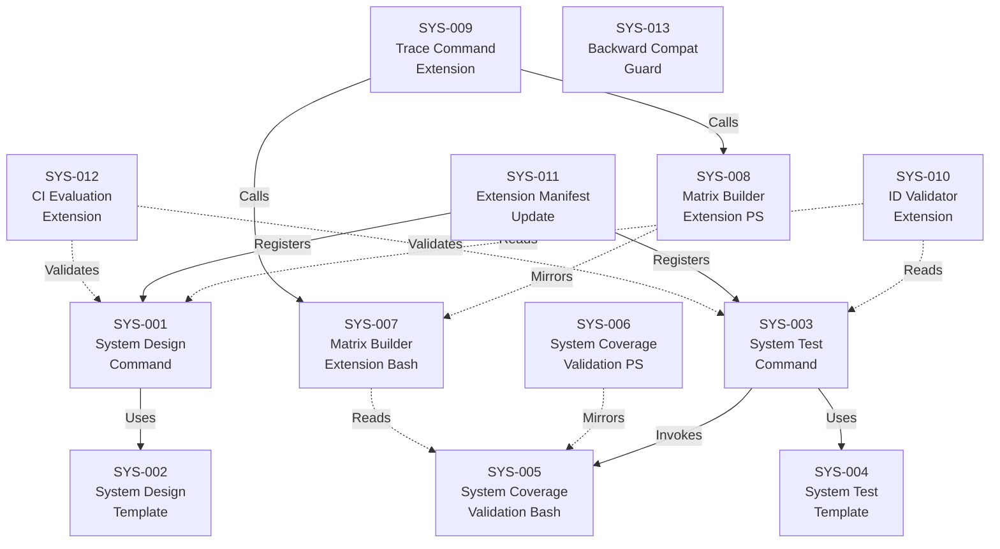

# System Design: System Design ↔ System Testing

**Feature Branch**: `002-system-design-testing`
**Created**: 2026-02-20
**Status**: Draft
**Source**: `specs/002-system-design-testing/v-model/requirements.md`

**Evolution History (Standards Enrichment):** This document was evolved from its original 13-component design to incorporate ISO/IEC 25010:2023 quality attribute analysis (Step 6). Lifecycle suspect analysis was performed on all SYS components against the deprecated parent requirements per `commands/system-design.md` Step 3 (Lifecycle Rules):

- **REQ-035** `[DEPRECATED — Superseded by REQ-038]`: Lifecycle check — no SYS component lists REQ-035 as a parent. SYS-001 traces to superseding REQ-038 (system-design command with generic overlay framing). No SUSPECT action needed.
- **REQ-036** `[DEPRECATED — Superseded by REQ-039]`: Lifecycle check — no SYS component lists REQ-036 as a parent. SYS-003 traces to superseding REQ-039 (system-test command with generic overlay framing). No SUSPECT action needed.
- **REQ-CN-001** `[DEPRECATED — Superseded by REQ-042]`: Lifecycle check — no SYS component lists REQ-CN-001 as a parent. SYS-001 and SYS-003 trace to superseding REQ-042 (domain-agnostic default behaviour). No SUSPECT action needed.

All 13 SYS components confirmed **ACTIVE**. No re-parenting or deprecation cascades required.

## Overview

This system design decomposes the 53 active requirements (3 deprecated) for the System Design ↔ System Testing feature into 13 system components organized across the extension's artifact types: two AI command prompts, two output templates, two deterministic validation scripts (Bash + PowerShell), two matrix builder extensions (Bash + PowerShell), a trace command extension, a Python ID validator extension, an extension manifest update, a CI evaluation extension, and a backward compatibility guard. The decomposition follows the natural artifact boundaries established in v0.1.0 — commands orchestrate AI generation, templates constrain output structure, scripts perform deterministic validation and matrix building, and the manifest registers capabilities. The core system design command (SYS-001) reads `requirements.md` and produces an IEEE 1016-compliant `system-design.md` with four mandatory views (Decomposition, Dependency, Interface, Data Design), assigning `SYS-NNN` identifiers with many-to-many REQ↔SYS traceability. The core system test command (SYS-003) reads `system-design.md` and produces an ISO 29119-compliant `system-test.md` with `STP-NNN-X` and `STS-NNN-X#` identifiers, applying named test techniques anchored to specific design views. System coverage validation (SYS-005/SYS-006) performs forward coverage (REQ→SYS), backward coverage (SYS→STP), and orphan detection. Matrix B (SYS-007/SYS-008) extends the existing build-matrix infrastructure with REQ→SYS→STP→STS traceability. Both commands support domain overlay loading via the assembly protocol, using generic IEEE 1016/ISO 29119 framing in base form.

## ID Schema

- **System Component**: `SYS-NNN` — sequential identifier for each component
- **Parent Requirements**: Comma-separated `REQ-NNN` list per component (many-to-many)
- Example: `SYS-005` with Parent Requirements `REQ-018, REQ-019, REQ-020, REQ-021` — component satisfies all four validation requirements

## Decomposition View (IEEE 1016 §5.1)

| SYS ID | Name | Description | Parent Requirements | Type |
|--------|------|-------------|---------------------|------|
| SYS-001 | System Design Command | Markdown agent prompt executed by GitHub Copilot that reads `requirements.md` as its sole mandatory input and produces `system-design.md` as output. Assigns unique `SYS-NNN` identifiers (3-digit zero-padded, sequential, never renumbered once assigned, matching regex `SYS-[0-9]{3}`). The output contains four IEEE 1016 mandatory views: a **Decomposition View** listing all major subsystems and components with name, description, and parent `REQ-NNN` identifiers; a **Dependency View** documenting inter-component relationships and failure propagation paths; an **Interface View** defining API contracts, data formats, communication protocols, and HW/SW boundaries; and a **Data Design View** showing data structures, storage mechanisms, and data protection measures. Supports many-to-many REQ↔SYS relationships: a single `REQ-NNN` may map to multiple `SYS-NNN` components, and a single `SYS-NNN` may satisfy multiple `REQ-NNN` identifiers. Non-functional requirements (performance, security, reliability) are addressed as cross-cutting quality attributes with explicit design decisions in the relevant views. When a necessary technical capability is identified that is not present in `requirements.md`, the command flags it as `[DERIVED REQUIREMENT: description]` instead of silently adding a `SYS-NNN` component. Loads domain overlay from `commands/overlays/{domain}/system-design.md` when `v-model-config.yml` specifies a `domain` value, including the overlay's safety-critical design sections in preference to the base generic guidance; produces general-purpose IEEE 1016 output with no safety-critical sections when no domain is configured. Uses generic design framing in command description and goal without referencing specific safety standards — domain-specific framing provided only by loaded overlays. Supports the domain overlay assembly protocol. Handles input files with 200+ `REQ-NNN` identifiers without truncation. Reads the template from `templates/system-design-template.md` for output structure. Follows the strict translator constraint: the AI SHALL NOT invent, infer, or add system components for capabilities not present in the requirements. Reads input exclusively from `{FEATURE_DIR}/v-model/requirements.md` and writes output exclusively to `{FEATURE_DIR}/v-model/system-design.md`. | REQ-001, REQ-002, REQ-003, REQ-004, REQ-005, REQ-006, REQ-007, REQ-008, REQ-009, REQ-032, REQ-034, REQ-038, REQ-040, REQ-042, REQ-043, REQ-NF-002, REQ-IF-001 | Module |
| SYS-002 | System Design Template | Markdown template file (`system-design-template.md`) in the `templates/` directory defining the required output structure for IEEE 1016-compliant system design descriptions. Includes section structure for: Overview, ID Schema, Decomposition View (table with SYS ID, Name, Description, Parent Requirements, Type columns), Dependency View (table with Source, Target, Relationship, Failure Impact columns plus Mermaid dependency diagram), Interface View (split into External Interfaces and Internal Interfaces with protocol-level detail), Data Design View (table with Entity, Component, Storage, Protection, Retention columns), Coverage Summary, Derived Requirements, and Glossary. Uses generic IEEE 1016 framing; domain-specific structural extensions are provided by template overlay files when a domain is configured. | REQ-030 | Module |
| SYS-003 | System Test Command | Markdown agent prompt executed by GitHub Copilot that reads `system-design.md` as its sole mandatory input and produces `system-test.md` as output. Assigns test case identifiers using `STP-NNN-X` format (e.g., `STP-001-A`) where NNN matches the parent `SYS-NNN` and X is a sequential letter, and test scenario identifiers using `STS-NNN-X#` format (e.g., `STS-001-A1`) where NNN-X matches the parent `STP-NNN-X` and # is a sequential number. Each `STP-NNN-X` references the specific IEEE 1016 design view it targets (Decomposition, Dependency, Interface, or Data Design) and applies a named ISO 29119 test technique: Interface Contract Testing (targeting Interface View), Boundary Value Analysis / Equivalence Partitioning (targeting data limits), or Fault Injection / Negative Testing (targeting Dependency View). Interface Contract test cases explicitly distinguish between external system interfaces (APIs exposed to users) and internal component interfaces (inter-module communication). Test scenarios (`STS-NNN-X#`) use Given/When/Then BDD structure with technical, component-oriented language (e.g., "Given the database connection pool is exhausted, When a new query is submitted, Then the system returns error code 503 within 200ms"), distinct from user-centric acceptance scenarios. Invokes `validate-system-coverage.sh` as a post-generation coverage gate and includes the validation result (pass/fail with coverage summary) in its output. Loads domain overlay from `commands/overlays/{domain}/system-test.md` when `v-model-config.yml` specifies a `domain` value; produces general-purpose ISO 29119 output with no safety-critical sections when no domain is configured. Uses generic testing framing without referencing specific safety standards. Supports the domain overlay assembly protocol. Follows the strict translator constraint. Reads input exclusively from `{FEATURE_DIR}/v-model/system-design.md` and writes output exclusively to `{FEATURE_DIR}/v-model/system-test.md`. | REQ-010, REQ-011, REQ-012, REQ-013, REQ-014, REQ-015, REQ-016, REQ-017, REQ-033, REQ-039, REQ-041, REQ-042, REQ-043, REQ-IF-002 | Module |
| SYS-004 | System Test Template | Markdown template file (`system-test-template.md`) in the `templates/` directory defining the required output structure for ISO 29119-compliant system test plans with the three-tier STP/STS hierarchy. Includes section structure for: Overview, ID Schema, Test Cases (table with STP ID, Name, Parent SYS, IEEE 1016 View, ISO 29119 Technique, Interface Type columns), Test Scenarios (table with STS ID, Parent STP, Given/When/Then BDD steps), Coverage Gate Results (validation script output), and Glossary. Uses generic ISO 29119 framing; domain-specific structural extensions (e.g., MC/DC coverage obligations, WCET verification) are provided by template overlay files when a domain is configured. | REQ-031 | Module |
| SYS-005 | System Coverage Validation Script (Bash) | Deterministic Bash script (`validate-system-coverage.sh`) that validates two independent coverage dimensions plus orphan detection. Forward coverage: every `REQ-NNN` in `requirements.md` has at least one corresponding `SYS-NNN` in `system-design.md` via the Parent Requirements field. Backward coverage: every `SYS-NNN` in `system-design.md` has at least one corresponding `STP-NNN-X` in `system-test.md`. Orphan detection: identifies any `SYS-NNN` not referenced as a parent in any `REQ-NNN` trace, and any `STP-NNN-X` whose parent `SYS-NNN` does not exist in `system-design.md`. Supports partial validation: when `system-test.md` is absent, validates forward coverage (`REQ→SYS`) only, gracefully bypasses `SYS→STP→STS` backward coverage checks, exits with code 0 if forward coverage is complete, and clearly indicates partial validation mode in output. Outputs human-readable gap reports listing each specific gap or orphan by ID (e.g., "REQ-003: no system component mapping found") suitable for CI log inspection. Exits with code 0 when all coverage checks pass and code 1 when any gap or orphan is detected. Uses regex-based parsing consistent with `validate-requirement-coverage.sh` from v0.1.0, requiring no runtime database or external tooling beyond standard Bash utilities. Accepts three file paths as arguments: `requirements.md`, `system-design.md`, and `system-test.md`, in that order. Outputs a structured coverage summary to stdout in the same format as `validate-requirement-coverage.sh`. Accepts gaps in `SYS-NNN` numbering (e.g., SYS-001, SYS-003 without SYS-002) without reporting false-positive errors. The ID lineage encoding is consistent across all tiers: given any identifier, a regex can extract parent ancestry without consulting a lookup table. | REQ-018, REQ-019, REQ-020, REQ-021, REQ-022, REQ-023, REQ-037, REQ-NF-001, REQ-NF-003, REQ-IF-003, REQ-IF-004 | Utility |
| SYS-006 | System Coverage Validation Script (PowerShell) | PowerShell script (`Validate-SystemCoverage.ps1`) with identical behavior, output format, field values, and exit codes as the Bash validation script (SYS-005). Implements the same two coverage dimensions (forward, backward) plus orphan detection, same partial validation mode, and same human-readable gap report format. Ensures cross-platform parity for enterprise Windows teams. Passes the same test fixture suite as SYS-005. | REQ-CN-003 | Utility |
| SYS-007 | Matrix Builder Script Extension (Bash) | Extension to the existing `build-matrix.sh` deterministic Bash script to parse `system-design.md` for `SYS-NNN` identifiers and their parent `REQ-NNN` references, and `system-test.md` for `STP-NNN-X` and `STS-NNN-X#` identifiers. Produces **Matrix B (Verification)** showing: `REQ-NNN` → `SYS-NNN` → `STP-NNN-X` → `STS-NNN-X#`. Each matrix includes an independently calculated coverage percentage that matches the output of the corresponding deterministic validation script (SYS-005). Highlights gaps where a component has no associated test coverage. Matrix B is a separate matrix from Matrix A (Validation: REQ→ATP→SCN), using the letter "B". Maintains backward compatibility: projects without `system-design.md` and `system-test.md` produce the same v0.1.0 output (Matrix A only). | REQ-024, REQ-027, REQ-028 | Utility |
| SYS-008 | Matrix Builder Script Extension (PowerShell) | Extension to the existing `build-matrix.ps1` deterministic PowerShell script with identical Matrix B generation logic as the Bash version (SYS-007). Ensures cross-platform parity for Matrix B output. | REQ-029 | Utility |
| SYS-009 | Trace Command Extension | Extension to the existing `/speckit.v-model.trace` Markdown agent prompt to include **Matrix B (Verification)** — `REQ → SYS → STP → STS` — in its output when `system-design.md` and `system-test.md` exist in the project directory. Produces Matrix A (Validation: REQ→ATP→SCN) as a separate table from Matrix B to prevent visual bloat. Follows the progressive matrix building pattern: A alone after acceptance, A+B after system-test. Maintains backward compatibility: when `system-design.md` and `system-test.md` are absent, produces only Matrix A with identical output to v0.1.0, no warning. | REQ-024, REQ-025, REQ-026 | Module |
| SYS-010 | ID Validator Extension | Extension to the existing `id_validator.py` Python script to recognize `SYS-NNN`, `STP-NNN-X`, and `STS-NNN-X#` as valid ID patterns alongside existing prefixes (REQ, ATP, SCN). Validates the `SYS-[0-9]{3}` regex pattern, the `STP-[0-9]{3}-[A-Z]` regex pattern, and the `STS-[0-9]{3}-[A-Z][0-9]+` regex pattern. Supports machine-parseable lineage extraction: given any `STS-NNN-X#` identifier, the validator can extract the parent `STP-NNN-X`, grandparent `SYS-NNN`, and great-grandparent `REQ-NNN` using regex alone without consulting a lookup table. | REQ-023 | Utility |
| SYS-011 | Extension Manifest Update | Updates to `extension.yml` to register the two new commands (`speckit.v-model.system-design` and `speckit.v-model.system-test`) with their file paths and descriptions. Bumps the extension version from `0.1.0` to `0.2.0`. The manifest SHALL register exactly 5 commands (3 existing from v0.1.0 + 2 new) and 1 hook. Updates the `trace` command description to mention Matrix B alongside Matrix A. | REQ-CN-002 | Module |
| SYS-012 | CI Evaluation Extension | Extension to the CI evaluation suite (`evals.yml` workflow) to validate that `/speckit.v-model.system-design` and `/speckit.v-model.system-test` command outputs meet or exceed the quality thresholds established for v0.1.0 artifacts. This is an internal QA gate — not user-facing. Ensures prompt quality through automated regression testing in the development pipeline. | REQ-NF-005 | Utility |
| SYS-013 | Backward Compatibility Guard | Cross-cutting design constraint enforced across all v0.2.0 components ensuring that existing v0.1.0 artifacts (`requirements.md`, `acceptance-plan.md`, `traceability-matrix.md`) are never modified by any v0.2.0 operation. Commands are domain-agnostic in their base form: adding a new regulated domain requires only adding overlay files with no modification to base commands or templates. This guard is verified by regression tests confirming v0.1.0 output identity before and after v0.2.0 installation. | REQ-NF-004, REQ-NF-006 | Module |

## Dependency View (IEEE 1016 §5.2)

| Source | Target | Relationship | Failure Impact |
|--------|--------|-------------|----------------|
| SYS-001 | SYS-002 | Uses | System design command cannot produce IEEE 1016-compliant output structure without the template; output would lack mandatory section structure, view tables, and coverage summary formatting. |
| SYS-003 | SYS-004 | Uses | System test command cannot produce ISO 29119-compliant output structure without the template; output would lack mandatory STP/STS hierarchy, BDD scenario formatting, and coverage gate section. |
| SYS-003 | SYS-005 | Invokes | System test command invokes the Bash validation script as a post-generation coverage gate; if SYS-005 is unavailable or broken, the gate check cannot run and the coverage result cannot be included in the output. |
| SYS-006 | SYS-005 | Mirrors | PowerShell validation script must replicate all Bash script logic; behavioral divergence between SYS-005 and SYS-006 produces inconsistent coverage results across platforms. |
| SYS-007 | SYS-005 | Reads | Matrix builder extension relies on the same `system-design.md` and `system-test.md` format validated by the coverage script; if SYS-005 parsing assumptions change, SYS-007 regex patterns must also update. |
| SYS-008 | SYS-007 | Mirrors | PowerShell matrix builder must replicate all Bash matrix builder logic; behavioral divergence produces inconsistent Matrix B data across platforms. |
| SYS-009 | SYS-007 | Calls | Trace command extension on Linux/macOS calls the Bash matrix builder to generate Matrix B data; Matrix B would be missing from the traceability matrix output if SYS-007 fails. |
| SYS-009 | SYS-008 | Calls | Trace command extension on Windows calls the PowerShell matrix builder to generate Matrix B data; Matrix B would be missing from the traceability matrix output on Windows if SYS-008 fails. |
| SYS-010 | SYS-001 | Reads | ID validator processes output generated by the system design command; if SYS-001 changes the SYS-NNN pattern, SYS-010 regex must also update. |
| SYS-010 | SYS-003 | Reads | ID validator processes output generated by the system test command; if SYS-003 changes the STP/STS patterns, SYS-010 regex must also update. |
| SYS-011 | SYS-001 | Registers | Extension manifest registers the system design command; if SYS-011 is missing or misconfigured, the command cannot be invoked by users. |
| SYS-011 | SYS-003 | Registers | Extension manifest registers the system test command; if SYS-011 is missing or misconfigured, the command cannot be invoked by users. |
| SYS-012 | SYS-001 | Validates | CI evaluation suite runs quality checks against system design output; if SYS-001 prompt quality degrades, SYS-012 detects the regression. |
| SYS-012 | SYS-003 | Validates | CI evaluation suite runs quality checks against system test output; if SYS-003 prompt quality degrades, SYS-012 detects the regression. |

### Dependency Diagram

## Interface View (IEEE 1016 §5.3)

### External Interfaces

| Component | Interface Name | Protocol | Input | Output | Error Handling |
|-----------|---------------|----------|-------|--------|----------------|
| SYS-001 | Copilot Chat Command | Markdown agent prompt | User invocation via `/speckit.v-model.system-design`; reads `{FEATURE_DIR}/v-model/requirements.md` | `system-design.md` written to `{FEATURE_DIR}/v-model/` | Fails with clear error message when `requirements.md` is not found in the expected path |
| SYS-003 | Copilot Chat Command | Markdown agent prompt | User invocation via `/speckit.v-model.system-test`; reads `{FEATURE_DIR}/v-model/system-design.md` | `system-test.md` written to `{FEATURE_DIR}/v-model/` | Fails with clear error message when `system-design.md` is not found in the expected path |
| SYS-005 | CLI Invocation (Bash) | Bash positional args | `validate-system-coverage.sh <requirements.md> <system-design.md> <system-test.md>` | Human-readable coverage report to stdout (section headers, gap lists, pass/fail verdict, coverage percentages) | Exit code 0 = pass, 1 = gaps detected; partial mode when third arg is missing |
| SYS-006 | CLI Invocation (PowerShell) | PowerShell params | `Validate-SystemCoverage.ps1 <requirements.md> <system-design.md> <system-test.md>` | Identical output structure to SYS-005 | Identical exit codes to SYS-005 |

### Internal Interfaces

| Source | Target | Interface Name | Protocol | Data Format | Error Handling |
|--------|--------|---------------|----------|-------------|----------------|
| SYS-001 | SYS-002 | Template Loading | File I/O | Markdown with HTML comments (section markers) from `templates/system-design-template.md` | Command fails if template not found in `templates/` directory |
| SYS-003 | SYS-004 | Template Loading | File I/O | Markdown with HTML comments (section markers) from `templates/system-test-template.md` | Command fails if template not found in `templates/` directory |
| SYS-003 | SYS-005 | Coverage Gate | Shell exec | Bash script stdout (structured coverage summary) invoked as post-generation validation | Command includes validation failure in output; does not suppress the result |
| SYS-009 | SYS-007 | Matrix B Data Generation | Shell exec | Bash script stdout (structured matrix rows for REQ→SYS→STP→STS) | Trace command omits Matrix B if script fails |
| SYS-009 | SYS-008 | Matrix B Data Generation | Shell exec | PowerShell script stdout (structured matrix rows for REQ→SYS→STP→STS) | Trace command omits Matrix B if script fails on Windows |
| SYS-007 | SYS-005 | Shared Parsing Convention | File format | `system-design.md` and `system-test.md` Markdown with `SYS-NNN`, `STP-NNN-X`, `STS-NNN-X#` IDs in tables | Both scripts must agree on table column positions and ID regex patterns |
| SYS-001 | Overlay Loader | Domain Overlay Assembly | File I/O | Markdown from `commands/overlays/{domain}/system-design.md` when domain configured in `v-model-config.yml` | No overlay loaded when domain is not configured; command proceeds with generic framing |
| SYS-003 | Overlay Loader | Domain Overlay Assembly | File I/O | Markdown from `commands/overlays/{domain}/system-test.md` when domain configured in `v-model-config.yml` | No overlay loaded when domain is not configured; command proceeds with generic framing |

## Data Design View (IEEE 1016 §5.4)

| Entity | Component | Storage | Protection at Rest | Protection in Transit | Retention |
|--------|-----------|---------|-------------------|-----------------------|-----------|
| System Design Document | SYS-001 | File (`system-design.md`) in `{FEATURE_DIR}/v-model/` | Git repository access controls | N/A (local file) | Permanent — tracked in Git, never deleted or renumbered |
| IEEE 1016 View Data | SYS-001 | Embedded in `system-design.md` Markdown tables (Decomposition, Dependency, Interface, Data Design) | Git repository access controls | N/A (local file) | Permanent — SYS-NNN IDs are immutable once assigned |
| System Test Plan | SYS-003 | File (`system-test.md`) in `{FEATURE_DIR}/v-model/` | Git repository access controls | N/A (local file) | Permanent — tracked in Git, never deleted |
| STP/STS Test Hierarchy | SYS-003 | Embedded in `system-test.md` Markdown tables (test cases and BDD scenarios) | Git repository access controls | N/A (local file) | Permanent — STP/STS IDs are immutable once assigned |
| Coverage Validation Results | SYS-005, SYS-006 | Stdout (transient) | N/A (ephemeral) | N/A (local process) | Transient — regenerated each validation run |
| Matrix B Data | SYS-007, SYS-008 | Embedded in `traceability-matrix.md` | Git repository access controls | N/A (local file) | Permanent — regenerated by trace command |
| System Design Template | SYS-002 | File (`system-design-template.md`) in `templates/` | Git repository access controls | N/A (local file) | Permanent — versioned with the extension |
| System Test Template | SYS-004 | File (`system-test-template.md`) in `templates/` | Git repository access controls | N/A (local file) | Permanent — versioned with the extension |
| Extension Manifest | SYS-011 | File (`extension.yml`) in extension root | Git repository access controls | N/A (local file) | Permanent — version-controlled release artifact |

---

## Quality Attribute Coverage (ISO/IEC 25010:2023)

This section cross-checks the design decisions against the ISO/IEC 25010:2023 quality characteristics applicable to this feature. Characteristics not implied by the requirements are marked **N/A**.

### Quality Characteristic Coverage

| Quality Characteristic | ISO/IEC 25010 Ref | SYS Components | Design Evidence | Status |
|------------------------|-------------------|----------------|-----------------|--------|
| Functional Suitability (completeness, correctness, appropriateness) | §4.2.1 | SYS-001 – SYS-013 | Decomposition View achieves 100% forward coverage — all 53 active REQ-NNN identifiers appear in at least one SYS-NNN component's Parent Requirements column. REQ-009 explicitly requires non-functional requirements (performance, security, reliability) to be addressed as cross-cutting quality attributes with explicit design decisions in the relevant IEEE 1016 views. | ✅ Covered |
| Reliability (availability, fault tolerance, recoverability) | §4.2.2 | SYS-003, SYS-005, SYS-006, SYS-013 | Dependency View documents 14 inter-component failure impacts covering all inter-component relationships (e.g., SYS-003→SYS-005: coverage gate unavailability prevents post-generation validation). SYS-006 mirrors SYS-005 for cross-platform reliability. SYS-013 Backward Compatibility Guard ensures v0.1.0 artifact integrity is preserved under all v0.2.0 operations, satisfying REQ-NF-004. | ✅ Covered |
| Performance Efficiency (time behaviour, resource utilisation, capacity) | §4.2.3 | SYS-001 | REQ-NF-002 implies a capacity constraint: commands must handle 200+ REQ-NNN identifiers without truncation. This is addressed in SYS-001's Decomposition View description. However, no measurable time-behaviour thresholds (response time SLAs, throughput limits) are documented in the Interface View or Data Design View. | ⚠️ [QUALITY GAP: ISO 25010 §4.2.3 — time-behaviour thresholds not formalised in Interface View or Data Design View; capacity constraint addressed in SYS-001 description only] |
| Security (confidentiality, integrity, authenticity, accountability) | §4.2.5 | SYS-001, SYS-002, SYS-003, SYS-004, SYS-007, SYS-008, SYS-011 | Data Design View documents protection at rest (Git repository access controls) and protection in transit (N/A — all artifact data is processed locally with no network transmission) for all 9 data entities. | ✅ Covered |
| Maintainability (modularity, reusability, analysability, modifiability, testability) | §4.2.7 | SYS-002, SYS-004, SYS-010, SYS-011, SYS-013 | Decomposition View partitions the system into 13 components with distinct responsibility boundaries (commands, templates, scripts, manifest, guard). Interface View explicitly contracts all external and internal interfaces. SYS-013 formalises modifiability constraints; SYS-010 enables machine-parseable ID lineage extraction for analysability. REQ-NF-006 requires domain-agnostic base commands, enforcing overlay-only extensibility. | ✅ Covered |
| Safety (operational constraint, risk identification, fail safe, hazard warning) | §4.2.9 | N/A | No domain overlay is loaded; no hazard analysis (HAZ-NNN) is defined for this feature. This feature is developer tooling with no operational safety-critical constraints. Safety-critical sections are intentionally omitted when no domain is configured, per REQ-042. | N/A — not implied by requirements |

### Quality Gap Summary

| Gap ID | Characteristic | ISO 25010 Ref | Description | Affected Components |
|--------|---------------|---------------|-------------|---------------------|
| QG-001 | Performance Efficiency | §4.2.3 | Time-behaviour thresholds (response time SLAs, throughput limits) are not documented in the Interface View or Data Design View. The capacity constraint from REQ-NF-002 (handle 200+ REQ-NNN files without truncation) is noted in SYS-001's Decomposition View description but is not formalised as a measurable Interface View or Data Design View entry. | SYS-001 |

---

## Coverage Summary

| Metric | Count |
|--------|-------|
| Total System Components (SYS) | 13 |
| Total Parent Requirements Covered | 53 / 53 active (100%) + 3 deprecated (REQ-035, REQ-036, REQ-CN-001) |
| Components per Type | Subsystem: 0 \| Module: 7 \| Service: 0 \| Library: 0 \| Utility: 6 |
| **Forward Coverage (REQ→SYS)** | **100%** |
| ISO 25010 Quality Characteristics Covered | 4 / 5 applicable (Functional Suitability, Reliability, Security, Maintainability) |
| ISO 25010 Quality Gaps | 1 — QG-001 Performance Efficiency §4.2.3 (time-behaviour thresholds not formalised) |
| ISO 25010 Characteristics Not Applicable | 1 — Safety §4.2.9 (developer tooling, no safety-critical operational constraints) |

## Derived Requirements

None — all components trace to existing requirements.

## Glossary

| Term | Definition |
|------|-----------|
| IEEE 1016 | IEEE Standard for Information Technology—Systems Design—Software Design Descriptions. Defines mandatory design views (Decomposition, Dependency, Interface, Data Design). |
| ISO 29119 | ISO/IEC/IEEE Software Testing standard. Defines test design techniques (Interface Contract Testing, Boundary Value Analysis, Equivalence Partitioning, Fault Injection). |
| Decomposition View | IEEE 1016 view showing how the system is partitioned into subsystems and components, with parent requirement traceability. |
| Dependency View | IEEE 1016 view showing inter-component relationships and failure propagation paths between SYS-NNN components. |
| Interface View | IEEE 1016 view defining API contracts, data formats, protocols, and HW/SW boundaries for each component. |
| Data Design View | IEEE 1016 view showing data structures, storage mechanisms, and protection measures (at rest and in transit). |
| Forward Coverage | Validation that every source ID (REQ-NNN) maps to at least one target ID (SYS-NNN) in the system design. |
| Backward Coverage | Validation that every target ID (SYS-NNN) maps to at least one test case (STP-NNN-X) in the system test plan. |
| Matrix A | Validation Traceability Matrix — proves the chain REQ → ATP → SCN (requirements to acceptance tests). |
| Matrix B | Verification Traceability Matrix — proves the chain REQ → SYS → STP → STS (requirements through system design to system tests). |
| Domain Overlay | A domain-specific Markdown file loaded from `commands/overlays/{domain}/` that adds safety-critical sections to base command output when a regulated domain is configured. |
| Strict Translator Constraint | Design rule prohibiting AI commands from inventing, inferring, or adding artifacts for capabilities not present in the input document. |
| Derived Requirement | A technical capability identified during design that was not in the original requirements; must be flagged as `[DERIVED REQUIREMENT]`, not silently added. |
| Partial Validation | Mode where the coverage script validates only forward coverage (REQ→SYS) when `system-test.md` does not yet exist. |
| BDD | Behavior-Driven Development — Given/When/Then specification format used for system test scenarios with technical, component-oriented language. |
| ISO/IEC 25010:2023 | ISO/IEC standard defining Systems and Software Quality Models. Provides a quality characteristic taxonomy used to cross-check design decisions against quality attributes (Functional Suitability, Reliability, Performance Efficiency, Security, Maintainability, Safety, and others). |
| Quality Gap | A quality characteristic implied by the requirements that is not explicitly addressed by any SYS-NNN component or IEEE 1016 design view decision; flagged as `[QUALITY GAP: ISO 25010 §X.X — description]` and listed in the Quality Gap Summary. |
