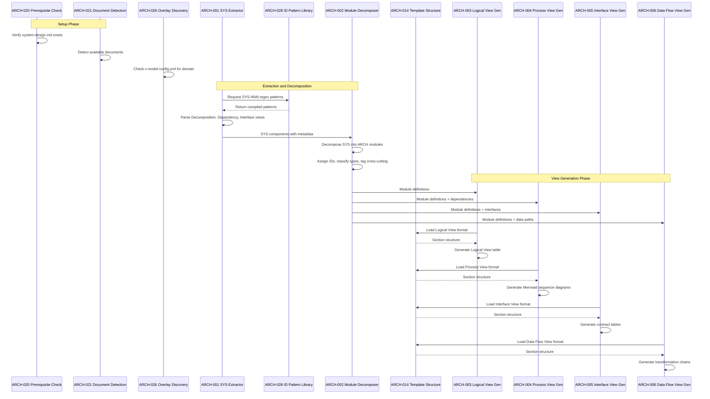
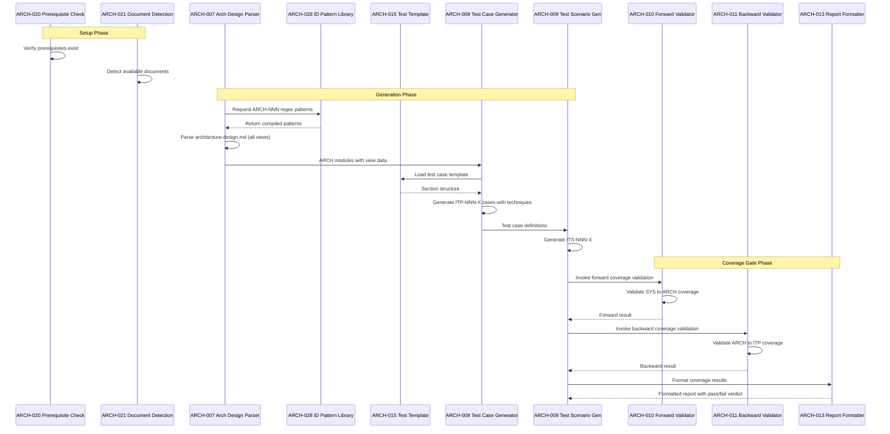
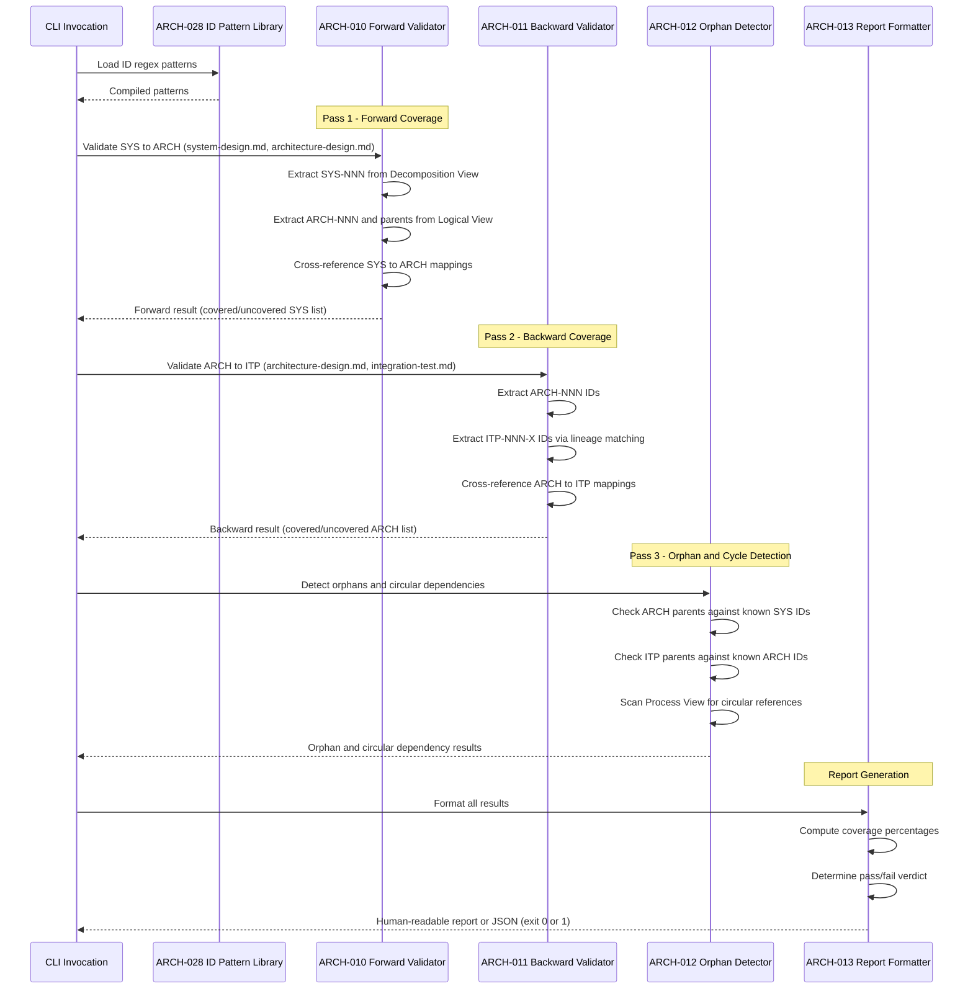
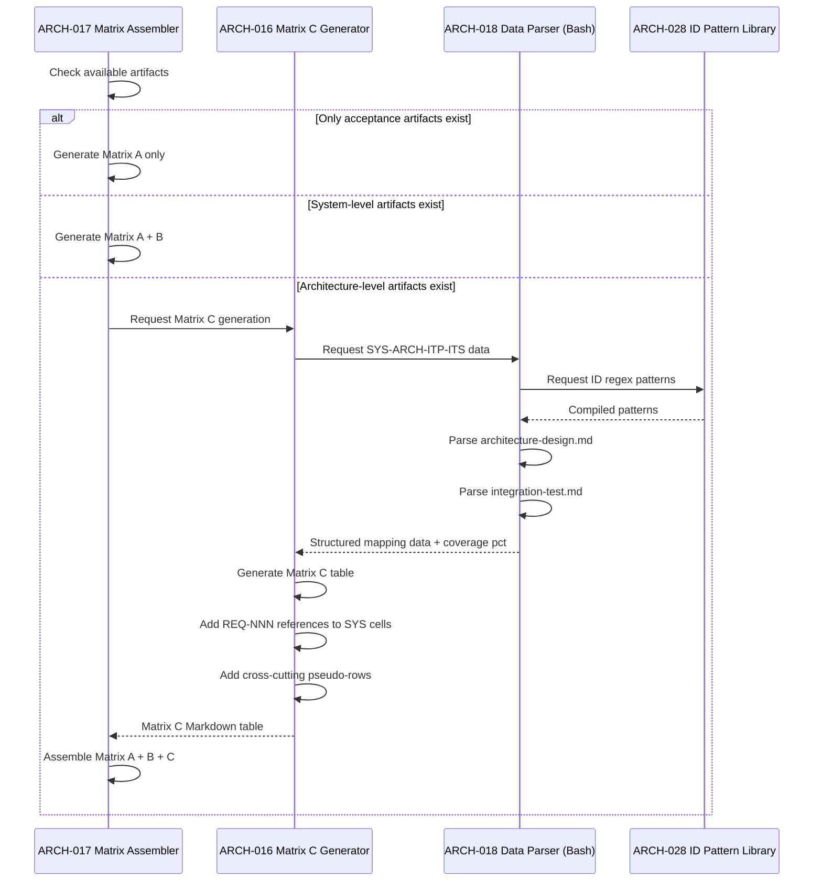
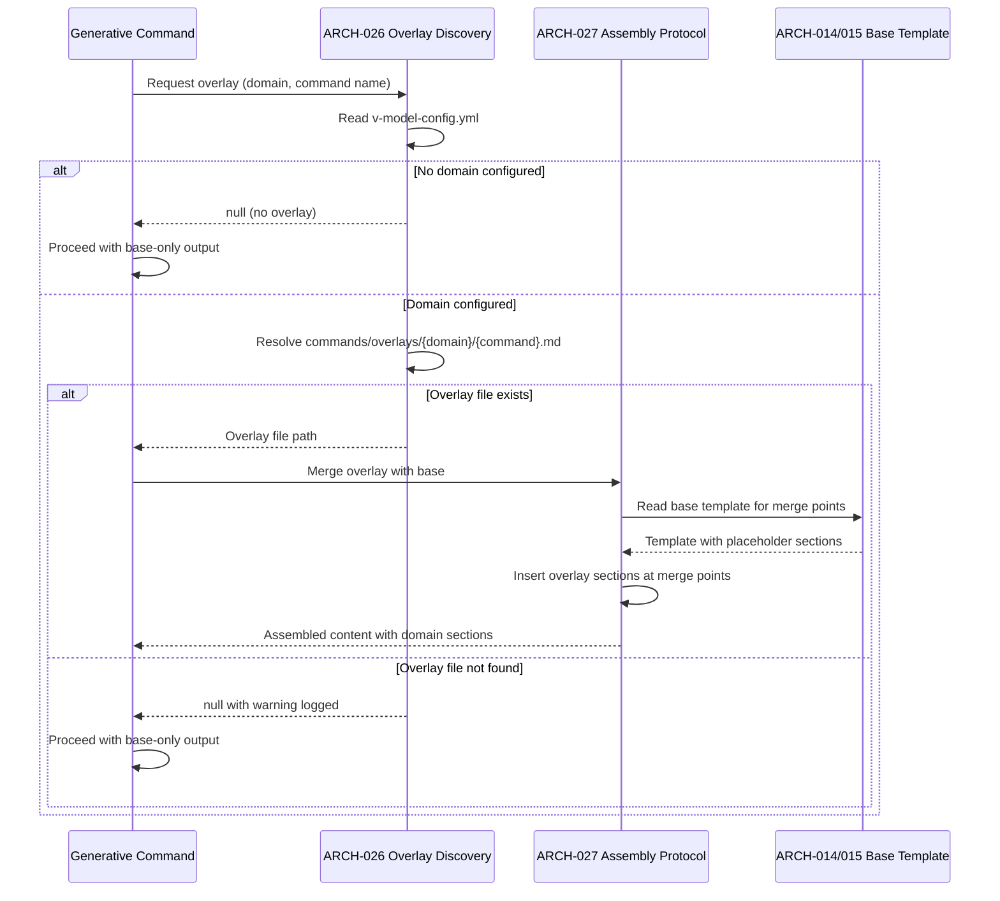

# Architecture Design: Architecture Design ↔ Integration Testing

**Feature Branch**: `003-architecture-integration`
**Created**: 2026-04-20
**Status**: Draft
**Source**: `specs/003-architecture-integration/v-model/system-design.md`

## Overview

This architecture design decomposes the 13 system components (SYS-001 through SYS-013) from the v0.3.0 system design into 28 architecture modules (ARCH-001 through ARCH-028). The decomposition follows IEEE 42010/Kruchten 4+1 architecture viewpoints, organizing modules across four mandatory views: Logical (component breakdown with many-to-many SYS↔ARCH traceability), Process (runtime interaction sequences), Interface (strict API contracts), and Data Flow (data transformation chains).

Each system component is decomposed along its natural responsibility boundaries: generative commands (SYS-001, SYS-002) are split into parsing, decomposition/generation, and per-view output modules; validation scripts (SYS-003, SYS-010) share a common logical architecture split into forward validation, backward validation, orphan/circular detection, and report formatting; templates (SYS-004, SYS-005) are modeled as reusable structural libraries; utility scripts (SYS-007, SYS-008, SYS-009) are decomposed into their distinct functional units; and infrastructure modules (SYS-011, SYS-012, SYS-013) are decomposed by their distinct responsibilities. One cross-cutting module (ARCH-028: ID Pattern Library) provides shared regex patterns used across multiple system components for deterministic ID extraction.

No domain overlay is configured (no `v-model-config.yml` exists) — safety-critical sections are omitted.

## ID Schema

- **Architecture Module**: `ARCH-NNN` — sequential identifier for each module (3-digit, zero-padded)
- **Parent System Components**: Comma-separated `SYS-NNN` list per module (many-to-many)
- **Cross-Cutting Tag**: `[CROSS-CUTTING]` for infrastructure/utility modules not traceable to a specific SYS
- Example: `ARCH-010` with Parent System Components `SYS-003, SYS-010` — module serves both the Bash and PowerShell coverage validation scripts
- Example: `ARCH-028 [CROSS-CUTTING]` — shared ID regex pattern library used by validation, matrix building, traceability, and CI evaluation modules

## Logical View — Component Breakdown (IEEE 42010 / Kruchten 4+1)

| ARCH ID | Name | Description | Parent System Components | Type |
|---------|------|-------------|--------------------------|------|
| ARCH-001 | SYS Component Extractor | Parses `system-design.md` to extract all `SYS-NNN` identifiers from the Decomposition View, dependency relationships from the Dependency View, and interface specifications from the Interface View. Produces a structured representation of system components with their metadata (name, description, parent requirements, type). Handles 50+ SYS identifiers without truncation. Fails gracefully when input is empty or contains zero SYS identifiers. | SYS-001 | Component |
| ARCH-002 | Architecture Module Decomposer | Receives extracted SYS components and decomposes them into `ARCH-NNN` modules. Assigns sequential IDs (never renumbered), maps each module to parent SYS components (many-to-many), classifies type, tags `[CROSS-CUTTING]` modules with rationale, and flags `[DERIVED MODULE]` items. Enforces the strict translator constraint. | SYS-001 | Component |
| ARCH-003 | Logical View Generator | Generates the IEEE 42010 Logical View component breakdown table from ARCH module definitions. Formats each module as a table row with ARCH ID, name, description, parent system components (comma-separated SYS-NNN list or `[CROSS-CUTTING]` tag with rationale), and type. Ensures every SYS-NNN appears as a parent in at least one row. | SYS-001 | Component |
| ARCH-004 | Process View Generator | Generates Mermaid `sequenceDiagram` blocks documenting runtime module interactions. Uses ARCH-NNN IDs as participants. Documents concurrency model, synchronization points, and execution order constraints. Sources interaction paths from the system design Dependency View. Produces syntactically valid Mermaid markup. | SYS-001 | Component |
| ARCH-005 | Interface View Generator | Generates strict API contract tables for every ARCH-NNN module. Each contract specifies inputs (types, formats, constraints), outputs (types, guarantees), and exceptions (error codes, failure conditions). Rejects black-box descriptions with anti-pattern warnings. Distinguishes synchronous and asynchronous interfaces. | SYS-001 | Component |
| ARCH-006 | Data Flow View Generator | Generates data transformation chain tables tracing data through ARCH modules. Each chain documents stage number, module reference (ARCH-NNN), input format, transformation description, and output format. Shows intermediate data formats at each transformation stage. | SYS-001 | Component |
| ARCH-007 | Architecture Design Parser | Parses `architecture-design.md` to extract all `ARCH-NNN` module definitions and their four architecture views (Logical, Process, Interface, Data Flow). Produces a structured representation of architecture modules with view data for downstream test generation. Handles cross-cutting modules and many-to-many SYS↔ARCH mappings. | SYS-002 | Component |
| ARCH-008 | Integration Test Case Generator | Generates `ITP-NNN-X` test case definitions where NNN matches the parent ARCH-NNN and X is a sequential uppercase letter. Assigns one of four ISO 29119-4 techniques per case: Interface Contract Testing, Data Flow Testing, Interface Fault Injection, or Concurrency & Race Condition Testing. Anchors each case to a specific architecture view. Ensures cross-cutting modules have at least one test case. | SYS-002 | Component |
| ARCH-009 | Integration Test Scenario Generator | Generates `ITS-NNN-X#` test scenarios in Given/When/Then BDD format with module-boundary-oriented language. Restricts scope to boundary/handshake tests only. Invokes coverage gate and includes validation result in output. | SYS-002 | Component |
| ARCH-010 | Forward Coverage Validator | Validates that every `SYS-NNN` in `system-design.md` has at least one corresponding `ARCH-NNN` in `architecture-design.md`. Extracts SYS IDs from the Decomposition View section and cross-references against the Logical View Parent System Components column. Recognizes `[CROSS-CUTTING]` modules as valid without SYS parent. | SYS-003, SYS-010 | Component |
| ARCH-011 | Backward Coverage Validator | Validates that every `ARCH-NNN` in `architecture-design.md` has at least one corresponding `ITP-NNN-X` in `integration-test.md`. Uses ID lineage encoding (NNN substring matching) to trace ARCH→ITP ancestry. Operates in partial mode when `integration-test.md` is absent. | SYS-003, SYS-010 | Component |
| ARCH-012 | Orphan and Circular Dependency Detector | Detects orphaned identifiers: ARCH-NNN referencing non-existent SYS-NNN (excluding `[CROSS-CUTTING]` modules), and ITP-NNN-X whose parent ARCH-NNN does not exist. Detects circular dependencies in the Process View without hanging. Accepts gaps in ARCH numbering without false positives. | SYS-003, SYS-010 | Component |
| ARCH-013 | Coverage Report Formatter | Formats validation results as human-readable gap reports (listing each gap/orphan by specific ID) or JSON-structured output (when `--json`/`-Json` flag is specified). Computes forward, backward, and ITP→ITS coverage percentages. Determines pass/fail verdict and corresponding exit code (0 = pass, 1 = gaps). | SYS-003, SYS-010 | Component |
| ARCH-014 | Architecture Template Structure | Markdown template defining the required output structure for ISO/IEC/IEEE 42010-compliant architecture design. Provides section headers, HTML comment field definitions, and placeholder tables for four mandatory views: Logical View (ARCH-NNN table with Parent System Components), Process View (Mermaid sequenceDiagram placeholders), Interface View (contract table format), and Data Flow View (transformation chain format). Includes conditional safety-critical section placeholders populated only when a domain overlay is loaded. | SYS-004 | Library |
| ARCH-015 | Integration Test Template Structure | Markdown template defining the required output structure for ISO/IEC/IEEE 29119-4-compliant integration test output. Provides the three-tier ITP/ITS hierarchy (ARCH→ITP-NNN-X→ITS-NNN-X#), technique naming and view anchoring per test case, Given/When/Then BDD format, and a Test Harness & Mocking Strategy section. Includes conditional safety-critical section placeholders populated only when a domain overlay is loaded. | SYS-005 | Library |
| ARCH-016 | Matrix C Table Generator | Generates the Matrix C (Integration Verification) Markdown table with columns SYS→ARCH→ITP→ITS. Each SYS-NNN cell includes parent REQ-NNN references in parentheses. Cross-cutting ARCH modules appear as pseudo-rows with `N/A (Cross-Cutting)` in the SYS column. Computes independently calculated coverage percentage matching the validation script output. | SYS-006 | Component |
| ARCH-017 | Progressive Matrix Assembler | Assembles traceability matrices progressively based on available artifacts: Matrix A alone (after acceptance), A+B (after system-test), A+B+C (after integration-test). Produces separate tables with independent coverage percentages. Maintains backward compatibility — when architecture-level artifacts are absent, produces v0.2.0 output (Matrix A + B only, no warning). | SYS-006 | Component |
| ARCH-018 | Matrix C Data Parser (Bash) | Bash script module that parses `architecture-design.md` and `integration-test.md` to extract SYS→ARCH→ITP→ITS mapping data. Outputs structured text with parsed mappings and independently calculated coverage percentages. Uses regex-based ID extraction consistent with the validation script patterns. | SYS-007 | Utility |
| ARCH-019 | Matrix C Data Parser (PowerShell) | PowerShell script module with identical Matrix C data parsing logic as ARCH-018. Ensures cross-platform parity for enterprise Windows teams. Produces identical structured output format for consumption by ARCH-016. | SYS-008 | Utility |
| ARCH-020 | System Design Prerequisite Check | Extends setup scripts with `--require-system-design` flag. Verifies `system-design.md` exists in the feature v-model directory before the architecture design command proceeds. Returns non-zero exit code with error message if prerequisite is missing. Preserves backward compatibility with existing v0.2.0 invocations. | SYS-009 | Component |
| ARCH-021 | Extended Document Detection | Extends the `AVAILABLE_DOCS` detection logic in setup scripts to include `architecture-design.md` and `integration-test.md`. Returns detected documents in the JSON output alongside existing document types. Preserves backward compatibility with existing document detection. | SYS-009 | Component |
| ARCH-022 | Manifest Version and Command Registry | Updates `extension.yml` version field to `0.3.0` and registers 7 commands (5 existing + 2 new: `architecture-design`, `integration-test`) and 1 hook. Updates `catalog-entry.json` with matching version and capability metadata. | SYS-011 | Component |
| ARCH-023 | Architecture Command Evaluator | Python-based CI evaluation module that validates `/speckit.v-model.architecture-design` command output against quality thresholds. Verifies structural compliance (four mandatory views present), field completeness (no empty Parent System Components), and coverage gate results. Compares output quality against v0.2.0 baseline thresholds. | SYS-012 | Component |
| ARCH-024 | Integration Test Command Evaluator | Python-based CI evaluation module that validates `/speckit.v-model.integration-test` command output against quality thresholds. Verifies structural compliance (ITP/ITS hierarchy, technique assignment, BDD format), test harness definitions, and coverage gate results. Compares output quality against v0.2.0 baseline thresholds. | SYS-012 | Component |
| ARCH-025 | Mermaid Syntax Validator | Python-based CI evaluation module that validates syntactic correctness of generated Mermaid diagrams in the Process View. Broken Mermaid syntax is treated as a structural failure. Validates sequenceDiagram participant declarations, message syntax, and block structure. | SYS-012 | Component |
| ARCH-026 | Overlay Discovery Mechanism | Discovers domain overlay files based on `v-model-config.yml` configuration. When `domain` is set, resolves overlay paths: `commands/overlays/{domain}/{command}.md` for command overlays and `templates/overlays/{domain}/{template}.md` for template overlays. Returns overlay file path or null when no domain is configured or overlay file does not exist. | SYS-013 | Component |
| ARCH-027 | Overlay Assembly Protocol | Loads and merges domain-specific overlay content into base commands and templates. Reads base templates to identify conditional safety-critical section placeholders (merge points). Inserts overlay sections at merge points. Logs warning when merge points are not found. Ensures zero-modification extensibility — adding a new domain requires only creating overlay files. | SYS-013 | Component |
| ARCH-028 | ID Pattern Library | Shared library of compiled regex patterns for deterministic extraction of V-Model identifiers: `SYS-[0-9]{3}`, `ARCH-[0-9]{3}`, `ITP-[0-9]{3}-[A-Z]`, `ITS-[0-9]{3}-[A-Z][0-9]+`, and `REQ-[A-Z0-9-]+`. Provides consistent ID extraction logic across validation scripts, matrix builders, trace commands, and CI evaluators. Patterns are POSIX ERE compatible requiring no external tooling. | [CROSS-CUTTING] — Shared regex patterns used by SYS-003, SYS-006, SYS-007, SYS-008, SYS-010, and SYS-012 for deterministic ID extraction across validation, matrix building, traceability, and CI evaluation | Library |

## Process View — Dynamic Behavior (Kruchten 4+1)

### Interaction: Architecture Design Generation

**Concurrency Model**: Sequential single-process execution. The architecture design command runs as a Markdown agent prompt within GitHub Copilot's execution context. All phases execute sequentially: setup → extraction → decomposition → view generation → output. No multi-threading or parallel execution.

**Synchronization Points**: None required. Each phase completes before the next begins. Template loading (ARCH-014) is a synchronous file read. Setup script invocation (ARCH-020, ARCH-021) is a synchronous subprocess call returning JSON.

### Interaction: Integration Test Generation with Coverage Gate

**Concurrency Model**: Sequential single-process execution. The integration test command executes as a Markdown agent prompt. Coverage gate invocation is a synchronous subprocess call to the validation script.

**Synchronization Points**: Coverage gate invocation is a blocking synchronous call — the integration test command waits for the validation script to complete and checks its exit code before including results in output.

### Interaction: Coverage Validation Execution

**Concurrency Model**: Sequential single-process execution. The validation script runs as a Bash or PowerShell CLI tool with all passes executing sequentially.

**Synchronization Points**: None within the script — sequential execution. Exit code (0 or 1) is the synchronization signal to the calling process.

### Interaction: Traceability Matrix Generation with Matrix C

**Concurrency Model**: Sequential execution. The trace command invokes matrix builder scripts via synchronous shell execution. On Linux/macOS, ARCH-018 (Bash) is called; on Windows, ARCH-019 (PowerShell) is called.

**Synchronization Points**: Shell execution of matrix builder is synchronous — trace command waits for script completion before assembling final output.

### Interaction: Domain Overlay Loading

**Concurrency Model**: Sequential file I/O. Overlay discovery and assembly are synchronous file reads performed during the command setup phase.

**Synchronization Points**: None — all file reads are synchronous. Overlay loading completes before command generation begins.

## Interface View — API Contracts (Kruchten 4+1)

### ARCH-001: SYS Component Extractor

| Direction | Name | Type | Format | Constraints |
|-----------|------|------|--------|-------------|
| Input | system_design_content | String | Markdown text of `system-design.md` | Required; must contain Decomposition View section with SYS-NNN table rows |
| Input | id_patterns | Object | Compiled regex patterns from ARCH-028 | Required; must include SYS-NNN pattern |
| Output | sys_components | Array | List of {id, name, description, parent_reqs, type} objects | Guaranteed non-empty when input contains valid SYS identifiers |
| Output | dependencies | Array | List of {source, target, relationship, failure_impact} objects | May be empty if no Dependency View exists |
| Output | interfaces | Array | List of {component, interface_name, protocol, input, output, error_handling} objects | May be empty if no Interface View exists |
| Exception | EMPTY_INPUT | Error | Text message | When system-design.md is empty or contains zero SYS identifiers: "No system components found in system-design.md" |

### ARCH-002: Architecture Module Decomposer

| Direction | Name | Type | Format | Constraints |
|-----------|------|------|--------|-------------|
| Input | sys_components | Array | List of SYS component objects from ARCH-001 | Required; at least one component |
| Input | dependencies | Array | Dependency relationships from ARCH-001 | Optional |
| Input | interfaces | Array | Interface specifications from ARCH-001 | Optional |
| Output | arch_modules | Array | List of {id, name, description, parent_sys, type, tags} objects | Sequential IDs starting from ARCH-001 or continuing from existing highest |
| Output | cross_cutting_modules | Array | Subset of arch_modules with `[CROSS-CUTTING]` tag | Each has rationale string |
| Output | derived_modules | Array | List of `[DERIVED MODULE: description]` flags | Empty when all modules trace to SYS or CROSS-CUTTING |
| Exception | DERIVED_MODULE_HALT | Warning | Text description | When a module is neither SYS-traceable nor CROSS-CUTTING; halts ID assignment |
| Exception | TRANSLATOR_VIOLATION | Error | Text message | When decomposition attempts to create capability not in system-design.md |

### ARCH-003: Logical View Generator

| Direction | Name | Type | Format | Constraints |
|-----------|------|------|--------|-------------|
| Input | arch_modules | Array | ARCH module definitions from ARCH-002 | Required; at least one module |
| Input | template_structure | String | Logical View section format from ARCH-014 | Required |
| Output | logical_view_table | String | Markdown table with columns: ARCH ID, Name, Description, Parent System Components, Type | Every SYS-NNN appears in at least one row |
| Exception | INCOMPLETE_COVERAGE | Error | Text message with specific uncovered SYS IDs | When any SYS-NNN has no corresponding ARCH parent |

### ARCH-004: Process View Generator

| Direction | Name | Type | Format | Constraints |
|-----------|------|------|--------|-------------|
| Input | arch_modules | Array | ARCH module definitions from ARCH-002 | Required |
| Input | dependencies | Array | Dependency data from ARCH-001 | Required for interaction path derivation |
| Input | template_structure | String | Process View section format from ARCH-014 | Required |
| Output | sequence_diagrams | Array | List of Mermaid `sequenceDiagram` code blocks | Syntactically valid Mermaid; uses ARCH-NNN as participants |
| Output | concurrency_model | String | Description of thread/task/execution model | Required for each interaction path |
| Exception | INVALID_MERMAID | Error | Syntax error description | When generated Mermaid fails structural validation |

### ARCH-005: Interface View Generator

| Direction | Name | Type | Format | Constraints |
|-----------|------|------|--------|-------------|
| Input | arch_modules | Array | ARCH module definitions from ARCH-002 | Required |
| Input | sys_interfaces | Array | System interface specifications from ARCH-001 | Required |
| Input | template_structure | String | Interface View section format from ARCH-014 | Required |
| Output | contract_tables | Array | Per-module Markdown tables with Direction, Name, Type, Format, Constraints | One table per ARCH module — no black boxes |
| Exception | BLACK_BOX_WARNING | Warning | ARCH-NNN ID + missing contract details | When a module description is too vague to derive inputs/outputs/exceptions |

### ARCH-006: Data Flow View Generator

| Direction | Name | Type | Format | Constraints |
|-----------|------|------|--------|-------------|
| Input | arch_modules | Array | ARCH module definitions from ARCH-002 | Required |
| Input | dependencies | Array | Dependency data from ARCH-001 | Required for flow derivation |
| Input | template_structure | String | Data Flow View section format from ARCH-014 | Required |
| Output | data_flow_tables | Array | Markdown tables with Stage, Module, Input Format, Transformation, Output Format | Each chain shows intermediate formats |
| Exception | DISCONNECTED_MODULE | Warning | ARCH-NNN ID | When a module has no data flow connections |

### ARCH-007: Architecture Design Parser

| Direction | Name | Type | Format | Constraints |
|-----------|------|------|--------|-------------|
| Input | arch_design_content | String | Markdown text of `architecture-design.md` | Required; must contain Logical View with ARCH-NNN table rows |
| Input | id_patterns | Object | Compiled regex patterns from ARCH-028 | Required; must include ARCH-NNN, SYS-NNN patterns |
| Output | arch_modules | Array | List of {id, name, description, parent_sys, type} objects | Preserves many-to-many and CROSS-CUTTING mappings |
| Output | process_view | Object | Parsed sequence diagrams with participants and messages | Used for Concurrency and Race Condition test generation |
| Output | interface_view | Object | Parsed contract tables per module | Used for Interface Contract and Fault Injection test generation |
| Output | data_flow_view | Object | Parsed transformation chains | Used for Data Flow test generation |
| Exception | MISSING_VIEW | Error | View name | When a mandatory view is absent from architecture-design.md |

### ARCH-008: Integration Test Case Generator

| Direction | Name | Type | Format | Constraints |
|-----------|------|------|--------|-------------|
| Input | arch_modules | Array | ARCH module definitions from ARCH-007 | Required |
| Input | view_data | Object | Process, Interface, Data Flow view data from ARCH-007 | Required for technique-to-view anchoring |
| Input | template_structure | String | Test case section format from ARCH-015 | Required |
| Output | test_cases | Array | List of {id: ITP-NNN-X, parent_arch, technique, anchored_view, description} | ID format: ITP-NNN-X where NNN matches parent ARCH number |
| Exception | NO_TECHNIQUE_MATCH | Warning | ARCH-NNN ID | When a module's view data is insufficient to assign a technique |

### ARCH-009: Integration Test Scenario Generator

| Direction | Name | Type | Format | Constraints |
|-----------|------|------|--------|-------------|
| Input | test_cases | Array | ITP-NNN-X definitions from ARCH-008 | Required |
| Input | template_structure | String | Test scenario section format from ARCH-015 | Required |
| Output | test_scenarios | Array | List of {id: ITS-NNN-X#, parent_itp, given, when, then} | BDD format; module-boundary language only |
| Output | coverage_gate_result | Object | {pass: boolean, summary: string} from validation invocation | Included in final output |
| Exception | SCOPE_VIOLATION | Warning | ITS-NNN-X# ID | When a scenario tests internal logic or user-journey instead of boundary |

### ARCH-010: Forward Coverage Validator

| Direction | Name | Type | Format | Constraints |
|-----------|------|------|--------|-------------|
| Input | system_design_path | String | File path to `system-design.md` | Required; file must exist |
| Input | arch_design_path | String | File path to `architecture-design.md` | Required; file must exist |
| Output | sys_ids | Array | Unique SYS-NNN identifiers extracted from Decomposition View | Deduplicated, sorted |
| Output | covered_sys | Array | SYS-NNN identifiers that have at least one ARCH parent | Subset of sys_ids |
| Output | uncovered_sys | Array | SYS-NNN identifiers without any ARCH parent | Complement of covered_sys |
| Output | coverage_pct | Integer | Forward coverage percentage (covered/total × 100) | 0–100 |
| Exception | FILE_NOT_FOUND | Error | File path | When input file does not exist (exit code 1) |

### ARCH-011: Backward Coverage Validator

| Direction | Name | Type | Format | Constraints |
|-----------|------|------|--------|-------------|
| Input | arch_design_path | String | File path to `architecture-design.md` | Required; file must exist |
| Input | integration_test_path | String | File path to `integration-test.md` | Optional; absence triggers partial mode |
| Output | arch_ids | Array | Unique ARCH-NNN identifiers from Logical View | Deduplicated, sorted |
| Output | covered_arch | Array | ARCH-NNN with at least one ITP match via lineage encoding | Subset of arch_ids |
| Output | uncovered_arch | Array | ARCH-NNN without ITP match | Empty in partial mode |
| Output | coverage_pct | Integer | Backward coverage percentage | 0 in partial mode |
| Exception | PARTIAL_MODE | Info | "integration-test.md not found" | Backward validation skipped; not treated as failure |

### ARCH-012: Orphan and Circular Dependency Detector

| Direction | Name | Type | Format | Constraints |
|-----------|------|------|--------|-------------|
| Input | sys_ids | Array | Known SYS-NNN identifiers from ARCH-010 | Required |
| Input | arch_data | Object | ARCH-NNN IDs with parent mappings and cross-cutting flags | Required |
| Input | itp_ids | Array | Known ITP-NNN-X identifiers | Optional (empty in partial mode) |
| Output | orphaned_arch | Array | ARCH-NNN entries referencing non-existent SYS (excluding CROSS-CUTTING) | Each entry includes the unknown SYS reference |
| Output | orphaned_itps | Array | ITP-NNN-X entries whose parent ARCH does not exist | Empty in partial mode |
| Output | circular_deps | Array | Circular dependency chains detected in Process View | Empty when no cycles found |
| Exception | — | — | — | Module completes without exception; all anomalies returned as data |

### ARCH-013: Coverage Report Formatter

| Direction | Name | Type | Format | Constraints |
|-----------|------|------|--------|-------------|
| Input | forward_result | Object | From ARCH-010: coverage data with covered/uncovered lists | Required |
| Input | backward_result | Object | From ARCH-011: coverage data (may be partial) | Required |
| Input | orphan_result | Object | From ARCH-012: orphan and circular dependency data | Required |
| Input | json_mode | Boolean | Whether to output JSON format | Default: false |
| Output | report | String | Human-readable gap report OR JSON object | Lists each gap/orphan by specific ID |
| Output | exit_code | Integer | 0 (all checks pass) or 1 (gaps found) | Determines script exit status |
| Exception | — | — | — | Formatter always produces output; exit code signals result |

### ARCH-014: Architecture Template Structure

| Direction | Name | Type | Format | Constraints |
|-----------|------|------|--------|-------------|
| Input | file_read_request | String | File path to `templates/architecture-design-template.md` | Required; file must exist in extension distribution |
| Output | template_content | String | Markdown with section headers, HTML comments, placeholder tables | Contains four mandatory view sections + conditional safety section |
| Exception | TEMPLATE_NOT_FOUND | Error | File path | When template file is missing from extension distribution |

### ARCH-015: Integration Test Template Structure

| Direction | Name | Type | Format | Constraints |
|-----------|------|------|--------|-------------|
| Input | file_read_request | String | File path to `templates/integration-test-template.md` | Required; file must exist in extension distribution |
| Output | template_content | String | Markdown with ITP/ITS hierarchy, BDD format, test harness section | Contains three-tier hierarchy + conditional safety section |
| Exception | TEMPLATE_NOT_FOUND | Error | File path | When template file is missing from extension distribution |

### ARCH-016: Matrix C Table Generator

| Direction | Name | Type | Format | Constraints |
|-----------|------|------|--------|-------------|
| Input | mapping_data | Object | SYS→ARCH→ITP→ITS structured data from ARCH-018 or ARCH-019 | Required |
| Input | req_references | Object | REQ-NNN parent lists per SYS from system-design.md | Required for SYS cell annotations |
| Output | matrix_c_table | String | Markdown table: SYS (with REQ refs) → ARCH → ITP → ITS columns | Cross-cutting modules as pseudo-rows with N/A SYS |
| Output | coverage_pct | Integer | Independently calculated coverage percentage | Must match validation script output |
| Exception | EMPTY_MAPPING | Error | — | When mapping data contains no entries |

### ARCH-017: Progressive Matrix Assembler

| Direction | Name | Type | Format | Constraints |
|-----------|------|------|--------|-------------|
| Input | available_artifacts | Array | List of existing v-model document names | From ARCH-021 |
| Input | matrix_a | String | Matrix A Markdown table (if applicable) | Optional |
| Input | matrix_b | String | Matrix B Markdown table (if applicable) | Optional |
| Input | matrix_c | String | Matrix C Markdown table from ARCH-016 (if applicable) | Optional |
| Output | assembled_matrix | String | Combined traceability-matrix.md content | Progressive: A, A+B, or A+B+C based on available artifacts |
| Exception | NO_ARTIFACTS | Warning | — | When no v-model artifacts exist to build matrices from |

### ARCH-018: Matrix C Data Parser (Bash)

| Direction | Name | Type | Format | Constraints |
|-----------|------|------|--------|-------------|
| Input | arch_design_path | String | File path to `architecture-design.md` | Required; positional argument |
| Input | integration_test_path | String | File path to `integration-test.md` | Required; positional argument |
| Output | mapping_data | String | Structured text: SYS→ARCH→ITP→ITS per line on stdout | Piped to ARCH-016 for table generation |
| Output | coverage_pct | String | Coverage percentage line on stdout | Independently calculated |
| Exception | MALFORMED_INPUT | Error | Error message to stderr | Non-zero exit code when input files are malformed or missing |

### ARCH-019: Matrix C Data Parser (PowerShell)

| Direction | Name | Type | Format | Constraints |
|-----------|------|------|--------|-------------|
| Input | arch_design_path | String | File path to `architecture-design.md` | Required; positional parameter |
| Input | integration_test_path | String | File path to `integration-test.md` | Required; positional parameter |
| Output | mapping_data | String | Identical structured text format to ARCH-018 on stdout | Cross-platform parity guaranteed |
| Output | coverage_pct | String | Coverage percentage line on stdout | Matches ARCH-018 output format |
| Exception | MALFORMED_INPUT | Error | Error message to stderr | Non-zero exit code when input files are malformed or missing |

### ARCH-020: System Design Prerequisite Check

| Direction | Name | Type | Format | Constraints |
|-----------|------|------|--------|-------------|
| Input | vmodel_dir | String | Path to feature's v-model directory | Required; from CLI arguments |
| Input | require_system_design_flag | Boolean | Whether `--require-system-design` was specified | Default: false |
| Output | validation_result | Boolean | true if system-design.md exists (or flag not set) | Included in setup script JSON output |
| Exception | PREREQUISITE_MISSING | Error | "system-design.md not found in {vmodel_dir}" | Non-zero exit code when flag is set and file is missing |

### ARCH-021: Extended Document Detection

| Direction | Name | Type | Format | Constraints |
|-----------|------|------|--------|-------------|
| Input | vmodel_dir | String | Path to feature's v-model directory | Required |
| Output | available_docs | Array | JSON array of detected document filenames | Includes all V-Model artifact types: spec.md through unit-test.md |
| Exception | — | — | — | Missing documents are simply omitted from the array |

### ARCH-022: Manifest Version and Command Registry

| Direction | Name | Type | Format | Constraints |
|-----------|------|------|--------|-------------|
| Input | extension_yml_path | String | File path to `extension.yml` | Required |
| Input | catalog_entry_path | String | File path to `catalog-entry.json` | Required |
| Output | updated_extension_yml | File | YAML with version `0.3.0`, 7 commands, 1 hook | Preserves existing command registrations |
| Output | updated_catalog_entry | File | JSON with matching version and capability metadata | Consistent with extension.yml |
| Exception | FILE_NOT_FOUND | Error | File path | When manifest files are missing |

### ARCH-023: Architecture Command Evaluator

| Direction | Name | Type | Format | Constraints |
|-----------|------|------|--------|-------------|
| Input | arch_design_content | String | Generated architecture-design.md content | Required |
| Input | quality_thresholds | Object | v0.2.0 baseline quality metrics | Required |
| Output | evaluation_result | Object | {pass: boolean, scores: {structural, coverage, completeness}, details} | Meets or exceeds baseline thresholds |
| Exception | STRUCTURAL_FAILURE | Error | Missing view or section name | When mandatory views are absent from output |

### ARCH-024: Integration Test Command Evaluator

| Direction | Name | Type | Format | Constraints |
|-----------|------|------|--------|-------------|
| Input | integration_test_content | String | Generated integration-test.md content | Required |
| Input | quality_thresholds | Object | v0.2.0 baseline quality metrics | Required |
| Output | evaluation_result | Object | {pass: boolean, scores: {structural, coverage, technique, bdd}, details} | Meets or exceeds baseline thresholds |
| Exception | STRUCTURAL_FAILURE | Error | Missing section or hierarchy element | When ITP/ITS hierarchy is malformed |

### ARCH-025: Mermaid Syntax Validator

| Direction | Name | Type | Format | Constraints |
|-----------|------|------|--------|-------------|
| Input | mermaid_blocks | Array | Extracted Mermaid code blocks from Process View | Required; at least one block expected |
| Output | validation_results | Array | Per-block {valid: boolean, errors: []} results | All blocks must pass for overall success |
| Exception | SYNTAX_FAILURE | Error | Block index + error description | Broken Mermaid syntax treated as structural failure |

### ARCH-026: Overlay Discovery Mechanism

| Direction | Name | Type | Format | Constraints |
|-----------|------|------|--------|-------------|
| Input | config_path | String | Path to `v-model-config.yml` at repository root | Optional; absence means no domain configured |
| Input | command_name | String | Name of the command requesting overlay | Required (e.g., "architecture-design") |
| Output | command_overlay_path | String or null | `commands/overlays/{domain}/{command}.md` | null when no domain configured or file not found |
| Output | template_overlay_path | String or null | `templates/overlays/{domain}/{template}.md` | null when no domain configured or file not found |
| Exception | CONFIG_PARSE_ERROR | Warning | Parse error description | When v-model-config.yml exists but is malformed YAML |

### ARCH-027: Overlay Assembly Protocol

| Direction | Name | Type | Format | Constraints |
|-----------|------|------|--------|-------------|
| Input | base_template_content | String | Base template content from ARCH-014 or ARCH-015 | Required |
| Input | overlay_content | String | Domain overlay Markdown content | Required (non-null) |
| Output | assembled_content | String | Base template with overlay sections inserted at merge points | Merge points identified by conditional safety-critical placeholders |
| Exception | MERGE_POINT_NOT_FOUND | Warning | Overlay section name | When base template lacks expected placeholder; overlay section skipped |

### ARCH-028: ID Pattern Library

| Direction | Name | Type | Format | Constraints |
|-----------|------|------|--------|-------------|
| Input | pattern_request | String | Pattern name: "SYS", "ARCH", "ITP", "ITS", or "REQ" | Required; one of the five supported patterns |
| Output | compiled_pattern | Regex | `SYS-[0-9]{3}`, `ARCH-[0-9]{3}`, `ITP-[0-9]{3}-[A-Z]`, `ITS-[0-9]{3}-[A-Z][0-9]+`, or `REQ-[A-Z0-9-]+` | POSIX ERE compatible; no external dependencies |
| Exception | UNKNOWN_PATTERN | Error | Pattern name | When an unsupported pattern type is requested |

## Data Flow View — Data Transformation Chains (Kruchten 4+1)

### Data Flow: System Design to Architecture Design

| Stage | Module | Input Format | Transformation | Output Format |
|-------|--------|-------------|----------------|---------------|
| 1 | ARCH-028 | Pattern request string | Compile ID extraction regex patterns for SYS-NNN | Compiled regex patterns |
| 2 | ARCH-001 | Markdown (`system-design.md`): Decomposition View table, Dependency View table, Interface View tables | Regex extraction of SYS-NNN IDs, dependency relationships, and interface specifications from section-scoped Markdown tables | Structured SYS component list [{id, name, description, parent_reqs, type}] + dependency list + interface list |
| 3 | ARCH-002 | Structured SYS component list + dependency list + interface list | Decompose SYS into ARCH modules: assign ARCH-NNN IDs, map parent SYS (many-to-many), classify types, tag cross-cutting, flag derived | ARCH module definitions [{id, name, description, parent_sys[], type, tags[]}] |
| 4 | ARCH-003 | ARCH module definitions + Logical View template format from ARCH-014 | Format module definitions into Markdown table rows with Parent System Components column | Markdown Logical View table (ARCH ID, Name, Description, Parent System Components, Type) |
| 5 | ARCH-004 | ARCH module definitions + dependency data + Process View template format from ARCH-014 | Generate Mermaid sequenceDiagram blocks with ARCH-NNN participants and message flows | Mermaid code blocks + concurrency model descriptions |
| 6 | ARCH-005 | ARCH module definitions + system interface specs + Interface View template format from ARCH-014 | Generate per-module contract tables with inputs, outputs, exceptions | Per-ARCH Markdown contract tables (Direction, Name, Type, Format, Constraints) |
| 7 | ARCH-006 | ARCH module definitions + dependency paths + Data Flow View template format from ARCH-014 | Trace data through module chains: identify input→transformation→output at each stage | Markdown data flow tables (Stage, Module, Input Format, Transformation, Output Format) |

### Data Flow: Architecture Design to Integration Tests

| Stage | Module | Input Format | Transformation | Output Format |
|-------|--------|-------------|----------------|---------------|
| 1 | ARCH-028 | Pattern request string | Compile ID extraction regex patterns for ARCH-NNN, ITP, ITS | Compiled regex patterns |
| 2 | ARCH-007 | Markdown (`architecture-design.md`): Logical View table, Process View Mermaid blocks, Interface View contract tables, Data Flow View tables | Regex extraction and section parsing of ARCH-NNN modules with all four view data structures | Structured ARCH module list with view data [{id, name, parent_sys, type, process_interactions, interface_contracts, data_flows}] |
| 3 | ARCH-008 | Structured ARCH module list with view data + test template format from ARCH-015 | Map ARCH modules to ISO 29119-4 techniques based on view data: Interface View→Contract Testing + Fault Injection, Data Flow View→Data Flow Testing, Process View→Concurrency Testing | ITP-NNN-X test case definitions [{id, parent_arch, technique, anchored_view, description}] |
| 4 | ARCH-009 | ITP-NNN-X test case definitions + test template format from ARCH-015 | Generate BDD scenarios: Given (precondition at module boundary), When (interaction trigger), Then (expected boundary behavior) | ITS-NNN-X# test scenarios [{id, parent_itp, given, when, then}] |

### Data Flow: Coverage Validation

| Stage | Module | Input Format | Transformation | Output Format |
|-------|--------|-------------|----------------|---------------|
| 1 | ARCH-028 | Pattern request strings (SYS, ARCH, ITP, ITS) | Compile all ID regex patterns | Compiled regex set |
| 2 | ARCH-010 | Markdown files: `system-design.md` (Decomposition View section), `architecture-design.md` (Logical View section) | Section-scoped regex extraction of SYS-NNN and ARCH-NNN IDs; cross-reference via Parent System Components column | Forward coverage data {sys_ids[], covered_sys[], uncovered_sys[], coverage_pct} |
| 3 | ARCH-011 | Markdown files: `architecture-design.md` (Logical View), `integration-test.md` (ITP identifiers) | Regex extraction of ARCH-NNN and ITP-NNN-X IDs; ID lineage substring matching to build ARCH→ITP mapping | Backward coverage data {arch_ids[], covered_arch[], uncovered_arch[], coverage_pct} |
| 4 | ARCH-012 | SYS ID list from ARCH-010 + ARCH parent mappings + ITP IDs from ARCH-011 | Cross-reference ARCH parents against known SYS IDs (excluding CROSS-CUTTING); cross-reference ITP parents against known ARCH IDs; scan for circular references | Orphan/circular data {orphaned_arch[], orphaned_itps[], circular_deps[]} |
| 5 | ARCH-013 | Forward + backward + orphan results + json_mode flag | Aggregate all results; compute coverage percentages; determine pass/fail verdict; format output | Formatted report string + exit code (0 or 1) |

### Data Flow: Matrix C Building

| Stage | Module | Input Format | Transformation | Output Format |
|-------|--------|-------------|----------------|---------------|
| 1 | ARCH-028 | Pattern request strings (SYS, ARCH, ITP, ITS, REQ) | Compile ID regex patterns | Compiled regex set |
| 2 | ARCH-018 or ARCH-019 | Markdown files: `architecture-design.md` (Logical View), `integration-test.md` (ITP/ITS identifiers) | Regex extraction and cross-referencing: build SYS→ARCH mapping from Logical View, build ARCH→ITP→ITS mapping from lineage encoding | Structured mapping data: per-line SYS→ARCH→ITP→ITS entries + coverage percentage |
| 3 | ARCH-016 | Structured mapping data from ARCH-018/019 + REQ parent references from system-design.md | Generate Markdown table with SYS (annotated with parent REQs), ARCH, ITP, ITS columns; add cross-cutting pseudo-rows | Matrix C Markdown table with independently calculated coverage percentage |
| 4 | ARCH-017 | Matrix A table + Matrix B table + Matrix C table from ARCH-016 + available artifact list from ARCH-021 | Progressive assembly: select A-only, A+B, or A+B+C based on available artifacts; combine as separate tables | Complete traceability-matrix.md content with independent coverage percentages per matrix |

---

## Architecture Evaluation — ISO/IEC 42030:2019 / ISO/IEC 25010:2023

This section performs a scenario-based fitness-for-purpose evaluation per ISO/IEC 42030:2019, completing the IEEE 42010 "describe" → ISO 42030 "evaluate" cycle. Quality characteristics are referenced by name per ISO/IEC 25010:2023.

### 5.5.1 Quality Attribute Justification (ISO/IEC 25010:2023)

For each of the 28 architecture modules, the primary quality characteristic driving its design is documented with the trade-off accepted.

| ARCH ID | Architecture Decision | Primary Quality Characteristic (ISO 25010:2023) | Trade-off Accepted |
|---------|----------------------|------------------------------------------------|---------------------|
| ARCH-001 | Section-scoped regex extraction of all SYS-NNN identifiers; graceful failure on empty input | Reliability — Fault Tolerance §4.2.2 ↑; Functional Suitability — Completeness §4.2.1 ↑ | Regex-only parsing sacrifices deep semantic understanding for zero external-tool dependency; pathological inputs may cause Performance Efficiency §4.2.3 degradation |
| ARCH-002 | Strict translator constraint: ARCH-NNN sourced only from SYS-NNN or [CROSS-CUTTING]; undocumented needs flagged as [DERIVED MODULE] | Maintainability — Analysability §4.2.7 ↑; Functional Suitability — Correctness §4.2.1 ↑ | Architectural creativity constrained; Flexibility §4.2.8 ↓ — undocumented architectural needs become [DERIVED MODULE] flags requiring human resolution |
| ARCH-003 | Markdown table output for Logical View; every SYS-NNN must appear in at least one Parent System Components column entry | Functional Suitability — Completeness §4.2.1 ↑; Maintainability — Analysability §4.2.7 ↑ | Fixed table format reduces Flexibility §4.2.8; compensated by deterministic downstream parsing in ARCH-007 and ARCH-010 |
| ARCH-004 | Mermaid `sequenceDiagram` syntax for Process View; ARCH-NNN used as participants | Maintainability — Analysability §4.2.7 ↑; Interaction Capability §4.2.4 ↑ | Tool dependency on Mermaid renderer accepted; ARCH-025 mitigates syntax failures as a CI quality gate |
| ARCH-005 | Mandatory interface contract tables for every ARCH-NNN; anti-pattern guard rejects black-box descriptions | Functional Suitability — Completeness §4.2.1 ↑; Security §4.2.5 ↑ (explicit error contracts) | Significant verbosity overhead accepted; each contract table directly drives fault-injection test cases in the integration test phase |
| ARCH-006 | Data transformation chain tables with intermediate formats at each stage | Maintainability — Analysability §4.2.7 ↑; Functional Suitability §4.2.1 ↑ | Granular stage documentation increases initial authoring cost; payoff is deterministic Data Flow Testing case generation via ARCH-008 |
| ARCH-007 | Section-scoped Markdown parsing of `architecture-design.md` to extract all four view data structures | Reliability — Faultlessness §4.2.2 ↑; Functional Suitability §4.2.1 ↑ | Controlled coupling to ARCH-014 template section headers accepted; structural heading changes in ARCH-014 would break ARCH-007 extraction |
| ARCH-008 | One ITP-NNN-X per ARCH-NNN per ISO 29119-4 technique; NNN lineage encoding for ancestry traceability | Maintainability — Traceability §4.2.7 ↑; Reliability §4.2.2 ↑ | Lineage encoding couples ITP ID numbers to ARCH ID numbers; ID permanence rule (no renumbering) mitigates silent traceability breakage |
| ARCH-009 | BDD Given/When/Then format restricted to module-boundary scope; invokes coverage gate and embeds result | Functional Suitability — Appropriateness §4.2.1 ↑; Maintainability — Testability §4.2.7 ↑ | Boundary restriction excludes end-to-end scenarios; accepted — integration tests are purposely scoped to V-Model Level 3 |
| ARCH-010 | Section-scoped SYS/ARCH extraction with Parent System Components column cross-referencing for forward coverage | Reliability — Fault Tolerance §4.2.2 ↑; Functional Suitability §4.2.1 ↑ | Section-scoping reduces false positives but fails silently on non-standard section headings |
| ARCH-011 | ID lineage substring matching to trace ARCH→ITP ancestry; partial mode when `integration-test.md` is absent | Reliability §4.2.2 ↑; Flexibility — Adaptability §4.2.8 ↑ | Substring matching is simpler than AST parsing; edge-case risk when ITP IDs share identical NNN substrings, mitigated by sequential assignment rules |
| ARCH-012 | Two-phase orphan detection (ARCH→SYS + ITP→ARCH); circular dependency scan with cycle-halting guard | Reliability — Faultlessness §4.2.2 ↑; Safety — Risk Identification §4.2.9 ↑ | [CROSS-CUTTING] exclusion and gap-acceptance logic add decision branches; novel cross-cutting patterns may produce false negatives requiring human review |
| ARCH-013 | Dual-format output: human-readable gap reports and JSON (`--json`/`-Json` flag); pass/fail exit code | Interaction Capability §4.2.4 ↑ (human); Compatibility — Interoperability §4.2.6 ↑ (CI systems) | Two output renderers must be kept in sync; JSON schema changes require coordinated updates with CI consumers (ARCH-023, ARCH-024) |
| ARCH-014 | Conditional safety-critical section placeholders in architecture template; merge-point pattern for overlay insertion | Flexibility — Adaptability §4.2.8 ↑; Maintainability — Modifiability §4.2.7 ↑ | Placeholder markers create implicit coupling between ARCH-014 and ARCH-027; undocumented merge points are silently skipped |
| ARCH-015 | Three-tier ITP/ITS hierarchy template with technique naming and BDD format; conditional safety-critical placeholders | Maintainability — Analysability §4.2.7 ↑; Functional Suitability §4.2.1 ↑ | Template rigidity enforces consistent test structure; teams may find the three-tier hierarchy verbose for simple features |
| ARCH-016 | SYS-annotated-with-REQ-parents format in Matrix C; independently calculated coverage percentage | Functional Suitability — Completeness §4.2.1 ↑; Maintainability — Analysability §4.2.7 ↑ | REQ annotation requires reading system-design.md parents column; REQ ID changes make Matrix C annotations stale |
| ARCH-017 | Progressive matrix assembly (A-only, A+B, A+B+C) based on available artifacts; backward-compatible with v0.2.0 | Compatibility §4.2.6 ↑; Flexibility — Adaptability §4.2.8 ↑ | Three code paths must be maintained; adding a Matrix D would require a fourth path and additional conditional logic |
| ARCH-018 | Bash script with POSIX ERE regex-based ID extraction; produces output format identical to ARCH-019 | Compatibility — Interoperability §4.2.6 ↑; Reliability §4.2.2 ↑ | POSIX ERE behavior may diverge between GNU and BSD regex engines (macOS vs. Linux); CI test suite validates parity |
| ARCH-019 | PowerShell script with parsing logic identical to ARCH-018; cross-platform parity enforced | Compatibility — Portability §4.2.6 ↑; Flexibility §4.2.8 ↑ | Dual-script maintenance cost accepted; enterprise Windows teams require native PowerShell without WSL dependency |
| ARCH-020 | Non-breaking `--require-system-design` flag extension to setup scripts; non-zero exit on missing prerequisite | Flexibility — Adaptability §4.2.8 ↑; Compatibility §4.2.6 ↑ | Flag must be added to both Bash and PowerShell scripts in sync; desynchronization causes platform-specific failures |
| ARCH-021 | Backward-compatible AVAILABLE_DOCS extension to include `architecture-design.md` and `integration-test.md` | Compatibility §4.2.6 ↑; Flexibility — Adaptability §4.2.8 ↑ | New document type keys added to JSON output; existing callers receive new keys silently — no error on unknown keys |
| ARCH-022 | Single version bump to `0.3.0` in `extension.yml` and `catalog-entry.json`; 2-command registry addition | Maintainability — Modifiability §4.2.7 ↑; Functional Suitability §4.2.1 ↑ | Version field exists in two files; desynchronization between `extension.yml` and `catalog-entry.json` would cause catalog validation failures |
| ARCH-023 | Python-based quality threshold evaluation for architecture-design command; structural compliance and coverage gate checks | Reliability — Faultlessness §4.2.2 ↑; Maintainability — Testability §4.2.7 ↑ | Quality threshold values (e.g., minimum ARCH count) are embedded in evaluator code; changing them requires code changes, not config |
| ARCH-024 | Python-based quality threshold evaluation for integration-test command; BDD format, technique assignment, and test-harness checks | Reliability — Faultlessness §4.2.2 ↑; Maintainability — Testability §4.2.7 ↑ | Same threshold-embedding trade-off as ARCH-023; evaluator must be updated when command output format evolves |
| ARCH-025 | Mermaid syntax validation as a CI quality gate; broken Mermaid treated as structural failure | Reliability — Fault Tolerance §4.2.2 ↑; Security §4.2.5 ↑ (prevents malformed content propagation) | Syntax-only validation accepted over semantic validation; diagram correctness and meaning rely on human review |
| ARCH-026 | Null-returning overlay discovery (returns null when no domain configured or overlay absent); no error raised | Flexibility — Adaptability §4.2.8 ↑; Reliability — Fault Tolerance §4.2.2 ↑ | Silent null return means misconfigured domain keys produce no overlay without warning; ARCH-027 log warning partially mitigates this |
| ARCH-027 | Merge-point pattern for overlay insertion; zero-modification extensibility — new domains require only overlay files | Flexibility — Adaptability §4.2.8 ↑; Maintainability — Modifiability §4.2.7 ↑ | Implicit merge-point contract between ARCH-014/ARCH-015 templates and ARCH-027 assembler; undocumented merge points are silently skipped |
| ARCH-028 | Centralized POSIX ERE regex patterns for all V-Model ID types; shared across ARCH-010, ARCH-011, ARCH-012, ARCH-016, ARCH-018, ARCH-019 | Maintainability — Reusability §4.2.7 ↑; Reliability — Faultlessness §4.2.2 ↑ | [CROSS-CUTTING] High-sensitivity centralization: pattern changes cascade simultaneously to 6 consumers; single-point consistency vs. single-point failure risk |

### 5.5.2 Fitness-for-Purpose Scenario Analysis (ISO/IEC 42030:2019 §6)

Evaluation of the architecture against top stakeholder concerns per ISO/IEC 42030:2019 §6.3. The spec-kit v-model extension must deliver reliable, maintainable, and cross-platform coverage validation for V-Model artifacts at scale.

| Quality Scenario | Architecture Response (ARCH-NNN) | Risk / Sensitivity Point | Verdict |
|-----------------|-----------------------------------|--------------------------|---------|
| **Reliability**: Forward coverage validation correctly identifies 100% of SYS-NNN components across documents with 50+ identifiers, with no truncation, no false positives, and a deterministic pass/fail exit code | ARCH-001 (section-scoped extraction, handles 50+ SYS without truncation) + ARCH-028 (compiled POSIX ERE patterns for deterministic ID matching) + ARCH-010 (Parent System Components column cross-reference) + ARCH-013 (pass/fail verdict with exit code 0/1) | ARCH-001 and ARCH-010 are sensitive to exact section heading text; non-standard headings in `system-design.md` cause silent zero-extraction, producing misleading 0% coverage without an explicit error | ✅ Addressed |
| **Compatibility**: Matrix C produces byte-identical output on Linux/macOS (Bash via ARCH-018) and Windows (PowerShell via ARCH-019) for the same input artifact set, enabling cross-platform CI pipelines | ARCH-018 (Bash regex extraction) + ARCH-019 (PowerShell regex extraction) + ARCH-028 (shared POSIX ERE patterns ensuring consistent ID recognition) + ARCH-016 (shared formatter consuming identical structured data from both parsers) | POSIX ERE quantifier syntax (e.g., `{3}`) differs between GNU grep (Linux) and BSD grep (macOS); PowerShell .NET regex engine diverges on boundary anchors; parity is validated by CI test suite but not guaranteed at all edge cases | ⚠️ Partially Addressed — `[ARCH CONCERN: Add explicit cross-platform regex parity tests covering ERE edge cases for macOS BSD and Windows PowerShell engines]` |
| **Flexibility (Maintainability)**: A new safety-critical domain overlay (e.g., IEC 62304, DO-178C) can be added entirely by creating overlay files, with zero modifications to base command files or templates | ARCH-026 (domain overlay discovery resolving paths from `v-model-config.yml`) + ARCH-027 (merge-point assembly inserting overlay content at named markers) + ARCH-014 (conditional safety-critical section placeholders in architecture template) + ARCH-015 (conditional safety-critical section placeholders in test template) | ARCH-014 and ARCH-015 base templates must be updated with new merge-point markers whenever a new conditional section is introduced; without the correct marker, ARCH-027 silently drops overlay content with only a log warning, providing no validation-time failure | ⚠️ Partially Addressed — `[ARCH CONCERN: Add a validation step in ARCH-027 that errors when expected overlay merge-points are absent in the target template, converting silent drop to explicit failure]` |

### 5.5.3 Sensitivity and Trade-off Points

**Sensitivity Points** (where a small change significantly affects one or more quality characteristics):

1. **ARCH-028 — High-sensitivity centralization**: ARCH-028 (ID Pattern Library) is the single source of truth for all V-Model ID regex patterns. Any change to a pattern (e.g., extending `SYS-[0-9]{3}` to four digits) cascades simultaneously to ARCH-010, ARCH-011, ARCH-012, ARCH-016, ARCH-018, and ARCH-019. An incompatible pattern update without coordinated changes across all six consumers would degrade Functional Suitability §4.2.1 across the entire validation and traceability subsystem.

2. **ARCH-001/ARCH-010 — Section-header coupling**: Both ARCH-001 (SYS extraction) and ARCH-010 (forward coverage validation) rely on section-scoped regex that matches exact Markdown heading text (e.g., `## Decomposition View`, `## Logical View`). If ARCH-014 (Architecture Template Structure) changes a heading, ARCH-001 and ARCH-010 silently extract zero items, producing 0% coverage with no explicit error — a Reliability §4.2.2 sensitivity point that degrades Functional Suitability §4.2.1 without warning.

3. **ARCH-014/ARCH-027 — Merge-point coupling**: ARCH-027 (Overlay Assembly Protocol) inserts domain overlay content only at named merge-point markers present in ARCH-014/ARCH-015. Adding a new conditional section to a template without a corresponding merge-point marker causes overlay content to be silently dropped, degrading the Flexibility §4.2.8 characteristic of the overlay extension mechanism without any runtime indication of failure.

**Trade-off Points** (where improving one characteristic degrades another):

1. **Strict translator constraint (ARCH-002) — Maintainability ↑ vs. Flexibility ↓**: The constraint that every ARCH-NNN must trace to a SYS-NNN or be tagged [CROSS-CUTTING] maximises traceability and Maintainability §4.2.7 at the cost of architectural Flexibility §4.2.8. Legitimate architectural needs absent from the system design surface as [DERIVED MODULE] flags rather than automatic modules, requiring human intervention before the pipeline can proceed.

2. **Mandatory interface contracts (ARCH-005) — Security/Reliability ↑ vs. Interaction Capability ↓**: Requiring explicit contract tables for all 28 ARCH-NNN modules eliminates black-box components (Security §4.2.5 ↑, Reliability §4.2.2 ↑) but significantly increases document size. Large contract tables degrade rendering performance and reduce Interaction Capability §4.2.4 for human reviewers scanning the document.

3. **ID lineage encoding (ARCH-008) — Maintainability ↑ vs. Coupling ↑**: Using NNN substring matching to trace ITP-NNN-X back to ARCH-NNN is tool-free and elegant, supporting Maintainability §4.2.7. However, it creates a structural coupling between ARCH ID numbers and ITP ID numbers. Any ARCH-NNN renumbering (prohibited by lifecycle rules, but possible after deprecation sequences) would silently break ITP→ARCH backward traceability in ARCH-011 without a validation error.

4. **Dual-script parity (ARCH-018/ARCH-019) — Compatibility ↑ vs. Maintainability ↓**: Maintaining identical parsing logic across Bash (ARCH-018) and PowerShell (ARCH-019) maximises Compatibility §4.2.6 for cross-platform teams. The trade-off is doubled maintenance burden: every logic change must be implemented and tested twice, and behavioural drift between scripts is a latent Reliability §4.2.2 risk that requires proactive CI parity testing to surface.

---

## Coverage Summary

| Metric | Count |
|--------|-------|
| Total Architecture Modules (ARCH) | 28 (28 active, 0 deprecated, 0 suspect) |
| Cross-Cutting Modules | 1 (ARCH-028: ID Pattern Library) |
| Total Parent System Components Covered | 13 / 13 (100%) (active items only) |
| Modules per Type | Component: 23 \| Service: 0 \| Library: 3 \| Utility: 2 \| Adapter: 0 |
| **Forward Coverage (SYS→ARCH)** | **100%** |

## Derived Modules

None — all modules trace to existing system components or are tagged `[CROSS-CUTTING]` with rationale.
