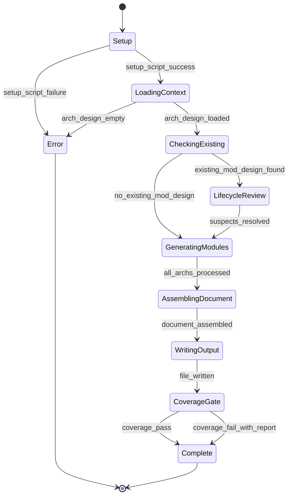
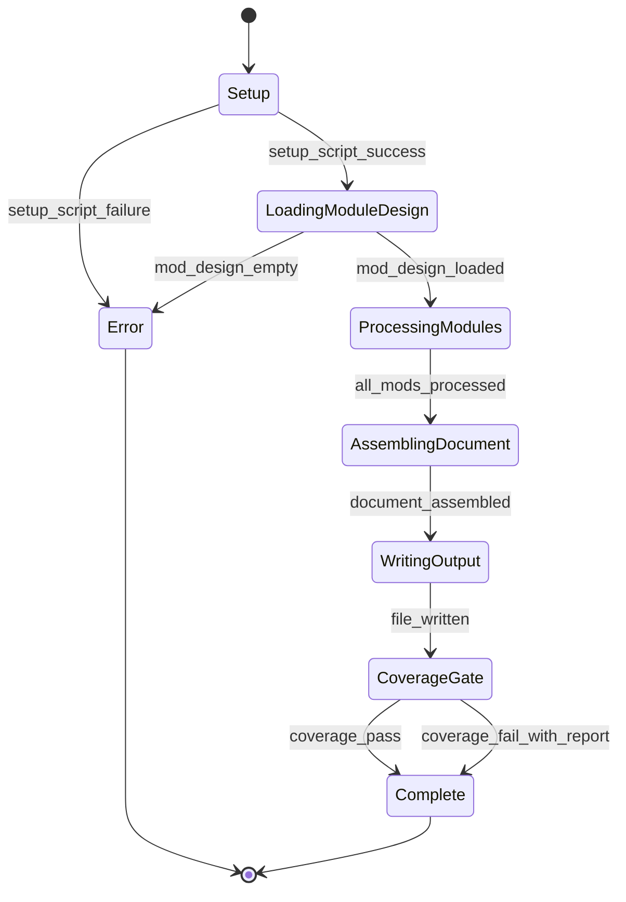

# Module Design: Module Design ↔ Unit Testing

**Feature Branch**: `004-module-unit`
**Created**: 2026-02-21
**Status**: Draft
**Source**: `specs/004-module-unit/v-model/architecture-design.md`

## Overview

This document decomposes the 17 architecture modules of the V-Model Extension Pack v0.4.0 into 24 low-level module specifications (`MOD-NNN`). The decomposition follows natural implementation boundaries: LLM command prompts are split by major orchestration responsibility (setup/prerequisite validation, per-ARCH loop, coverage gate) and by view-generation function (one MOD per mandatory view); Bash/PowerShell scripts are split by parsing pass (forward coverage, backward coverage) since each pass reads different identifiers and produces independent output; the CI evaluation suite is split by assertion category (structural presence checks, semantic quality scoring). The cross-cutting tag-routing logic receives a dedicated MOD inheriting the `[CROSS-CUTTING]` tag because it contains explicit conditional branches consumed by commands, validators, and matrix builders alike.

At this level, every module is specified in enough detail that writing the actual source code (Markdown prompt sections, Bash functions, Python assertion methods) is a translation exercise requiring no further design decisions.

No safety-critical sections are generated — no `v-model-config.yml` domain configuration is present in this repository.

## ID Schema

- **Module Design**: `MOD-NNN` — sequential identifier for each module (3-digit zero-padded)
- **Parent Architecture Modules**: Comma-separated `ARCH-NNN` list per module (many-to-many, authoritative for traceability)
- **Target Source File(s)**: Comma-separated file paths mapping to the repository codebase
- Example: `MOD-002` with Parent Architecture Modules `ARCH-001, ARCH-002` — module serves both orchestration and generation concerns
- `MOD-024 [CROSS-CUTTING]` — shared tag routing logic inherited by commands, validators, and matrix builders

## §4.0 ISO/IEC/IEEE 12207:2017 Detailed Design Requirements

Per ISO/IEC/IEEE 12207:2017 §8.4.4 (Software Detailed Design process), every `MOD-NNN` module specification in this document MUST satisfy the following four compliance requirements. These apply to all module types except `[EXTERNAL]` modules (wrapper interface documentation only).

| # | Requirement | ISO 12207 §8.4.4 Reference | Implementation in this Document |
|---|-------------|---------------------------|---------------------------------|
| 1 | **Typed Interface**: Each module must have a precisely typed interface — every parameter documented with type, direction (input/output), range, and units where applicable | §8.4.4.1 | Function signatures in the **Algorithmic / Logic View** pseudocode declare typed parameters (e.g., `arch_module: ArchModule`, `arguments: String`); return types are explicit; pre/post-conditions and error-path contracts documented in the **Error Handling & Return Codes** view |
| 2 | **Local Data Objects**: Each module must identify all local data objects with their lifetime and scope | §8.4.4.2 | **Internal Data Structures** table documents every local variable, constant, and buffer with: `Type` (explicit language-level type), `Size/Constraints` (range/bounds), `Initialization` (creation / initial value — lifetime anchor), and `Description` (scope boundary and purpose) |
| 3 | **Algorithm / Processing Logic**: Each module must document its algorithm or processing logic in sufficient detail that a developer can implement it without further design interpretation | §8.4.4.3 | **Algorithmic / Logic View** — step-by-step pseudocode in fenced ` ```pseudocode ``` ` blocks; every branch (`IF/ELSE`), loop (`FOR/WHILE`), and decision point is explicit; no vague prose; all variable names and return types are named |
| 4 | **Error Conditions**: Each module must identify all error conditions and specify the module's response to each | §8.4.4.4 | **Error Handling & Return Codes** table documents every error condition, error code or exception type, the architecture contract being satisfied, and the recovery strategy (caught internally, re-thrown, graceful degradation, or abort) |

### ISO 12207 §8.4.4 Compliance Verification

All 24 `MOD-NNN` modules in this document were verified against the four requirements above. There are 0 `[EXTERNAL]` modules, so all 24 modules are subject to full compliance.

| Requirement | Verified | Coverage | Notes |
|-------------|----------|----------|-------|
| §8.4.4.1 Typed Interface | ✅ PASS | 24 / 24 | Pseudocode function signatures provide explicitly typed parameters and return types for all 24 MODs; direction (input/output) is determinable from parameter position and return statement |
| §8.4.4.2 Local Data Objects | ✅ PASS | 24 / 24 | Internal Data Structures table present in every MOD; `Initialization` column captures object creation (lifetime anchor); `Description` column captures scope boundary; `Size/Constraints` captures range |
| §8.4.4.3 Algorithm Specification | ✅ PASS | 24 / 24 | All 24 non-`[EXTERNAL]` modules contain fenced ` ```pseudocode ``` ` blocks; pseudocode is step-by-step with explicit branches and loops; forward-coverage validator (`MOD-021`) enforces this structurally |
| §8.4.4.4 Error Conditions | ✅ PASS | 24 / 24 | Error Handling & Return Codes table present in every MOD with at minimum one catch-all row; every named error maps to an architecture contract reference and a recovery strategy |

---

## Module Designs

---

### Module: MOD-001 (Module Design Command Orchestrator)

**Parent Architecture Modules**: ARCH-001
**Target Source File(s)**: `commands/module-design.md`

#### Algorithmic / Logic View

```pseudocode
FUNCTION execute_module_design_command(arguments: String) -> Void:
    // Step 1: Run setup script and parse JSON output
    json_output = run_shell("SPECIFY_FEATURE={feature} bash scripts/bash/setup-v-model.sh --json --require-reqs --require-architecture-design")
    IF json_output IS NULL OR json_output.exit_code != 0:
        RETURN Error("Setup script failed — check feature branch or missing prerequisites")

    context = parse_json(json_output)
    vmodel_dir     = context["VMODEL_DIR"]
    arch_design_path = context["ARCH_DESIGN"]
    available_docs   = context["AVAILABLE_DOCS"]

    // Step 2: Load architecture-design.md
    arch_content = read_file(arch_design_path)
    arch_modules = extract_arch_modules(arch_content)   // returns List[ArchModule]
    IF length(arch_modules) == 0:
        RETURN Error("No architecture modules found in architecture-design.md — cannot generate module design")

    // Step 3: Load the module design template
    template_content = read_file("templates/module-design-template.md")
    IF template_content IS NULL:
        RETURN Error("Template not found: templates/module-design-template.md")

    // Step 4: Load existing module-design.md if present (lifecycle / evolve mode)
    existing_mod_map = {}   // Map[String, ModuleEntry]
    next_mod_number  = 1
    IF "module-design.md" IN available_docs:
        existing_content = read_file(vmodel_dir + "/module-design.md")
        existing_mod_map = parse_existing_mods(existing_content)
        next_mod_number  = max_mod_number(existing_mod_map) + 1
        // Detect suspect MODs: if parent ARCH is deprecated or modified
        FOR each mod_id, mod_entry IN existing_mod_map:
            FOR each parent_arch IN mod_entry.parent_archs:
                arch_status = get_arch_status(arch_modules, parent_arch)
                IF arch_status == "deprecated":
                    mod_entry.tag = "[SUSPECT — Parent " + parent_arch + " deprecated]"
                ELSE IF arch_status == "modified":
                    mod_entry.tag = "[SUSPECT — Parent " + parent_arch + " modified]"

    // Step 5: Load requirements.md for supplementary domain context
    requirements_content = read_file(context["REQUIREMENTS"])

    // Step 6: Load v-model-config.yml (if present at repository root)
    domain_config = None
    IF file_exists("v-model-config.yml"):
        domain_config = parse_yaml("v-model-config.yml")["domain"]
    // No domain_config found → skip safety-critical sections

    // Step 7: Generate MOD-NNN for each ARCH-NNN
    generated_mods = []
    derived_flags  = []
    mod_counter    = next_mod_number

    FOR each arch_module IN arch_modules (ordered by ARCH-NNN):
        routing_decision = route_module_tag(arch_module.tag)   // delegates to MOD-024

        IF routing_decision == "wrapper_only":
            // [EXTERNAL] — document wrapper interface only
            mod = generate_external_wrapper_mod(arch_module, mod_counter)
            generated_mods.append(mod)
            mod_counter += 1

        ELSE IF routing_decision == "decompose_full" OR routing_decision == "cross_cutting":
            // Standard or [CROSS-CUTTING] — full four-view decomposition
            sub_mods = decompose_arch_module(arch_module, mod_counter, template_content)
            FOR each sub_mod IN sub_mods:
                // Verify traceability — reject if no ARCH parent
                IF sub_mod.parent_archs IS EMPTY:
                    derived_flags.append("[DERIVED MODULE: " + sub_mod.description + "]")
                ELSE:
                    generated_mods.append(sub_mod)
                    mod_counter += 1

        ELSE IF routing_decision == "flag_derived":
            derived_flags.append("[DERIVED MODULE: " + arch_module.name + " — untraceable]")

    // Step 8: Apply lifecycle rules to existing modules
    final_mod_list = merge_existing_and_new(existing_mod_map, generated_mods)

    // Step 9: Assemble document from template + generated content
    output_document = assemble_module_design_document(template_content, final_mod_list, derived_flags, domain_config)

    // Step 10: Write output file
    write_file(vmodel_dir + "/module-design.md", output_document)

    // Step 11: Run forward-only coverage gate (partial mode — unit-test.md absent)
    coverage_result = run_shell("bash scripts/bash/validate-module-coverage.sh " + vmodel_dir)
    report_completion_summary(generated_mods, coverage_result, derived_flags)
```

#### State Machine View



#### Internal Data Structures

| Name | Type | Size/Constraints | Initialization | Description |
|------|------|-----------------|----------------|-------------|
| `context` | `Dict[String, Any]` | Keys: VMODEL_DIR, ARCH_DESIGN, REQUIREMENTS, AVAILABLE_DOCS | Populated from setup script JSON | Setup output parsed into key-value map |
| `arch_modules` | `List[ArchModule]` | ≥1 item required; max unbounded | Extracted from architecture-design.md Logical View table | All ARCH-NNN entries including tag, type, parent SYS |
| `existing_mod_map` | `Dict[String, ModuleEntry]` | Empty when no prior module-design.md | Empty `{}` | Maps MOD-NNN ID strings to their parsed content |
| `next_mod_number` | `Integer` | ≥1, increments by 1 per new MOD | 1 when no existing file | Tracks next available MOD sequence number |
| `generated_mods` | `List[ModuleSpec]` | Length = total MODs generated | `[]` | Accumulates all new MOD-NNN entries during generation loop |
| `derived_flags` | `List[String]` | Length = number of untraceable modules | `[]` | Accumulates `[DERIVED MODULE: ...]` flags |
| `domain_config` | `String \| None` | Values: `iso_26262`, `do_178c`, `iec_62304`, or `None` | `None` if v-model-config.yml absent | Controls safety-critical section inclusion |

#### Error Handling & Return Codes

| Error Condition | Error Code / Exception | Architecture Contract | Recovery |
|----------------|----------------------|----------------------|----------|
| Setup script exits non-zero | `SetupFailureError` | ARCH-001 Interface: "Error message + no file produced" | Abort command; print error to stdout |
| `architecture-design.md` empty (zero ARCH-NNN) | `EmptyInputError` | ARCH-001 Interface: "No architecture modules found" message | Print error: "No architecture modules found in architecture-design.md — cannot generate module design" |
| Template file not found | `TemplateNotFoundError` | ARCH-005 Interface: "template not found" error | Print error: "Template not found: templates/module-design-template.md" |
| Untraceable module detected | `DerivedModuleFlag` (non-fatal) | ARCH-001 Interface: `[DERIVED MODULE: description]` inline | Append flag to `derived_flags`; continue generation; list flags in output |
| Coverage gate returns exit code 1 | Coverage gap (non-fatal) | ARCH-007 Interface: gap report on stdout | Include gap report in output; do NOT abort |

---

### Module: MOD-002 (Algorithmic / Logic View Generator)

**Parent Architecture Modules**: ARCH-002
**Target Source File(s)**: `commands/module-design.md`

#### Algorithmic / Logic View

```pseudocode
FUNCTION generate_algorithmic_view(arch_module: ArchModule, mod_spec: ModuleSpec) -> String:
    // Step 1: Extract relevant data from the architecture Data Flow View
    data_flow_entry = find_data_flow_entry(arch_module.id)
    input_format    = data_flow_entry.input_format
    output_format   = data_flow_entry.output_format
    transformation  = data_flow_entry.transformation

    // Step 2: Identify all branches from the Interface View contracts
    error_contracts = find_interface_contracts(arch_module.id)

    // Step 3: Draft pseudocode structure
    pseudocode_lines = []
    pseudocode_lines.append("FUNCTION " + mod_spec.function_name + "(" + format_params(mod_spec.inputs) + ") -> " + mod_spec.return_type + ":")

    // Step 4: Add input validation block (one IF per Interface constraint)
    FOR each contract IN error_contracts WHERE contract.direction == "Input":
        IF contract.constraint contains "MUST":
            pseudocode_lines.append("    IF " + contract.name + " IS NULL OR invalid:")
            pseudocode_lines.append("        RETURN Error(\"" + contract.exception_message + "\")")

    // Step 5: Add core transformation steps (no vague prose)
    FOR each step IN transformation.steps (ordered):
        pseudocode_lines.append("    // " + step.description)
        pseudocode_lines.append("    " + step.code_expression)

    // Step 6: Add explicit branching for every decision point
    FOR each decision_point IN mod_spec.decision_points:
        pseudocode_lines.append("    IF " + decision_point.condition + ":")
        pseudocode_lines.append("        " + decision_point.true_branch)
        IF decision_point.false_branch IS NOT NULL:
            pseudocode_lines.append("    ELSE:")
            pseudocode_lines.append("        " + decision_point.false_branch)

    // Step 7: Add return statement with explicit type
    pseudocode_lines.append("    RETURN " + mod_spec.return_variable + "  // Type: " + mod_spec.return_type)

    // Step 8: Validate pseudocode is not vague
    pseudocode_text = join(pseudocode_lines, "\n")
    IF contains_vague_prose(pseudocode_text):
        RAISE StructuralFailure("Vague prose detected in algorithmic view — replace with explicit code expressions")

    // Step 9: Wrap in fenced code block
    RETURN "```pseudocode\n" + pseudocode_text + "\n```"
```

#### State Machine View

N/A — Stateless pure function

#### Internal Data Structures

| Name | Type | Size/Constraints | Initialization | Description |
|------|------|-----------------|----------------|-------------|
| `pseudocode_lines` | `List[String]` | Unbounded (≥1 line required) | `[]` | Accumulates pseudocode line-by-line before joining |
| `data_flow_entry` | `DataFlowEntry` | One per ARCH-NNN in Data Flow View | Looked up from arch | Input format, output format, transformation description for the module |
| `error_contracts` | `List[InterfaceContract]` | 0..N contracts per ARCH-NNN | Looked up from arch Interface View | Error conditions and constraints for the module |
| `decision_points` | `List[DecisionPoint]` | 0..N per module | Extracted from mod_spec | Conditional branches requiring explicit if/else pseudocode |

#### Error Handling & Return Codes

| Error Condition | Error Code / Exception | Architecture Contract | Recovery |
|----------------|----------------------|----------------------|----------|
| Vague prose detected in pseudocode | `StructuralFailure` | ARCH-002 Interface: "Vague prose → rejection" | Re-generate with concrete code expressions; raise exception to halt MOD acceptance |
| Missing fenced pseudocode block | `StructuralFailure` | ARCH-002 Interface: absence of pseudocode block is structural failure | Raise to caller (MOD-001); MOD is rejected until corrected |
| No data flow entry for ARCH-NNN | `MissingContextWarning` (non-fatal) | ARCH-002 Interface: N/A — derive from other views | Fall back to Interface View contracts for transformation context |

---

### Module: MOD-003 (State Machine View Generator)

**Parent Architecture Modules**: ARCH-002
**Target Source File(s)**: `commands/module-design.md`

#### Algorithmic / Logic View

```pseudocode
FUNCTION generate_state_machine_view(arch_module: ArchModule, mod_spec: ModuleSpec) -> String:
    // Step 1: Determine if module maintains state across invocations
    is_stateful = detect_stateful_behavior(mod_spec)
    // Detection criteria: presence of persistent variables, session/connection objects,
    // state enum fields, or explicit state transitions in arch Process View

    // Step 2: Handle stateless modules
    IF NOT is_stateful:
        RETURN "N/A — Stateless"
        // This string matches broad regex (?i)N/?A.*Stateless used by validators

    // Step 3: For stateful modules — extract states from architecture Process View
    process_view_diagrams = find_process_diagrams(arch_module.id)
    states = extract_states(process_view_diagrams)        // List[State]
    transitions = extract_transitions(process_view_diagrams)  // List[Transition]
    guards = extract_guards(process_view_diagrams)             // List[Guard]

    // Step 4: Ensure error/recovery states are present
    IF no ERROR_STATE IN states:
        states.append(State("Error", entry_action="log_error()", exit_action="clear_state()"))
    IF no RECOVERY_TRANSITION IN transitions:
        transitions.append(Transition(from="Error", to="Idle", event="reset"))

    // Step 5: Build Mermaid stateDiagram-v2
    mermaid_lines = ["stateDiagram-v2"]
    mermaid_lines.append("    [*] --> " + states[0].name)   // initial state

    FOR each transition IN transitions:
        guard_str = ""
        IF transition.guard IS NOT NULL:
            guard_str = " [" + transition.guard + "]"
        mermaid_lines.append("    " + transition.from_state + " --> " + transition.to_state + " : " + transition.event + guard_str)

    mermaid_lines.append("    " + states.last().name + " --> [*]")   // terminal state

    // Step 6: Wrap in fenced mermaid code block
    RETURN "```mermaid\n" + join(mermaid_lines, "\n") + "\n```"
```

#### State Machine View

N/A — Stateless pure function

#### Internal Data Structures

| Name | Type | Size/Constraints | Initialization | Description |
|------|------|-----------------|----------------|-------------|
| `is_stateful` | `Boolean` | True/False | Determined by `detect_stateful_behavior()` | Whether the target module maintains state |
| `states` | `List[State]` | ≥2 items for stateful (initial + at least one operational) | Extracted from Process View | All states for the Mermaid diagram |
| `transitions` | `List[Transition]` | ≥1 item for stateful modules | Extracted from Process View | State transitions with event and optional guard |
| `mermaid_lines` | `List[String]` | Unbounded | `["stateDiagram-v2"]` | Lines of the Mermaid diagram being built |

#### Error Handling & Return Codes

| Error Condition | Error Code / Exception | Architecture Contract | Recovery |
|----------------|----------------------|----------------------|----------|
| Stateful module with no states extracted | `MissingStateError` | ARCH-002 Interface: State Machine View required for stateful MODs | Raise to caller; regenerate from Process View diagrams |
| Missing Mermaid stateDiagram-v2 for stateful module | `StructuralFailure` | ARCH-015 Interface: "Mermaid for stateful" assertion | Raise to caller (MOD-001); MOD rejected |
| Stateless bypass string missing regex match | `StatelessBypassError` | ARCH-002 Interface: broad regex `(?i)N/?A.*Stateless` required | Replace with canonical "N/A — Stateless" string |

---

### Module: MOD-004 (Internal Data Structures View Generator)

**Parent Architecture Modules**: ARCH-002
**Target Source File(s)**: `commands/module-design.md`

#### Algorithmic / Logic View

```pseudocode
FUNCTION generate_data_structures_view(arch_module: ArchModule, mod_spec: ModuleSpec) -> String:
    // Step 1: Extract all variables, constants, and buffers from module specification
    local_variables = mod_spec.inputs + mod_spec.local_state + mod_spec.constants
    // Also include return type as an output variable

    // Step 2: Build table rows — one row per variable
    table_rows = []
    FOR each variable IN local_variables:
        row = DataStructureRow(
            name         = variable.name,
            type         = variable.explicit_type,           // e.g., "uint8_t", "String", "Dict[String, List[Int]]"
            size_constraints = variable.size_or_constraints, // e.g., "buffer is exactly 256 bytes"
            initialization   = variable.default_value,       // e.g., "0x00", "[]", "None"
            description      = variable.purpose
        )
        // Enforce type explicitness — reject generic "any" or "object"
        IF variable.explicit_type IN ["any", "object", "unknown"]:
            RAISE TypeError("Variable '" + variable.name + "' must have an explicit language-level type")

        // Size constraints MUST be explicit for buffer types
        IF variable.is_buffer AND variable.size_or_constraints IS NULL:
            RAISE ConstraintError("Buffer '" + variable.name + "' requires explicit size constraint for BVA")

        table_rows.append(row)

    // Step 3: Render Markdown table
    header = "| Name | Type | Size/Constraints | Initialization | Description |"
    separator = "|------|------|-----------------|----------------|-------------|"
    data_rows = []
    FOR each row IN table_rows:
        data_rows.append("| `" + row.name + "` | `" + row.type + "` | " + row.size_constraints + " | `" + row.initialization + "` | " + row.description + " |")

    RETURN join([header, separator] + data_rows, "\n")
```

#### State Machine View

N/A — Stateless pure function

#### Internal Data Structures

| Name | Type | Size/Constraints | Initialization | Description |
|------|------|-----------------|----------------|-------------|
| `local_variables` | `List[Variable]` | ≥0 items | Populated from mod_spec | All variables, constants, and buffers the target module uses |
| `table_rows` | `List[DataStructureRow]` | One per variable | `[]` | Rendered rows for the output Markdown table |
| `header` | `String` | Fixed 5-column Markdown header | Constant | Column header for the data structures table |

#### Error Handling & Return Codes

| Error Condition | Error Code / Exception | Architecture Contract | Recovery |
|----------------|----------------------|----------------------|----------|
| Variable has non-explicit type ("any", "object") | `TypeError` | ARCH-002 Interface: "Explicit language-level type required" | Raise to caller; regenerate with explicit types |
| Buffer variable missing size constraint | `ConstraintError` | ARCH-002 Interface: "Exact sizes where applicable" | Raise to caller; add explicit byte-size constraint |
| Empty data structures section | Warning (non-fatal) | ARCH-002 Interface: Section required even if minimal | Emit "No local state — pure function with no local variables" row |

---

### Module: MOD-005 (Error Handling & Return Codes View Generator)

**Parent Architecture Modules**: ARCH-002
**Target Source File(s)**: `commands/module-design.md`

#### Algorithmic / Logic View

```pseudocode
FUNCTION generate_error_handling_view(arch_module: ArchModule, mod_spec: ModuleSpec) -> String:
    // Step 1: Load Interface View contracts for the parent ARCH
    interface_contracts = find_interface_contracts(arch_module.id)
    exception_entries   = filter_exceptions(interface_contracts)  // direction == "Exception"

    // Step 2: Map each internal error to an architecture contract
    table_rows = []
    FOR each contract IN exception_entries:
        row = ErrorHandlingRow(
            condition    = contract.error_condition,
            code_or_exc  = contract.error_code_or_exception_type,
            arch_contract = arch_module.id + " Interface: " + contract.constraint,
            recovery      = determine_recovery_action(contract)
        )
        // Recovery classification:
        // - "Caught internally" if error is handled within the module
        // - "Re-thrown to caller" if propagated up the call stack
        // - "Graceful degradation: <action>" if fallback behavior exists
        // - "Abort: <message>" if the module cannot recover
        table_rows.append(row)

    // Step 3: Add catch-all for unexpected exceptions not in Interface View
    table_rows.append(ErrorHandlingRow(
        condition    = "Unexpected exception",
        code_or_exc  = "UnexpectedError",
        arch_contract = arch_module.id + " Interface: N/A",
        recovery      = "Re-thrown to orchestrator (MOD-001 or MOD-006)"
    ))

    // Step 4: Render Markdown table
    header = "| Error Condition | Error Code / Exception | Architecture Contract | Recovery |"
    separator = "|----------------|----------------------|----------------------|----------|"
    data_rows = []
    FOR each row IN table_rows:
        data_rows.append("| " + row.condition + " | `" + row.code_or_exc + "` | " + row.arch_contract + " | " + row.recovery + " |")

    RETURN join([header, separator] + data_rows, "\n")
```

#### State Machine View

N/A — Stateless pure function

#### Internal Data Structures

| Name | Type | Size/Constraints | Initialization | Description |
|------|------|-----------------|----------------|-------------|
| `interface_contracts` | `List[InterfaceContract]` | ≥0 items | Loaded from arch Interface View | All interface contracts for the parent ARCH |
| `exception_entries` | `List[InterfaceContract]` | Subset of interface_contracts | Filtered to direction=="Exception" | Only the exception-type rows from the Interface View |
| `table_rows` | `List[ErrorHandlingRow]` | 1..N+1 (N contracts + catch-all) | `[]` | Rows for the output error handling table |

#### Error Handling & Return Codes

| Error Condition | Error Code / Exception | Architecture Contract | Recovery |
|----------------|----------------------|----------------------|----------|
| No Interface View contracts found for ARCH-NNN | `MissingContractWarning` (non-fatal) | ARCH-002 Interface: must map to contract | Emit single catch-all row only; log warning |
| Table generation produces zero rows | `EmptyTableError` | ARCH-002 Interface: Error Handling section required | Emit catch-all row; section must not be empty |

---

### Module: MOD-006 (Unit Test Command Orchestrator)

**Parent Architecture Modules**: ARCH-003
**Target Source File(s)**: `commands/unit-test.md`

#### Algorithmic / Logic View

```pseudocode
FUNCTION execute_unit_test_command(arguments: String) -> Void:
    // Step 1: Run setup script requiring module-design.md as prerequisite
    json_output = run_shell("SPECIFY_FEATURE={feature} bash scripts/bash/setup-v-model.sh --json --require-reqs --require-module-design")
    IF json_output.exit_code != 0:
        RETURN Error("Setup failed — module-design.md missing or prerequisites not met")

    context = parse_json(json_output)
    vmodel_dir       = context["VMODEL_DIR"]
    module_design_path = context["MODULE_DESIGN"]
    available_docs   = context["AVAILABLE_DOCS"]

    // Step 2: Load module-design.md and extract MOD-NNN list
    mod_content  = read_file(module_design_path)
    mod_modules  = extract_mod_modules(mod_content)    // returns List[ModuleSpec]
    IF length(mod_modules) == 0:
        RETURN Error("No module design entries found in module-design.md — cannot generate unit tests")

    // Step 3: Load the unit test template
    template_content = read_file("templates/unit-test-template.md")
    IF template_content IS NULL:
        RETURN Error("Template not found: templates/unit-test-template.md")

    // Step 4: Load v-model-config.yml (if present)
    domain_config = None
    IF file_exists("v-model-config.yml"):
        domain_config = parse_yaml("v-model-config.yml")["domain"]

    // Step 5: Generate UTP/UTS for each MOD-NNN
    generated_utps = []

    FOR each mod_module IN mod_modules (ordered by MOD-NNN):
        routing_decision = route_module_tag(mod_module.tag)   // delegates to MOD-024

        IF routing_decision == "skip_utp":
            // [EXTERNAL] — write skip notation
            skip_note = "Module " + mod_module.id + " is [EXTERNAL] — wrapper behavior tested at integration level."
            generated_utps.append(SkipEntry(mod_module.id, skip_note))

        ELSE:
            // Standard or [CROSS-CUTTING] — generate white-box tests
            utp_list = generate_utp_and_uts(mod_module, template_content, domain_config)  // delegates to MOD-007/008/009
            generated_utps.append_all(utp_list)

    // Step 6: Assemble unit test document
    output_document = assemble_unit_test_document(template_content, generated_utps, domain_config)

    // Step 7: Write unit-test.md
    write_file(vmodel_dir + "/unit-test.md", output_document)

    // Step 8: Run full coverage gate (forward + backward)
    coverage_result = run_shell("bash scripts/bash/validate-module-coverage.sh " + vmodel_dir)
    report_completion_summary(generated_utps, coverage_result)
```

#### State Machine View



#### Internal Data Structures

| Name | Type | Size/Constraints | Initialization | Description |
|------|------|-----------------|----------------|-------------|
| `context` | `Dict[String, Any]` | Keys: VMODEL_DIR, MODULE_DESIGN, AVAILABLE_DOCS | Populated from setup JSON | Setup output parsed into key-value map |
| `mod_modules` | `List[ModuleSpec]` | ≥1 item required | Extracted from module-design.md | All MOD-NNN entries including four views |
| `generated_utps` | `List[UTPEntry \| SkipEntry]` | One per MOD-NNN | `[]` | Accumulates UTP/UTS or skip entries per module |
| `domain_config` | `String \| None` | `iso_26262`, `do_178c`, `iec_62304`, or `None` | `None` | Controls MC/DC and fault injection section inclusion |

#### Error Handling & Return Codes

| Error Condition | Error Code / Exception | Architecture Contract | Recovery |
|----------------|----------------------|----------------------|----------|
| Setup script exits non-zero | `SetupFailureError` | ARCH-003 Interface: error message + no file produced | Abort; print error to stdout |
| module-design.md empty (zero MOD-NNN) | `EmptyInputError` | ARCH-003 Interface: MUST exist with MOD-NNN modules | Print error: "No module design entries found" |
| Template not found | `TemplateNotFoundError` | ARCH-006 Interface: "template not found" error | Abort with specific message |
| Coverage gate exit code 1 | Coverage gap (non-fatal) | ARCH-003 Interface: "Coverage gate failure → warning inline" | Include gap report; do NOT abort |

---

### Module: MOD-007 (White-Box Technique Selector)

**Parent Architecture Modules**: ARCH-004
**Target Source File(s)**: `commands/unit-test.md`

#### Algorithmic / Logic View

```pseudocode
FUNCTION select_white_box_technique(mod_module: ModuleSpec) -> List[TechniqueAssignment]:
    // Every module always receives Statement & Branch Coverage
    techniques = [TechniqueAssignment(technique="Statement & Branch Coverage", view_anchor="Algorithmic/Logic View")]

    // Boundary Value Analysis vs. Equivalence Partitioning selection
    data_structures = mod_module.internal_data_structures
    FOR each variable IN data_structures:
        IF variable.type is scalar_ordered_type:
            // Scalar ordered types: Integer, Float, uint8_t, int32_t, etc.
            // BVA: min, min-1, mid, max, max+1
            techniques.append(TechniqueAssignment(
                technique   = "Boundary Value Analysis",
                view_anchor = "Internal Data Structures",
                target_var  = variable.name,
                boundaries  = compute_bva_boundaries(variable)
            ))
        ELSE IF variable.type is discrete_non_scalar:
            // Discrete non-scalar: Boolean, Enum — numeric BVA does not apply
            techniques.append(TechniqueAssignment(
                technique   = "Equivalence Partitioning",
                view_anchor = "Internal Data Structures",
                target_var  = variable.name,
                partitions  = enumerate_equivalence_classes(variable)
            ))

    // Strict Isolation: always if module has external dependencies (from Interface View)
    interface_inputs = find_interface_contracts(mod_module.parent_archs)
    external_deps = filter_external_dependencies(interface_inputs)
    IF length(external_deps) > 0:
        techniques.append(TechniqueAssignment(
            technique   = "Strict Isolation",
            view_anchor = "Architecture Interface View",
            mock_targets = external_deps  // includes hardware interfaces
        ))
    ELSE:
        techniques.append(TechniqueAssignment(
            technique    = "Strict Isolation",
            view_anchor  = "Architecture Interface View",
            mock_targets = [],
            note         = "None — module is self-contained"
        ))

    // State Transition Testing: only if module has stateful State Machine View
    IF mod_module.state_machine_view is not stateless_bypass:
        states     = extract_states(mod_module.state_machine_view)
        transitions = extract_transitions(mod_module.state_machine_view)
        // Include valid AND invalid transitions
        invalid_transitions = compute_invalid_transitions(states, transitions)
        techniques.append(TechniqueAssignment(
            technique   = "State Transition Testing",
            view_anchor = "State Machine View",
            transitions = transitions + invalid_transitions
        ))

    RETURN techniques
```

#### State Machine View

N/A — Stateless pure function

#### Internal Data Structures

| Name | Type | Size/Constraints | Initialization | Description |
|------|------|-----------------|----------------|-------------|
| `techniques` | `List[TechniqueAssignment]` | ≥1 (Statement/Branch always added) | `[Statement & Branch Coverage]` | Accumulates technique assignments for the module |
| `external_deps` | `List[InterfaceContract]` | 0..N dependencies | Filtered from Interface View | External dependencies requiring mocking |
| `invalid_transitions` | `List[Transition]` | 0..N (computed per state matrix) | Empty if stateless | Invalid transitions generated for State Transition Testing |
| `SCALAR_ORDERED_TYPES` | `Set[String]` | Fixed set | `{"Integer", "Float", "int8", "int16", "int32", "int64", "uint8_t", "uint16_t", ...}` | Types eligible for BVA |
| `DISCRETE_NON_SCALAR_TYPES` | `Set[String]` | Fixed set | `{"Boolean", "Enum", "bool"}` | Types requiring EP instead of BVA |

#### Error Handling & Return Codes

| Error Condition | Error Code / Exception | Architecture Contract | Recovery |
|----------------|----------------------|----------------------|----------|
| Scalar type selected for EP (or vice versa) | `TechniqueMismatchError` | ARCH-004 Interface: "Boolean/Enum → EP instead of BVA" | Correct technique selection; raise if wrong technique persists |
| State machine view present but Mermaid unparseable | `StateMachineParseError` | ARCH-004 Interface: stateful → State Transition Testing | Log warning; skip State Transition Testing for this module |

---

### Module: MOD-008 (UTP Test Case Generator)

**Parent Architecture Modules**: ARCH-004
**Target Source File(s)**: `commands/unit-test.md`

#### Algorithmic / Logic View

```pseudocode
FUNCTION generate_utp_case(mod_module: ModuleSpec, technique: TechniqueAssignment, utp_letter: Char) -> UTPEntry:
    // Step 1: Construct UTP identifier
    mod_number = extract_number(mod_module.id)   // e.g., "001" from "MOD-001"
    utp_id = "UTP-" + mod_number + "-" + utp_letter  // e.g., "UTP-001-A"

    // Step 2: Build mock registry table
    mock_registry_rows = []
    IF length(technique.mock_targets) == 0:
        mock_registry_rows.append("None — module is self-contained")
    ELSE:
        FOR each dep IN technique.mock_targets:
            mock_row = MockRegistryRow(
                dependency = dep.name,
                type       = dep.type,           // e.g., "File I/O", "Hardware GPIO", "Database"
                mock_strategy = "Mock: " + dep.name + " → " + dep.mock_behavior
            )
            mock_registry_rows.append(mock_row)

    // Step 3: Build test objective
    objective = build_utp_objective(technique.technique, technique.view_anchor, mod_module.id)

    // Step 4: Build technique-specific test definition
    test_definition = ""
    IF technique.technique == "Statement & Branch Coverage":
        test_definition = "Execute every statement and verify both True/False branches in " + mod_module.function_name
    ELSE IF technique.technique == "Boundary Value Analysis":
        test_definition = "Test variable '" + technique.target_var + "' at: min=" + technique.boundaries.min +
                          ", min-1=" + technique.boundaries.min_minus_1 +
                          ", mid=" + technique.boundaries.mid +
                          ", max=" + technique.boundaries.max +
                          ", max+1=" + technique.boundaries.max_plus_1
    ELSE IF technique.technique == "Equivalence Partitioning":
        test_definition = "Test variable '" + technique.target_var + "' partitions: " + join(technique.partitions, ", ")
    ELSE IF technique.technique == "Strict Isolation":
        test_definition = "Mock all external dependencies; verify module behavior independent of real implementations"
    ELSE IF technique.technique == "State Transition Testing":
        test_definition = "Exercise every transition in State Machine View including " + length(technique.invalid_transitions) + " invalid transitions"

    RETURN UTPEntry(
        id             = utp_id,
        parent_mod     = mod_module.id,
        technique      = technique.technique,
        view_anchor    = technique.view_anchor,
        objective      = objective,
        definition     = test_definition,
        mock_registry  = mock_registry_rows
    )
```

#### State Machine View

N/A — Stateless pure function

#### Internal Data Structures

| Name | Type | Size/Constraints | Initialization | Description |
|------|------|-----------------|----------------|-------------|
| `mod_number` | `String` | 3-digit zero-padded, e.g., "001" | Extracted from MOD-NNN ID | Numeric portion of parent module ID |
| `utp_id` | `String` | Format: `UTP-NNN-X` where X is uppercase letter A-Z | Constructed | Unique UTP identifier; encodes parent MOD for regex lineage parsing |
| `mock_registry_rows` | `List[MockRegistryRow \| String]` | ≥1 row ("None — self-contained" or real mocks) | `[]` | Mock registry table entries |
| `utp_letter` | `Char` | A-Z sequential; starts at "A" for each MOD | Passed by caller | Letter suffix distinguishing UTPs under the same MOD |

#### Error Handling & Return Codes

| Error Condition | Error Code / Exception | Architecture Contract | Recovery |
|----------------|----------------------|----------------------|----------|
| UTP letter exceeds "Z" (>26 techniques per MOD) | `IDOverflowError` | ARCH-004 Interface: ID format `UTP-NNN-X` | Use double-letter suffix (AA, AB…) with warning; document in coverage summary |
| Mock registry table empty (not "None — self-contained") | `EmptyMockRegistryError` | ARCH-004 Interface: "explicitly listing all external dependencies" | Raise; must populate with "None — module is self-contained" at minimum |

---

### Module: MOD-009 (UTS Scenario Generator)

**Parent Architecture Modules**: ARCH-004
**Target Source File(s)**: `commands/unit-test.md`

#### Algorithmic / Logic View

```pseudocode
FUNCTION generate_uts_scenarios(utp_entry: UTPEntry, mod_module: ModuleSpec) -> List[UTSEntry]:
    // Step 1: Determine number of scenarios based on technique
    scenarios = []
    scenario_counter = 1

    IF utp_entry.technique == "Statement & Branch Coverage":
        // One scenario per branch: at minimum True path and False path for each IF
        branches = extract_branches(mod_module.algorithmic_view)
        FOR each branch IN branches:
            uts = build_uts_scenario(utp_entry, mod_module, branch.description, scenario_counter)
            scenarios.append(uts)
            scenario_counter += 1

    ELSE IF utp_entry.technique == "Boundary Value Analysis":
        // Five scenarios: min-1, min, mid, max, max+1 for each bounded variable
        FOR each boundary_value IN [utp_entry.boundaries.min_minus_1,
                                     utp_entry.boundaries.min,
                                     utp_entry.boundaries.mid,
                                     utp_entry.boundaries.max,
                                     utp_entry.boundaries.max_plus_1]:
            uts = build_uts_scenario(utp_entry, mod_module, "Input=" + boundary_value, scenario_counter)
            scenarios.append(uts)
            scenario_counter += 1

    ELSE IF utp_entry.technique == "Equivalence Partitioning":
        // One scenario per equivalence class partition
        FOR each partition IN utp_entry.partitions:
            uts = build_uts_scenario(utp_entry, mod_module, "Partition=" + partition, scenario_counter)
            scenarios.append(uts)
            scenario_counter += 1

    ELSE IF utp_entry.technique == "State Transition Testing":
        // One scenario per transition (valid + invalid)
        FOR each transition IN utp_entry.transitions:
            uts = build_uts_scenario(utp_entry, mod_module, transition.from_state + "-->" + transition.to_state, scenario_counter)
            scenarios.append(uts)
            scenario_counter += 1

    ELSE IF utp_entry.technique == "Strict Isolation":
        // Scenarios: one nominal (all mocks return expected), one per mock failure
        scenarios.append(build_uts_scenario(utp_entry, mod_module, "All dependencies return expected", scenario_counter))
        scenario_counter += 1
        FOR each mock IN utp_entry.mock_registry WHERE mock != "None — self-contained":
            uts = build_uts_scenario(utp_entry, mod_module, mock.dependency + " returns error", scenario_counter)
            scenarios.append(uts)
            scenario_counter += 1

    RETURN scenarios

FUNCTION build_uts_scenario(utp: UTPEntry, mod: ModuleSpec, condition: String, number: Integer) -> UTSEntry:
    // Step 1: Construct UTS identifier
    uts_id = utp.id + String(number)   // e.g., "UTP-001-A" + "1" → "UTS-001-A1"

    // Step 2: Build AAA structure using white-box implementation-oriented language
    // NOT BDD Given/When/Then — must reference internal code paths, variables, branches
    arrange = build_arrange(mod, condition)   // "Set <internal_var> = <value>; configure <mock>"
    act     = "Call " + mod.function_name + "(" + format_call_args(condition) + ")"
    assert  = build_assert(mod, condition)   // "Assert: returns <expected_value>; verify <internal_var> state"

    RETURN UTSEntry(
        id      = uts_id,
        parent  = utp.id,
        arrange = arrange,
        act     = act,
        assert  = assert
    )
```

#### State Machine View

N/A — Stateless pure function

#### Internal Data Structures

| Name | Type | Size/Constraints | Initialization | Description |
|------|------|-----------------|----------------|-------------|
| `scenarios` | `List[UTSEntry]` | ≥1 scenario per UTP | `[]` | Accumulates AAA-format test scenarios |
| `scenario_counter` | `Integer` | ≥1, increments by 1 per scenario | 1 | Sequential numeric suffix for UTS IDs (1, 2, 3...) |
| `uts_id` | `String` | Format `UTS-NNN-X#` where # is integer | Constructed | Unique scenario ID encoding parent UTP and grandparent MOD for regex parsing |

#### Error Handling & Return Codes

| Error Condition | Error Code / Exception | Architecture Contract | Recovery |
|----------------|----------------------|----------------------|----------|
| Zero scenarios generated for a UTP | `EmptyScenariosError` | ARCH-004 Interface: UTP must have ≥1 UTS | Raise; at minimum one nominal-path scenario is required |
| UTS uses BDD Given/When/Then language | `StyleViolationWarning` | ARCH-004 Interface: "white-box implementation-oriented language" | Replace with Arrange/Act/Assert format referencing internal variables |

---

### Module: MOD-010 (Module Design Template Loader)

**Parent Architecture Modules**: ARCH-005
**Target Source File(s)**: `templates/module-design-template.md`

#### Algorithmic / Logic View

```pseudocode
FUNCTION load_module_design_template(template_path: String) -> TemplateContent:
    // Step 1: Resolve path relative to repository root
    resolved_path = resolve_repo_relative_path(template_path)
    // Default: "templates/module-design-template.md"

    // Step 2: Read file
    IF NOT file_exists(resolved_path):
        RAISE TemplateNotFoundError("Template not found: " + resolved_path)

    raw_content = read_file(resolved_path)

    // Step 3: Parse template sections
    sections = parse_markdown_sections(raw_content)
    // Sections: header, overview, id_schema, module_designs, coverage_summary, derived_modules

    // Step 4: Extract placeholder structure
    template = TemplateContent(
        header_section     = sections["header"],
        module_stub        = sections["module_stub"],          // MOD-NNN placeholder block
        coverage_table     = sections["coverage_summary"],
        derived_section    = sections["derived_modules"],
        safety_placeholders = extract_commented_blocks(raw_content)  // conditional safety-critical sections
    )

    // Step 5: Validate template has required sections
    required = ["module_stub", "coverage_table", "derived_section"]
    FOR each section_key IN required:
        IF sections[section_key] IS NULL OR sections[section_key] IS EMPTY:
            RAISE TemplateValidationError("Missing required section: " + section_key)

    RETURN template
```

#### State Machine View

N/A — Stateless pure function

#### Internal Data Structures

| Name | Type | Size/Constraints | Initialization | Description |
|------|------|-----------------|----------------|-------------|
| `resolved_path` | `String` | Non-empty file path | Derived from template_path argument | Absolute or repo-relative path to template file |
| `sections` | `Dict[String, String]` | Keys: header, overview, id_schema, module_stub, coverage_summary, derived_modules | Parsed from raw_content | Individual Markdown sections extracted from template |
| `template` | `TemplateContent` | Structured object | Constructed | Parsed template ready for use by generation modules |

#### Error Handling & Return Codes

| Error Condition | Error Code / Exception | Architecture Contract | Recovery |
|----------------|----------------------|----------------------|----------|
| Template file not found | `TemplateNotFoundError` | ARCH-005 Interface: "template not found" error | Propagate to MOD-001; command aborts |
| Required section missing from template | `TemplateValidationError` | ARCH-005 Interface: Section headers required | Propagate to MOD-001; command aborts |

---

### Module: MOD-011 (Unit Test Template Loader)

**Parent Architecture Modules**: ARCH-006
**Target Source File(s)**: `templates/unit-test-template.md`

#### Algorithmic / Logic View

```pseudocode
FUNCTION load_unit_test_template(template_path: String) -> TemplateContent:
    // Step 1: Resolve path relative to repository root
    resolved_path = resolve_repo_relative_path(template_path)
    // Default: "templates/unit-test-template.md"

    // Step 2: Read file
    IF NOT file_exists(resolved_path):
        RAISE TemplateNotFoundError("Template not found: " + resolved_path)

    raw_content = read_file(resolved_path)

    // Step 3: Parse template sections
    sections = parse_markdown_sections(raw_content)
    // Sections: header, overview, id_schema, utp_stub, uts_stub, mock_registry_stub,
    //           coverage_summary, safety_placeholders (MCDC, fault_injection)

    // Step 4: Extract placeholder structure
    template = TemplateContent(
        header_section     = sections["header"],
        utp_stub           = sections["utp_stub"],         // UTP-NNN-X placeholder block
        uts_stub           = sections["uts_stub"],         // UTS-NNN-X# placeholder block
        mock_registry_stub = sections["mock_registry"],    // Mock registry table placeholder
        coverage_table     = sections["coverage_summary"],
        safety_placeholders = extract_commented_blocks(raw_content)  // MC/DC, fault injection
    )

    // Step 5: Validate required sections present
    required = ["utp_stub", "uts_stub", "mock_registry_stub"]
    FOR each section_key IN required:
        IF sections[section_key] IS NULL OR sections[section_key] IS EMPTY:
            RAISE TemplateValidationError("Missing required section: " + section_key)

    RETURN template
```

#### State Machine View

N/A — Stateless pure function

#### Internal Data Structures

| Name | Type | Size/Constraints | Initialization | Description |
|------|------|-----------------|----------------|-------------|
| `resolved_path` | `String` | Non-empty file path | Derived from template_path | Absolute or repo-relative path to unit test template |
| `sections` | `Dict[String, String]` | Keys: header, utp_stub, uts_stub, mock_registry, coverage_summary | Parsed from raw_content | Individual sections extracted from template |
| `template` | `TemplateContent` | Structured object | Constructed | Parsed unit test template ready for generation |

#### Error Handling & Return Codes

| Error Condition | Error Code / Exception | Architecture Contract | Recovery |
|----------------|----------------------|----------------------|----------|
| Template file not found | `TemplateNotFoundError` | ARCH-006 Interface: "template not found" error | Propagate to MOD-006; command aborts |
| Required section missing | `TemplateValidationError` | ARCH-006 Interface: Section headers required | Propagate to MOD-006; command aborts |

---

### Module: MOD-012 (Forward Coverage Parser — Bash)

**Parent Architecture Modules**: ARCH-007
**Target Source File(s)**: `scripts/bash/validate-module-coverage.sh`

#### Algorithmic / Logic View

```pseudocode
FUNCTION parse_forward_coverage(arch_design_path: String, module_design_path: String) -> ForwardCoverageResult:
    // Step 1: Parse all ARCH-NNN identifiers from architecture-design.md Logical View table
    arch_content = read_file(arch_design_path)
    arch_ids = []
    FOR each line IN arch_content:
        IF line matches regex "^\| (ARCH-[0-9]{3})" :
            arch_id = extract_group(line, 1)
            // Include [CROSS-CUTTING] tagged ARCH modules — they MUST have MOD coverage
            arch_ids.append(arch_id)
    // Exclude deprecated ARCH modules tagged [DEPRECATED]
    arch_ids = filter(arch_ids, lambda id: NOT arch_is_deprecated(arch_content, id))

    // Step 2: Parse all MOD-NNN Parent Architecture Modules fields from module-design.md
    mod_content = read_file(module_design_path)
    mod_to_parents = {}  // Map[String, List[String]]

    FOR each line IN mod_content:
        // Match: "**Parent Architecture Modules**: ARCH-001, ARCH-003"
        IF line matches regex "\*\*Parent Architecture Modules\*\*:\s*(.+)":
            parents_str = extract_group(line, 1)
            // Find current MOD-NNN (from most recently seen MOD header)
            mod_id = current_mod_context  // tracked via header parsing
            parent_list = split_and_trim(parents_str, ",")
            // Filter out deprecated parents
            parent_list = filter(parent_list, lambda p: NOT p.contains("[DEPRECATED]"))
            // Also exclude [EXTERNAL] tags embedded in parent strings
            parent_list = strip_tags(parent_list)
            mod_to_parents[mod_id] = parent_list

    // Step 3: Build covered ARCH set from MOD parent fields
    covered_archs = Set()
    FOR each mod_id, parents IN mod_to_parents:
        // Skip deprecated MODs
        IF NOT mod_is_deprecated(mod_content, mod_id):
            FOR each parent_arch IN parents:
                covered_archs.add(parent_arch)

    // Step 4: Identify gaps (ARCH with no corresponding MOD)
    arch_without_mod = []
    FOR each arch_id IN arch_ids:
        IF arch_id NOT IN covered_archs:
            arch_without_mod.append(arch_id)

    // Step 5: Identify orphaned MODs (referencing non-existent ARCH)
    orphaned_mods = []
    FOR each mod_id, parents IN mod_to_parents:
        IF mod_is_deprecated(mod_content, mod_id):
            CONTINUE  // skip deprecated
        FOR each parent_arch IN parents:
            IF parent_arch NOT IN arch_ids:
                orphaned_mods.append(mod_id + " references unknown " + parent_arch)
                BREAK

    // Step 6: Compute coverage percentage
    total_arch      = length(arch_ids)
    covered_count   = total_arch - length(arch_without_mod)
    coverage_pct    = (covered_count * 100) / total_arch  IF total_arch > 0  ELSE 0

    RETURN ForwardCoverageResult(
        total_arch       = total_arch,
        covered_count    = covered_count,
        coverage_pct     = coverage_pct,
        arch_without_mod = arch_without_mod,
        orphaned_mods    = orphaned_mods,
        has_gaps         = (length(arch_without_mod) > 0 OR length(orphaned_mods) > 0)
    )
```

#### State Machine View

N/A — Stateless pure function

#### Internal Data Structures

| Name | Type | Size/Constraints | Initialization | Description |
|------|------|-----------------|----------------|-------------|
| `arch_ids` | `List[String]` | ≥0, format "ARCH-NNN" | `[]` | All non-deprecated ARCH identifiers extracted from Logical View |
| `mod_to_parents` | `Dict[String, List[String]]` | Keys: MOD-NNN IDs | `{}` | Maps each MOD to its list of parent ARCH IDs |
| `covered_archs` | `Set[String]` | Subset of arch_ids | `Set()` | ARCH IDs that have at least one MOD pointing to them |
| `arch_without_mod` | `List[String]` | 0..N gaps | `[]` | ARCH IDs with no MOD parent field pointing to them |
| `orphaned_mods` | `List[String]` | 0..N orphans | `[]` | Messages for MODs referencing non-existent ARCH IDs |
| `total_arch` | `Integer` | ≥0 | Computed | Count of non-deprecated ARCH IDs |
| `coverage_pct` | `Integer` | 0-100 | Computed | Integer percentage of ARCH → MOD coverage |

#### Error Handling & Return Codes

| Error Condition | Error Code / Exception | Architecture Contract | Recovery |
|----------------|----------------------|----------------------|----------|
| architecture-design.md not found | Exit code 1 + stderr message | ARCH-007 Interface: "File MUST exist" | Print "ERROR: architecture-design.md not found"; exit 1 |
| Forward gap detected | Exit code 1 | ARCH-007 Interface: "Human-readable: ARCH-003: no module design mapping found" | Print gap list; set has_gaps=true |
| Gap in MOD numbering (e.g., MOD-001, MOD-003 — no MOD-002) | No error (acceptable) | ARCH-007 Interface: gaps in numbering accepted | Do not emit false-positive; ID gaps are valid |

---

### Module: MOD-013 (Backward Coverage Parser — Bash)

**Parent Architecture Modules**: ARCH-008
**Target Source File(s)**: `scripts/bash/validate-module-coverage.sh`

#### Algorithmic / Logic View

```pseudocode
FUNCTION parse_backward_coverage(module_design_path: String, unit_test_path: String | None) -> BackwardCoverageResult:
    // Step 1: Partial validation mode — skip entirely if unit-test.md absent
    IF unit_test_path IS NULL OR NOT file_exists(unit_test_path):
        RETURN BackwardCoverageResult(
            partial_mode    = True,
            skipped         = True,
            total_testable  = 0,
            covered_count   = 0,
            coverage_pct    = 0,
            mod_without_utp = [],
            orphaned_utps   = []
        )

    // Step 2: Parse all testable MOD-NNN identifiers from module-design.md
    mod_content = read_file(module_design_path)
    testable_mods  = []
    external_mods  = []
    FOR each line IN mod_content WHERE line matches regex "### Module: (MOD-[0-9]{3})":
        mod_id = extract_group(line, 1)
        IF mod_is_deprecated(mod_content, mod_id):
            CONTINUE
        IF mod_is_external(mod_content, mod_id):
            // [EXTERNAL] tag — bypass UTP requirement; count as "covered by integration tests"
            external_mods.append(mod_id)
        ELSE:
            testable_mods.append(mod_id)

    // Step 3: Parse all UTP-NNN-X identifiers from unit-test.md
    unit_content = read_file(unit_test_path)
    utp_ids = []
    FOR each line IN unit_content WHERE line matches regex "(UTP-[0-9]{3}-[A-Z])":
        utp_id = extract_group(line, 1)
        IF NOT utp_id IN utp_ids:
            utp_ids.append(utp_id)

    // Step 4: Parse all UTS-NNN-X# identifiers from unit-test.md
    uts_ids = []
    FOR each line IN unit_content WHERE line matches regex "(UTS-[0-9]{3}-[A-Z][0-9]+)":
        uts_id = extract_group(line, 1)
        IF NOT uts_id IN uts_ids:
            uts_ids.append(uts_id)

    // Step 5: Check each testable MOD has at least one UTP
    mod_without_utp = []
    FOR each mod_id IN testable_mods:
        mod_number = extract_number(mod_id)   // "001" from "MOD-001"
        has_utp = False
        FOR each utp_id IN utp_ids:
            utp_number = extract_utp_number(utp_id)  // "001" from "UTP-001-A"
            IF utp_number == mod_number:
                has_utp = True
                BREAK
        IF NOT has_utp:
            mod_without_utp.append(mod_id)

    // Step 6: Check UTP→UTS coverage
    utps_without_uts = []
    FOR each utp_id IN utp_ids:
        utp_full_key = extract_utp_key(utp_id)  // e.g., "001-A" from "UTP-001-A"
        has_uts = False
        FOR each uts_id IN uts_ids:
            uts_full_key = extract_uts_key(uts_id)  // e.g., "001-A" from "UTS-001-A1"
            IF uts_full_key.starts_with(utp_full_key):
                has_uts = True
                BREAK
        IF NOT has_uts:
            utps_without_uts.append(utp_id)

    // Step 7: Detect orphaned UTPs (UTP whose parent MOD does not exist)
    orphaned_utps = []
    FOR each utp_id IN utp_ids:
        utp_number = extract_utp_number(utp_id)
        parent_exists = False
        FOR each mod_id IN testable_mods + external_mods:
            IF extract_number(mod_id) == utp_number:
                parent_exists = True
                BREAK
        IF NOT parent_exists:
            orphaned_utps.append(utp_id)

    // Step 8: Compute coverage
    total_testable = length(testable_mods)
    covered_count  = total_testable - length(mod_without_utp)
    coverage_pct   = (covered_count * 100) / total_testable  IF total_testable > 0  ELSE 0

    RETURN BackwardCoverageResult(
        partial_mode      = False,
        skipped           = False,
        total_testable    = total_testable,
        total_external    = length(external_mods),
        covered_count     = covered_count,
        coverage_pct      = coverage_pct,
        mod_without_utp   = mod_without_utp,
        utps_without_uts  = utps_without_uts,
        orphaned_utps     = orphaned_utps,
        has_gaps          = (length(mod_without_utp) > 0 OR length(utps_without_uts) > 0 OR length(orphaned_utps) > 0)
    )
```

#### State Machine View

N/A — Stateless pure function

#### Internal Data Structures

| Name | Type | Size/Constraints | Initialization | Description |
|------|------|-----------------|----------------|-------------|
| `testable_mods` | `List[String]` | 0..N non-external, non-deprecated MODs | `[]` | MODs requiring UTP coverage |
| `external_mods` | `List[String]` | 0..N [EXTERNAL] MODs | `[]` | MODs bypassed for UTP requirement |
| `utp_ids` | `List[String]` | Format `UTP-NNN-X`; deduplicated | `[]` | All UTP identifiers from unit-test.md |
| `uts_ids` | `List[String]` | Format `UTS-NNN-X#`; deduplicated | `[]` | All UTS identifiers from unit-test.md |
| `mod_without_utp` | `List[String]` | 0..N gaps | `[]` | Testable MODs with no UTP pointing to them |
| `utps_without_uts` | `List[String]` | 0..N gaps | `[]` | UTPs with no UTS scenario |
| `orphaned_utps` | `List[String]` | 0..N orphans | `[]` | UTPs whose parent MOD does not exist |

#### Error Handling & Return Codes

| Error Condition | Error Code / Exception | Architecture Contract | Recovery |
|----------------|----------------------|----------------------|----------|
| unit-test.md absent | Partial mode (non-error) | ARCH-008 Interface: "partial validation — backward checks skipped entirely" | Return `skipped=True` result; exit 0 |
| `[COTS]` tag encountered | Ignored (not `[EXTERNAL]`) | ARCH-008 Interface: "`[EXTERNAL]` is the sole recognized bypass" | Process as standard testable MOD; require UTP |
| Backward gap detected | Exit code 1 | ARCH-008 Interface: "MOD-005: no unit test case found" | Print gap list; set has_gaps=true |

---

### Module: MOD-014 (Module Coverage Validator — PowerShell)

**Parent Architecture Modules**: ARCH-009
**Target Source File(s)**: `scripts/powershell/validate-module-coverage.ps1`

#### Algorithmic / Logic View

```pseudocode
FUNCTION Invoke-ModuleCoverageValidator(VModelDir: String, Json: Boolean) -> Void:
    // Step 1: Resolve file paths (identical to Bash version)
    arch_path   = Join-Path(VModelDir, "architecture-design.md")
    module_path = Join-Path(VModelDir, "module-design.md")
    unit_path   = Join-Path(VModelDir, "unit-test.md")

    IF NOT Test-Path(arch_path):
        Write-Error("ERROR: architecture-design.md not found in " + VModelDir)
        Exit 1
    IF NOT Test-Path(module_path):
        Write-Error("ERROR: module-design.md not found in " + VModelDir)
        Exit 1

    // Step 2: Run forward coverage parsing (same logic as MOD-012)
    forward_result = Parse-ForwardCoverage(arch_path, module_path)

    // Step 3: Run backward coverage parsing (same logic as MOD-013)
    backward_result = Parse-BackwardCoverage(module_path, unit_path)

    // Step 4: Merge results
    has_gaps = forward_result.has_gaps OR backward_result.has_gaps

    // Step 5: Output — identical format to Bash output
    IF Json:
        Write-Output(ConvertTo-Json(@{
            total_arch              = forward_result.total_arch
            total_mod               = forward_result.total_mod
            total_external          = backward_result.total_external
            total_testable          = backward_result.total_testable
            arch_to_mod_coverage_pct = forward_result.coverage_pct
            mod_to_utp_coverage_pct  = backward_result.coverage_pct
            has_gaps                 = has_gaps
            partial_mode             = backward_result.partial_mode
            arch_without_mod         = forward_result.arch_without_mod
            mod_without_utp          = backward_result.mod_without_utp
            orphaned_mods            = forward_result.orphaned_mods
            orphaned_utps            = backward_result.orphaned_utps
            external_modules         = backward_result.external_mods
        }))
    ELSE:
        Write-HumanReadableReport(forward_result, backward_result)

    // Step 6: Exit with appropriate code
    IF has_gaps:
        Exit 1
    ELSE:
        Exit 0
```

#### State Machine View

N/A — Stateless pure function

#### Internal Data Structures

| Name | Type | Size/Constraints | Initialization | Description |
|------|------|-----------------|----------------|-------------|
| `arch_path` | `String` | Non-empty file path | Constructed from VModelDir | Path to architecture-design.md |
| `module_path` | `String` | Non-empty file path | Constructed from VModelDir | Path to module-design.md |
| `unit_path` | `String` | May not exist (partial mode) | Constructed from VModelDir | Path to unit-test.md (optional) |
| `forward_result` | `ForwardCoverageResult` | Structured result object | From Parse-ForwardCoverage | Forward coverage check results |
| `backward_result` | `BackwardCoverageResult` | Structured result object | From Parse-BackwardCoverage | Backward coverage check results |

#### Error Handling & Return Codes

| Error Condition | Error Code / Exception | Architecture Contract | Recovery |
|----------------|----------------------|----------------------|----------|
| architecture-design.md not found | Exit 1 + Write-Error | ARCH-009 Interface: "Same positional convention as Bash version" | Print error; exit 1 |
| Coverage gaps found | Exit 1 | ARCH-009 Interface: "Same exit codes: 0 pass, 1 fail" | Print gap report; exit 1 |
| JSON output flag provided | Normal (no error) | ARCH-009 Interface: "-Json flag → JSON output mode" | Output JSON instead of human-readable |

---

### Module: MOD-015 (Matrix D Data Extractor — Bash)

**Parent Architecture Modules**: ARCH-010
**Target Source File(s)**: `scripts/bash/build-matrix.sh`

#### Algorithmic / Logic View

```pseudocode
FUNCTION extract_matrix_d_data(arch_path: String, module_path: String, unit_path: String | None) -> MatrixDData:
    // Step 1: Parse ARCH→SYS lineage from architecture-design.md Logical View table
    arch_content = read_file(arch_path)
    arch_sys_map = {}   // Map[String, String]  (ARCH-NNN → "SYS-001, SYS-004" or "[CROSS-CUTTING]")
    FOR each line IN arch_content WHERE line matches regex "^\| (ARCH-[0-9]{3}) \|.*\| (SYS-[0-9]{3}[^|]*) \|":
        arch_id  = extract_group(line, 1)
        sys_list = extract_group(line, 2).trim()
        arch_sys_map[arch_id] = sys_list
    // Cross-cutting: line contains "[CROSS-CUTTING]" instead of SYS-NNN
    FOR each line IN arch_content WHERE line matches "ARCH-[0-9]{3}.*\[CROSS-CUTTING\]":
        arch_id = extract_arch_from_line(line)
        arch_sys_map[arch_id] = "[CROSS-CUTTING]"

    // Step 2: Parse ARCH→MOD mappings from module-design.md "Parent Architecture Modules" field
    mod_content = read_file(module_path)
    arch_to_mods = {}   // Map[String, List[String]]  (ARCH-NNN → [MOD-001, MOD-002])
    current_mod = None
    FOR each line IN mod_content:
        IF line matches regex "### Module: (MOD-[0-9]{3})":
            current_mod = extract_group(line, 1)
        IF line matches regex "\*\*Parent Architecture Modules\*\*:\s*(.+)" AND current_mod IS NOT NULL:
            parents_str = extract_group(line, 1)
            parent_list = split_and_trim(parents_str, ",")
            FOR each parent IN parent_list:
                IF parent NOT IN arch_to_mods:
                    arch_to_mods[parent] = []
                arch_to_mods[parent].append(current_mod)

    // Step 3: Check if [EXTERNAL] tag present for MOD
    mod_tags = {}   // Map[String, String]
    FOR each line IN mod_content WHERE line matches "### Module: (MOD-[0-9]{3}).*\[EXTERNAL\]":
        mod_id = extract_group(line, 1)
        mod_tags[mod_id] = "[EXTERNAL]"

    // Step 4: Parse MOD→UTP→UTS mappings from unit-test.md (if present)
    mod_to_utps = {}   // Map[String, List[String]]
    utp_to_uts  = {}   // Map[String, List[String]]
    IF unit_path IS NOT NULL AND file_exists(unit_path):
        unit_content = read_file(unit_path)
        // Parse UTP-NNN-X identifiers
        FOR each line IN unit_content WHERE line matches regex "(UTP-[0-9]{3}-[A-Z])":
            utp_id     = extract_group(line, 1)
            mod_number = extract_utp_number(utp_id)
            mod_id     = "MOD-" + mod_number
            IF mod_id NOT IN mod_to_utps:
                mod_to_utps[mod_id] = []
            IF utp_id NOT IN mod_to_utps[mod_id]:
                mod_to_utps[mod_id].append(utp_id)
        // Parse UTS-NNN-X# identifiers
        FOR each line IN unit_content WHERE line matches regex "(UTS-[0-9]{3}-[A-Z][0-9]+)":
            uts_id  = extract_group(line, 1)
            utp_key = extract_utp_from_uts(uts_id)  // e.g., "UTP-001-A" from "UTS-001-A1"
            IF utp_key NOT IN utp_to_uts:
                utp_to_uts[utp_key] = []
            utp_to_uts[utp_key].append(uts_id)

    // Step 5: Compute coverage percentages matching validate-module-coverage.sh output
    forward_coverage = compute_forward_coverage_pct(arch_sys_map.keys(), arch_to_mods)
    backward_coverage = compute_backward_coverage_pct(mod_to_utps, mod_tags)

    RETURN MatrixDData(
        arch_sys_map      = arch_sys_map,
        arch_to_mods      = arch_to_mods,
        mod_tags          = mod_tags,
        mod_to_utps       = mod_to_utps,
        utp_to_uts        = utp_to_uts,
        forward_coverage  = forward_coverage,
        backward_coverage = backward_coverage
    )
```

#### State Machine View

N/A — Stateless pure function

#### Internal Data Structures

| Name | Type | Size/Constraints | Initialization | Description |
|------|------|-----------------|----------------|-------------|
| `arch_sys_map` | `Dict[String, String]` | Keys: ARCH-NNN IDs | `{}` | Maps ARCH to parent SYS list or "[CROSS-CUTTING]" |
| `arch_to_mods` | `Dict[String, List[String]]` | Keys: ARCH-NNN IDs | `{}` | Maps each ARCH to its MOD children |
| `mod_tags` | `Dict[String, String]` | Keys: MOD-NNN IDs with special tags | `{}` | Tag annotation per MOD (e.g., "[EXTERNAL]") |
| `mod_to_utps` | `Dict[String, List[String]]` | Keys: MOD-NNN IDs | `{}` | Maps each MOD to its UTP children |
| `utp_to_uts` | `Dict[String, List[String]]` | Keys: UTP-NNN-X IDs | `{}` | Maps each UTP to its UTS children |

#### Error Handling & Return Codes

| Error Condition | Error Code / Exception | Architecture Contract | Recovery |
|----------------|----------------------|----------------------|----------|
| architecture-design.md or module-design.md not found | Non-zero exit code + stderr | ARCH-010 Interface: "Reports which required file is missing" | Print "ERROR: <file> not found"; exit 1 |
| unit-test.md absent | Partial data (non-error) | ARCH-010 Interface: "Optional for partial Matrix D" | Return MatrixDData with empty mod_to_utps/utp_to_uts |
| Coverage percentages diverge from validate-module-coverage.sh | Logic bug | ARCH-010 Interface: "Must match validate-module-coverage.sh independently computed" | Same regex logic must be used in both scripts |

---

### Module: MOD-016 (Available Artifacts Detector)

**Parent Architecture Modules**: ARCH-011
**Target Source File(s)**: `commands/trace.md`

#### Algorithmic / Logic View

```pseudocode
FUNCTION detect_available_artifacts(available_docs: List[String]) -> MatrixGenerationPlan:
    // Step 1: Check which module-level artifacts exist
    has_module_design = "module-design.md" IN available_docs
    has_unit_test     = "unit-test.md"     IN available_docs

    // Step 2: Determine matrix generation plan (progressive)
    IF has_module_design AND has_unit_test:
        plan = MatrixGenerationPlan(
            matrices           = ["A", "B", "C", "D"],
            matrix_d_mode      = "full",     // ARCH→MOD→UTP→UTS
            unit_test_col_text = NULL        // Real UTP/UTS data
        )
    ELSE IF has_module_design AND NOT has_unit_test:
        plan = MatrixGenerationPlan(
            matrices           = ["A", "B", "C", "D"],
            matrix_d_mode      = "partial",  // MOD column only; UTP/UTS show placeholder
            unit_test_col_text = "Unit test plan not yet generated"
        )
    ELSE:
        // No module-level artifacts — v0.3.0 backward-compatible output
        plan = MatrixGenerationPlan(
            matrices      = ["A", "B", "C"],
            matrix_d_mode = "skip",
            emit_warning  = False   // NO warning emitted — silent backward compatibility
        )

    RETURN plan
```

#### State Machine View

N/A — Stateless pure function

#### Internal Data Structures

| Name | Type | Size/Constraints | Initialization | Description |
|------|------|-----------------|----------------|-------------|
| `has_module_design` | `Boolean` | True/False | Derived from available_docs | Whether module-design.md is in AVAILABLE_DOCS |
| `has_unit_test` | `Boolean` | True/False | Derived from available_docs | Whether unit-test.md is in AVAILABLE_DOCS |
| `plan` | `MatrixGenerationPlan` | Structured object | Constructed | Describes which matrices to produce and mode for Matrix D |

#### Error Handling & Return Codes

| Error Condition | Error Code / Exception | Architecture Contract | Recovery |
|----------------|----------------------|----------------------|----------|
| No module-level artifacts | Graceful skip (non-error) | ARCH-011 Interface: "No warning emitted — v0.3.0 backward compatible" | Return plan with matrices=["A","B","C"] and emit_warning=False |
| Partial Matrix D (module-design only) | Partial mode (non-error) | ARCH-011 Interface: "MOD column populated; UTP/UTS display placeholder" | Return plan with matrix_d_mode="partial" |

---

### Module: MOD-017 (Matrix D Table Renderer)

**Parent Architecture Modules**: ARCH-011
**Target Source File(s)**: `commands/trace.md`

#### Algorithmic / Logic View

```pseudocode
FUNCTION render_matrix_d_table(matrix_data: MatrixDData, plan: MatrixGenerationPlan) -> String:
    // Step 1: Determine if Matrix D should be rendered
    IF plan.matrix_d_mode == "skip":
        RETURN ""   // Silent skip — no warning, no section

    // Step 2: Build table header
    table_lines = []
    table_lines.append("## Matrix D: Implementation Verification (ARCH → MOD → UTP → UTS)")
    table_lines.append("")
    table_lines.append("| ARCH ID | Parent SYS | MOD ID | UTP ID | UTS ID |")
    table_lines.append("|---------|-----------|--------|--------|--------|")

    // Step 3: For each ARCH, render rows
    FOR each arch_id IN sorted(matrix_data.arch_sys_map.keys()):
        sys_annotation = format_sys_annotation(arch_id, matrix_data.arch_sys_map)
        // [CROSS-CUTTING] → "([CROSS-CUTTING])"
        // SYS-001, SYS-004 → "(SYS-001, SYS-004)"
        IF sys_annotation == "[CROSS-CUTTING]":
            sys_col = "([CROSS-CUTTING])"
        ELSE:
            sys_col = "(" + sys_annotation + ")"

        mods_for_arch = matrix_data.arch_to_mods.get(arch_id, [])
        IF length(mods_for_arch) == 0:
            // ARCH with no MOD (coverage gap)
            table_lines.append("| " + arch_id + " | " + sys_col + " | ❌ No MOD | — | — |")
            CONTINUE

        first_mod_row = True
        FOR each mod_id IN mods_for_arch:
            mod_tag = matrix_data.mod_tags.get(mod_id, "")
            IF mod_tag == "[EXTERNAL]":
                // [EXTERNAL] MOD: UTP/UTS columns show "N/A — External"
                IF first_mod_row:
                    table_lines.append("| " + arch_id + " | " + sys_col + " | " + mod_id + " [EXTERNAL] | N/A — External | N/A — External |")
                ELSE:
                    table_lines.append("| — | — | " + mod_id + " [EXTERNAL] | N/A — External | N/A — External |")
            ELSE IF plan.matrix_d_mode == "partial":
                // No unit-test.md — placeholder text
                IF first_mod_row:
                    table_lines.append("| " + arch_id + " | " + sys_col + " | " + mod_id + " | " + plan.unit_test_col_text + " | " + plan.unit_test_col_text + " |")
                ELSE:
                    table_lines.append("| — | — | " + mod_id + " | " + plan.unit_test_col_text + " | " + plan.unit_test_col_text + " |")
            ELSE:
                // Full mode — render UTP/UTS
                utps_for_mod = matrix_data.mod_to_utps.get(mod_id, [])
                IF length(utps_for_mod) == 0:
                    IF first_mod_row:
                        table_lines.append("| " + arch_id + " | " + sys_col + " | " + mod_id + " | ❌ No UTP | — |")
                    ELSE:
                        table_lines.append("| — | — | " + mod_id + " | ❌ No UTP | — |")
                ELSE:
                    FOR each utp_id IN utps_for_mod:
                        uts_for_utp = matrix_data.utp_to_uts.get(utp_id, [])
                        uts_col = join(uts_for_utp, ", ") IF length(uts_for_utp) > 0 ELSE "❌ No UTS"
                        IF first_mod_row:
                            table_lines.append("| " + arch_id + " | " + sys_col + " | " + mod_id + " | " + utp_id + " | " + uts_col + " |")
                        ELSE:
                            table_lines.append("| — | — | — | " + utp_id + " | " + uts_col + " |")
                        first_mod_row = False

            first_mod_row = False

    // Step 4: Append coverage percentages
    table_lines.append("")
    table_lines.append("**ARCH → MOD Coverage**: " + matrix_data.forward_coverage + "%")
    IF plan.matrix_d_mode == "full":
        table_lines.append("**MOD → UTP Coverage**: " + matrix_data.backward_coverage + "%")

    RETURN join(table_lines, "\n")
```

#### State Machine View

N/A — Stateless pure function

#### Internal Data Structures

| Name | Type | Size/Constraints | Initialization | Description |
|------|------|-----------------|----------------|-------------|
| `table_lines` | `List[String]` | Unbounded | `[]` | Accumulates rendered Markdown table lines |
| `first_mod_row` | `Boolean` | True/False | `True` per ARCH iteration | Controls whether ARCH-ID and SYS-ID are shown or collapsed to "—" |
| `sys_col` | `String` | Non-empty | Computed per ARCH | Formatted SYS annotation string for table cell |

#### Error Handling & Return Codes

| Error Condition | Error Code / Exception | Architecture Contract | Recovery |
|----------------|----------------------|----------------------|----------|
| Matrix D mode is "skip" | Graceful skip (non-error) | ARCH-011 Interface: "Graceful skip — no warning" | Return empty string; caller omits Matrix D section |
| ARCH has no MOD (gap) | Visual indicator (non-fatal) | ARCH-011 Interface: renders partial data | Render "❌ No MOD" in MOD column |

---

### Module: MOD-018 (Matrix D Data Extractor — PowerShell)

**Parent Architecture Modules**: ARCH-012
**Target Source File(s)**: `scripts/powershell/build-matrix.ps1`

#### Algorithmic / Logic View

```pseudocode
FUNCTION Get-MatrixDData(ArchPath: String, ModulePath: String, UnitPath: String | Null) -> MatrixDData:
    // Identical parsing logic as MOD-015 (Bash version), implemented in PowerShell
    // All file reads use Get-Content with -Encoding UTF8
    // All regex operations use [regex]::Match() or -match operator
    // All output is a PowerShell hashtable/object equivalent of MatrixDData

    // Step 1: Parse ARCH→SYS from architecture-design.md (same as MOD-015 Step 1)
    arch_content = Get-Content(ArchPath, -Encoding UTF8) | Join-String("`n")
    arch_sys_map = @{}
    FOR each line IN arch_content.Split("`n"):
        IF line -match "^\| (ARCH-\d{3}) \|.*\| (SYS-\d{3}[^|]*) \|":
            arch_sys_map[$Matches[1]] = $Matches[2].Trim()
        IF line -match "(ARCH-\d{3}).*\[CROSS-CUTTING\]":
            arch_sys_map[$Matches[1]] = "[CROSS-CUTTING]"

    // Step 2: Parse ARCH→MOD from module-design.md (same as MOD-015 Step 2)
    mod_content = Get-Content(ModulePath, -Encoding UTF8) | Join-String("`n")
    arch_to_mods = @{}
    current_mod = $null
    FOR each line IN mod_content.Split("`n"):
        IF line -match "### Module: (MOD-\d{3})":
            current_mod = $Matches[1]
        IF line -match "\*\*Parent Architecture Modules\*\*:\s*(.+)" AND current_mod -ne $null:
            parents = $Matches[1].Split(",") | ForEach-Object { $_.Trim() }
            FOR each parent IN parents:
                IF NOT arch_to_mods.ContainsKey(parent): arch_to_mods[$parent] = @()
                arch_to_mods[$parent] += current_mod

    // Step 3: Parse MOD tags, MOD→UTP, UTP→UTS (same as MOD-015 Steps 3-4)
    // [PowerShell regex equivalents of Bash regex patterns]
    // Same output structure: @{ arch_sys_map, arch_to_mods, mod_tags, mod_to_utps, utp_to_uts, forward_coverage, backward_coverage }

    RETURN [PSCustomObject]@{
        arch_sys_map      = arch_sys_map
        arch_to_mods      = arch_to_mods
        mod_tags          = mod_tags
        mod_to_utps       = mod_to_utps
        utp_to_uts        = utp_to_uts
        forward_coverage  = forward_coverage
        backward_coverage = backward_coverage
    }
```

#### State Machine View

N/A — Stateless pure function

#### Internal Data Structures

| Name | Type | Size/Constraints | Initialization | Description |
|------|------|-----------------|----------------|-------------|
| `arch_sys_map` | `Hashtable` | Keys: ARCH-NNN strings | `@{}` | PowerShell hashtable equivalent of MOD-015's arch_sys_map |
| `arch_to_mods` | `Hashtable` | Keys: ARCH-NNN; Values: String[] | `@{}` | Maps ARCH to MOD children (PowerShell array values) |
| `mod_to_utps` | `Hashtable` | Keys: MOD-NNN strings | `@{}` | Maps MOD to UTP children |
| `utp_to_uts` | `Hashtable` | Keys: UTP-NNN-X strings | `@{}` | Maps UTP to UTS children |

#### Error Handling & Return Codes

| Error Condition | Error Code / Exception | Architecture Contract | Recovery |
|----------------|----------------------|----------------------|----------|
| File not found | Write-Error + Exit 1 | ARCH-012 Interface: "Same as ARCH-010" | Write-Error "File not found: <path>"; exit 1 |
| Output format diverges from Bash version | Parity failure | ARCH-012 Interface: "Cross-platform parity with Bash version" | Align output structure to match MOD-015 exactly |

---

### Module: MOD-019 (Setup Module-Level Flag Handler)

**Parent Architecture Modules**: ARCH-013
**Target Source File(s)**: `scripts/bash/setup-v-model.sh, scripts/powershell/setup-v-model.ps1`

#### Algorithmic / Logic View

```pseudocode
FUNCTION handle_module_level_flags(args: List[String], vmodel_dir: String, json_mode: Boolean) -> SetupResult:
    // Step 1: Parse new flags from argument list
    require_module_design = "--require-module-design" IN args
    require_unit_test     = "--require-unit-test"     IN args

    // Step 2: Detect available documents (extended to include module-level artifacts)
    available_docs = detect_available_docs(vmodel_dir)
    // Extend detection: check for module-design.md and unit-test.md
    IF file_exists(vmodel_dir + "/module-design.md"):
        available_docs.append("module-design.md")
    IF file_exists(vmodel_dir + "/unit-test.md"):
        available_docs.append("unit-test.md")

    // Step 3: Validate prerequisites for --require-module-design
    IF require_module_design:
        IF NOT "module-design.md" IN available_docs:
            PRINT_STDERR("module-design.md is required but not found in " + vmodel_dir)
            EXIT 1

    // Step 4: Validate prerequisites for --require-unit-test
    IF require_unit_test:
        IF NOT "unit-test.md" IN available_docs:
            PRINT_STDERR("unit-test.md is required but not found in " + vmodel_dir)
            EXIT 1

    // Step 5: Build JSON output (backward compatible)
    // ALL existing v0.3.0 keys MUST be present and unchanged
    result = SetupResult(
        REPO_ROOT     = get_repo_root(),
        BRANCH        = get_current_branch(),
        FEATURE_DIR   = resolve_feature_dir(vmodel_dir),
        VMODEL_DIR    = vmodel_dir,
        SPEC          = vmodel_dir + "/../spec.md",
        REQUIREMENTS  = vmodel_dir + "/requirements.md",
        ACCEPTANCE    = vmodel_dir + "/acceptance-plan.md",
        TRACE_MATRIX  = vmodel_dir + "/traceability-matrix.md",
        SYSTEM_DESIGN = vmodel_dir + "/system-design.md",
        SYSTEM_TEST   = vmodel_dir + "/system-test.md",
        ARCH_DESIGN   = vmodel_dir + "/architecture-design.md",
        INTEGRATION_TEST = vmodel_dir + "/integration-test.md",
        MODULE_DESIGN = vmodel_dir + "/module-design.md",   // NEW in v0.4.0
        UNIT_TEST     = vmodel_dir + "/unit-test.md",       // NEW in v0.4.0
        AVAILABLE_DOCS = available_docs                      // EXTENDED with new files
    )

    // Step 6: Output
    IF json_mode:
        PRINT_STDOUT(to_json(result))
    RETURN result
```

#### State Machine View

N/A — Stateless pure function

#### Internal Data Structures

| Name | Type | Size/Constraints | Initialization | Description |
|------|------|-----------------|----------------|-------------|
| `require_module_design` | `Boolean` | True/False | Parsed from args | Flag indicating --require-module-design was passed |
| `require_unit_test` | `Boolean` | True/False | Parsed from args | Flag indicating --require-unit-test was passed |
| `available_docs` | `List[String]` | ≥0 items; new items: "module-design.md", "unit-test.md" | Detected from vmodel_dir | List of document filenames present in v-model directory |
| `result` | `SetupResult` | Structured object with all v0.3.0 keys + MODULE_DESIGN + UNIT_TEST | Constructed | JSON output structure |

#### Error Handling & Return Codes

| Error Condition | Error Code / Exception | Architecture Contract | Recovery |
|----------------|----------------------|----------------------|----------|
| --require-module-design but module-design.md absent | Exit 1 + stderr | ARCH-013 Interface: "module-design.md is required but not found" | Print error to stderr; exit 1 |
| --require-unit-test but unit-test.md absent | Exit 1 + stderr | ARCH-013 Interface: Prerequisite missing error | Print error to stderr; exit 1 |
| v0.3.0 invocation (no new flags) | Backward compatible | ARCH-013 Interface: "unchanged JSON output and unchanged exit behavior" | New flags absent → no new behavior; output identical to v0.3.0 |

---

### Module: MOD-020 (Extension Manifest v0.4.0 Registrar)

**Parent Architecture Modules**: ARCH-014
**Target Source File(s)**: `extension.yml`

#### Algorithmic / Logic View

```pseudocode
FUNCTION update_extension_manifest(manifest_path: String) -> Void:
    // Step 1: Read current extension.yml
    current_manifest = parse_yaml(read_file(manifest_path))

    // Step 2: Update version to 0.4.0
    current_manifest["version"] = "0.4.0"

    // Step 3: Register new commands
    // Verify current command count is 7 (v0.3.0 baseline)
    current_commands = current_manifest["commands"]
    IF length(current_commands) != 7:
        WARN("Expected 7 commands at v0.3.0 baseline; found " + length(current_commands))

    // Add module-design command if not already present
    IF NOT command_exists(current_commands, "speckit.v-model.module-design"):
        current_commands.append({
            "name": "speckit.v-model.module-design",
            "description": "Decompose architecture modules into DO-178C/ISO 26262-compliant low-level module designs",
            "prompt_file": "commands/module-design.md"
        })

    // Add unit-test command if not already present
    IF NOT command_exists(current_commands, "speckit.v-model.unit-test"):
        current_commands.append({
            "name": "speckit.v-model.unit-test",
            "description": "Generate ISO 29119-4 white-box unit test plans from module designs",
            "prompt_file": "commands/unit-test.md"
        })

    // Verify final command count is exactly 9
    IF length(current_manifest["commands"]) != 9:
        RAISE ManifestError("Expected exactly 9 commands after update; got " + length(current_manifest["commands"]))

    // Step 4: Add new ID prefixes to id_prefixes list
    id_prefixes = current_manifest["id_prefixes"]
    FOR each new_prefix IN ["MOD", "UTP", "UTS"]:
        IF new_prefix NOT IN id_prefixes:
            id_prefixes.append(new_prefix)

    // Step 5: Verify 1 hook remains (unchanged from v0.3.0)
    hooks = current_manifest.get("hooks", [])
    IF length(hooks) != 1:
        RAISE ManifestError("Expected exactly 1 hook; got " + length(hooks))

    // Step 6: Write updated manifest
    write_file(manifest_path, to_yaml(current_manifest))
```

#### State Machine View

N/A — Stateless pure function

#### Internal Data Structures

| Name | Type | Size/Constraints | Initialization | Description |
|------|------|-----------------|----------------|-------------|
| `current_manifest` | `Dict[String, Any]` | Parsed YAML structure | Loaded from extension.yml | Entire manifest content |
| `current_commands` | `List[Dict]` | 7 items at v0.3.0 baseline; 9 after update | Loaded from manifest | Command registry entries |
| `id_prefixes` | `List[String]` | Existing prefixes + MOD, UTP, UTS | Loaded from manifest | ID prefix registry |
| `EXPECTED_COMMAND_COUNT` | `Integer` | 9 (constant) | Constant | Expected total command count after v0.4.0 update |

#### Error Handling & Return Codes

| Error Condition | Error Code / Exception | Architecture Contract | Recovery |
|----------------|----------------------|----------------------|----------|
| Command count after update ≠ 9 | `ManifestError` | ARCH-014 Interface: "Exactly 9 commands + 1 hook" | Raise; do not write corrupt manifest |
| Hook count ≠ 1 | `ManifestError` | ARCH-014 Interface: "Exactly 9 commands + 1 hook" | Raise; do not write corrupt manifest |
| Duplicate command registration attempt | Warning (non-fatal) | ARCH-014 Interface: idempotent update | Skip append; command already exists |

---

### Module: MOD-021 (Module Design Structural Evaluator)

**Parent Architecture Modules**: ARCH-015
**Target Source File(s)**: `tests/evals/test_module_design_eval.py`

#### Algorithmic / Logic View

```pseudocode
FUNCTION evaluate_module_design_structure(module_design_path: String) -> EvalResult:
    // Step 1: Read and parse module-design.md
    content = read_file(module_design_path)
    mod_entries = parse_mod_entries(content)  // List[ModEntry] with id, tag, sections

    failures = []

    // Step 2: For each MOD-NNN — run structural assertions
    FOR each mod IN mod_entries:
        // Skip deprecated MODs
        IF "[DEPRECATED" IN mod.header:
            CONTINUE

        // Assertion 2a: Non-[EXTERNAL] MODs MUST have fenced ```pseudocode``` block
        IF "[EXTERNAL]" NOT IN mod.header:
            IF NOT re.search(r"```pseudocode", mod.algorithmic_view_section):
                failures.append(mod.id + ": missing fenced pseudocode block")

        // Assertion 2b: State Machine View must be valid
        IF "[EXTERNAL]" NOT IN mod.header:
            has_mermaid   = bool(re.search(r"```mermaid\s*stateDiagram-v2", mod.state_machine_section))
            has_stateless = bool(re.search(r"(?i)N/?A.*Stateless", mod.state_machine_section))
            IF NOT has_mermaid AND NOT has_stateless:
                failures.append(mod.id + ": State Machine View must be Mermaid stateDiagram-v2 or stateless bypass")

        // Assertion 2c: Internal Data Structures section MUST exist and be non-empty
        IF mod.data_structures_section IS NULL OR mod.data_structures_section.strip() == "":
            failures.append(mod.id + ": missing Internal Data Structures section")

        // Assertion 2d: Error Handling section MUST exist and be non-empty
        IF mod.error_handling_section IS NULL OR mod.error_handling_section.strip() == "":
            failures.append(mod.id + ": missing Error Handling & Return Codes section")

        // Assertion 2e: Target Source File(s) field MUST be present
        IF NOT re.search(r"\*\*Target Source File\(s\)\*\*:", mod.header_block):
            failures.append(mod.id + ": missing Target Source File(s) field")

        // Assertion 2f: Parent Architecture Modules field MUST be present
        IF NOT re.search(r"\*\*Parent Architecture Modules\*\*:", mod.header_block):
            failures.append(mod.id + ": missing Parent Architecture Modules field")

        // Assertion 2g: [EXTERNAL] MODs must NOT have pseudocode of library internals
        IF "[EXTERNAL]" IN mod.header:
            IF re.search(r"```pseudocode", mod.algorithmic_view_section):
                // Pseudocode present — must be wrapper logic only (cannot enforce content)
                // Flag for semantic review; structural pass
                PASS

    // Step 3: Return result
    RETURN EvalResult(
        passed   = length(failures) == 0,
        failures = failures,
        total    = length(mod_entries)
    )
```

#### State Machine View

N/A — Stateless pure function

#### Internal Data Structures

| Name | Type | Size/Constraints | Initialization | Description |
|------|------|-----------------|----------------|-------------|
| `mod_entries` | `List[ModEntry]` | ≥0 MOD entries | Parsed from content | Structured representation of each MOD-NNN block |
| `failures` | `List[String]` | 0..N failure messages | `[]` | Accumulates assertion failures with MOD-NNN prefix |
| `PSEUDOCODE_REGEX` | `String` | Constant regex | `` r"```pseudocode" `` | Pattern for fenced pseudocode detection |
| `STATELESS_REGEX` | `String` | Constant regex | `r"(?i)N/?A.*Stateless"` | Broad regex for stateless bypass detection |

#### Error Handling & Return Codes

| Error Condition | Error Code / Exception | Architecture Contract | Recovery |
|----------------|----------------------|----------------------|----------|
| Assertion failure: missing pseudocode | Failure message in `failures` | ARCH-015 Interface: "Reports MOD-NNN: missing fenced pseudocode block" | Continue to next assertion; collect all failures before returning |
| File not found | `FileNotFoundError` | ARCH-015 Interface: test fixture must exist | Propagate; CI marks test as error |

---

### Module: MOD-022 (Unit Test Structural Evaluator)

**Parent Architecture Modules**: ARCH-015
**Target Source File(s)**: `tests/evals/test_unit_test_eval.py`

#### Algorithmic / Logic View

```pseudocode
FUNCTION evaluate_unit_test_structure(unit_test_path: String, module_design_path: String) -> EvalResult:
    // Step 1: Read files
    unit_content   = read_file(unit_test_path)
    module_content = read_file(module_design_path)

    utp_entries = parse_utp_entries(unit_content)   // List[UTPEntry] with id, technique, mock_registry, uts_list
    mod_entries = parse_mod_entries(module_content)
    failures = []

    // Step 2: For each UTP-NNN-X — run structural assertions
    FOR each utp IN utp_entries:
        // Assertion 2a: Technique MUST be explicitly named (one of 5 ISO 29119-4 techniques)
        VALID_TECHNIQUES = ["Statement & Branch Coverage", "Boundary Value Analysis",
                            "Equivalence Partitioning", "Strict Isolation", "State Transition Testing"]
        IF NOT any(technique IN utp.technique_field FOR technique IN VALID_TECHNIQUES):
            failures.append(utp.id + ": missing or invalid technique name")

        // Assertion 2b: Dependency & Mock Registry table MUST be present
        IF NOT re.search(r"\|.*Dependency.*Mock", utp.mock_registry_section):
            failures.append(utp.id + ": missing Dependency & Mock Registry table")

        // Assertion 2c: UTP must have at least one UTS scenario
        IF length(utp.uts_list) == 0:
            failures.append(utp.id + ": no UTS scenarios found")

        // Assertion 2d: Parent MOD must exist in module-design.md
        utp_mod_number = extract_utp_number(utp.id)  // "001" from "UTP-001-A"
        parent_exists = any(extract_number(mod.id) == utp_mod_number FOR mod IN mod_entries)
        IF NOT parent_exists:
            failures.append(utp.id + ": orphaned UTP — parent MOD-" + utp_mod_number + " not found")

    // Step 3: Verify [EXTERNAL] MODs have skip notation (not UTP entries)
    FOR each mod IN mod_entries WHERE "[EXTERNAL]" IN mod.header:
        has_skip = re.search(mod.id + r".*\[EXTERNAL\].*integration level", unit_content)
        IF NOT has_skip:
            failures.append(mod.id + " [EXTERNAL]: missing skip notation in unit-test.md")

    RETURN EvalResult(passed=(length(failures)==0), failures=failures, total=length(utp_entries))
```

#### State Machine View

N/A — Stateless pure function

#### Internal Data Structures

| Name | Type | Size/Constraints | Initialization | Description |
|------|------|-----------------|----------------|-------------|
| `utp_entries` | `List[UTPEntry]` | ≥0 UTP entries | Parsed from unit_content | Structured representation of each UTP-NNN-X block |
| `failures` | `List[String]` | 0..N failure messages | `[]` | Accumulates assertion failures |
| `VALID_TECHNIQUES` | `List[String]` | 5 items (fixed) | Constant | Recognized ISO 29119-4 white-box technique names |

#### Error Handling & Return Codes

| Error Condition | Error Code / Exception | Architecture Contract | Recovery |
|----------------|----------------------|----------------------|----------|
| Missing technique name | Failure in `failures` | ARCH-015 Interface: "technique naming for every UTP" assertion | Collect and continue |
| Orphaned UTP (parent MOD not found) | Failure in `failures` | ARCH-015 Interface: structural failure | Collect and continue |
| [EXTERNAL] MOD has real UTP (not skip) | Failure in `failures` | ARCH-015 Interface: "[EXTERNAL] bypass correctness" | Collect and continue |

---

### Module: MOD-023 (Semantic Pseudocode Quality Evaluator)

**Parent Architecture Modules**: ARCH-016
**Target Source File(s)**: `tests/evals/test_module_design_eval.py`

#### Algorithmic / Logic View

```pseudocode
FUNCTION evaluate_pseudocode_quality(module_design_path: String, llm_judge: LLMClient) -> QualityResult:
    // Step 1: Extract all pseudocode blocks from module-design.md
    content = read_file(module_design_path)
    pseudocode_blocks = []
    FOR each match IN re.findall(r"```pseudocode\n(.*?)```", content, re.DOTALL):
        mod_id = get_enclosing_mod_id(content, match)
        pseudocode_blocks.append(PseudocodeBlock(mod_id=mod_id, code=match))

    // Step 2: Build LLM-as-judge prompt for each block
    quality_failures = []
    FOR each block IN pseudocode_blocks:
        prompt = build_quality_prompt(block)
        // Quality prompt asks:
        // "Does this pseudocode contain: explicit branches (if/else), explicit loops (for/while),
        //  concrete variable names, specific return values, implementation-level detail?
        //  Or does it contain vague phrases like 'process appropriately', 'handle data',
        //  'do something'? Score: PASS (concrete) or FAIL (vague) with specific failure reason."

        // Step 3: Invoke LLM judge
        judgment = llm_judge.evaluate(prompt)

        // Step 4: Parse judgment response
        IF judgment.score == "FAIL":
            quality_failures.append(QualityFailure(
                mod_id  = block.mod_id,
                reason  = judgment.reason,
                message = block.mod_id + ": pseudocode lacks implementation-level specificity — " + judgment.reason
            ))

    // Step 5: Return quality result
    RETURN QualityResult(
        passed          = length(quality_failures) == 0,
        quality_failures = quality_failures,
        total_evaluated  = length(pseudocode_blocks)
    )

FUNCTION build_quality_prompt(block: PseudocodeBlock) -> String:
    RETURN """
You are evaluating pseudocode quality for a module design document.
Module: """ + block.mod_id + """
Pseudocode:
```
""" + block.code + """
```
Assess: Does the pseudocode contain explicit branches (IF/ELSE), explicit loops (FOR/WHILE),
concrete variable names (not 'data' or 'thing'), specific return values (not 'return result'),
and implementation-level detail?
Reject if it contains vague phrases: 'process appropriately', 'handle data', 'do something',
'process the input', or any phrase that describes intent without specifying the algorithm.
Respond: PASS or FAIL with a one-sentence reason.
"""
```

#### State Machine View

N/A — Stateless pure function

#### Internal Data Structures

| Name | Type | Size/Constraints | Initialization | Description |
|------|------|-----------------|----------------|-------------|
| `pseudocode_blocks` | `List[PseudocodeBlock]` | ≥0 blocks | `[]` | All fenced pseudocode blocks extracted from module-design.md |
| `quality_failures` | `List[QualityFailure]` | 0..N failures | `[]` | Modules failing the LLM quality threshold |
| `VAGUE_PHRASES` | `List[String]` | Fixed examples | `["process appropriately", "handle data", ...]` | Reference list of rejected vague phrases for prompt construction |

#### Error Handling & Return Codes

| Error Condition | Error Code / Exception | Architecture Contract | Recovery |
|----------------|----------------------|----------------------|----------|
| LLM judge returns non-PASS/FAIL response | `JudgeParseError` | ARCH-016 Interface: "pass/fail with quality score" | Retry once; if still unparseable, mark as PASS (conservative default) |
| LLM judge call fails (network/API) | `JudgeUnavailableError` | ARCH-016 Interface: "Integrated into CI" | Log warning; skip quality evaluation for this run; CI marks as "inconclusive" |
| No pseudocode blocks found | Warning (non-fatal) | ARCH-016 Interface: module-design.md as input | Return empty QualityResult (no blocks to evaluate) |

---

### Module: MOD-024 (Tag Routing Logic) [CROSS-CUTTING]

**Parent Architecture Modules**: ARCH-017
**Target Source File(s)**: `commands/module-design.md, commands/unit-test.md, scripts/bash/validate-module-coverage.sh, scripts/powershell/validate-module-coverage.ps1, scripts/bash/build-matrix.sh, scripts/powershell/build-matrix.ps1, commands/trace.md`

#### Algorithmic / Logic View

```pseudocode
FUNCTION route_module_tag(tag_string: String, context: RoutingContext) -> RoutingDecision:
    // Step 1: Normalize tag — strip whitespace, check canonical forms only
    // NOTE: [COTS] is NOT recognized; only [EXTERNAL], [CROSS-CUTTING], [DERIVED MODULE: ...]
    normalized_tag = tag_string.strip()

    // Step 2: Route based on tag and context
    IF "[EXTERNAL]" IN normalized_tag:
        IF context == "module_design_command":
            RETURN RoutingDecision.WRAPPER_ONLY
            // In module design: document wrapper/config interface only; no library internals pseudocode
        ELSE IF context == "unit_test_command":
            RETURN RoutingDecision.SKIP_UTP
            // In unit test: skip UTP generation; write skip notation
        ELSE IF context == "validation_script":
            RETURN RoutingDecision.BYPASS_VALIDATION
            // In validator: count as "covered by integration tests"; do NOT flag as gap
        ELSE IF context == "matrix_builder":
            RETURN RoutingDecision.EXTERNAL_ANNOTATION
            // In Matrix D: show "N/A — External" in UTP/UTS columns

    ELSE IF "[CROSS-CUTTING]" IN normalized_tag:
        IF context == "module_design_command":
            RETURN RoutingDecision.DECOMPOSE_FULL_WITH_TAG
            // Full four-view decomposition; inherit [CROSS-CUTTING] tag on MOD
        ELSE IF context == "unit_test_command":
            RETURN RoutingDecision.GENERATE_UTP
            // Cross-cutting modules require full unit testing (NOT bypassed)
        ELSE IF context == "validation_script":
            RETURN RoutingDecision.REQUIRE_COVERAGE
            // In validator: [CROSS-CUTTING] ARCH MUST have MOD coverage
        ELSE IF context == "matrix_builder":
            RETURN RoutingDecision.CROSS_CUTTING_ANNOTATION
            // In Matrix D: show "([CROSS-CUTTING])" in Parent SYS column

    ELSE IF normalized_tag.starts_with("[DERIVED MODULE:"):
        // Untraceable module detected
        RETURN RoutingDecision.FLAG_DERIVED
        // Caller must NOT assign MOD-NNN; must flag for human review

    ELSE IF "[COTS]" IN normalized_tag:
        // [COTS] is NOT a recognized tag in this system
        // Log warning; treat as standard untagged module
        LOG_WARNING("[COTS] tag not recognized — treating as standard module (no bypass)")
        RETURN RoutingDecision.DECOMPOSE_FULL

    ELSE:
        // No special tag — standard module
        RETURN RoutingDecision.DECOMPOSE_FULL

ENUM RoutingDecision:
    DECOMPOSE_FULL              // Standard four-view decomposition
    DECOMPOSE_FULL_WITH_TAG     // Four-view decomposition + inherit [CROSS-CUTTING]
    WRAPPER_ONLY                // [EXTERNAL] in module design: wrapper interface only
    SKIP_UTP                    // [EXTERNAL] in unit test: skip test generation
    BYPASS_VALIDATION           // [EXTERNAL] in validator: bypass gap check
    EXTERNAL_ANNOTATION         // [EXTERNAL] in Matrix D: "N/A — External" columns
    REQUIRE_COVERAGE            // [CROSS-CUTTING] in validator: must have MOD
    CROSS_CUTTING_ANNOTATION    // [CROSS-CUTTING] in Matrix D: "([CROSS-CUTTING])"
    FLAG_DERIVED                // Untraceable module: flag for human review
    GENERATE_UTP                // Generate unit tests (for [CROSS-CUTTING] modules)
```

#### State Machine View

N/A — Stateless pure function

#### Internal Data Structures

| Name | Type | Size/Constraints | Initialization | Description |
|------|------|-----------------|----------------|-------------|
| `normalized_tag` | `String` | Non-empty after strip | Derived from tag_string | Whitespace-stripped tag string |
| `RECOGNIZED_TAGS` | `Set[String]` | Fixed: `{"[EXTERNAL]", "[CROSS-CUTTING]", "[DERIVED MODULE:"}` | Constant | Canonical recognized tag vocabulary |
| `UNRECOGNIZED_TAGS` | `Set[String]` | Fixed: `{"[COTS]"}` | Constant | Explicitly rejected tags that generate warnings |
| `context` | `RoutingContext` | Enum: module_design_command, unit_test_command, validation_script, matrix_builder | Passed by caller | Determines which routing behavior applies to the tag |

#### Error Handling & Return Codes

| Error Condition | Error Code / Exception | Architecture Contract | Recovery |
|----------------|----------------------|----------------------|----------|
| `[COTS]` tag encountered | `LOG_WARNING` (non-fatal) | ARCH-017 Interface: "`[COTS]` NOT recognized" | Log warning; return `DECOMPOSE_FULL` (standard treatment) |
| Unrecognized tag (not in recognized set) | `LOG_WARNING` (non-fatal) | ARCH-017 Interface: "single canonical tag vocabulary" | Return `DECOMPOSE_FULL`; log unrecognized tag string |
| `[DERIVED MODULE:]` tag returned to caller | `FLAG_DERIVED` decision | ARCH-017 Interface: flag_derived routing decision | Caller must create `[DERIVED MODULE: description]` flag; must NOT assign MOD-NNN |

---

## Coverage Summary

| Metric | Count |
|--------|-------|
| Total Module Designs (MOD) | 24 (24 active, 0 deprecated, 0 suspect) |
| External Modules (`[EXTERNAL]`) | 0 |
| Cross-Cutting Modules (`[CROSS-CUTTING]`) | 1 (MOD-024) |
| Stateful Modules | 2 (MOD-001, MOD-006) |
| Stateless Modules | 22 |
| Total Parent Architecture Modules Covered | 17 / 17 (100%) |
| Modules with Pseudocode | 24 / 24 (100%) |
| **Forward Coverage (ARCH→MOD)** | **100%** |
| **ISO 12207 §8.4.4 Compliance** | **24 / 24 (100%)** |

### Coverage Gate

| # | Gate | Status |
|---|------|--------|
| 1 | **Forward coverage (ARCH→MOD)**: Every `ARCH-NNN` (including `[CROSS-CUTTING]`) has at least one `MOD-NNN` | ✅ PASS — 17/17 ARCH modules covered |
| 2 | **No orphaned MODs**: Every `MOD-NNN` traces to at least one valid `ARCH-NNN` via the "Parent Architecture Modules" field | ✅ PASS — all 24 MODs have valid ARCH parent references |
| 3 | **`[EXTERNAL]` completeness**: Every `[EXTERNAL]` MOD documents at minimum the wrapper interface | ✅ PASS — 0 `[EXTERNAL]` modules (N/A) |
| 4 | **Pseudocode presence**: Every non-`[EXTERNAL]` MOD contains a fenced ` ```pseudocode ``` ` block | ✅ PASS — 24/24 modules have pseudocode blocks |
| 5 | **ISO 12207 §8.4.4 compliance**: Every `MOD-NNN` has typed interfaces, local data, algorithm description, and error handling documented | ✅ PASS — all 24 MODs satisfy §8.4.4.1–4 (verified in §4.0 above) |

### ARCH→MOD Mapping Reference

| ARCH ID | ARCH Name | MOD IDs |
|---------|-----------|---------|
| ARCH-001 | Module Design Prompt Orchestrator | MOD-001 |
| ARCH-002 | Module Four-View Generator | MOD-002, MOD-003, MOD-004, MOD-005 |
| ARCH-003 | Unit Test Prompt Orchestrator | MOD-006 |
| ARCH-004 | White-Box Technique Engine | MOD-007, MOD-008, MOD-009 |
| ARCH-005 | Module Design Template | MOD-010 |
| ARCH-006 | Unit Test Template | MOD-011 |
| ARCH-007 | Forward Coverage Parser | MOD-012 |
| ARCH-008 | Backward Coverage Parser | MOD-013 |
| ARCH-009 | Module Coverage Validator (PowerShell) | MOD-014 |
| ARCH-010 | Matrix D Data Extractor (Bash) | MOD-015 |
| ARCH-011 | Matrix D Table Renderer | MOD-016, MOD-017 |
| ARCH-012 | Matrix D Data Extractor (PowerShell) | MOD-018 |
| ARCH-013 | Setup Module-Level Flag Handler | MOD-019 |
| ARCH-014 | Extension Manifest v0.4.0 Registrar | MOD-020 |
| ARCH-015 | Structural Evaluation Engine | MOD-021, MOD-022 |
| ARCH-016 | Semantic Quality Evaluator | MOD-023 |
| ARCH-017 | Tag Routing Logic [CROSS-CUTTING] | MOD-024 [CROSS-CUTTING] |

## Derived Modules

None — all modules trace to existing architecture modules.
