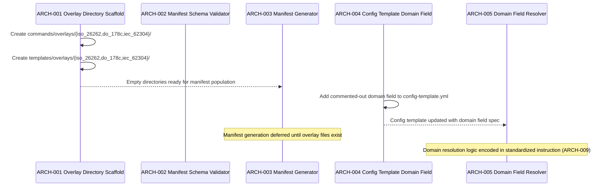
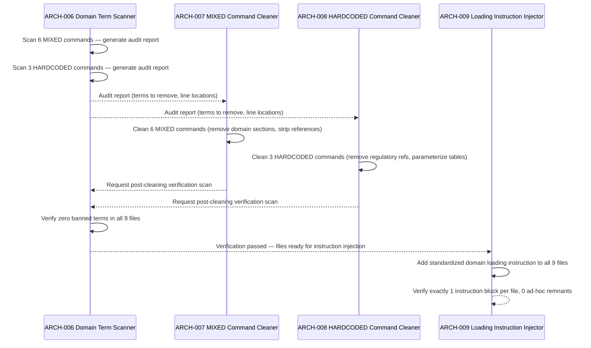
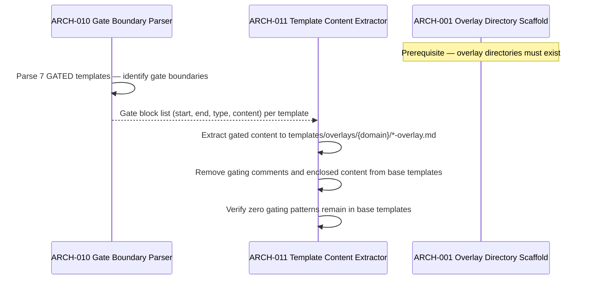
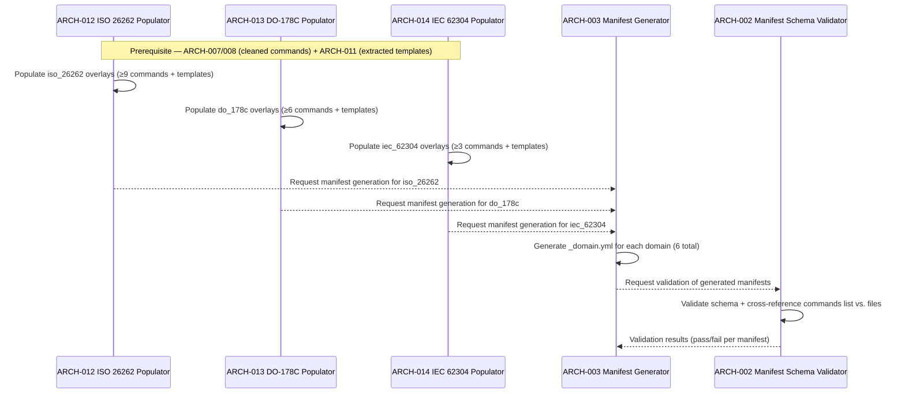
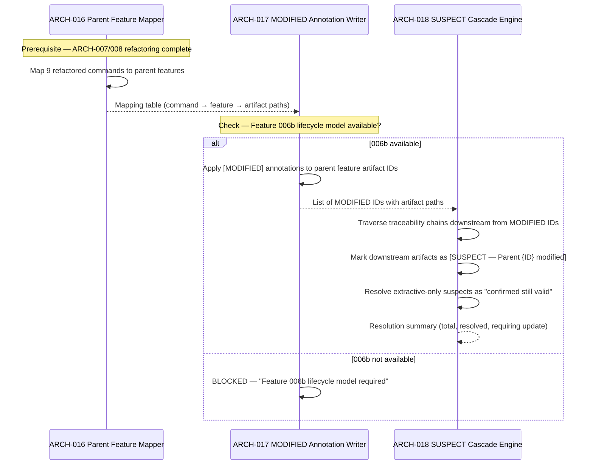

# Architecture Design: Domain Overlay Architecture

**Feature Branch**: `feature/006a-domain-overlay`
**Created**: 2025-07-19
**Status**: Draft
**Source**: `specs/006a-domain-overlay/v-model/system-design.md`

## Overview

This architecture decomposes the 9 system components of the Domain Overlay Architecture feature into 18 architecture modules organized by implementation boundary. The decomposition follows the feature's content-restructuring paradigm: all modules operate on Markdown files, YAML metadata, and directory structures — no runtime scripts are modified, no commands are added or removed. The modules are grouped into four implementation layers: (1) **Overlay Infrastructure** (ARCH-001 through ARCH-005) establishes the directory scaffold, manifest schema, and configuration gateway; (2) **Content Analysis & Cleaning** (ARCH-006 through ARCH-011) scans, refactors, and extracts domain-specific content from base files; (3) **Content Population** (ARCH-012 through ARCH-015) writes overlay files and updates extension metadata; (4) **Cross-Feature Lifecycle** (ARCH-016 through ARCH-018) coordinates parent feature evolution with MODIFIED/SUSPECT annotations. The Architecture combines SYS-001 and SYS-002 into a single scaffold module (ARCH-001) since both overlay directory hierarchies follow identical structure, while decomposing SYS-005 into four modules (scanner, two cleaners by contamination type, instruction injector) to separate the analysis step from the migration steps and to distinguish the different refactoring strategies required for MIXED vs. HARDCODED commands.

## ID Schema

- **Architecture Module**: `ARCH-NNN` — sequential identifier for each module
- **Parent System Components**: Comma-separated `SYS-NNN` list per module (many-to-many)
- **Cross-Cutting Tag**: `[CROSS-CUTTING]` for infrastructure/utility modules not traceable to a specific SYS
- Example: `ARCH-007` with Parent System Components `SYS-005` — MIXED Command Cleaner implements the refactoring for 6 MIXED commands
- Example: `ARCH-001` with Parent System Components `SYS-001, SYS-002` — single scaffold module serves both overlay directory hierarchies

## Logical View — Component Breakdown (IEEE 42010 / Kruchten 4+1)

| ARCH ID | Name | Description | Parent System Components | Type |
|---------|------|-------------|--------------------------|------|
| ARCH-001 | Overlay Directory Scaffold | Creates both `commands/overlays/` and `templates/overlays/` directory hierarchies with one subdirectory per supported domain (`iso_26262/`, `do_178c/`, `iec_62304/`). Implements a single creation pass since both command and template overlay hierarchies follow identical structure — only the root differs. Validates that all 3 domain subdirectories exist under both roots. Does NOT populate any files — only creates the empty directory structure. | SYS-001, SYS-002 | Component |
| ARCH-002 | Domain Manifest Schema Validator | Defines the required `_domain.yml` schema: `name` (string), `standards` (list of strings), `classification` (string), `commands` (list of strings). Validates a parsed YAML object against this schema, returning a list of missing or invalid fields. Cross-references the `commands` list against actual `.md` files in the same directory, reporting orphan entries (listed but no file) and unlisted files (file exists but not in manifest). | SYS-003 | Library |
| ARCH-003 | Domain Manifest Generator | Creates the 6 `_domain.yml` manifest files (one per domain under `commands/overlays/` and one per domain under `templates/overlays/`). Populates each with the domain's metadata: name ("ISO 26262" / "DO-178C" / "IEC 62304"), standards list, classification system ("ASIL" / "DAL" / "Safety Class"), and commands enumeration matching the overlay files present in the directory. Invokes ARCH-002 for validation after generation. | SYS-003 | Component |
| ARCH-004 | Config Template Domain Field | Adds the commented-out `domain` field to `config-template.yml` with inline YAML comments documenting: (1) the 3 supported values (`iso_26262`, `do_178c`, `iec_62304`), (2) the domain-agnostic default behavior when omitted or empty, (3) the single-value constraint (not a list). Modifies only `config-template.yml` — does not touch any user project files. | SYS-004 | Component |
| ARCH-005 | Domain Field Resolver | Reads the `domain` field from `v-model-config.yml` at the repository root and resolves it to one of four states: (1) supported domain ID → returns the ID string; (2) empty string → absent; (3) field not present → absent; (4) file not found → absent; (5) unsupported value → absent (graceful fallback, no error). When resolved as a supported domain, constructs the overlay paths: `commands/overlays/{domain}/` and `templates/overlays/{domain}/`. This is the logic encoded in the standardized domain loading instruction that every refactored command carries. | SYS-004 | Component |
| ARCH-006 | Domain Term Scanner | Scans a Markdown command file for banned domain-specific terms: ASIL, DAL, SIL, HIL, MC/DC, WCET, MISRA, CERT-C, "regulatory-grade", "Freedom from Interference", "ASIL Decomposition", "DO-178C", "ISO 26262", "ISO 14971", "IEC 62304", "FDA 21 CFR 820", "IEC 61508". Returns a report listing each match with its line number and surrounding context. Used both as a pre-refactoring audit tool and as a post-refactoring verification tool. | SYS-005 | Utility |
| ARCH-007 | MIXED Command Cleaner | Refactors the 6 MIXED base command files (`system-design.md`, `system-test.md`, `architecture-design.md`, `integration-test.md`, `module-design.md`, `unit-test.md`). For each file: removes domain-specific section headers and their content, replaces domain-specific table columns with domain-agnostic equivalents, strips domain-specific standard references from visible text while retaining universally applicable standards (IEEE 1016, ISO 29119, ISO 29119-4, IEEE 42010, INCOSE), and removes ad-hoc conditional patterns (`"If domain is set..."` + inline domain content). Uses ARCH-006 to verify zero banned terms remain after cleaning. | SYS-005 | Component |
| ARCH-008 | HARDCODED Command Cleaner | Refactors the 3 HARDCODED base command files (`trace.md`, `hazard-analysis.md`, `peer-review.md`). For each file: removes unconditional regulatory references from goal and constraint sections, replaces "regulatory-grade" with domain-agnostic language, replaces domain-specific severity tables with generic terminology, parameterizes the governing standard mapping table to list only domain-agnostic standards, and retains general-purpose analytical framing (e.g., FMEA for hazard-analysis). Uses ARCH-006 to verify zero banned terms remain. | SYS-005 | Component |
| ARCH-009 | Standardized Loading Instruction Injector | Adds the standardized domain loading instruction block to all 9 refactored command files (6 from ARCH-007 + 3 from ARCH-008). The instruction block directs the LLM to: (1) read `v-model-config.yml`; (2) check the `domain` field; (3) if a supported domain is found, read and append `commands/overlays/{domain}/{command-name}.md` after the base content. Replaces any remnant ad-hoc conditional patterns. Ensures exactly one instruction block per file. | SYS-005 | Component |
| ARCH-010 | Gate Boundary Parser | Parses HTML comment gates in the 7 GATED template files. Identifies the start and end boundaries of `<!-- SAFETY-CRITICAL SECTION -->`, `<!-- DOMAIN-SPECIFIC SCALES -->`, `<!-- SAFETY-CRITICAL TECHNIQUES -->`, and equivalent gating comment patterns. Returns a structured list of gate blocks: start line, end line, gate type, and the content between the boundaries. Handles nested comments and multi-section files. | SYS-006 | Utility |
| ARCH-011 | Template Content Extractor | Extracts the content identified by ARCH-010 from the 7 GATED base templates and writes it to the corresponding domain overlay template files under `templates/overlays/{domain}/` with the `-overlay.md` suffix. After extraction, removes the gating comments AND their enclosed content from the base templates, leaving genuinely clean files with no domain artifacts (not even HTML comments). Validates that no gating patterns remain in the cleaned base templates. | SYS-006 | Component |
| ARCH-012 | ISO 26262 Content Populator | Populates the `iso_26262` overlay set with domain-specific command and template overlay files. Creates at minimum 9 command overlays (system-design, system-test, architecture-design, integration-test, module-design, unit-test, trace, hazard-analysis, peer-review) and their corresponding template overlays. Content uses preference-based indirection ("prefer the domain's severity scale") rather than duplicating base command content. Sources content from ARCH-007/008 (extracted command content) and ARCH-011 (extracted template content). Updates the `_domain.yml` manifest via ARCH-003. | SYS-007 | Component |
| ARCH-013 | DO-178C Content Populator | Populates the `do_178c` overlay set with domain-specific command and template overlay files. Creates at minimum 6 command overlays (architecture-design, module-design, unit-test, trace, hazard-analysis, peer-review) and their corresponding template overlays. Content follows the same preference-based indirection pattern as ARCH-012. Sources content from ARCH-007/008 and ARCH-011. Updates the `_domain.yml` manifest via ARCH-003. | SYS-007 | Component |
| ARCH-014 | IEC 62304 Content Populator | Populates the `iec_62304` overlay set with domain-specific command and template overlay files. Creates at minimum 3 command overlays (hazard-analysis, trace, peer-review) and their corresponding template overlays. Content follows the same preference-based indirection pattern as ARCH-012 and ARCH-013. Sources content from ARCH-007/008 and ARCH-011. Updates the `_domain.yml` manifest via ARCH-003. | SYS-007 | Component |
| ARCH-015 | Extension Description Rewriter | Rewrites the 9 contaminated command descriptions in `extension.yml` to domain-agnostic language. For each description: replaces domain-specific standard names with generic purpose statements, removes "regulatory-grade" or "safety-compliant" qualifiers, and preserves the command's functional purpose (e.g., "Generate a system design document" not "Generate a safety-compliant system design document"). Retains the `safety-critical` tag without modification. Reads the refactored base commands (ARCH-007/008 output) to ensure description language aligns with cleaned content. | SYS-008 | Component |
| ARCH-016 | Parent Feature Mapper | Maps each refactored command to its parent feature ID using the fixed mapping: Feature 002 → system-design, system-test; Feature 003 → architecture-design, integration-test; Feature 004 → module-design, unit-test; Feature 001 → trace; Feature 005a → hazard-analysis; Feature 005c → peer-review. Returns a mapping table of command name → parent feature ID → affected V-Model artifact paths. Used by ARCH-017 to identify which artifacts to annotate. | SYS-009 | Utility |
| ARCH-017 | MODIFIED Annotation Writer | Applies `[MODIFIED — ...]` annotations to affected requirement and design IDs in parent feature V-Model artifacts identified by ARCH-016. Uses two annotation templates: `[MODIFIED — Domain-specific content extracted to overlay per Feature 006a]` for MIXED command parents, and `[MODIFIED — Unconditional domain-specific content removed from base and relocated to overlay per Feature 006a]` for HARDCODED command parents. Writes annotations inline in Markdown without changing the surrounding structure. Requires Feature 006b lifecycle model to be available; if unavailable, blocks and flags: "Feature 006b lifecycle model required for cross-feature evolution". | SYS-009 | Component |
| ARCH-018 | SUSPECT Cascade Engine | Traverses the traceability chain of each MODIFIED ID (from ARCH-017) and marks all downstream V-Model artifacts as `[SUSPECT — Parent {ID} modified]`. For extractive-only changes (functional intent unchanged), supports resolution as "confirmed still valid" without content changes. Handles the cascade recursively: a SUSPECT design ID triggers SUSPECT on its child test cases. Provides a resolution summary: count of SUSPECT items, count resolved, count requiring content update. | SYS-009 | Component |

## Process View — Dynamic Behavior (Kruchten 4+1)

### Interaction: Overlay Infrastructure Setup

**Concurrency Model**: Sequential, single-pass execution. ARCH-001 must complete before ARCH-003 can create manifests. ARCH-004 and ARCH-001 are independent and could execute in parallel. ARCH-005 is a specification (encoded in command instructions), not a runtime execution.

**Synchronization Points**: ARCH-001 completion gates ARCH-003 execution. No other ordering constraints in this layer.

### Interaction: Base Content Refactoring Pipeline

**Concurrency Model**: Sequential pipeline with parallel branches. ARCH-006 (scan) runs first to inform both ARCH-007 and ARCH-008. The two cleaners (ARCH-007, ARCH-008) are independent and could execute in parallel since they operate on disjoint file sets (6 MIXED vs. 3 HARDCODED). ARCH-009 runs last since it modifies files already cleaned by ARCH-007/008.

**Synchronization Points**: ARCH-006 gates ARCH-007 and ARCH-008. Both cleaners must complete before ARCH-009 executes. Post-cleaning verification (ARCH-006 re-invocation) gates ARCH-009.

### Interaction: Template Extraction Pipeline

**Concurrency Model**: Sequential two-stage pipeline. ARCH-010 (parse) must complete before ARCH-011 (extract) begins. Extraction across templates could be parallelized since each template is independent.

**Synchronization Points**: ARCH-010 completion gates ARCH-011. ARCH-001 (directory existence) is a prerequisite for ARCH-011 writes.

### Interaction: Overlay Content Population

**Concurrency Model**: The three populators (ARCH-012, ARCH-013, ARCH-014) are fully independent — they write to disjoint domain directories and can execute in parallel. Manifest generation (ARCH-003) must wait for all populators to finish so the `commands` list accurately reflects the populated files.

**Synchronization Points**: All three populators must complete before ARCH-003 generates manifests. ARCH-003 gates ARCH-002 validation.

### Interaction: Cross-Feature Lifecycle Coordination

**Concurrency Model**: Strictly sequential — each stage requires the output of the previous. ARCH-016 (mapping) feeds ARCH-017 (annotation), which feeds ARCH-018 (cascade). The 006b availability check is a hard gate.

**Synchronization Points**: ARCH-016 gates ARCH-017. ARCH-017 gates ARCH-018. Feature 006b implementation gates ARCH-017 execution.

## Interface View — API Contracts (Kruchten 4+1)

### ARCH-001: Overlay Directory Scaffold

| Direction | Name | Type | Format | Constraints |
|-----------|------|------|--------|-------------|
| Input | domain_ids | List of strings | `["iso_26262", "do_178c", "iec_62304"]` | Exactly 3 domain IDs, snake_case, no duplicates |
| Input | overlay_roots | List of paths | `["commands/overlays/", "templates/overlays/"]` | Exactly 2 root directories |
| Output | created_dirs | List of paths | Absolute directory paths | 6 directories total (3 domains × 2 roots) |
| Exception | dir_exists | Error | String | If a domain subdirectory already exists — idempotent (no error, report existing) |
| Exception | root_not_found | Error | String | If `commands/` or `templates/` root does not exist |

### ARCH-002: Domain Manifest Schema Validator

| Direction | Name | Type | Format | Constraints |
|-----------|------|------|--------|-------------|
| Input | manifest_content | YAML object | Parsed `_domain.yml` content | Must be valid YAML |
| Input | directory_files | List of strings | File names in the manifest's directory | `.md` files only, excluding `_domain.yml` |
| Output | validation_result | Object | `{valid: boolean, errors: string[]}` | Empty errors list when valid |
| Output | orphan_entries | List of strings | Commands in manifest but no file | May be empty |
| Output | unlisted_files | List of strings | Files in directory but not in manifest | May be empty |
| Exception | yaml_parse_error | Error | String | If manifest content is not valid YAML |

### ARCH-003: Domain Manifest Generator

| Direction | Name | Type | Format | Constraints |
|-----------|------|------|--------|-------------|
| Input | domain_id | String | snake_case domain ID | One of: `iso_26262`, `do_178c`, `iec_62304` |
| Input | domain_metadata | Object | `{name, standards, classification}` | All fields required |
| Input | overlay_files | List of strings | `.md` file names in the domain directory | At least 1 file |
| Output | manifest_file | File | `_domain.yml` at domain directory root | Valid against ARCH-002 schema |
| Exception | validation_failed | Error | String | If generated manifest fails ARCH-002 validation |

### ARCH-004: Config Template Domain Field

| Direction | Name | Type | Format | Constraints |
|-----------|------|------|--------|-------------|
| Input | config_template_path | Path | `config-template.yml` | File must exist |
| Output | updated_file | File | Modified `config-template.yml` | Contains commented-out `# domain:` field with documentation |
| Exception | file_not_found | Error | String | If `config-template.yml` does not exist |

### ARCH-005: Domain Field Resolver

| Direction | Name | Type | Format | Constraints |
|-----------|------|------|--------|-------------|
| Input | config_path | Path | `v-model-config.yml` | May not exist |
| Output | domain_id | String or null | snake_case domain ID or null | Null for absent/empty/unsupported |
| Output | overlay_paths | Object or null | `{commands: path, templates: path}` | Null when domain_id is null |
| Exception | — | — | — | No exceptions — all failure modes resolve to null (graceful fallback) |

### ARCH-006: Domain Term Scanner

| Direction | Name | Type | Format | Constraints |
|-----------|------|------|--------|-------------|
| Input | file_path | Path | Markdown file path | Must be readable |
| Input | banned_terms | List of strings | Term strings to scan for | Minimum 17 terms (the defined banned set) |
| Output | scan_report | List of objects | `[{term, line_number, context}]` | Empty list when clean |
| Output | is_clean | Boolean | `true` / `false` | `true` only when scan_report is empty |
| Exception | file_not_found | Error | String | If input file does not exist |

### ARCH-007: MIXED Command Cleaner

| Direction | Name | Type | Format | Constraints |
|-----------|------|------|--------|-------------|
| Input | command_paths | List of paths | 6 MIXED command file paths | All must exist and be writable |
| Input | scan_report | List of objects | From ARCH-006 | Identifies terms and locations to clean |
| Output | cleaned_files | List of paths | Modified Markdown files | Zero banned terms after cleaning |
| Output | diff_summary | Object | `{files_changed: N, lines_removed: N, lines_added: N}` | Non-negative counts |
| Exception | incomplete_cleaning | Error | String | If post-cleaning scan still finds banned terms |

### ARCH-008: HARDCODED Command Cleaner

| Direction | Name | Type | Format | Constraints |
|-----------|------|------|--------|-------------|
| Input | command_paths | List of paths | 3 HARDCODED command file paths | All must exist and be writable |
| Input | scan_report | List of objects | From ARCH-006 | Identifies terms and locations to clean |
| Output | cleaned_files | List of paths | Modified Markdown files | Zero banned terms after cleaning |
| Output | diff_summary | Object | `{files_changed: N, lines_removed: N, lines_added: N}` | Non-negative counts |
| Exception | incomplete_cleaning | Error | String | If post-cleaning scan still finds banned terms |

### ARCH-009: Standardized Loading Instruction Injector

| Direction | Name | Type | Format | Constraints |
|-----------|------|------|--------|-------------|
| Input | command_paths | List of paths | 9 refactored command file paths | All must exist and be writable |
| Input | instruction_template | String | Markdown instruction block text | References `commands/overlays/{domain}/{command-name}.md` |
| Output | injected_files | List of paths | Modified Markdown files | Exactly 1 instruction block per file |
| Output | remnant_check | Object | `{ad_hoc_patterns_found: N}` | Must be 0 |
| Exception | duplicate_injection | Error | String | If file already contains an instruction block — skip, do not duplicate |

### ARCH-010: Gate Boundary Parser

| Direction | Name | Type | Format | Constraints |
|-----------|------|------|--------|-------------|
| Input | template_path | Path | Markdown template file path | Must be readable |
| Output | gate_blocks | List of objects | `[{start_line, end_line, gate_type, content}]` | Empty list if no gates found |
| Output | gate_types_found | List of strings | Distinct gate pattern identifiers | Subset of known gate patterns |
| Exception | malformed_gate | Error | String | If opening gate comment has no matching close — report with line number |

### ARCH-011: Template Content Extractor

| Direction | Name | Type | Format | Constraints |
|-----------|------|------|--------|-------------|
| Input | template_path | Path | Source template file path | Must be writable |
| Input | gate_blocks | List of objects | From ARCH-010 | At least 1 gate block |
| Input | target_domains | List of strings | Domain IDs to receive extracted content | At least 1 domain |
| Output | overlay_files | List of paths | Created `-overlay.md` files | One per domain per template |
| Output | cleaned_template | Path | Modified base template | Zero gating patterns remaining |
| Exception | target_dir_missing | Error | String | If overlay directory does not exist — requires ARCH-001 first |

### ARCH-012: ISO 26262 Content Populator

| Direction | Name | Type | Format | Constraints |
|-----------|------|------|--------|-------------|
| Input | extracted_command_content | Map | Command name → domain-specific Markdown | From ARCH-007, ARCH-008 |
| Input | extracted_template_content | Map | Template name → domain-specific Markdown | From ARCH-011 |
| Output | overlay_files | List of paths | Files in `commands/overlays/iso_26262/` and `templates/overlays/iso_26262/` | ≥9 command overlays + corresponding template overlays |
| Output | file_count | Integer | Total overlay files created | Minimum 9 |
| Exception | content_missing | Error | String | If expected extracted content for a required command is unavailable |

### ARCH-013: DO-178C Content Populator

| Direction | Name | Type | Format | Constraints |
|-----------|------|------|--------|-------------|
| Input | extracted_command_content | Map | Command name → domain-specific Markdown | From ARCH-007, ARCH-008 |
| Input | extracted_template_content | Map | Template name → domain-specific Markdown | From ARCH-011 |
| Output | overlay_files | List of paths | Files in `commands/overlays/do_178c/` and `templates/overlays/do_178c/` | ≥6 command overlays + corresponding template overlays |
| Output | file_count | Integer | Total overlay files created | Minimum 6 |
| Exception | content_missing | Error | String | If expected extracted content for a required command is unavailable |

### ARCH-014: IEC 62304 Content Populator

| Direction | Name | Type | Format | Constraints |
|-----------|------|------|--------|-------------|
| Input | extracted_command_content | Map | Command name → domain-specific Markdown | From ARCH-007, ARCH-008 |
| Input | extracted_template_content | Map | Template name → domain-specific Markdown | From ARCH-011 |
| Output | overlay_files | List of paths | Files in `commands/overlays/iec_62304/` and `templates/overlays/iec_62304/` | ≥3 command overlays + corresponding template overlays |
| Output | file_count | Integer | Total overlay files created | Minimum 3 |
| Exception | content_missing | Error | String | If expected extracted content for a required command is unavailable |

### ARCH-015: Extension Description Rewriter

| Direction | Name | Type | Format | Constraints |
|-----------|------|------|--------|-------------|
| Input | extension_yml_path | Path | `extension.yml` | Must be readable and writable |
| Input | refactored_commands | List of paths | 9 refactored command files | For language alignment reference |
| Output | updated_file | Path | Modified `extension.yml` | 9 descriptions rewritten, `safety-critical` tag retained |
| Output | descriptions_changed | Integer | Count of descriptions rewritten | Expected: 9 |
| Exception | tag_removed | Error | String | If `safety-critical` tag was inadvertently removed during editing |

### ARCH-016: Parent Feature Mapper

| Direction | Name | Type | Format | Constraints |
|-----------|------|------|--------|-------------|
| Input | refactored_commands | List of strings | 9 command names | All must be in the fixed mapping |
| Output | mapping_table | List of objects | `[{command, feature_id, artifact_paths: []}]` | 9 entries, one per command |
| Exception | unmapped_command | Error | String | If a command is not in the fixed mapping — should never occur |

### ARCH-017: MODIFIED Annotation Writer

| Direction | Name | Type | Format | Constraints |
|-----------|------|------|--------|-------------|
| Input | mapping_table | List of objects | From ARCH-016 | At least 1 entry |
| Input | annotation_templates | Map | Contamination type → annotation string | 2 templates: MIXED, HARDCODED |
| Output | annotated_files | List of paths | Modified parent feature V-Model artifacts | At least 1 file per affected feature |
| Output | annotations_written | Integer | Count of IDs annotated | Non-negative |
| Exception | lifecycle_unavailable | Error | String | "Feature 006b lifecycle model required for cross-feature evolution" — hard block |

### ARCH-018: SUSPECT Cascade Engine

| Direction | Name | Type | Format | Constraints |
|-----------|------|------|--------|-------------|
| Input | modified_ids | List of objects | `[{id, artifact_path, annotation}]` | From ARCH-017 |
| Output | suspect_items | List of objects | `[{id, artifact_path, parent_id, annotation}]` | All downstream items marked |
| Output | resolution_summary | Object | `{total: N, resolved: N, requiring_update: N}` | resolved + requiring_update = total |
| Exception | traceability_gap | Error | String | If a MODIFIED ID has no downstream trace — report as potential traceability gap |

## Data Flow View — Data Transformation Chains (Kruchten 4+1)

### Data Flow: Base Command Refactoring Chain

| Stage | Module | Input Format | Transformation | Output Format |
|-------|--------|-------------|----------------|---------------|
| 1 | ARCH-006 | Markdown command file (contaminated) | Scan for banned domain terms, produce match report | Scan report: `[{term, line, context}]` |
| 2 | ARCH-007 | Markdown command file (MIXED) + scan report | Remove domain sections, strip references, replace with agnostic equivalents | Markdown command file (cleaned, no domain terms) |
| 3 | ARCH-008 | Markdown command file (HARDCODED) + scan report | Remove regulatory refs, parameterize tables, replace "regulatory-grade" | Markdown command file (cleaned, no domain terms) |
| 4 | ARCH-006 | Markdown command file (cleaned) | Post-cleaning verification scan | Scan report: empty list (zero banned terms) |
| 5 | ARCH-009 | Markdown command file (cleaned, verified) | Inject standardized domain loading instruction block | Markdown command file (cleaned + instruction block) |

### Data Flow: Template Extraction Chain

| Stage | Module | Input Format | Transformation | Output Format |
|-------|--------|-------------|----------------|---------------|
| 1 | ARCH-010 | Markdown template file (GATED) | Parse HTML comment gates, identify boundaries | Gate block list: `[{start, end, type, content}]` |
| 2 | ARCH-011 | Gate block list + base template + target domain IDs | Extract gated content to overlay files, remove gates from base | `-overlay.md` files (per domain) + cleaned base template |

### Data Flow: Overlay Population Chain

| Stage | Module | Input Format | Transformation | Output Format |
|-------|--------|-------------|----------------|---------------|
| 1 | ARCH-012/013/014 | Extracted command content + extracted template content (domain-specific Markdown) | Write domain overlay files with preference-based indirection | Overlay `.md` files in `commands/overlays/{domain}/` and `templates/overlays/{domain}/` |
| 2 | ARCH-003 | Overlay file list per domain + domain metadata | Generate manifest YAML with commands enumeration | `_domain.yml` per domain directory |
| 3 | ARCH-002 | Manifest YAML + directory file listing | Cross-reference commands list vs. actual files | Validation result: `{valid, errors, orphans, unlisted}` |

### Data Flow: Cross-Feature Lifecycle Chain

| Stage | Module | Input Format | Transformation | Output Format |
|-------|--------|-------------|----------------|---------------|
| 1 | ARCH-016 | List of 9 refactored command names | Map commands to parent feature IDs using fixed mapping | Mapping table: `[{command, feature_id, artifact_paths}]` |
| 2 | ARCH-017 | Mapping table + annotation templates | Apply `[MODIFIED — ...]` inline annotations to parent feature artifacts | Annotated Markdown files with MODIFIED IDs |
| 3 | ARCH-018 | List of MODIFIED IDs with traceability chains | Traverse downstream, mark as `[SUSPECT — Parent {ID} modified]` | Annotated Markdown files with SUSPECT IDs + resolution summary |

---

## Coverage Summary

| Metric | Count |
|--------|-------|
| Total Architecture Modules (ARCH) | 18 (18 active, 0 deprecated, 0 suspect) |
| Cross-Cutting Modules | 0 |
| Total Parent System Components Covered | 9 / 9 (100%) (active items only) |
| Modules per Type | Component: 14 \| Utility: 3 \| Library: 1 \| Service: 0 \| Adapter: 0 |
| Interface Contracts Defined | 18 / 18 (100%) |
| Mermaid Sequence Diagrams | 5 |
| **Forward Coverage (SYS→ARCH)** | **100%** (active items only) |

### System Component Coverage Matrix

| SYS ID | Covered by ARCH |
|--------|----------------|
| SYS-001 | ARCH-001 |
| SYS-002 | ARCH-001 |
| SYS-003 | ARCH-002, ARCH-003 |
| SYS-004 | ARCH-004, ARCH-005 |
| SYS-005 | ARCH-006, ARCH-007, ARCH-008, ARCH-009 |
| SYS-006 | ARCH-010, ARCH-011 |
| SYS-007 | ARCH-012, ARCH-013, ARCH-014 |
| SYS-008 | ARCH-015 |
| SYS-009 | ARCH-016, ARCH-017, ARCH-018 |

## Derived Modules

None — all modules trace to existing system components.
