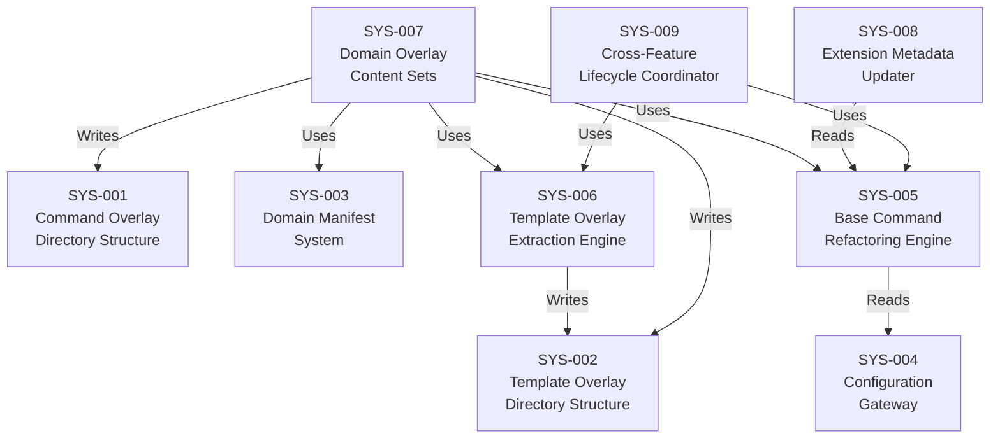

# System Design: Domain Overlay Architecture

**Feature Branch**: `feature/006a-domain-overlay`
**Created**: 2025-07-19
**Status**: Draft
**Source**: `specs/006a-domain-overlay/v-model/requirements.md`

## Overview

This system design decomposes the 33 requirements for the Domain Overlay Architecture feature into 9 system components organized around a file-based overlay mechanism that cleanly separates domain-agnostic base content from domain-specific enrichment layers. The architecture follows a content-restructuring paradigm: no scripts are modified, no commands are added or removed, and no runtime behavior changes. Instead, the system introduces a filesystem overlay structure (`commands/overlays/`, `templates/overlays/`) with domain manifests (`_domain.yml`), a configuration gateway (`domain` field in `v-model-config.yml`), and a standardized composition instruction that tells the LLM to append overlay content after base content when a domain is active. The 9 contaminated commands (6 MIXED, 3 HARDCODED) are refactored to clean base content, the 7 gated templates have their safety sections extracted to overlay files, and 3 complete domain overlay sets (`iso_26262`, `do_178c`, `iec_62304`) are populated with the extracted content. A cross-feature lifecycle coordination process ensures parent feature specifications (001–005) are evolved using the ID lifecycle model from Feature 006b. The decomposition separates the overlay infrastructure (SYS-001 through SYS-004) from the content migration work (SYS-005 through SYS-008) and the cross-feature evolution process (SYS-009).

## ID Schema

- **System Component**: `SYS-NNN` — sequential identifier for each component
- **Parent Requirements**: Comma-separated `REQ-NNN` list per component (many-to-many)
- Example: `SYS-005` with Parent Requirements `REQ-009, REQ-010, REQ-011, REQ-012, REQ-013` — component satisfies all five requirements

## Decomposition View (IEEE 1016 §5.1)

| SYS ID | Name | Description | Parent Requirements | Type |
|--------|------|-------------|---------------------|------|
| SYS-001 | Command Overlay Directory Structure | Filesystem component that provides the `commands/overlays/` directory hierarchy. Each supported domain has a subdirectory named with its domain ID (snake_case) containing command overlay `.md` files. Each overlay file is named identically to its corresponding base command file (e.g., `commands/overlays/iso_26262/system-design.md` enriches `commands/system-design.md`). The directory structure is the primary organizational mechanism — no registry or database is needed because the filesystem IS the registry: the presence of an overlay file at the expected path is sufficient for the composition engine to discover and apply it. | REQ-001, REQ-NF-002 | Subsystem |
| SYS-002 | Template Overlay Directory Structure | Filesystem component that provides the `templates/overlays/` directory hierarchy, symmetric to SYS-001. Each supported domain has a subdirectory containing template overlay files named with the `-overlay.md` suffix (e.g., `templates/overlays/iso_26262/system-design-overlay.md` enriches `templates/system-design-template.md`). The `-overlay` suffix distinguishes overlay templates from base templates, preventing accidental replacement. This component completes the separation of domain-specific output structure from base templates. | REQ-002, REQ-NF-002 | Subsystem |
| SYS-003 | Domain Manifest System | Metadata component that provides `_domain.yml` manifest files in each domain overlay directory (under both `commands/overlays/` and `templates/overlays/`). Each manifest declares: `name` (human-readable display name, e.g., "ISO 26262"), `standards` (list of governing standard identifiers), `classification` (the domain's safety classification system name, e.g., "ASIL", "DAL", "Safety Class"), and `commands` (enumeration of command names that have overlay content in this domain). The manifest enables tooling to validate overlay completeness (every listed command has a corresponding file; every file is listed), display domain metadata to users, and enumerate available overlays without scanning the filesystem. The underscore prefix (`_domain.yml`) distinguishes the manifest from overlay content files. | REQ-003, REQ-NF-002 | Module |
| SYS-004 | Configuration Gateway | Configuration component that adds the `domain` field to `config-template.yml` and defines the single-field activation mechanism. The field is commented-out by default with inline documentation listing supported values (`iso_26262`, `do_178c`, `iec_62304`) and the domain-agnostic default behavior (omit or leave empty). This component is the single point of configuration: setting `domain: iso_26262` activates all ISO 26262 overlays across every command and template; leaving it empty or absent produces the zero-config domain-agnostic experience. The field accepts exactly one value (not a list) — only one domain can be active at a time. There is no auto-detection; the user must manually set this field. | REQ-004, REQ-007, REQ-008, REQ-CN-003, REQ-CN-004 | Module |
| SYS-005 | Base Command Refactoring Engine | Content migration component responsible for cleaning all 9 contaminated base command files. For the 6 MIXED commands (`system-design.md`, `system-test.md`, `architecture-design.md`, `integration-test.md`, `module-design.md`, `unit-test.md`): extracts all safety-standard references, domain-specific section headers, and domain-specific table columns, replacing them with domain-agnostic equivalents or removing them entirely. For the 3 HARDCODED commands (`trace.md`, `hazard-analysis.md`, `peer-review.md`): removes unconditional regulatory references, replaces "regulatory-grade" with domain-agnostic language, retains general-purpose framing (e.g., FMEA for hazard-analysis), and parameterizes governing standard tables. After refactoring, every base command references only universally applicable standards (IEEE 1016, ISO 29119, ISO 29119-4, IEEE 42010, INCOSE) and contains none of the banned domain-specific terms (ASIL, DAL, SIL, HIL, MC/DC, WCET, MISRA, CERT-C, "regulatory-grade"). Each refactored command also gains the standardized domain loading instruction block that replaces any existing ad-hoc conditional patterns. | REQ-009, REQ-010, REQ-011, REQ-012, REQ-013, REQ-020, REQ-CN-001, REQ-CN-002 | Subsystem |
| SYS-006 | Template Overlay Extraction Engine | Content migration component responsible for extracting domain-specific content from the 7 GATED base templates into overlay template files. Each template's `<!-- SAFETY-CRITICAL SECTION -->` (or equivalent HTML comment gate) content is moved to the corresponding domain overlay template file in `templates/overlays/{domain}/`. After extraction, the base templates contain no commented-out safety sections — they are genuinely clean with no domain artifacts, not even as HTML comments. The existing gating pattern serves as the migration guide: every gated block maps to an overlay file. The extraction preserves the exact content that was inside the gates, placing it in overlay files that follow the `-overlay.md` naming convention. | REQ-014, REQ-CN-001 | Subsystem |
| SYS-007 | Domain Overlay Content Sets | Content component providing the three complete domain overlay file sets. Each set contains command and template overlay files populated with the domain-specific content extracted from base commands (SYS-005) and base templates (SYS-006). The `iso_26262` overlay set covers at minimum 9 commands (system-design, system-test, architecture-design, integration-test, module-design, unit-test, trace, hazard-analysis, peer-review) and their corresponding templates. The `do_178c` overlay set covers at minimum 6 commands (architecture-design, module-design, unit-test, trace, hazard-analysis, peer-review). The `iec_62304` overlay set covers at minimum 3 commands (hazard-analysis, trace, peer-review). Overlay content uses preference-based indirection (e.g., "prefer the domain's severity scale over the general-purpose scale") rather than duplicating base command content, keeping overlays focused on domain-specific additions. | REQ-005, REQ-006, REQ-017, REQ-018, REQ-019, REQ-021, REQ-CN-005 | Subsystem |
| SYS-008 | Extension Metadata Updater | Metadata component responsible for updating the 9 command descriptions in `extension.yml` that currently reference safety standards unconditionally. Each description is rewritten to use domain-agnostic language while preserving the command's functional purpose. The `safety-critical` tag is retained without modification (it describes the extension's capability, not a hardcoded domain requirement). This ensures the Copilot UI displays generic, welcoming descriptions regardless of the user's domain. | REQ-015, REQ-016 | Module |
| SYS-009 | Cross-Feature Lifecycle Coordinator | Process component that coordinates the evolution of parent feature specifications (Features 001–005) whose commands are modified by this feature. For each refactored command, the coordinator identifies the parent feature that originally specified the command's content, marks the affected requirement and design IDs as `[MODIFIED — Domain-specific content extracted to overlay per Feature 006a]` (for MIXED commands) or `[MODIFIED — Unconditional domain-specific content removed from base and relocated to overlay per Feature 006a]` (for HARDCODED commands). After marking, all downstream V-Model artifacts that trace to the MODIFIED IDs are marked SUSPECT and resolved through re-running the corresponding V-Model commands with human review. When a modification is purely extractive (functional intent unchanged), SUSPECT downstream items may be resolved by confirming them as still valid without content changes. This component depends on Feature 006b's lifecycle model being available. Parent feature mapping: Feature 002 → system-design, system-test; Feature 003 → architecture-design, integration-test; Feature 004 → module-design, unit-test; Feature 001 → trace; Feature 005a → hazard-analysis; Feature 005c → peer-review. | REQ-LC-001, REQ-LC-002, REQ-LC-003, REQ-LC-004, REQ-LC-005 | Subsystem |

## Dependency View (IEEE 1016 §5.2)

| Source | Target | Relationship | Failure Impact |
|--------|--------|-------------|----------------|
| SYS-005 | SYS-004 | Reads | Base Command Refactoring Engine reads the `domain` field configuration spec from SYS-004 to implement the standardized domain loading instruction block; without the config gateway definition, the loading instruction cannot reference the correct field name and values. |
| SYS-006 | SYS-002 | Writes | Template Overlay Extraction Engine writes extracted gated content to the template overlay directories managed by SYS-002; if the directory structure does not exist, extraction has no target location. |
| SYS-007 | SYS-001 | Writes | Domain Overlay Content Sets are written into the command overlay directories managed by SYS-001; if the directory structure does not exist, overlay files have no target location. |
| SYS-007 | SYS-002 | Writes | Domain Overlay Content Sets are written into the template overlay directories managed by SYS-002; if the directory structure does not exist, overlay template files have no target location. |
| SYS-007 | SYS-005 | Uses | Domain Overlay Content Sets are populated with the domain-specific content extracted FROM base commands by SYS-005; the extraction must complete before overlay files can be populated. |
| SYS-007 | SYS-006 | Uses | Domain Overlay Content Sets are populated with the domain-specific content extracted FROM base templates by SYS-006; the extraction must complete before overlay template files can be populated. |
| SYS-007 | SYS-003 | Uses | Domain Overlay Content Sets require the `_domain.yml` manifests from SYS-003 to declare which overlay files are present; manifests must be created alongside or after overlay files. |
| SYS-008 | SYS-005 | Reads | Extension Metadata Updater reads the refactored base commands to ensure description language aligns with the cleaned base content; descriptions should describe the domain-agnostic base behavior. |
| SYS-009 | SYS-005 | Uses | Cross-Feature Lifecycle Coordinator identifies which parent feature specs to evolve based on which commands SYS-005 refactored; cannot determine affected features without knowing the refactoring scope. |
| SYS-009 | SYS-006 | Uses | Cross-Feature Lifecycle Coordinator also tracks template changes that may affect parent feature specs; template extraction informs which design-level IDs need MODIFIED annotations. |

### Dependency Diagram

## Interface View (IEEE 1016 §5.3)

### External Interfaces

| Component | Interface Name | Protocol | Input | Output | Error Handling |
|-----------|---------------|----------|-------|--------|----------------|
| SYS-004 | Domain Configuration | YAML file (`v-model-config.yml`) | User sets `domain: {domain_id}` in YAML file, or omits/empties the field | All overlay-capable commands read this field to determine whether to load overlay content | If `domain` value is not one of the supported IDs (`iso_26262`, `do_178c`, `iec_62304`), the overlay path resolution fails gracefully (no overlay found → base content used) |
| SYS-005 | Command Composition | Copilot Extension command invocation | User invokes any of the 14 V-Model commands (e.g., `/speckit.v-model.system-design`) | The standardized domain loading instruction directs the LLM to read `v-model-config.yml`, check `domain`, and append overlay content if found at `commands/overlays/{domain}/{command-name}.md` | Missing overlay → base content only (graceful fallback, no error); missing config file → domain-agnostic mode |
| SYS-007 | Overlay Content Discovery | File system path resolution | LLM follows the standardized instruction to look for `commands/overlays/{domain}/{command-name}.md` and `templates/overlays/{domain}/{template-name}-overlay.md` | Overlay file content (Markdown) appended after base content | File not found → graceful fallback (base content only, no error or warning) |

### Internal Interfaces

| Source | Target | Interface Name | Protocol | Data Format | Error Handling |
|--------|--------|---------------|----------|-------------|----------------|
| SYS-005 | SYS-007 | Extracted Command Content | File migration | Domain-specific Markdown content extracted from base commands, placed into overlay `.md` files per domain | Content extraction failures result in incomplete overlay files; validated by comparing base before/after with overlay content |
| SYS-006 | SYS-007 | Extracted Template Content | File migration | Domain-specific Markdown content from `<!-- SAFETY-CRITICAL SECTION -->` gates, placed into `-overlay.md` files per domain | Gating comment boundaries must be correctly identified; misidentification results in incomplete extraction |
| SYS-003 | SYS-007 | Manifest Validation | YAML file cross-reference | `_domain.yml` `commands` list cross-referenced against actual overlay files in the directory | Mismatch between manifest and filesystem indicates incomplete overlay set |
| SYS-005 | SYS-009 | Refactoring Change Report | Process handoff | List of commands refactored, mapped to parent feature IDs (e.g., "system-design.md → Feature 002") | If parent feature mapping is incorrect, wrong feature specs are evolved |
| SYS-009 | External | Lifecycle Annotations | Markdown annotations in parent feature V-Model artifacts | `[MODIFIED — ...]` and `[SUSPECT — ...]` inline annotations per Feature 006b lifecycle model | Requires Feature 006b lifecycle model to be available; if unavailable, lifecycle evolution is blocked |

## Data Design View (IEEE 1016 §5.4)

| Entity | Component | Storage | Protection at Rest | Protection in Transit | Retention |
|--------|-----------|---------|-------------------|-----------------------|-----------|
| Command Overlay Files | SYS-001, SYS-007 | File system (`commands/overlays/{domain}/*.md`) | Git repository access controls | N/A (local files) | Permanent — versioned in Git; content changes tracked via git history |
| Template Overlay Files | SYS-002, SYS-007 | File system (`templates/overlays/{domain}/*-overlay.md`) | Git repository access controls | N/A (local files) | Permanent — versioned in Git |
| Domain Manifests | SYS-003 | File system (`commands/overlays/{domain}/_domain.yml`, `templates/overlays/{domain}/_domain.yml`) | Git repository access controls | N/A (local files) | Permanent — versioned in Git; updated when overlay files are added or removed |
| Config Template | SYS-004 | File system (`config-template.yml`) | Git repository access controls | N/A (local files) | Permanent — versioned in Git; users copy and customize for their projects |
| User Domain Config | SYS-004 | File system (`v-model-config.yml` in user's project) | User's repository access controls | N/A (local files) | User-managed; not part of the extension repository |
| Refactored Base Commands | SYS-005 | File system (`commands/*.md`) | Git repository access controls | N/A (local files) | Permanent — the `git diff` between v0.5.0 and v0.6.0 documents every extraction |
| Refactored Base Templates | SYS-006 | File system (`templates/*-template.md`) | Git repository access controls | N/A (local files) | Permanent — gating comments removed; content moved to overlays |
| Extension Metadata | SYS-008 | File system (`extension.yml`) | Git repository access controls | N/A (local files) | Permanent — description changes versioned in Git |
| Lifecycle Annotations | SYS-009 | Inline Markdown annotations in parent feature V-Model artifacts | Git repository access controls | N/A (local files) | Permanent until resolved — MODIFIED persists as historical marker; SUSPECT is resolved and removed after review |

---

## Coverage Summary

| Metric | Count |
|--------|-------|
| Total System Components (SYS) | 9 (9 active, 0 deprecated, 0 suspect) |
| Total Parent Requirements Covered | 33 / 33 (100%) |
| Components per Type | Subsystem: 5 \| Module: 3 \| Service: 0 \| Library: 0 \| Utility: 0 |
| **Forward Coverage (REQ→SYS)** | **100%** (active items only) |

### Requirement Coverage Matrix

| REQ ID | Covered by SYS |
|--------|----------------|
| REQ-001 | SYS-001 |
| REQ-002 | SYS-002 |
| REQ-003 | SYS-003 |
| REQ-004 | SYS-004 |
| REQ-005 | SYS-007 |
| REQ-006 | SYS-007 |
| REQ-007 | SYS-004 |
| REQ-008 | SYS-004 |
| REQ-009 | SYS-005 |
| REQ-010 | SYS-005 |
| REQ-011 | SYS-005 |
| REQ-012 | SYS-005 |
| REQ-013 | SYS-005 |
| REQ-014 | SYS-006 |
| REQ-015 | SYS-008 |
| REQ-016 | SYS-008 |
| REQ-017 | SYS-007 |
| REQ-018 | SYS-007 |
| REQ-019 | SYS-007 |
| REQ-020 | SYS-005 |
| REQ-021 | SYS-007 |
| REQ-LC-001 | SYS-009 |
| REQ-LC-002 | SYS-009 |
| REQ-LC-003 | SYS-009 |
| REQ-LC-004 | SYS-009 |
| REQ-LC-005 | SYS-009 |
| REQ-NF-001 | SYS-004, SYS-005, SYS-007 |
| REQ-NF-002 | SYS-001, SYS-002, SYS-003 |
| REQ-CN-001 | SYS-005, SYS-006 |
| REQ-CN-002 | SYS-005 |
| REQ-CN-003 | SYS-004 |
| REQ-CN-004 | SYS-004 |
| REQ-CN-005 | SYS-007 |

## Derived Requirements

None — all components trace to existing requirements.

## Glossary

| Term | Definition |
|------|-----------|
| Base content | The domain-agnostic command or template file used regardless of domain configuration |
| Overlay | A domain-specific file appended after base content when the corresponding domain is active |
| Domain ID | A snake_case identifier (e.g., `iso_26262`) used consistently across directories, manifests, and configuration |
| Additive composition | The principle that overlay content is appended after base content, never replacing it |
| Graceful fallback | Missing overlay → base content used without error or warning |
| MIXED command | A command with domain conditional checks that still leaks domain terms in visible text |
| HARDCODED command | A command that unconditionally references domain-specific standards |
| GATED template | A template with domain content enclosed in HTML comment markers |
| Preference-based indirection | Overlay instruction pattern saying "prefer domain content over base" rather than duplicating base |
| Standardized domain loading instruction | The uniform instruction block added to all overlay-capable commands, replacing ad-hoc conditionals |
| Cross-feature lifecycle evolution | The process of marking parent feature IDs as MODIFIED and cascading SUSPECT to downstream artifacts per Feature 006b |
