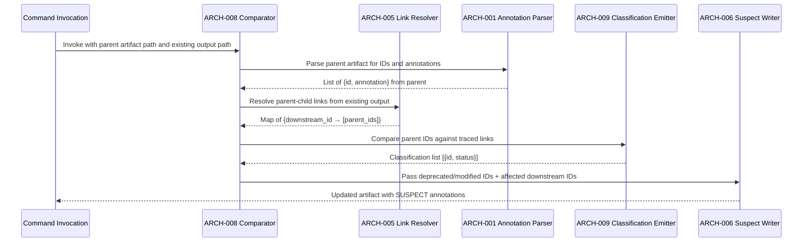
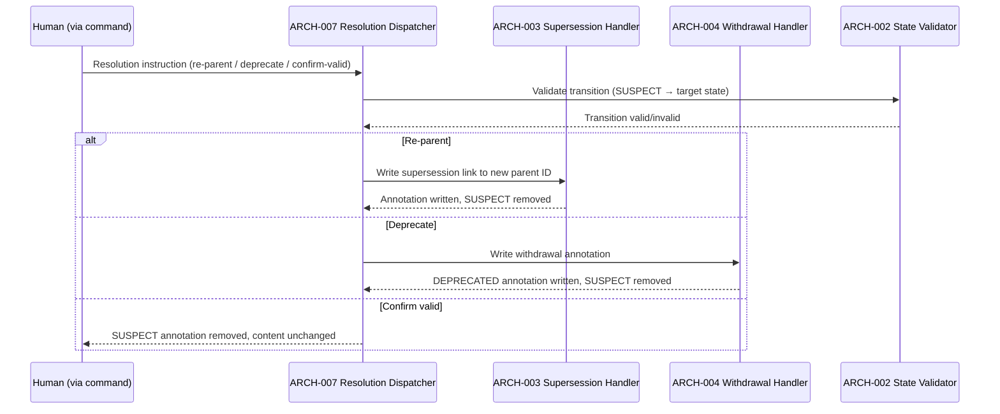
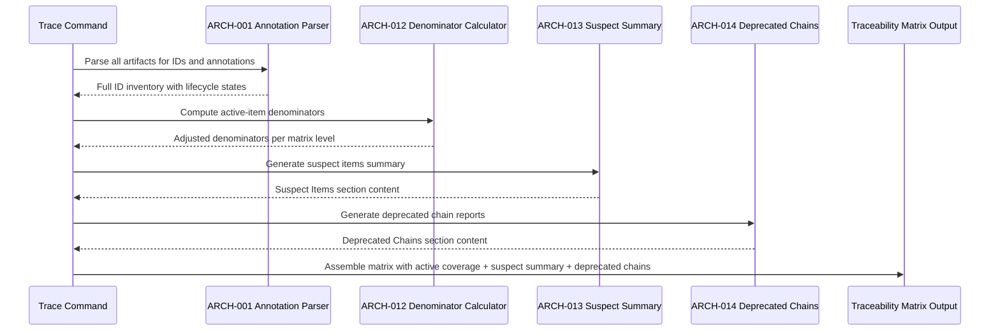
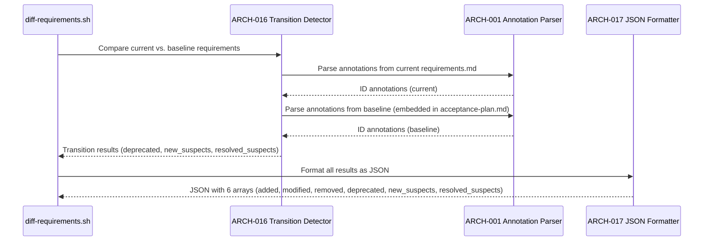

# Architecture Design: 006b — ID Lifecycle Model

**Feature Branch**: `feature/006b-id-lifecycle`
**Created**: 2026-04-18
**Status**: Draft
**Source**: `specs/006b-id-lifecycle/v-model/system-design.md`

## Overview

The architecture decomposes 9 system components into 17 software modules organized across three tiers. The **core annotation tier** (ARCH-001 through ARCH-004) handles parsing, validating, and writing lifecycle annotations in Markdown text. The **engine tier** (ARCH-005 through ARCH-011) implements change detection, suspect cascade, resolution dispatching, and command file injection. The **reporting tier** (ARCH-012 through ARCH-017) extends the trace, impact-analysis, and diff commands with lifecycle awareness. All modules operate on Markdown artifact files — there is no runtime service, database, or external state store.

## ID Schema

- **Architecture Module**: `ARCH-NNN` — sequential identifier for each module
- **Parent System Components**: Comma-separated `SYS-NNN` list per module (many-to-many)
- Example: `ARCH-008` with Parent System Components `SYS-005` — module implements the parent artifact comparator within the Change Detection Engine

## Logical View — Component Breakdown (IEEE 42010 / Kruchten 4+1)

| ARCH ID | Name | Description | Parent System Components | Type |
|---------|------|-------------|--------------------------|------|
| ARCH-001 | Annotation Syntax Parser | Parses lifecycle annotations from Markdown text using regex patterns. Recognizes four annotation forms: `[DEPRECATED — Superseded by ...]`, `[DEPRECATED — Withdrawn: ...]`, `[SUSPECT — Parent ... deprecated]`, `[SUSPECT — Parent ... modified]`. Returns structured annotation objects with type, target/reason, and parent reference. IDs without annotations are classified as ACTIVE. | SYS-001 | Component |
| ARCH-002 | State Transition Validator | Enforces valid state transitions: ACTIVE→DEPRECATED, ACTIVE→SUSPECT, SUSPECT→ACTIVE (confirm valid), SUSPECT→DEPRECATED, MODIFIED→SUSPECT (on downstream). Rejects invalid transitions (e.g., DEPRECATED→ACTIVE, SUSPECT→MODIFIED). Reports validation errors for malformed annotations (missing successor ID, empty withdrawal reason). | SYS-001 | Component |
| ARCH-003 | Supersession Annotation Handler | Writes and parses `[DEPRECATED — Superseded by {PREFIX}-NNN]` annotations. On write: validates that the successor ID exists in the artifact and uses the em dash (U+2014) separator. On parse: extracts the successor ID and validates it matches the expected prefix pattern. | SYS-002 | Component |
| ARCH-004 | Withdrawal Annotation Handler | Writes and parses `[DEPRECATED — Withdrawn: {reason}]` annotations. On write: validates that the reason string is non-empty. On parse: extracts the full reason string preserving whitespace and punctuation. | SYS-002 | Component |
| ARCH-005 | Parent-Child Link Resolver | Reads an existing downstream artifact and extracts parent ID references (e.g., "Linked Requirement: REQ-003" in acceptance-plan.md, "Parent Requirements: REQ-001, REQ-005" in system-design.md). Builds a mapping of each downstream ID to its traced parent IDs. | SYS-003 | Component |
| ARCH-006 | Suspect Annotation Writer | Receives a list of downstream IDs that need suspect marking (from ARCH-009 classification + ARCH-005 resolution). Writes `[SUSPECT — Parent {ID} deprecated]` or `[SUSPECT — Parent {ID} modified]` inline in the downstream artifact. Preserves existing content and other annotations. | SYS-003 | Component |
| ARCH-007 | Resolution Dispatcher | Routes suspect resolution instructions to the correct handler: (a) re-parent → updates the parent link to the successor ID and removes SUSPECT annotation, (b) deprecate → delegates to ARCH-003 or ARCH-004 to write a DEPRECATED annotation replacing the SUSPECT annotation, (c) confirm-valid → removes the SUSPECT annotation with no content change. Enforces that resolution is never automated — requires explicit human instruction. | SYS-004 | Component |
| ARCH-008 | Parent Artifact Comparator | Performs the 4-step comparison: (1) reads the parent artifact, (2) reads the command's existing output via ARCH-005, (3) compares parent IDs and their content against traced parent links, (4) emits a classification list via ARCH-009. Operates within the LLM command flow — no external script for non-acceptance commands. | SYS-005 | Component |
| ARCH-009 | ID Classification Emitter | Produces a structured classification result: a list of `{id, status}` objects where status is one of `unchanged`, `modified`, `deprecated`, or `added`. This output is consumed by ARCH-006 (Suspect Annotation Writer) to determine which downstream IDs need SUSPECT marking. In forward development (no existing output), classifies all parent IDs as `added`. | SYS-005 | Component |
| ARCH-010 | Section Template Generator | Generates the standardized Lifecycle Rules section text. Accepts a single parameter: the ID prefix (REQ, ATP, SYS, STP, ARCH, ITP, MOD, UTP, HAZ). Outputs the section text with 5 subsections (never-delete rule, deprecation types, suspect detection, suspect resolution, modified-item handling) using the provided prefix. | SYS-006 | Component |
| ARCH-011 | Command File Inserter | Reads an existing command Markdown file, locates the insertion point between "Load existing artifact" and "Generate new content" steps, and inserts the Lifecycle Rules section generated by ARCH-010. Validates that the command file has the expected step structure before insertion. Does not create or delete files. | SYS-006 | Utility |
| ARCH-012 | Coverage Denominator Calculator | Reads all artifact IDs and their lifecycle states (via ARCH-001). Computes the active-item count by excluding DEPRECATED IDs from the denominator. Returns the adjusted denominator for each coverage matrix (REQ→ATP, SYS→STP, ARCH→ITP, MOD→UTP). | SYS-007 | Component |
| ARCH-013 | Suspect Summary Generator | Scans all V-Model artifacts for SUSPECT annotations (via ARCH-001). Generates a dedicated "Suspect Items" section listing each suspect ID, its artifact location, and the parent change reason extracted from the annotation. | SYS-007 | Component |
| ARCH-014 | Deprecated Chain Reporter | Reads all DEPRECATED annotations across artifacts (via ARCH-001 and ARCH-003). Builds deprecation lineage: for supersessions, links deprecated ID → successor ID; for withdrawals, records the reason. Generates a "Deprecated Chains" section separate from active coverage matrices. | SYS-007 | Component |
| ARCH-015 | Formal Tag Emitter | Reads lifecycle states from artifacts (via ARCH-001). Replaces informal suspect reporting in impact-analysis output with formal tags: `[DEPRECATED]`, `[MODIFIED]`, `[SUSPECT]`. Emits no tags for ACTIVE items. | SYS-008 | Component |
| ARCH-016 | Lifecycle Transition Detector | Extends diff-requirements.sh to compare the current requirements.md against the baseline snapshot embedded in acceptance-plan.md. Detects three new transition types: new deprecations (IDs that gained DEPRECATED annotation), new suspects (IDs that gained SUSPECT annotation), and resolved suspects (IDs that lost SUSPECT annotation). | SYS-009 | Component |
| ARCH-017 | Extended JSON Formatter | Formats the output of diff-requirements.sh as a JSON object with 6 arrays: `added`, `modified`, `removed` (existing fields) plus `deprecated`, `new_suspects`, `resolved_suspects` (new lifecycle fields). Ensures backward compatibility — existing consumers that read only the first 3 fields continue to work. | SYS-009 | Utility |

## Process View — Dynamic Behavior (Kruchten 4+1)

### Interaction 1: Change Detection and Suspect Cascade

**Concurrency Model**: Sequential — all steps execute within a single LLM command invocation. No parallelism or thread boundaries.

### Interaction 2: Suspect Resolution

**Concurrency Model**: Sequential — resolution is a single command invocation with human instruction.

### Interaction 3: Lifecycle-Aware Trace Report Generation

**Concurrency Model**: Sequential — the trace command (or build-matrix.sh) processes artifacts in order.

### Interaction 4: Extended Diff Script Execution

**Concurrency Model**: Sequential — shell script executes synchronously.

## Interface View — API Contracts (Kruchten 4+1)

### ARCH-001: Annotation Syntax Parser

| Direction | Name | Type | Format | Constraints |
|-----------|------|------|--------|-------------|
| Input | artifact_text | String | Raw Markdown text of a V-Model artifact | Required; must be valid UTF-8 |
| Output | annotations | List | `[{id: String, state: Enum, type?: String, target?: String, reason?: String}]` | state ∈ {ACTIVE, DEPRECATED, SUSPECT}; ACTIVE items have no annotation fields |
| Exception | MalformedAnnotation | Error | `{id: String, raw_text: String, issue: String}` | Raised when annotation matches partial pattern but is syntactically invalid |

### ARCH-002: State Transition Validator

| Direction | Name | Type | Format | Constraints |
|-----------|------|------|--------|-------------|
| Input | current_state | Enum | `ACTIVE \| DEPRECATED \| SUSPECT` | Required |
| Input | target_state | Enum | `ACTIVE \| DEPRECATED \| SUSPECT` | Required |
| Output | valid | Boolean | `true \| false` | true if transition is allowed |
| Exception | InvalidTransition | Error | `{from: Enum, to: Enum, reason: String}` | Raised on forbidden transitions (e.g., DEPRECATED→ACTIVE) |

### ARCH-003: Supersession Annotation Handler

| Direction | Name | Type | Format | Constraints |
|-----------|------|------|--------|-------------|
| Input | id | String | ID being deprecated (e.g., "REQ-005") | Required; must match `{PREFIX}-NNN` pattern |
| Input | successor_id | String | Successor ID (e.g., "REQ-012") | Required; must match `{PREFIX}-NNN` pattern |
| Output | annotation_text | String | `[DEPRECATED — Superseded by {successor_id}]` | Uses em dash U+2014 |
| Exception | MissingSuccessor | Error | `{id: String, issue: "successor_id is required"}` | Raised when successor_id is empty or null |

### ARCH-004: Withdrawal Annotation Handler

| Direction | Name | Type | Format | Constraints |
|-----------|------|------|--------|-------------|
| Input | id | String | ID being deprecated (e.g., "REQ-007") | Required; must match `{PREFIX}-NNN` pattern |
| Input | reason | String | Withdrawal reason | Required; must be non-empty after trimming |
| Output | annotation_text | String | `[DEPRECATED — Withdrawn: {reason}]` | Uses em dash U+2014 |
| Exception | MissingReason | Error | `{id: String, issue: "reason is required"}` | Raised when reason is empty or whitespace-only |

### ARCH-005: Parent-Child Link Resolver

| Direction | Name | Type | Format | Constraints |
|-----------|------|------|--------|-------------|
| Input | artifact_text | String | Raw Markdown text of a downstream artifact | Required |
| Input | link_patterns | List | Regex patterns for parent references (e.g., `Linked Requirement: (REQ-\d+)`) | At least one pattern required |
| Output | link_map | Map | `{downstream_id: [parent_id, ...]}` | Every downstream ID maps to ≥1 parent |
| Exception | NoLinksFound | Warning | `{artifact: String, issue: "no parent links detected"}` | Warning (not error) — may indicate first-time generation |

### ARCH-006: Suspect Annotation Writer

| Direction | Name | Type | Format | Constraints |
|-----------|------|------|--------|-------------|
| Input | artifact_text | String | Raw Markdown text of downstream artifact | Required |
| Input | suspect_items | List | `[{downstream_id: String, parent_id: String, reason: "deprecated" \| "modified"}]` | May be empty (no cascade needed) |
| Output | updated_text | String | Artifact text with SUSPECT annotations inserted inline | Preserves all existing content and annotations |
| Exception | IDNotFound | Error | `{downstream_id: String, issue: "ID not found in artifact"}` | Raised when downstream_id cannot be located in the artifact |

### ARCH-007: Resolution Dispatcher

| Direction | Name | Type | Format | Constraints |
|-----------|------|------|--------|-------------|
| Input | resolution | Object | `{id: String, action: "re-parent" \| "deprecate" \| "confirm-valid", successor_id?: String, reason?: String}` | action required; successor_id required for re-parent; reason required for deprecate |
| Output | updated_text | String | Artifact text with resolution applied | SUSPECT annotation removed; new annotation written if deprecating |
| Exception | AutoResolutionBlocked | Error | `{id: String, issue: "automated resolution not permitted — human instruction required"}` | Raised if resolution is attempted without explicit human instruction |

### ARCH-008: Parent Artifact Comparator

| Direction | Name | Type | Format | Constraints |
|-----------|------|------|--------|-------------|
| Input | parent_artifact | String | Raw Markdown text of the parent artifact | Required |
| Input | existing_output | String | Raw Markdown text of the command's existing output (may be empty for first-time generation) | Optional |
| Output | comparison_ready | Boolean | `true` when comparison is complete | Passes result to ARCH-009 |
| Exception | ParentNotFound | Error | `{path: String, issue: "parent artifact does not exist"}` | Raised when parent file is missing |

### ARCH-009: ID Classification Emitter

| Direction | Name | Type | Format | Constraints |
|-----------|------|------|--------|-------------|
| Input | parent_ids | List | IDs extracted from parent artifact with content hashes | From ARCH-008 |
| Input | traced_parent_links | Map | `{downstream_id: [parent_id, ...]}` | From ARCH-005 via ARCH-008 |
| Output | classifications | List | `[{id: String, status: "unchanged" \| "modified" \| "deprecated" \| "added"}]` | Every parent ID appears exactly once |
| Exception | AmbiguousClassification | Warning | `{id: String, issue: "ID matches multiple categories"}` | Should not occur — reports logic error |

### ARCH-010: Section Template Generator

| Direction | Name | Type | Format | Constraints |
|-----------|------|------|--------|-------------|
| Input | id_prefix | String | One of: REQ, ATP, SYS, STP, ARCH, ITP, MOD, UTP, HAZ | Required; must be a recognized prefix |
| Output | section_text | String | Markdown text of the Lifecycle Rules section with the prefix substituted | Contains 5 subsections |
| Exception | UnknownPrefix | Error | `{prefix: String, issue: "not a recognized ID prefix"}` | Raised for prefixes outside the 9 recognized values |

### ARCH-011: Command File Inserter

| Direction | Name | Type | Format | Constraints |
|-----------|------|------|--------|-------------|
| Input | command_file_path | String | Absolute path to a command Markdown file | Required; file must exist and be writable |
| Input | section_text | String | Lifecycle Rules section content from ARCH-010 | Required; must be non-empty |
| Output | success | Boolean | `true` if insertion completed | File is modified in-place |
| Exception | InsertionPointNotFound | Error | `{file: String, issue: "cannot locate 'Load existing artifact' step"}` | Raised when the command file lacks the expected step structure |
| Exception | SectionAlreadyExists | Warning | `{file: String, issue: "Lifecycle Rules section already present"}` | Idempotency guard — no modification if section exists |

### ARCH-012: Coverage Denominator Calculator

| Direction | Name | Type | Format | Constraints |
|-----------|------|------|--------|-------------|
| Input | all_ids | List | All IDs from an artifact with their lifecycle states | From ARCH-001 |
| Output | active_count | Integer | Count of non-DEPRECATED IDs | ≥ 0; used as denominator in coverage metrics |
| Output | deprecated_count | Integer | Count of DEPRECATED IDs | ≥ 0 |
| Exception | None | — | — | Pure computation — no failure modes |

### ARCH-013: Suspect Summary Generator

| Direction | Name | Type | Format | Constraints |
|-----------|------|------|--------|-------------|
| Input | all_annotations | List | Annotations from all artifacts (via ARCH-001) | May contain zero SUSPECT items |
| Output | summary_section | String | Markdown section listing each suspect ID with location and parent change reason | Empty string if zero suspects |
| Exception | None | — | — | Pure report generation — no failure modes |

### ARCH-014: Deprecated Chain Reporter

| Direction | Name | Type | Format | Constraints |
|-----------|------|------|--------|-------------|
| Input | deprecated_annotations | List | DEPRECATED annotations from all artifacts (via ARCH-001, ARCH-003) | May be empty |
| Output | chains_section | String | Markdown section showing deprecation lineage (deprecated → successor or reason) | Empty string if zero deprecated items |
| Exception | BrokenChain | Warning | `{id: String, successor: String, issue: "successor not found in artifact"}` | Warns when a supersession target ID doesn't exist |

### ARCH-015: Formal Tag Emitter

| Direction | Name | Type | Format | Constraints |
|-----------|------|------|--------|-------------|
| Input | impact_items | List | Items from impact-analysis with their lifecycle states (via ARCH-001) | Required |
| Output | tagged_items | List | Same items with formal tags: `[DEPRECATED]`, `[MODIFIED]`, `[SUSPECT]` appended; ACTIVE items receive no tag | Tags are appended to existing item text |
| Exception | None | — | — | Pure transformation — no failure modes |

### ARCH-016: Lifecycle Transition Detector

| Direction | Name | Type | Format | Constraints |
|-----------|------|------|--------|-------------|
| Input | current_annotations | List | Annotations from current requirements.md (via ARCH-001) | Required |
| Input | baseline_annotations | List | Annotations from baseline (embedded in acceptance-plan.md, via ARCH-001) | Required; may be empty on first run |
| Output | transitions | Object | `{deprecated: [ids], new_suspects: [ids], resolved_suspects: [ids]}` | Each array may be empty |
| Exception | BaselineParseError | Error | `{issue: "cannot extract baseline from acceptance-plan.md"}` | Raised when the baseline snapshot is missing or unparseable |

### ARCH-017: Extended JSON Formatter

| Direction | Name | Type | Format | Constraints |
|-----------|------|------|--------|-------------|
| Input | content_changes | Object | `{added: [ids], modified: [ids], removed: [ids]}` | Existing diff-requirements.sh output |
| Input | lifecycle_transitions | Object | `{deprecated: [ids], new_suspects: [ids], resolved_suspects: [ids]}` | From ARCH-016 |
| Output | json_string | String | JSON object with 6 arrays: added, modified, removed, deprecated, new_suspects, resolved_suspects | Valid JSON; backward-compatible (first 3 fields unchanged) |
| Exception | None | — | — | Pure formatting — no failure modes |

## Data Flow View — Data Transformation Chains (Kruchten 4+1)

### Data Flow 1: Lifecycle Detection and Cascade

| Stage | Module | Input Format | Transformation | Output Format |
|-------|--------|-------------|----------------|---------------|
| 1 | ARCH-001 | Raw Markdown (parent artifact) | Parse IDs and lifecycle annotations via regex | List of `{id, state, annotation_details}` |
| 2 | ARCH-005 | Raw Markdown (existing output) | Extract parent-child link references | Map of `{downstream_id → [parent_ids]}` |
| 3 | ARCH-008 | Parsed IDs + link map | Compare parent IDs against traced links | Comparison pairs `{parent_id, content_hash, has_annotation}` |
| 4 | ARCH-009 | Comparison pairs | Classify each parent ID as unchanged/modified/deprecated/added | List of `{id, status}` |
| 5 | ARCH-006 | Classifications + downstream artifact text | Write SUSPECT annotations for affected downstream IDs | Updated Markdown text with inline SUSPECT annotations |

### Data Flow 2: Suspect Resolution

| Stage | Module | Input Format | Transformation | Output Format |
|-------|--------|-------------|----------------|---------------|
| 1 | ARCH-007 | Human resolution instruction `{id, action, ...}` | Route to correct handler based on action type | Validated instruction with target state |
| 2 | ARCH-002 | Current state + target state | Validate state transition is permitted | Boolean (valid/invalid) |
| 3a | ARCH-003 | ID + successor_id (for re-parent) | Write supersession annotation, remove SUSPECT | Updated Markdown with DEPRECATED annotation |
| 3b | ARCH-004 | ID + reason (for deprecate) | Write withdrawal annotation, remove SUSPECT | Updated Markdown with DEPRECATED annotation |
| 3c | ARCH-007 | ID (for confirm-valid) | Remove SUSPECT annotation, preserve content | Updated Markdown with annotation removed |

### Data Flow 3: Trace Report Assembly

| Stage | Module | Input Format | Transformation | Output Format |
|-------|--------|-------------|----------------|---------------|
| 1 | ARCH-001 | Raw Markdown (all 9 artifacts) | Parse all IDs and lifecycle annotations | Full ID inventory with states |
| 2 | ARCH-012 | ID inventory | Exclude DEPRECATED from denominators | Adjusted denominators per matrix level |
| 3 | ARCH-013 | SUSPECT annotations from inventory | Generate suspect items listing | Markdown "Suspect Items" section |
| 4 | ARCH-014 | DEPRECATED annotations from inventory | Build deprecation lineage chains | Markdown "Deprecated Chains" section |
| 5 | build-matrix.sh | Active coverage data + suspect section + deprecated section | Assemble complete traceability matrix | traceability-matrix.md output |

### Data Flow 4: Extended Diff Execution

| Stage | Module | Input Format | Transformation | Output Format |
|-------|--------|-------------|----------------|---------------|
| 1 | ARCH-001 | Raw Markdown (current requirements.md) | Parse annotations from current version | Current annotation set |
| 2 | ARCH-001 | Raw Markdown (baseline from acceptance-plan.md) | Parse annotations from baseline version | Baseline annotation set |
| 3 | ARCH-016 | Current vs. baseline annotation sets | Detect new deprecations, new suspects, resolved suspects | Transition result `{deprecated, new_suspects, resolved_suspects}` |
| 4 | ARCH-017 | Content changes + lifecycle transitions | Merge into single JSON object with 6 arrays | JSON string output |

---

## Coverage Summary

| Metric | Count |
|--------|-------|
| Total Architecture Modules (ARCH) | 17 (17 active, 0 deprecated, 0 suspect) |
| Cross-Cutting Modules | 0 |
| Total Parent System Components Covered | 9 / 9 (100%) (active items only) |
| Modules per Type | Component: 15 \| Utility: 2 |
| Interface Contracts Defined | 17 / 17 (100%) |
| Mermaid Sequence Diagrams | 4 |
| **Forward Coverage (SYS→ARCH)** | **100%** (active items only) |

## Derived Modules

None — all modules trace to existing system components.
