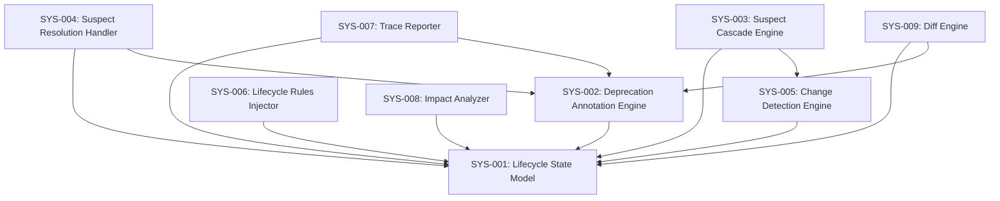

# System Design: 006b — ID Lifecycle Model

**Feature Branch**: `feature/006b-id-lifecycle`
**Created**: 2026-04-18
**Status**: Draft
**Source**: `specs/006b-id-lifecycle/v-model/requirements.md`

## Overview

The ID Lifecycle Model decomposes into 9 system components organized around three functional tiers: (1) a core state model that defines the lifecycle vocabulary and annotation syntax, (2) an engine tier that performs change detection, suspect cascade, and resolution within each command invocation, and (3) an integration tier that extends existing read-only commands (trace, impact-analysis, diff) with lifecycle awareness. The architecture is purely additive — it modifies the behavior of existing command files without introducing new commands, external state, or runtime services.

## ID Schema

- **System Component**: `SYS-NNN` — sequential identifier for each component
- **Parent Requirements**: Comma-separated `REQ-NNN` list per component (many-to-many)
- Example: `SYS-001` with Parent Requirements `REQ-001, REQ-007, REQ-018` — component satisfies all three requirements

## Decomposition View (IEEE 1016 §5.1)

| SYS ID | Name | Description | Parent Requirements | Type |
|--------|------|-------------|---------------------|------|
| SYS-001 | Lifecycle State Model | Defines the four lifecycle states (ACTIVE, DEPRECATED, MODIFIED, SUSPECT), their inline Markdown annotation syntax, state transition rules, and the invariant that IDs are never deleted. ACTIVE is implicit (no annotation); the other three require explicit inline annotations. Git is the sole history mechanism — no embedded changelogs. In forward development (no pre-existing IDs), this component produces zero annotations. | REQ-001, REQ-007, REQ-018, REQ-NF-001, REQ-NF-002, REQ-CN-004 | Module |
| SYS-002 | Deprecation Annotation Engine | Parses and writes DEPRECATED annotations in two forms: Supersession (`[DEPRECATED — Superseded by {PREFIX}-NNN]`) with a mandatory successor ID, and Withdrawal (`[DEPRECATED — Withdrawn: {reason}]`) with a mandatory reason string. Validates annotation syntax on read (detects malformed annotations with missing successor or empty reason). | REQ-002, REQ-003 | Module |
| SYS-003 | Suspect Cascade Engine | When a parent ID is classified as DEPRECATED or MODIFIED by the Change Detection Engine (SYS-005), marks all immediate downstream IDs as SUSPECT with the annotation `[SUSPECT — Parent {ID} deprecated]` or `[SUSPECT — Parent {ID} modified]`. Cascades one V-Model level per command invocation — never cascades through multiple levels in a single invocation. | REQ-004, REQ-005, REQ-CN-002 | Module |
| SYS-004 | Suspect Resolution Handler | Processes the three resolution paths for SUSPECT items: (a) re-parent to a superseding ID, (b) deprecate the suspect item, or (c) confirm still valid and remove the SUSPECT annotation. Resolution is never automated — every suspect item requires human review via command invocation. | REQ-006, REQ-CN-001 | Module |
| SYS-005 | Change Detection Engine | Performs the 4-step comparison within each command invocation: (a) reads the parent artifact, (b) reads the command's existing output, (c) compares parent IDs against traced parent links, (d) classifies each parent ID as unchanged, modified, deprecated, or added. Executed by the LLM as part of the command instruction flow — no external detection script is required (except for the acceptance command, which retains diff-requirements.sh as an accelerator). In forward development, detects zero changes. | REQ-010, REQ-011, REQ-NF-001 | Module |
| SYS-006 | Lifecycle Rules Section Injector | Adds a standardized Lifecycle Rules section to each of the 9 ID-bearing generative commands (requirements, acceptance, system-design, system-test, architecture-design, integration-test, module-design, unit-test, hazard-analysis). The section text is identical across all commands with only the ID prefix varying. Positioned between "Load existing artifact" and "Generate new content" in each command's execution flow. Does not create new command files — only adds content to existing ones. | REQ-008, REQ-009, REQ-019, REQ-CN-003 | Utility |
| SYS-007 | Lifecycle-Aware Trace Reporter | Extends the trace command to: (a) exclude DEPRECATED items from coverage metric denominators so retiring IDs does not reduce percentages, (b) report SUSPECT items in a dedicated summary section with parent change reasons, and (c) report deprecated chains (parent + downstream deprecated items) in a section separate from active coverage matrices. | REQ-013, REQ-014, REQ-015 | Module |
| SYS-008 | Lifecycle-Aware Impact Analyzer | Extends the impact-analysis command to use formal lifecycle state syntax (`[DEPRECATED]`, `[MODIFIED]`, `[SUSPECT]`) in its output, replacing informal suspect reporting. The formalized output becomes directly consumable by downstream commands. | REQ-016 | Module |
| SYS-009 | Lifecycle-Aware Diff Engine | Extends the existing diff-requirements.sh script to detect lifecycle transitions: new deprecations, new suspects, and resolved suspects, in addition to its existing content addition and removal detection. The script continues to serve as a deterministic accelerator for the requirements→acceptance transition specifically. | REQ-012, REQ-017 | Utility |

## Dependency View (IEEE 1016 §5.2)

| Source | Target | Relationship | Failure Impact |
|--------|--------|-------------|----------------|
| SYS-002 | SYS-001 | Uses | SYS-002 cannot validate annotation syntax without the state model definitions from SYS-001 |
| SYS-003 | SYS-001 | Uses | SYS-003 cannot produce SUSPECT annotations without the annotation syntax defined by SYS-001 |
| SYS-003 | SYS-005 | Reads | SYS-003 depends on SYS-005's classification output to know which parent IDs are deprecated or modified; if SYS-005 fails to classify, no cascade occurs |
| SYS-004 | SYS-001 | Uses | SYS-004 cannot write resolution annotations (deprecation, re-parent) without SYS-001's syntax definitions |
| SYS-004 | SYS-002 | Calls | SYS-004 delegates deprecation-type resolution (Supersession, Withdrawal) to SYS-002's annotation writer |
| SYS-005 | SYS-001 | Uses | SYS-005 must recognize lifecycle annotations (DEPRECATED, MODIFIED) to classify parent IDs correctly |
| SYS-006 | SYS-001 | Reads | SYS-006 references the lifecycle rule definitions from SYS-001 to populate the standardized section text |
| SYS-007 | SYS-001 | Uses | SYS-007 must parse lifecycle annotations to exclude deprecated items and identify suspect items |
| SYS-007 | SYS-002 | Reads | SYS-007 reads deprecation annotations to build deprecated chain reports (supersession lineage) |
| SYS-008 | SYS-001 | Uses | SYS-008 must recognize lifecycle states to emit formal tags in impact-analysis output |
| SYS-009 | SYS-001 | Uses | SYS-009 must recognize lifecycle annotations to detect transitions in diff output |
| SYS-009 | SYS-002 | Reads | SYS-009 reads deprecation annotations to report new deprecations in its JSON output |

### Dependency Diagram

## Interface View (IEEE 1016 §5.3)

### External Interfaces

| Component | Interface Name | Protocol | Input | Output | Error Handling |
|-----------|---------------|----------|-------|--------|----------------|
| SYS-006 | Command File Writer | File I/O | 9 existing command Markdown files | Modified command files with Lifecycle Rules section inserted | Fails with error if command file is missing or read-only; preserves original on write failure |
| SYS-009 | Diff CLI Interface | Shell / JSON | V-Model directory path; reads requirements.md and acceptance-plan.md | JSON object with `added`, `modified`, `removed`, `deprecated`, `new_suspects`, `resolved_suspects` arrays | Returns empty arrays on first run (no existing acceptance-plan.md); exits non-zero on parse failure |

### Internal Interfaces

| Source | Target | Interface Name | Protocol | Data Format | Error Handling |
|--------|--------|---------------|----------|-------------|----------------|
| SYS-003 | SYS-005 | Classification Result | In-memory (LLM context) | List of `{id, status}` objects where status ∈ {unchanged, modified, deprecated, added} | If SYS-005 returns empty classification, SYS-003 treats all parent IDs as unchanged (no cascade) |
| SYS-004 | SYS-002 | Deprecation Request | In-memory (LLM context) | `{id, type, successor_id?, reason?}` — either supersession (with successor) or withdrawal (with reason) | SYS-002 validates syntax; returns error if successor_id missing for supersession or reason missing for withdrawal |
| SYS-007 | SYS-001 | State Query | File I/O (Markdown parse) | Reads artifact files; extracts IDs and their lifecycle annotations via regex patterns | Returns ACTIVE for IDs with no annotation; reports malformed annotations as warnings |
| SYS-007 | SYS-002 | Deprecation Chain Query | File I/O (Markdown parse) | Reads supersession annotations to build lineage: `{deprecated_id, successor_id, type}` | Missing successor in supersession annotation triggers a malformed-annotation warning |
| SYS-008 | SYS-001 | State Lookup | File I/O (Markdown parse) | Reads artifact files; maps each ID to its lifecycle state for formal tag emission | Same as SYS-007 → SYS-001: ACTIVE default, malformed warnings |
| SYS-009 | SYS-002 | Annotation Parser | File I/O (Markdown parse) | Reads deprecation annotations from requirements.md to detect new deprecations vs. prior run | Returns empty list if no deprecation annotations found |

## Data Design View (IEEE 1016 §5.4)

| Entity | Component | Storage | Protection at Rest | Protection in Transit | Retention |
|--------|-----------|---------|-------------------|-----------------------|-----------|
| Lifecycle Annotation | SYS-001 | Inline Markdown text within artifact files | Git repository access controls; no encryption needed (plain text, version-controlled) | Not applicable — annotations are file content, not transmitted over network | Permanent — annotations are never deleted, only transitioned between states |
| Deprecation Metadata | SYS-002 | Inline within DEPRECATED annotation text (successor ID or reason string) | Same as Lifecycle Annotation | Not applicable | Permanent — deprecation annotations persist in artifact and git history |
| Classification Result | SYS-005 | Ephemeral — exists only in LLM context during command execution | Not persisted to disk | Not applicable — exists within single command invocation | Transient — discarded after command completes; reproducible by re-running comparison |
| Suspect Annotation | SYS-003 | Inline Markdown text within downstream artifact files | Same as Lifecycle Annotation | Not applicable | Until resolution — SUSPECT annotations persist until human resolves via SYS-004 |
| Diff Report | SYS-009 | Ephemeral JSON output from shell script | Not persisted beyond command invocation unless redirected to file | Not applicable | Transient — regenerated on each script invocation |
| Coverage Metrics | SYS-007 | Output section in traceability-matrix.md | Same as artifact files (git-controlled) | Not applicable | Regenerated on each trace invocation — reflects current state |

---

## Coverage Summary

| Metric | Count |
|--------|-------|
| Total System Components (SYS) | 9 (9 active, 0 deprecated, 0 suspect) |
| Total Parent Requirements Covered | 25 / 25 (100%) |
| Components per Type | Module: 7 \| Utility: 2 |
| **Forward Coverage (REQ→SYS)** | **100%** (active items only) |

## Derived Requirements

None — all components trace to existing requirements.

## Glossary

| Term | Definition |
|------|-----------|
| Lifecycle Annotation | An inline Markdown tag (e.g., `[DEPRECATED — ...]`, `[SUSPECT — ...]`) embedded in an artifact's text adjacent to the ID it describes |
| Forward Development | Building a V-Model artifact set from scratch with no pre-existing IDs; the lifecycle model produces zero annotations in this mode |
| Classification Result | The ephemeral output of the Change Detection Engine that categorizes each parent ID as unchanged, modified, deprecated, or added |
| Suspect Cascade | The process by which a parent ID's state change (DEPRECATED or MODIFIED) causes immediate downstream IDs to be marked SUSPECT |
| Deprecated Chain | The lineage of a deprecated ID, including its successor (for supersession) or withdrawal reason, and any downstream items that were also deprecated as a result |
| Deterministic Accelerator | The diff-requirements.sh script, which provides a deterministic (non-LLM) shortcut for change detection in the requirements→acceptance transition specifically |
