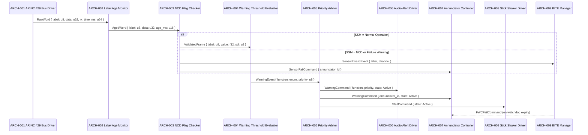

# Architecture Design — Flight Warning Computer (FWC)

## ID Schema

Architecture modules use the `ARCH-NNN` identifier format (sequential, never renumbered).
Each module traces to one or more parent system components via the "Parent SYS" column.

## Logical View

| ARCH ID | Name | Description | Parent SYS | Type |
|---------|------|-------------|------------|------|
| ARCH-001 | ARINC 429 Bus Driver | Manages interrupt-driven reception of ARINC 429 32-bit words from dual ADIRU channels and radio altimeter; writes raw words to channel ring buffers | SYS-001 | Hardware Abstraction |
| ARCH-002 | Label Age Monitor | Inspects the timestamp of each ARINC 429 label in the ring buffer; flags labels older than 150 ms as stale and raises the channel-stale interrupt | SYS-001 | Module |
| ARCH-003 | NCD Flag Checker | Extracts the Sign/Status Matrix (SSM) field from each received ARINC 429 word; discards words with NCD or Failure Warning SSM and raises the sensor-invalid flag | SYS-001 | Module |
| ARCH-004 | Warning Threshold Evaluator | Compares validated airspeed, AoA, altitude, radio altitude, and attitude values against configured warning thresholds; emits WarningEvent records for each exceedance | SYS-002 | Module |
| ARCH-005 | Priority Arbiter | Receives simultaneous WarningEvent records and serializes them by priority (1 = OVERSPEED, 2 = STALL, 3 = GPWS, 4 = ALT ALERT, 5 = ATTITUDE); dispatches ordered WarningCommand list to Output Control | SYS-002 | Module |
| ARCH-006 | Audio Alert Driver | Encodes WarningCommand records into ARINC 429 alert discrete words and transmits them to the Audio Management Unit; retransmits on no AMU acknowledgement within 100 ms | SYS-003 | Service |
| ARCH-007 | Annunciator Controller | Drives 28 VDC discrete output lines to the centralized warning panel annunciators; monitors open-circuit via BITE current loop | SYS-003 | Module |
| ARCH-008 | Stick Shaker Driver | Drives the 28 VDC stick shaker actuator control line; monitors actuator feedback for stuck-on/stuck-off conditions via BITE | SYS-003 | Module |
| ARCH-009 | BITE Manager | Runs Power-On Self-Test, monitors watchdog expiry, logs BITE fault entries to EEPROM with flight-hour timestamps, and controls the FWC FAIL annunciator | SYS-001, SYS-002, SYS-003 | Cross-Cutting |

## Process View

## Interface View

| Producer | Consumer | Contract | Exceptions | Latency Budget |
|----------|----------|----------|------------|----------------|
| ARCH-001 | ARCH-002 | `RawWord { label: u8, data: u32, sdi: u2, rx_time_ms: u64 }` | `BusTimeoutError` (no word for > 20 ms) | ≤ 1 ms per word |
| ARCH-002 | ARCH-003 | `AgedWord { label: u8, data: u32, age_ms: u16 }` | `StaleDataError` (age > 150 ms) | ≤ 1 ms |
| ARCH-003 | ARCH-004 | `ValidatedFrame { label: u8, value: f32, sdi: u2, channel: u2 }` | `SensorInvalidError` (NCD or FW SSM) | ≤ 2 ms |
| ARCH-004 | ARCH-005 | `WarningEvent { function: WarnFunc, value: f32, threshold: f32, priority: u8 }` | None (always produced; Inactive events clear active warnings) | ≤ 2 ms |
| ARCH-005 | ARCH-006 | `WarningCommand { function: WarnFunc, state: Active\|Inactive, priority: u8 }` | None | ≤ 1 ms |
| ARCH-005 | ARCH-007 | `WarningCommand { annunciator_id: u8, state: Active\|Inactive }` | None | ≤ 1 ms |
| ARCH-005 | ARCH-008 | `StallCommand { state: Active\|Inactive }` | None | ≤ 1 ms |
| ARCH-009 | ARCH-007 | `FWCFailCommand { reason: enum }` (watchdog expiry, POST fail) | None | ≤ 5 ms |

## Data Flow View

| Stage | Module | Input | Transformation | Output |
|-------|--------|-------|----------------|--------|
| 1 | ARCH-001 | ARINC 429 serial bus | Interrupt-driven word reception, DMA to ring buffer | RawWord (32-bit) |
| 2 | ARCH-002 | RawWord + system timestamp | Age calculation: current_time − rx_time | AgedWord with age_ms field |
| 3 | ARCH-003 | AgedWord SSM field | SSM decode: Normal Op / NCD / Failure Warning | ValidatedFrame or SensorInvalidError |
| 4 | ARCH-004 | ValidatedFrame (airspeed, AoA, alt, RA, attitude) | Threshold comparison with hysteresis band | WarningEvent per active function |
| 5 | ARCH-005 | Multiple WarningEvents | Priority sort, deduplication, state transition | Ordered WarningCommand list |
| 6a | ARCH-006 | WarningCommand | ARINC 429 encoding, priority word construction | Transmitted ARINC 429 alert discrete |
| 6b | ARCH-007 | WarningCommand | 28 VDC discrete drive, BITE current sense | Annunciator illuminated/extinguished |
| 6c | ARCH-008 | StallCommand | 28 VDC drive, feedback monitoring | Stick shaker ON/OFF |

## Safety Annotations (DO-178C DAL-A)

| ARCH ID | DAL | MC/DC Required | Defensive Programming Notes |
|---------|-----|---------------|-----------------------------|
| ARCH-001 | A | Yes | DMA ring buffer with hardware overrun interrupt; watchdog on bus driver task |
| ARCH-002 | A | Yes | All age comparisons use saturating arithmetic to prevent wrap-around |
| ARCH-003 | A | Yes | All three SSM states handled explicitly; default to SensorInvalid on unknown SSM value |
| ARCH-004 | A | Yes | Hysteresis band on all thresholds prevents chatter; independent second evaluator for OVERSPEED and STALL |
| ARCH-005 | A | Yes | Priority table is ROM-resident; runtime modification is prohibited |
| ARCH-006 | A | Yes | Fail-safe: AMU output defaults to last active alert on ARINC 429 bus failure |
| ARCH-007 | A | Yes | Open-circuit BITE; annunciator fail-on (logic 0 = annunciator ON) |
| ARCH-008 | A | Yes | Fail-safe: stick shaker output is fail-active (power loss = shaker OFF; logic fault = shaker latches ON via hardware relay) |
| ARCH-009 | B | No | BITE is monitoring only; BITE failure does not affect DAL-A warning path |

## Architecture Evaluation — ISO/IEC 42030:2019 / ISO/IEC 25010:2023

### Evaluation Scenarios

| Scenario | Quality Concern (ISO 25010) | Architecture Response | Result |
|----------|----------------------------|----------------------|--------|
| ADIRU channel loss during flight | Reliability (§4.2.2) | Dual-channel with cross-comparison; single-channel NCD triggers DEGRADED state, not full FWC FAIL | ✅ Addressed |
| Simultaneous multi-function warning | Performance Efficiency (§4.2.3) | Priority Arbiter (ARCH-005) serializes output within 1 ms; all outputs dispatched within 5 ms total | ✅ Addressed |
| Software watchdog expiry | Safety (§4.2.8) | Hardware watchdog independent of Warning Logic Engine; FWC FAIL annunciator set via BITE (ARCH-009) | ✅ Addressed |

### Trade-off Assessment

| Decision | Trade-off | Rationale |
|----------|-----------|-----------|
| Independent dual evaluator for OVERSPEED and STALL | Higher ROM footprint vs. independence assurance | DO-178C DAL-A independence objective requires separate verification of highest-risk warning functions |
| ROM-resident priority table | Flexibility vs. integrity | Prevents inadvertent priority modification; satisfies DO-178C data integrity objectives |

## Coverage Summary

| SYS Components Covered | 3 / 3 (100%) |
| Cross-Cutting Modules | 1 (ARCH-009 BITE Manager) |

## Governing Standards

| Standard | Full Name | Role in this Document |
|----------|-----------|----------------------|
| **IEEE 42010:2011** | Systems and Software Engineering — Architecture Description | Primary description standard: viewpoint definitions, architecture rationale |
| **ISO/IEC 42030:2019** | Software, Systems and Enterprise — Architecture Evaluation | Architecture evaluation: scenario-based fitness-for-purpose analysis, trade-off assessment |
| **DO-178C** | Software Considerations in Airborne Systems and Equipment Certification | DAL-A architectural requirements; independence and fail-safe design objectives |
