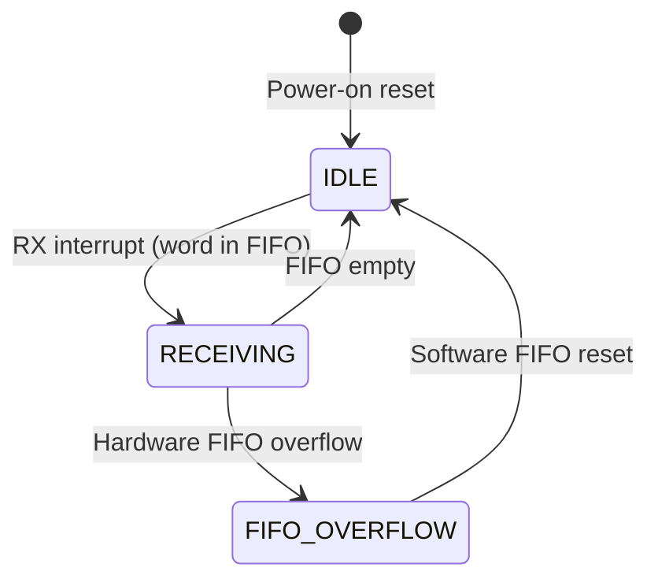
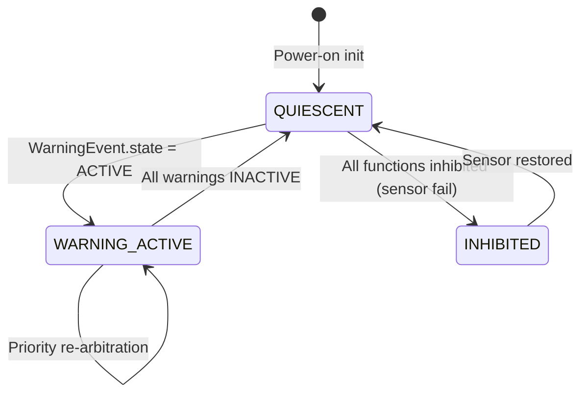

# Module Design: Flight Warning Computer (FWC)

## ID Schema

- **Module Design**: `MOD-NNN` — sequential identifier for each module (3-digit zero-padded)
- **Parent Architecture Modules**: Comma-separated `ARCH-NNN` list per module (many-to-many, authoritative for traceability)
- **Target Source File(s)**: Comma-separated file paths mapping to the repository codebase

## Module Catalogue

| MOD ID | Name | Parent ARCH | Target Source File(s) | Statefulness |
|--------|------|-------------|----------------------|--------------|
| MOD-001 | ARINC 429 Word Receiver | ARCH-001 | `src/hal/arinc429_drv.c`, `src/hal/arinc429_drv.h` | Stateful |
| MOD-002 | Label Age Checker | ARCH-002 | `src/input/label_age.c` | Stateless |
| MOD-003 | SSM Decoder | ARCH-003 | `src/input/ssm_decoder.c` | Stateless |
| MOD-004 | Warning Threshold Comparator | ARCH-004 | `src/logic/threshold_eval.c` | Stateless |
| MOD-005 | Warning State Machine | ARCH-005 | `src/logic/warning_fsm.c` | Stateful |
| MOD-006 | Audio Alert Driver | ARCH-006 | `src/output/audio_alert_drv.c` | Stateless |
| MOD-007 | Annunciator Controller | ARCH-007 | `src/output/annunciator_ctrl.c` | Stateless |
| MOD-008 | Stick Shaker Driver | ARCH-008 | `src/output/stick_shaker_drv.c` | Stateful |

## Module Designs

### Module: MOD-001 (ARINC 429 Word Receiver)

**Parent Architecture Modules**: ARCH-001
**Target Source File(s)**: `src/hal/arinc429_drv.c`, `src/hal/arinc429_drv.h`

#### Algorithmic / Logic View

> **Hardware Mock Note**: Unit tests must replace the ARINC 429 hardware FIFO register reads
> with a mock that returns pre-configured 32-bit word sequences. No physical ARINC 429 hardware
> is available in the software-only test environment. The mock must also simulate the interrupt
> line to trigger the ISR under test.

```pseudocode
INTERRUPT HANDLER arinc429_rx_isr(channel: u8):
    WHILE hardware_fifo_not_empty(channel):
        raw_word = read_hardware_fifo(channel)             // 32-bit ARINC 429 word
        label   = reverse_bits(raw_word AND 0xFF)          // ARINC 429 label is bit-reversed
        sdi     = (raw_word >> 8) AND 0x03                 // Source/Destination Identifier
        data    = (raw_word >> 10) AND 0xFFFFF             // 19-bit data field (BNR)
        ssm     = (raw_word >> 29) AND 0x03                // Sign/Status Matrix
        rx_time = get_system_time_ms()
        ring_buf_write(channel, RawWord{ label, sdi, data, ssm, rx_time })
    CLEAR hardware_interrupt(channel)

FUNCTION arinc429_get_word(channel: u8, label: u8) -> Option<RawWord>:
    RETURN ring_buf_find_latest(channel, label)
```

#### State Machine View

| State | Entry Action | Exit Condition | Exit Action |
|-------|-------------|----------------|-------------|
| IDLE | Enable RX interrupt; clear FIFO | RX interrupt fires | Read hardware FIFO word |
| RECEIVING | Write word to ring buffer | FIFO empty | Re-enable interrupt; return to IDLE |
| FIFO_OVERFLOW | Assert FIFO_OVF fault to ARCH-009 BITE | Software resets FIFO | Clear OVF flag; return to IDLE |



#### Internal Data Structures

| Name | Type | Size/Constraints | Initialization | Description |
|------|------|-----------------|----------------|-------------|
| channel | `uint8_t` | 0–3 | ISR parameter | ARINC 429 channel index (0=ADIRUpri, 1=ADIRUsec, 2=RA, 3=FMS) |
| label | `uint8_t` | 0–255 (bit-reversed) | Extracted from raw word | ARINC 429 octal label |
| sdi | `uint8_t` | 0–3 | Extracted from raw word | Source/Destination Identifier |
| data | `uint32_t` | 0–0xFFFFF (19 bits) | Extracted from raw word | BNR data field |
| ssm | `uint8_t` | 0–3 | Extracted from raw word | Sign/Status Matrix (00=FW, 01=NO, 10=FT, 11=NCD) |
| rx_time | `uint64_t` | ms since boot | get_system_time_ms() | Timestamp of word receipt |

```c
typedef struct {
    uint8_t  label;       // bit-reversed ARINC 429 label
    uint8_t  sdi;         // Source/Destination Identifier (0-3)
    uint32_t data;        // 19-bit BNR data field (right-justified)
    uint8_t  ssm;         // Sign/Status Matrix (00=FW, 01=NO, 10=FT, 11=NCD)
    uint64_t rx_time_ms;  // system timestamp at reception
} RawWord_t;

#define RING_BUF_DEPTH 64   // 64 words per channel, ~640 ms at 100 kbps
typedef struct {
    RawWord_t   words[RING_BUF_DEPTH];
    uint8_t     head;
    uint8_t     tail;
    uint8_t     count;
} RingBuffer_t;

static RingBuffer_t g_rx_ring[4];  // one ring buffer per channel
```

#### Error Handling & Return Codes

| Error Condition | Error Code / Exception | Architecture Contract | Recovery |
|----------------|----------------------|----------------------|----------|
| Hardware FIFO overflow | `FIFO_OVF` | ISR detects overflow bit; reports to ARCH-009 BITE | Software reset of FIFO; log BITE fault entry |
| Ring buffer full (software overflow) | `RB_FULL` | `ring_buf_write` discards oldest word | Continue receiving; increment overflow counter for BITE |

---

### Module: MOD-002 (Label Age Checker)

**Parent Architecture Modules**: ARCH-002
**Target Source File(s)**: `src/input/label_age.c`

#### Algorithmic / Logic View

> **DO-178C Note**: The age comparison uses saturating arithmetic to prevent counter wrap-around.
> All branches in the comparison must achieve MC/DC coverage in the unit test suite.

```pseudocode
FUNCTION check_label_age(word: RawWord, current_time_ms: u64, max_age_ms: u16) -> AgeResult:
    IF current_time_ms < word.rx_time_ms THEN
        // Saturating arithmetic: counter wrap is treated as stale
        age_ms = MAX_UINT16           // saturate to maximum stale value
    ELSE
        age_ms = current_time_ms - word.rx_time_ms
        IF age_ms > MAX_UINT16 THEN age_ms = MAX_UINT16   // clamp to u16
    IF age_ms > max_age_ms THEN
        RETURN AgeResult{ status: STALE, age_ms: age_ms }
    RETURN AgeResult{ status: FRESH, age_ms: (u16) age_ms }
```

#### State Machine View

N/A — Stateless (pure function)

#### Internal Data Structures

| Name | Type | Size/Constraints | Initialization | Description |
|------|------|-----------------|----------------|-------------|
| max_age_ms | `uint16_t` | 150 (constant) | Compile-time | Maximum allowed label age |
| age_ms | `uint64_t` | 0–MAX_UINT64 | Computed | Actual computed age in milliseconds |
| status | `AgeStatus_t` | FRESH, STALE | Computed | Freshness verdict |

```c
typedef enum {
    AGE_FRESH = 0,    // label within max_age_ms
    AGE_STALE = 1     // label older than max_age_ms
} AgeStatus_t;

typedef struct {
    AgeStatus_t status;
    uint16_t    age_ms;   // saturated to UINT16_MAX if > 65535 ms
} AgeResult_t;

#define MAX_LABEL_AGE_MS   150u   // DO-178C requirement REQ-IF-001
#define SATURATE_U16_MAX   0xFFFFu
```

#### Error Handling & Return Codes

| Error Condition | Error Code / Exception | Architecture Contract | Recovery |
|----------------|----------------------|----------------------|----------|
| Timestamp counter wrap (current < rx_time) | Saturated age = UINT16_MAX, status = STALE | Conservative: treat wrap as stale | Downstream logic inhibits warning based on stale flag |

---

### Module: MOD-003 (SSM Decoder)

**Parent Architecture Modules**: ARCH-003
**Target Source File(s)**: `src/input/ssm_decoder.c`

#### Algorithmic / Logic View

> **DO-178C Note**: All four SSM values (00, 01, 10, 11) must be tested explicitly. The default
> case must map to SensorInvalid to ensure fail-safe behavior on unknown SSM values.

```pseudocode
FUNCTION decode_ssm(word: AgedWord) -> SsmDecodeResult:
    SWITCH word.ssm:
        CASE 0b01:  // Normal Operation
            value = bnr_to_float(word.data, word.label)   // resolve BNR scaling by label
            RETURN SsmDecodeResult{ status: VALID, value: value }
        CASE 0b00:  // Failure Warning
            RETURN SsmDecodeResult{ status: SENSOR_FAULT, value: NaN }
        CASE 0b10:  // Functional Test (only valid on ground)
            IF aircraft_is_on_ground() THEN
                RETURN SsmDecodeResult{ status: FUNCTIONAL_TEST, value: NaN }
            RETURN SsmDecodeResult{ status: SENSOR_FAULT, value: NaN }
        CASE 0b11:  // No Computed Data
            RETURN SsmDecodeResult{ status: NCD, value: NaN }
        DEFAULT:
            // Unknown SSM — fail-safe: treat as sensor invalid
            RETURN SsmDecodeResult{ status: SENSOR_FAULT, value: NaN }

FUNCTION bnr_to_float(data: u32, label: u8) -> f32:
    // Look up resolution (LSB weight in engineering units) from label scaling table
    resolution = LABEL_SCALE_TABLE[label]
    sign_bit   = (data >> 18) AND 0x01          // bit 29 of ARINC 429 word
    magnitude  = data AND 0x3FFFF               // bits 10-28 (18-bit magnitude)
    IF sign_bit == 1 THEN magnitude = magnitude - (1 << 18)   // two's complement
    RETURN (f32) magnitude * resolution
```

#### State Machine View

N/A — Stateless (pure function)

#### Internal Data Structures

| Name | Type | Size/Constraints | Initialization | Description |
|------|------|-----------------|----------------|-------------|
| ssm | `uint8_t` | 0–3 | Extracted from AgedWord | Sign/Status Matrix field |
| value | `float` | IEEE 754 f32 | BNR decoded | Decoded engineering unit value |
| status | `SsmStatus_t` | VALID, NCD, SENSOR_FAULT, FUNCTIONAL_TEST | Decoded | SSM validity verdict |
| LABEL_SCALE_TABLE | `float[256]` | Per-label constant | ROM | Resolution (LSB weight) for each ARINC 429 label |

```c
typedef enum {
    SSM_VALID          = 0,   // Normal Operation (0b01)
    SSM_NCD            = 1,   // No Computed Data (0b11)
    SSM_SENSOR_FAULT   = 2,   // Failure Warning (0b00) or unknown
    SSM_FUNCTIONAL_TEST= 3    // Functional Test (0b10, ground only)
} SsmStatus_t;

typedef struct {
    SsmStatus_t status;
    float       value;      // NaN if not VALID
} SsmDecodeResult_t;

extern const float LABEL_SCALE_TABLE[256];  // ROM-resident, write-protected
```

#### Error Handling & Return Codes

| Error Condition | Error Code / Exception | Architecture Contract | Recovery |
|----------------|----------------------|----------------------|----------|
| Unknown SSM value (defensive case) | `SSM_SENSOR_FAULT` | Default case always returns fault | Downstream ARCH-004 inhibits warning; BITE notified |
| Functional Test on ground | `SSM_FUNCTIONAL_TEST` | Inhibit warning logic; no BITE fault | Return to MONITORING when on-ground mode exits |

---

### Module: MOD-004 (Warning Threshold Comparator)

**Parent Architecture Modules**: ARCH-004
**Target Source File(s)**: `src/logic/threshold_eval.c`

#### Algorithmic / Logic View

> **DO-178C Note**: Both directions of each comparison (value ≤ threshold and value > threshold)
> must be covered in unit tests. Hysteresis band implementation requires MC/DC coverage of the
> three-way branch: BELOW_LOWER, WITHIN_BAND, ABOVE_UPPER.

```pseudocode
FUNCTION evaluate_threshold(function: WarnFunc, value: f32, config: ThresholdConfig) -> WarningEvent:
    IF value IS NaN OR value IS Inf THEN
        RETURN WarningEvent{ function: function, state: INHIBITED, priority: config.priority }

    upper_threshold = config.activation_threshold
    lower_threshold = config.activation_threshold - config.hysteresis_band

    SWITCH current_warning_state[function]:
        CASE INACTIVE:
            IF value > upper_threshold THEN
                current_warning_state[function] = ACTIVE
                RETURN WarningEvent{ function: function, state: ACTIVE, priority: config.priority, value: value }
        CASE ACTIVE:
            IF value <= lower_threshold THEN
                current_warning_state[function] = INACTIVE
                RETURN WarningEvent{ function: function, state: INACTIVE, priority: config.priority }

    RETURN WarningEvent{ function: function, state: current_warning_state[function], priority: config.priority }

FUNCTION evaluate_all_warnings(frames: ValidatedFrame[]) -> WarningEvent[]:
    events = []
    FOR EACH frame IN frames:
        function = LABEL_TO_FUNCTION[frame.label]
        IF function IS NONE THEN CONTINUE
        config = THRESHOLD_CONFIG[function]
        event = evaluate_threshold(function, frame.value, config)
        events.APPEND(event)
    RETURN events
```

#### State Machine View

| State | Entry Condition | Exit Condition | Notes |
|-------|----------------|----------------|-------|
| INACTIVE | Initial state; value ≤ upper threshold | value > upper_threshold | Activate warning |
| ACTIVE | value > upper_threshold | value ≤ lower_threshold | Clear warning with hysteresis |

#### Internal Data Structures

| Name | Type | Size/Constraints | Initialization | Description |
|------|------|-----------------|----------------|-------------|
| activation_threshold | `float` | Per-function constant | ROM THRESHOLD_CONFIG | Threshold value that activates the warning |
| hysteresis_band | `float` | ≥ 0.0 | ROM THRESHOLD_CONFIG | Hysteresis band below activation threshold for deactivation |
| current_warning_state | `WarnState_t[NUM_FUNCTIONS]` | INACTIVE, ACTIVE, INHIBITED | All INACTIVE at init | Per-function current state |
| THRESHOLD_CONFIG | `ThresholdConfig_t[NUM_FUNCTIONS]` | ROM | ROM | Per-function threshold and hysteresis configuration |

```c
typedef enum {
    WARN_INACTIVE  = 0,
    WARN_ACTIVE    = 1,
    WARN_INHIBITED = 2
} WarnState_t;

typedef struct {
    float    activation_threshold;
    float    hysteresis_band;
    uint8_t  priority;           // 1 = highest (OVERSPEED)
} ThresholdConfig_t;

extern const ThresholdConfig_t THRESHOLD_CONFIG[NUM_FUNCTIONS];  // ROM-resident
static WarnState_t current_warning_state[NUM_FUNCTIONS];          // zero-initialized
```

#### Error Handling & Return Codes

| Error Condition | Error Code / Exception | Architecture Contract | Recovery |
|----------------|----------------------|----------------------|----------|
| NaN or Inf input value | `WARN_INHIBITED` | Inhibit warning; do not activate or clear on bad data | ARCH-003 must have already flagged sensor invalid |
| ROM read failure (OTP integrity error) | CRC check at startup detects mismatch | BITE sets FWC FAIL if THRESHOLD_CONFIG CRC fails at POST | No recovery in-flight; FWC FAIL annunciator |

---

### Module: MOD-005 (Warning State Machine)

**Parent Architecture Modules**: ARCH-005
**Target Source File(s)**: `src/logic/warning_fsm.c`

#### Algorithmic / Logic View

> **DO-178C Note**: The priority sort implementation uses an insertion sort over the constant-size
> priority table (5 entries). Both the case where all priorities are unique and the case where a
> new event replaces an existing active warning of the same function must achieve MC/DC coverage.

```pseudocode
FUNCTION arbitrate_warnings(events: WarningEvent[]) -> WarningCommand[]:
    // Update per-function active state from events
    FOR EACH event IN events:
        active_set[event.function] = (event.state == ACTIVE OR event.state == INHIBITED)
        active_priority[event.function] = event.priority

    // Build sorted command list from all currently active warnings
    commands = []
    FOR EACH function IN NUM_FUNCTIONS:
        IF active_set[function]:
            commands.APPEND(WarningCommand{ function: function, state: active_set[function], priority: active_priority[function] })

    // Sort commands ascending by priority (1 = highest priority first)
    insertion_sort(commands, key: priority)

    RETURN commands

FUNCTION dispatch_commands(commands: WarningCommand[]):
    FOR EACH cmd IN commands:
        send_to_audio_driver(cmd)
        send_to_annunciator(cmd)
        IF cmd.function == STALL THEN send_to_stick_shaker(cmd)
```

#### State Machine View

| State | Entry Condition | Exit Condition | Notes |
|-------|----------------|----------------|-------|
| QUIESCENT | No active warnings | Any WarningEvent.state = ACTIVE | Dispatch first WarningCommand |
| WARNING_ACTIVE | ≥1 active warning | All warnings clear (INACTIVE) | Continue dispatching in priority order |
| INHIBITED | All warning functions INHIBITED (sensor fail) | Sensor restored (VALID frame received) | No commands dispatched; SENSOR FAIL annunciator driven by SYS-001 |



#### Internal Data Structures

| Name | Type | Size/Constraints | Initialization | Description |
|------|------|-----------------|----------------|-------------|
| active_set | `bool[NUM_FUNCTIONS]` | NUM_FUNCTIONS = 5 | All false | Per-function active flag |
| active_priority | `uint8_t[NUM_FUNCTIONS]` | 1–5 | Per ROM config | Per-function dispatch priority |
| commands | `WarningCommand_t[NUM_FUNCTIONS]` | Up to 5 entries | Computed each cycle | Sorted command list for output dispatch |

```c
typedef struct {
    WarnFunc_t  function;
    WarnState_t state;
    uint8_t     priority;
} WarningCommand_t;

typedef enum {
    FSM_QUIESCENT      = 0,
    FSM_WARNING_ACTIVE = 1,
    FSM_INHIBITED      = 2
} ArbiterState_t;

static bool         active_set[NUM_FUNCTIONS];
static uint8_t      active_priority[NUM_FUNCTIONS];
static ArbiterState_t arbiter_state = FSM_QUIESCENT;
```

#### Error Handling & Return Codes

| Error Condition | Error Code / Exception | Architecture Contract | Recovery |
|----------------|----------------------|----------------------|----------|
| Send queue full in audio driver | `SEND_QUEUE_FULL` | Drop lowest-priority command; log to BITE | Higher-priority warnings remain in queue; lower-priority deferred |
| Stick shaker send failure | `STALL_CMD_LOST` | Retry once; if still fails, log BITE fault | BITE activates STICK SHAKER FAIL annunciator |

---

### Module: MOD-006 (Audio Alert Driver)

**Parent Architecture Modules**: ARCH-006
**Target Source File(s)**: `src/output/audio_alert_drv.c`

#### Algorithmic / Logic View

> **Hardware Mock Note**: Unit tests must replace `arinc429_tx_word()` with a mock. The AMU
> acknowledgement line must be simulated by the test harness to exercise the retry path.

```pseudocode
FUNCTION audio_send_alert(cmd: WarningCommand) -> AudioSendResult:
    word = encode_arinc429_alert(cmd.function, cmd.state, cmd.priority)
    FOR attempt = 1 TO MAX_RETRIES (=3):
        arinc429_tx_word(AMU_CHANNEL, word)
        IF wait_for_amu_ack(timeout_ms=100) == ACK_RECEIVED THEN
            RETURN AudioSendResult{ status: SENT_OK }
    // All retries exhausted — log BITE fault
    bite_report_fault(FAULT_AMU_NO_ACK, cmd.function)
    RETURN AudioSendResult{ status: SEND_FAILED }

FUNCTION encode_arinc429_alert(function: WarnFunc, state: WarnState, priority: u8) -> u32:
    label = ALERT_LABEL_TABLE[function]             // look up ARINC 429 label for function
    data  = (state == ACTIVE) ? priority : 0x00     // 0x00 = alert clear
    ssm   = 0b01                                    // Normal Operation
    RETURN arinc429_build_word(label, sdi=0, data, ssm)
```

#### State Machine View

| State | Entry Condition | Exit Condition | Notes |
|-------|----------------|----------------|-------|
| IDLE | No pending alert commands | Alert command received | Begin transmission |
| TRANSMITTING | Alert command queued | AMU ACK received or retries exhausted | Retry up to MAX_RETRIES |
| FAULT | MAX_RETRIES exhausted without ACK | BITE reset command | BITE notified; alert may be lost |

#### Internal Data Structures

| Name | Type | Size/Constraints | Initialization | Description |
|------|------|-----------------|----------------|-------------|
| MAX_RETRIES | `uint8_t` | 3 (constant) | Compile-time | Maximum AMU transmission retries |
| AMU_ACK_TIMEOUT_MS | `uint16_t` | 100 (constant) | Compile-time | Timeout for AMU acknowledgement |
| ALERT_LABEL_TABLE | `uint8_t[NUM_FUNCTIONS]` | Per-function constant | ROM | ARINC 429 label for each warning function |

```c
#define MAX_RETRIES          3u
#define AMU_ACK_TIMEOUT_MS   100u

typedef enum {
    AUDIO_SEND_OK     = 0,
    AUDIO_SEND_FAILED = 1
} AudioSendStatus_t;

typedef struct {
    AudioSendStatus_t status;
} AudioSendResult_t;

extern const uint8_t ALERT_LABEL_TABLE[NUM_FUNCTIONS];  // ROM-resident
```

#### Error Handling & Return Codes

| Error Condition | Error Code / Exception | Architecture Contract | Recovery |
|----------------|----------------------|----------------------|----------|
| AMU no acknowledgement after 3 retries | `FAULT_AMU_NO_ACK` | BITE fault logged; `AUDIO_SEND_FAILED` returned | BITE activates AMU FAIL annunciator; crew relies on visual warnings |
| ARINC 429 TX bus timeout | `FAULT_ARINC_TX_TIMEOUT` | BITE fault; `AUDIO_SEND_FAILED` returned | BITE activates FWC FAIL annunciator |

---

### Module: MOD-007 (Annunciator Controller)

**Parent Architecture Modules**: ARCH-007
**Target Source File(s)**: `src/output/annunciator_ctrl.c`

#### Algorithmic / Logic View

> **Hardware Mock Note**: Unit tests must replace `gpio_write()` and `bite_read_current_sense()`
> with mocks. The current sense threshold must be configurable in the test harness to exercise
> the open-circuit detection path.

```pseudocode
FUNCTION annunciator_drive(cmd: WarningCommand) -> AnnunciatorResult:
    pin = ANNUNCIATOR_PIN_TABLE[cmd.annunciator_id]
    IF cmd.state == ACTIVE THEN
        gpio_write(pin, LOGIC_LOW)     // fail-on: annunciator ON when logic = 0
    ELSE
        gpio_write(pin, LOGIC_HIGH)    // annunciator OFF when logic = 1

    // BITE open-circuit detection
    current_ma = bite_read_current_sense(pin)
    IF cmd.state == ACTIVE AND current_ma < MIN_CURRENT_MA THEN
        bite_report_fault(FAULT_ANNUNC_OPEN_CIRCUIT, cmd.annunciator_id)
        RETURN AnnunciatorResult{ status: OPEN_CIRCUIT_FAULT }

    RETURN AnnunciatorResult{ status: DRIVE_OK }

FUNCTION annunciator_self_test() -> SelfTestResult:
    // Power-On Self-Test: illuminate each annunciator for 1 second and verify current
    FOR EACH annunciator IN ANNUNCIATOR_PIN_TABLE:
        gpio_write(annunciator.pin, LOGIC_LOW)
        delay_ms(100)
        current_ma = bite_read_current_sense(annunciator.pin)
        IF current_ma < MIN_CURRENT_MA THEN
            bite_report_fault(FAULT_ANNUNC_OPEN_CIRCUIT, annunciator.id)
            RETURN SelfTestResult{ status: POST_FAIL, failed_id: annunciator.id }
        gpio_write(annunciator.pin, LOGIC_HIGH)
    RETURN SelfTestResult{ status: POST_PASS }
```

#### State Machine View

N/A — Stateless output driver (state managed by MOD-005 Warning State Machine)

#### Internal Data Structures

| Name | Type | Size/Constraints | Initialization | Description |
|------|------|-----------------|----------------|-------------|
| MIN_CURRENT_MA | `uint16_t` | 20 mA (constant) | Compile-time | Minimum expected current for illuminated annunciator |
| ANNUNCIATOR_PIN_TABLE | `AnnuncPin_t[NUM_ANNUNC]` | Per-annunciator constant | ROM | GPIO pin assignment per annunciator |
| LOGIC_LOW / LOGIC_HIGH | `uint8_t` | 0 / 1 | Compile-time | Logic level for ON/OFF; inverted because fail-on |

```c
#define MIN_CURRENT_MA   20u   // open-circuit threshold

typedef struct {
    uint8_t  id;     // annunciator identifier
    uint8_t  pin;    // GPIO pin number
} AnnuncPin_t;

typedef enum {
    ANNUNC_DRIVE_OK         = 0,
    ANNUNC_OPEN_CIRCUIT     = 1
} AnnuncStatus_t;

typedef struct {
    AnnuncStatus_t status;
} AnnunciatorResult_t;

extern const AnnuncPin_t ANNUNCIATOR_PIN_TABLE[NUM_ANNUNC];  // ROM-resident
```

#### Error Handling & Return Codes

| Error Condition | Error Code / Exception | Architecture Contract | Recovery |
|----------------|----------------------|----------------------|----------|
| Open-circuit detected during drive | `FAULT_ANNUNC_OPEN_CIRCUIT` | BITE fault logged; `ANNUNC_OPEN_CIRCUIT` returned | FWC FAIL annunciator activated (redundant annunciator path) |
| Open-circuit detected during POST | `FAULT_ANNUNC_OPEN_CIRCUIT` | POST fails; FWC remains in POWER_ON_SELF_TEST | FWC FAIL held; aircraft ground maintenance required |

---

### Module: MOD-008 (Stick Shaker Driver)

**Parent Architecture Modules**: ARCH-008
**Target Source File(s)**: `src/output/stick_shaker_drv.c`

#### Algorithmic / Logic View

> **Hardware Mock Note**: Unit tests must mock `gpio_write()` (actuator control line) and
> `gpio_read()` (actuator feedback line). The stuck-on and stuck-off fault paths require
> the mock to simulate feedback line state independently of the drive command.

```pseudocode
FUNCTION stick_shaker_drive(cmd: StallCommand) -> StickShakerResult:
    IF cmd.state == ACTIVE THEN
        gpio_write(STICK_SHAKER_CTRL_PIN, LOGIC_HIGH)   // actuator energized
    ELSE
        gpio_write(STICK_SHAKER_CTRL_PIN, LOGIC_LOW)    // actuator de-energized

    // Feedback monitoring — allow 100 ms for actuator response
    delay_ms(ACTUATOR_RESPONSE_MS)   // ACTUATOR_RESPONSE_MS = 100
    feedback = gpio_read(STICK_SHAKER_FEEDBACK_PIN)

    IF cmd.state == ACTIVE AND feedback == LOGIC_LOW THEN
        // Commanded ON but feedback says OFF — stuck-off fault
        bite_report_fault(FAULT_STICK_SHAKER_STUCK_OFF)
        RETURN StickShakerResult{ status: STUCK_OFF_FAULT }

    IF cmd.state == INACTIVE AND feedback == LOGIC_HIGH THEN
        // Commanded OFF but feedback says ON — stuck-on fault
        bite_report_fault(FAULT_STICK_SHAKER_STUCK_ON)
        RETURN StickShakerResult{ status: STUCK_ON_FAULT }

    RETURN StickShakerResult{ status: DRIVE_OK }
```

#### State Machine View

| State | Entry Condition | Exit Condition | Notes |
|-------|----------------|----------------|-------|
| INACTIVE | Initial; StallCommand.state = INACTIVE | StallCommand.state = ACTIVE | Actuator de-energized |
| ACTIVE | StallCommand.state = ACTIVE | StallCommand.state = INACTIVE | Actuator energized; feedback monitored |
| STUCK_FAULT | Feedback disagrees with command | BITE reset | Fault logged; STICK SHAKER FAIL annunciator active |

#### Internal Data Structures

| Name | Type | Size/Constraints | Initialization | Description |
|------|------|-----------------|----------------|-------------|
| STICK_SHAKER_CTRL_PIN | `uint8_t` | GPIO pin | ROM config | Drive output GPIO pin |
| STICK_SHAKER_FEEDBACK_PIN | `uint8_t` | GPIO pin | ROM config | Actuator feedback input GPIO pin |
| ACTUATOR_RESPONSE_MS | `uint16_t` | 100 ms | Compile-time | Time allowed for actuator to respond |

```c
#define ACTUATOR_RESPONSE_MS    100u

typedef enum {
    SHAKER_DRIVE_OK       = 0,
    SHAKER_STUCK_OFF      = 1,
    SHAKER_STUCK_ON       = 2
} ShakeStatus_t;

typedef struct {
    ShakeStatus_t status;
} StickShakerResult_t;
```

#### Error Handling & Return Codes

| Error Condition | Error Code / Exception | Architecture Contract | Recovery |
|----------------|----------------------|----------------------|----------|
| Stuck-off fault (STALL active, actuator not engaging) | `FAULT_STICK_SHAKER_STUCK_OFF` | BITE fault; STICK SHAKER FAIL annunciator active | Maintenance action required; crew notified via annunciator |
| Stuck-on fault (actuator engaged without command) | `FAULT_STICK_SHAKER_STUCK_ON` | BITE fault; STICK SHAKER FAIL annunciator active | Hardware relay disables stuck-on actuator; maintenance required |

| Metric | Value |
|--------|-------|
| Total MOD Modules | 8 |
| Parent ARCH Modules Covered | 8 / 9 (ARCH-001 through ARCH-008; ARCH-009 BITE Manager in separate design) |
| Uncovered ARCH Modules | ARCH-009 (BITE Manager — cross-cutting, separate module design document) |

## Governing Standards

| Standard | Full Name | Role in this Document |
|----------|-----------|----------------------|
| **DO-178C** | Software Considerations in Airborne Systems and Equipment Certification | DAL-A module design requirements: MC/DC coverage mandated; defensive programming; ROM data integrity |
| **IEEE 1016:2009** | IEEE Standard for Information Technology — Software Design Descriptions | Primary structure: algorithmic view, state machine view, data structure view per module |
| **MISRA C:2012** | Guidelines for the Use of the C Language in Critical Systems | Coding standard referenced for all C source files; deviations require documented rationale |
